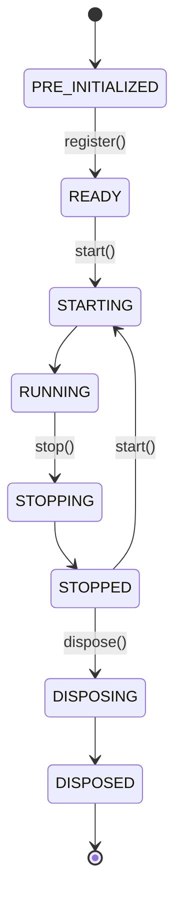

# NautilusTrader 框架说明

## 概述

NautilusTrader 是一个开源、高性能、生产级的算法交易平台，为量化交易者提供在历史数据上使用事件驱动引擎回测自动化交易策略的能力，并且可以无需修改代码即可将这些策略部署到实盘交易中。

## 核心特性

### 高性能

- **Rust 核心**：关键组件使用 Rust 编写，提供系统级性能
- **Cython 扩展**：性能敏感的指标和策略实现
- **异步网络**：使用 tokio 进行高效的异步 I/O 操作
- **纳秒精度**：所有时间戳使用纳秒级精度

### 回测与实盘一致性

- 策略代码在回测和实盘环境中完全相同
- 事件驱动架构确保行为一致性
- 支持多交易所、多品种同时运行

### 灵活的适配器架构

- 支持 16+ 交易所：Binance、Bybit、OKX、Interactive Brokers、Polymarket 等
- 支持多种资产类别：FX、股票、期货、期权、加密货币、DeFi、博彩
- 模块化设计，易于扩展新的市场接入

---

## 系统架构

### 核心组件

```
┌─────────────────────────────────────────────────────────────┐
│                      NautilusKernel                          │
│  ┌─────────┐  ┌─────────┐  ┌─────────┐  ┌─────────┐        │
│  │MessageBus│  │  Cache  │  │DataEngine│ │ExecEngine│        │
│  └─────────┘  └─────────┘  └─────────┘  └─────────┘        │
│       │            │            │            │               │
│       └────────────┴────────────┴────────────┘               │
│                         │                                    │
│  ┌─────────┐  ┌─────────┐  ┌─────────┐  ┌─────────┐        │
│  │RiskEngine│  │Portfolio│  │ Actor   │  │Strategy │        │
│  └─────────┘  └─────────┘  └─────────┘  └─────────┘        │
└─────────────────────────────────────────────────────────────┘
```

### 组件职责

| 组件 | 职责 |
|------|------|
| **NautilusKernel** | 系统内核，负责初始化和管理所有组件 |
| **MessageBus** | 消息总线，实现组件间的 Pub/Sub 通信 |
| **Cache** | 高性能缓存，存储 instruments、orders、positions |
| **DataEngine** | 数据引擎，处理和路由市场数据 |
| **ExecutionEngine** | 执行引擎，管理订单生命周期 |
| **RiskEngine** | 风险引擎，预交易风险检查 |
| **Portfolio** | 投资组合管理 |
| **Actor** | 消息处理组件基类 |
| **Strategy** | 交易策略组件基类 |

---

## 运行环境

### Backtest（回测）

- 使用历史数据
- 模拟交易所执行
- 纳秒级时间精度
- 支持多品种、多策略

### Sandbox（沙盒）

- 实时市场数据
- 模拟交易执行
- 用于策略验证

### Live（实盘）

- 实时市场数据
- 真实交易执行
- 支持模拟账户和实盘账户

---

## 数据类型

### 市场数据

| 类型 | 说明 |
|------|------|
| `OrderBookDelta` | 订单簿增量（L1/L2/L3） |
| `OrderBookDepth10` | 固定深度订单簿（每边10档） |
| `QuoteTick` | 报价数据 |
| `TradeTick` | 成交数据 |
| `Bar` | K线数据 |
| `Instrument` | 合约信息 |

### 价值类型

| 类型 | 说明 | 精度 |
|------|------|------|
| `Price` | 价格 | 128位/64位可选 |
| `Quantity` | 数量 | 128位/64位可选 |
| `Money` | 金额 | 128位/64位可选 |

### 订单类型

- `MARKET` - 市价单
- `LIMIT` - 限价单
- `STOP_MARKET` - 止损市价单
- `STOP_LIMIT` - 止损限价单
- `MARKET_TO_LIMIT` - 市价转限价
- `MARKET_IF_TOUCHED` - 触价市价单
- `LIMIT_IF_TOUCHED` - 触价限价单
- `TRAILING_STOP_MARKET` - 追踪止损市价单
- `TRAILING_STOP_LIMIT` - 追踪止损限价单

---

## 组件生命周期



### 状态说明

| 状态 | 说明 |
|------|------|
| PRE_INITIALIZED | 组件已实例化但未就绪 |
| READY | 组件已配置可启动 |
| RUNNING | 组件正常运行 |
| STOPPED | 组件已停止 |
| DISPOSED | 组件已释放资源 |

---

## 消息总线

### 通信模式

1. **Publish/Subscribe**：广播事件和数据给多个消费者
2. **Request/Response**：需要确认的操作
3. **Point-to-Point**：定向消息传递

### 线程模型

- **单线程内核**：确保确定性事件处理
- **异步 I/O**：网络操作在独立线程/运行时
- **Actor 模式**：组件通过消息通信，避免共享状态

---

## 适配器开发

### DataClient 适配器

```python
class CustomDataClient(LiveMarketDataClient):
    """自定义数据客户端"""

    def __init__(self, ...):
        super().__init__(...)

    async def _connect(self):
        """建立连接"""
        pass

    async def _disconnect(self):
        """断开连接"""
        pass

    async def _subscribe_quote_ticks(self, instrument_id):
        """订阅报价数据"""
        pass
```

### ExecutionClient 适配器

```python
class CustomExecutionClient(LiveExecutionClient):
    """自定义执行客户端"""

    async def _submit_order(self, command):
        """提交订单"""
        pass

    async def _cancel_order(self, command):
        """取消订单"""
        pass
```

---

## 策略开发

### 基本结构

```python
class ArbitrageStrategy(Strategy):
    """套利策略示例"""

    def __init__(self, config):
        super().__init__(config)

    def on_start(self):
        """策略启动"""
        # 订阅数据
        self.subscribe_quote_ticks(self.instrument_id)

    def on_quote_tick(self, tick: QuoteTick):
        """处理报价数据"""
        # 实现套利逻辑
        pass

    def on_order_filled(self, event: OrderFilled):
        """处理成交事件"""
        pass
```

### 最佳实践

1. **使用框架类型**：Price、Quantity 等确保精度
2. **事件驱动**：通过事件处理状态变更
3. **风险管理**：利用 RiskEngine 进行预交易检查
4. **状态管理**：使用 Cache 存储和查询状态

---

## 参考资源

- 官方文档：https://nautilustrader.io/docs/
- GitHub 仓库：https://github.com/nautechsystems/nautilus_trader
- API 参考：`/docs/api_reference/`
- 概念指南：`/docs/concepts/`
- 集成指南：`/docs/integrations/`
