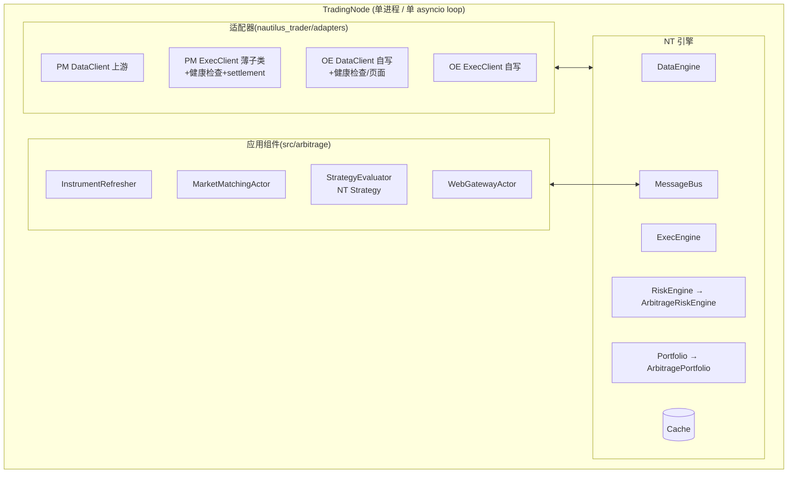
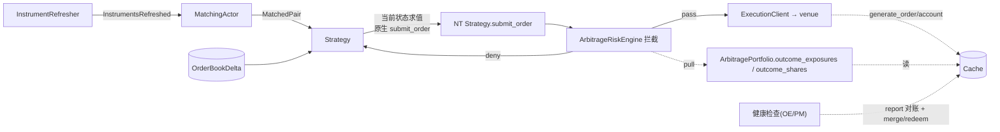

# 跨市场套利系统 — 架构设计(NT 端态总览)

> **定位**:端态架构**总览 + 导航**。本文给高层视图,组件细节在 `architectures/<组件>/architecture.md`。
> **文档分层**:`refactor.md`(初设 + 决策史 Q1–Q20 + 修订记录)→ 本文及 `architectures/*`(详细设计,面向代码落地)→ `tests/arbitrage/*/README.md`(用例)。
> 旧微服务架构文档(7 个 `architecture.md`)已于 2026-05-21 删除；
> `src/arbitrage/services/` 代码栈已于 2026-07-23 删除。当前运行时只有
> **NautilusTrader 原生架构**，旧路径只会出现在决策历史中。

---

## 1. 系统概述

基于 NautilusTrader 的跨市场体育赛事套利:**Polymarket**(CLOB / `BinaryOption` / `py_clob_client` / WS)与 **OrbitExch**(Playwright 浏览器 / `BettingInstrument` / DOM+WS 帧)双边对冲。

核心思路:**最大化复用 NT 原语**(P1),仅领域 IP(跨场馆事件匹配、outcome exposure/share、链上 merge/claim)保留自研(P2)。设计原则 P1–P11 见 `refactor.md §2`。

---

## 2. 端态架构

NT 引擎层(NT 自带,部分子类化:`ArbitrageRiskEngine` / `ArbitragePortfolio`)+ 适配器层(PM 上游 / OE 自写)+ 应用组件层(`src/arbitrage/<capability>/`,P8)。

---

## 3. 高层数据流

主链:发现 → 匹配 → 策略(快照+信号决策)→ 风控拦截 → 执行 → venue。
旁路:健康检查(对账 + PM merge/redeem)、Portfolio outcome 指标 pull、账户状态维护。

---

## 4. 组件地图

| 组件 | 角色 | 状态 | 详细设计 |
|---|---|---|---|
| Discovery | InstrumentProvider + Refresher | 占位(Step1/2 概要) | [discovery/](architectures/discovery/architecture.md) |
| Data | DataClient(PM 上游 / OE 自写) | 占位(Step2 概要) | [data/](architectures/data/architecture.md) |
| Matching | MarketMatchingActor(异构归一) | 占位(Step3 概要) | [matching/](architectures/matching/architecture.md) |
| Strategy | ArbitrageStrategy(信号流水线 + 快照) | **搁置**(核心信号框架待设计) | [strategy/](architectures/strategy/architecture.md) |
| **Execution** | ExecClients + session + timeout + 健康检查 + settlement | **✅ 详细** | [execution/](architectures/execution/architecture.md) |
| **Risk** | ArbitrageRiskEngine + ArbitragePortfolio | **✅ 详细** | [risk/](architectures/risk/architecture.md) |
| Common | 跨组件轻量契约 / 注册表 / 工具 | **✅ 详细** | [common/](architectures/common/architecture.md) |
| SharpExch | 第三 venue 接入设计(OE 型 Playwright/BIAB exchange) | **设计中** | [sharpexch/](architectures/sharpexch/architecture.md) |
| Web | WebGatewayActor | 占位(暂不迁移) | [web/](architectures/web/architecture.md) |
| **横切·Venue Registry** | venue enablement / capability / factory 注册收敛 | **设计中** | [_cross-cutting/venues.md](architectures/_cross-cutting/venues.md) |
| **横切·Sports Event Anchor** | PMSPORTS non-tradable event discovery + matching anchor | **设计中** | [_cross-cutting/sports-event-anchor.md](architectures/_cross-cutting/sports-event-anchor.md) |
| **横切·同步** | 健康检查 ⊥ 执行 全局互斥 | **✅ 详细** | [_cross-cutting/synchronization.md](architectures/_cross-cutting/synchronization.md) |
| **横切·Debug** | 子类化 + 工厂注入 | **✅ 详细** | [_cross-cutting/debug-injection.md](architectures/_cross-cutting/debug-injection.md) |

---

## 5. 横切机制(P11:无单一归属 → 单独成章)

- **同步**:健康检查 ⊥ 执行**全局互斥**(msgbus + ref-count + strategy 前置 pre-check,单 loop 无锁)→ `synchronization.md`
- **Debug 注入**:生产类干净 + Debug 子类覆盖 + 工厂选择,零 `if self._debug` → `debug-injection.md`
- **Venue Registry / Capability**:真实 venue identity 保留,概率/size/enablement/factory 等同类规则集中到静态 registry → `venues.md`
- **Sports Event Anchor**:`PMSPORTS` 产出 `.PMSPORTS` non-tradable synthetic event instruments,作为 matching anchor;PM/OE/SE 作为 tradable venues 匹配到该 anchor → `sports-event-anchor.md`
- **健康检查**:OE(页面 staleness)/ PM(report 对账 + merge/redeem),NT clock 自重排,详见 `execution/architecture.md §4.3`
- **VenueExecutionLiveness**(#108,取代退役的 `leg_settled`):per-venue `order_alive && position_alive`,execution/reconciliation 写、**Risk 读门控**(Strategy/Portfolio 不读)→ `_cross-cutting/synchronization.md §8.5`

---

## 6. 文档导航

| 文档 | 角色 |
|---|---|
| `refactor.md` | **初设**:迁移理由 + 决策史(Q1–Q20)+ 修订记录(冲突时详细设计有把握则以详细为准并回写) |
| `architectures/<组件>/architecture.md` | **详细设计**:类/接口签名、数据流、算法、时序、落地清单 |
| `architectures/_cross-cutting/*.md` | 横切机制详细设计 |
| `requirements/services/*/requirements.md` | 行为真理源(注:按**旧服务名**组织,语义仍有效;新架构组件 ← 旧服务需求映射) |
| `tests/arbitrage/*/README.md` | 测试用例(用例编号/前置/输入/步骤/期望/验收) |
