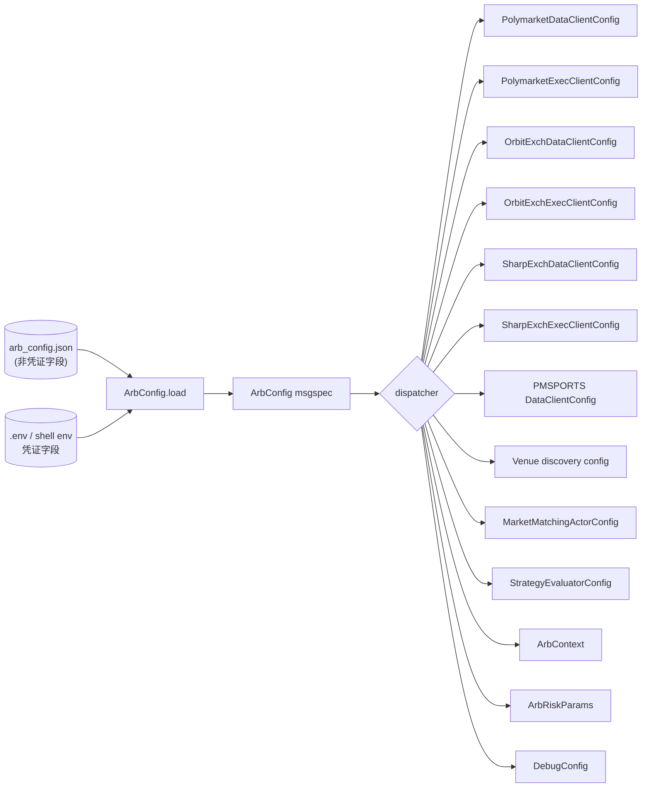

# 横切:Configuration 详细设计

> **定位**:详细设计。理由 / 历史(Q22-Q27 拍板)见初设 `refactor.md` 对应修订条目。
> 冲突时:**有把握 → 以本文为准并回写 refactor.md;没把握 → 讨论**。
> **横切机制**(配置面贯穿 data / discovery / matching / strategy / risk / execution / debug 各组件,
> 无单一自然归属,符合 P11 横切判据)。
> Venue enablement / capability 的设计真理源见
> [`venues.md`](venues.md);本文只保留用户 JSON/env schema 与 dispatcher 输入输出。

---

## 1. 总览



**单一真理源**:每个字段一份(JSON 或 env,不重复);launcher 走唯一 entry `ArbConfig.load(path)`。

---

## 2. ArbConfig schema(`src/arbitrage/config/schema.py`)

顶层 + 分组件子 config,全继承 `ConfigStruct(msgspec.Struct, frozen=True, kw_only=True, forbid_unknown_fields=True)`:

```python
class ArbConfig(ConfigStruct):
    discovery:  DiscoveryConfig
    data_sources: DataSourcesConfig
    matching:   MatchingConfig
    venues:     VenuesConfig
    strategy:   StrategySectionConfig
    arbitrage:  ArbitrageSectionConfig
    risk:       RiskSectionConfig
    execution:  ExecutionSectionConfig
    web:        WebSectionConfig          # Step 7 控制台(enabled/host/port/start_halted;默认 enabled=false)
    debug:      DebugSectionConfig | None = None


class DiscoveryConfig(ConfigStruct):
    refresh_interval_secs: float = 60.0     # 给 MarketMatchingActor 周期扫描
    polymarket: VenueDiscoveryConfig         # sport → competitions[]
    orbitexch:  VenueDiscoveryConfig
    sharpexch:  VenueDiscoveryConfig


class VenueDiscoveryConfig(Struct, kw_only=True):
    enabled: bool = True
    sports:  list[SportFilter]               # [{sport, competitions}]


class SportFilter(Struct, kw_only=True):
    sport:        str                        # "Tennis" / "Soccer" / ...
    competitions: list[str]                  # ["atp"] / ["Men's Wimbledon 2026"] / ...


class DataSourcesConfig(Struct, kw_only=True):
    sports_status: SportsStatusDataSourceConfig


class SportsStatusDataSourceConfig(Struct, kw_only=True):
    enabled: bool = True
    provider: str = "polymarket_sports"
    ws_url: str | None = None                # None → adapter 默认 SPORTS_WS_URL
    sports: list[SportFilter] = []           # 可选覆盖;默认空时继承 discovery.polymarket.sports


class MatchingConfig(Struct, kw_only=True):
    sport_aliases:          dict[str, str] = {}     # {"soccer": "Soccer"}
    competition_aliases:    dict[str, str] = {}     # {"atp": "ATP", "Men's Wimbledon 2026": "ATP"}
    competition_max_matches: dict[str, int] = {}    # {"ATP": 1}


class VenuesConfig(Struct, kw_only=True):
    polymarket: PolymarketSectionConfig
    orbitexch:  OrbitExchSectionConfig
    sharpexch:  SharpExchSectionConfig


class PolymarketSectionConfig(Struct, kw_only=True):
    clob_url:                 str = "https://clob.polymarket.com"
    ws_url:                   str = "wss://ws-subscriptions-clob.polymarket.com/ws/"
    relayer_url:              str = "https://relayer-v2.polymarket.com/"
    polygon_rpc_url:          str = "https://polygon-rpc.com/"
    proxy_url:                str | None = None  # PM HTTP/WS 代理;loader 可从 env 注入
    signature_type:           int = 0            # EOA=0;Polymarket proxy/funder 钱包通常为 2
    max_retries:              int | None = None  # 透传 PM ExecClient;默认不改上游 retry 语义
    retry_delay_initial_ms:   int | None = None
    retry_delay_max_ms:       int | None = None
    # 凭证字段(loader 阶段从 env 注入,不入 JSON;详见 §4)
    clob_api_key:             str | None = None
    clob_api_secret:          str | None = None
    clob_passphrase:          str | None = None
    private_key:              str | None = None
    funder:                   str | None = None
    # builder relayer(可选)
    builder_api_key:          str | None = None
    builder_api_secret:       str | None = None
    builder_passphrase:       str | None = None


class OrbitExchSectionConfig(Struct, kw_only=True):
    base_url:                 str = "https://www.orbitexch.com"
    page_load_timeout_sec:    float = 120.0
    staleness_timeout_sec:    int = 300
    headless:                 bool = True
    browser_type:             str = "chromium"
    user_data_dir:            str | None = None
    # 凭证(从 env 注入)
    username:                 str | None = None
    password:                 str | None = None


class SharpExchSectionConfig(Struct, kw_only=True):
    enabled:                  bool = False
    base_url:                 str = "https://portal.sharpxch.com"
    login_url:                str = "https://sharpxch.com/player/"
    page_load_timeout_sec:    float = 120.0
    cloudflare_timeout_sec:   float = 120.0
    staleness_timeout_sec:    int = 300
    headless:                 bool = True
    browser_type:             str = "chromium"
    user_data_dir:            str | None = None
    # 凭证(从 env 注入)
    username:                 str | None = None
    password:                 str | None = None

`venues.orbitexch.user_data_dir` / `venues.sharpexch.user_data_dir` 是 Playwright 持久
profile 路径。OE/SE 生产 Data/Exec factory 都使用各自共享的 `PlaywrightBrowserManager`,
该 manager 默认启用 `AutomationControlled` 参数、使用浏览器原生 user-agent、隐藏
`navigator.webdriver`、模拟 plugins,并强制页面 visible。上述反自动化/可见性设置在生产
launcher、skip smoke 与 probe 中走同一条 BrowserManager 路径。

probe 中通过 `--user-data-dir /tmp/se-playwright-profile` 复用人工 Cloudflare 验证后的
cookie/profile 只是命令行覆盖;若生产也要复用同一 profile,必须把相同路径显式写入
`venues.sharpexch.user_data_dir`。不配置时仍有反自动化 init script,但不会复用 probe profile。


class StrategySectionConfig(Struct, kw_only=True):
    enabled:         bool = True
    log_evaluations: bool = False
    # Check / Action 实现 + JSON 配置(§7 Strategy 解析)
    strategies:      dict[str, StrategyJsonConfig] = {}
    bindings:        list[StrategyBindingConfig] = []  # scope → strategy_id


class StrategyBindingConfig(ConfigStruct):
    scope:       str          # "pair:<pair_id>" / "competition:<name>" / "sport:<name>"
    strategy_id: str          # 引用 strategies.<id>


class ArbitrageSectionConfig(ConfigStruct):
    share:             float = 22.5
    max_leg_share:     float | None = None  # Web 默认单腿上限;Strategy share_limit 可读取/覆盖
    fx:                float = 1.33


class RiskSectionConfig(ConfigStruct):
    match_tp:          float = 0.05
    match_sl:          float = -0.05


class ExecutionSectionConfig(ConfigStruct):
    tracking_timeout_sec:          float = 30.0
    # #110:health_check_interval_sec 已删(PM 无 HealthCheckLoop;merge/redeem 走 NT position 对账)
    cleanup_enabled:               bool = True
    cleanup_merge_enabled:         bool = True
    cleanup_claim_enabled:         bool = True


class DebugSectionConfig(ConfigStruct):
    """与 `src/arbitrage/debug/config.py:DebugConfig` schema 对齐,loader 转换。"""
    enabled:    bool = False
    overrides:  dict = {}      # {name: {enabled, value}}
    mock_data:  dict = {}      # {id: {category, enabled, data, conditions, priority}}
```

> 第二阶段 venue 插拔化不改变第一版 JSON 形态:`venues.polymarket/orbitexch/sharpexch`
> 仍是显式字段。PMSPORTS 这种 data-only source 不再放进 `venues.*`,而是通过
> `data_sources.sports_status` 控制。代码侧 runtime enablement、factory 注册、tradable venue
> 派生已开始由 `VenueDescriptor` / `DataSourceDescriptor` 静态 registry 收敛,详见
> `venues.md §3-§5`。

`strategy.enabled=false` 的语义是**禁用策略决策 / Action**,不是关闭 `StrategyEvaluator`
Actor。原因:当前 `StrategyEvaluator` 同时承担 `MatchedPair → SubscribeOrderBookDeltas`
的订阅桥职责;如果直接不装 Actor,PM/OE OBD 也不会被订阅。dispatcher 因此在 disabled 时让
`to_strategy_registry(cfg)` 返回空 registry:Evaluator 仍接收 `MatchedPair` 并发起 OBD 订阅,
但查不到策略后 no-op,不会触发 `PlaceBetsAction` / submit。

---

## 3. JSON 文件 schema(用户视角)

`arb_config.json` 使用当前 NT `ArbConfig` schema。**凭证字段在 JSON 中留空 / 省略,从 env 读**:

```json
{
  "discovery": {
    "refresh_interval_secs": 60,
    "polymarket": {"enabled": true, "sports": [{"sport": "Tennis", "competitions": ["atp"]}]},
    "orbitexch":  {"enabled": true, "sports": [{"sport": "Tennis", "competitions": ["Men's Wimbledon 2026"]}]},
    "sharpexch":  {"enabled": true, "sports": [{"sport": "Tennis", "competitions": ["Men's Wimbledon 2026"]}]}
  },
  "matching": {
    "competition_aliases": {"atp": "ATP", "Men's Wimbledon 2026": "ATP"},
    "competition_max_matches": {"ATP": 1}
  },
  "venues": {
    "polymarket": {"clob_url": "https://clob.polymarket.com", "...": "其他非凭证字段"},
    "orbitexch":  {"base_url": "https://www.orbitexch.com", "headless": true},
    "sharpexch":  {"enabled": false, "base_url": "https://portal.sharpxch.com", "login_url": "https://sharpxch.com/player/", "user_data_dir": null}
  },
  "arbitrage": {"share": 22.5, "max_leg_share": 100, "fx": 1.33},
  "risk": {"match_tp": 0.05, "match_sl": -0.05},
  "execution": {"tracking_timeout_sec": 30, "...": "..."},
  "strategy": {
    "enabled": true,
    "strategies": {
      "tennis_mean_rebate": {
        "arbitrage_tree": {
          "self_hits": {},
          "sub_conditions": [],
          "checktion": [{"type": "rebate_check", "params": {"min_rate": 0.03}}],
          "actions": [{"type": "place_bet", "params": {}}]
        },
        "compensation_tree": null
      }
    },
    "bindings": [{"scope": "competition:ATP", "strategy_id": "tennis_mean_rebate"}]
  },
  "debug": {"enabled": false}
}
```

---

## 4. Env 变量(凭证字段唯一通道,Q23)

| 变量 | 字段 | 来源 |
|---|---|---|
| `ORBITEXCH_USERNAME` | `venues.orbitexch.username` | 沿用旧码 |
| `ORBITEXCH_PASSWORD` | `venues.orbitexch.password` | 沿用 |
| `SHARPEXCH_USERNAME` | `venues.sharpexch.username` | SharpExch 第一阶段接入 |
| `SHARPEXCH_PASSWORD` | `venues.sharpexch.password` | SharpExch 第一阶段接入 |
| `POLYMARKET_CLOB_API_KEY` | `venues.polymarket.clob_api_key` | 沿用 |
| `POLYMARKET_CLOB_SECRET` | `venues.polymarket.clob_api_secret` | 沿用(注意旧码用 `_SECRET` 不是 `_API_SECRET`)|
| `POLYMARKET_CLOB_PASSPHRASE` | `venues.polymarket.clob_passphrase` | 沿用 |
| `POLYMARKET_SIGNATURE_TYPE` | `venues.polymarket.signature_type` | NT 上游 CLOB 签名类型;EOA=0,proxy/funder 钱包=2 |
| `POLYMARKET_PRIVATE_KEY` | `venues.polymarket.private_key` | 沿用 |
| `POLYMARKET_FUNDER` | `venues.polymarket.funder` | 沿用 |
| `POLYMARKET_API_KEY` *(builder relayer)* | `venues.polymarket.builder_api_key` | 沿用 |
| `POLYMARKET_API_SECRET` | `venues.polymarket.builder_api_secret` | 沿用 |
| `POLYMARKey_PASSPHRASE` | `venues.polymarket.builder_passphrase` | 沿用 |

**规则**:
- 凭证字段 **env 唯一**;JSON 里写了也会被 env 覆盖(loader 顺序:JSON → env override)。
- 非凭证字段 **env 不覆盖**(URL / timeout / sports 等只走 JSON,避免重复)。
- 凭证段在 JSON 里推荐**根本不写**,但 schema 允许 `null`/omit。

---

## 5. Loader 接口(`src/arbitrage/config/loader.py`)

```python
def load_arb_config(path: str | Path) -> ArbConfig:
    """读 JSON → msgspec.json.decode(ArbConfig) → 凭证段 env override → return。
    
    顺序:
      1. open(path) read text + json.loads → dict
      2. 检测 JSON 中非空 env-only 凭证字段 → ConfigWarning
      3. 补缺省 venues 子 section,并从 env 覆盖凭证/proxy 字段
      4. msgspec.convert(raw, type=ArbConfig)             # schema 校验 + freeze
    """
```

**错误路径**:JSON 解析失败 / schema 不匹配(含任何未知字段,如 `_doc` 注释字段或拼错字段) / `venues`
或单个 venue section 显式写成非 object → `ConfigError`;凭证缺失不在 loader 阶段 raise,dispatcher 对 OE/SE
`username/password` 转为空串,由下游 BrowserManager / login 流程触发明确错误。

**未知字段拒绝(2026-07-02)**:`risk.share` / `risk.max_leg_share` / `risk.fx` 不再迁移也不静默忽略;旧 `risk.execution_enabled` / `risk.health_check_interval_sec` / `risk.match_overrides`、顶层 `discovery.enabled` / `matching.enabled` / `risk.enabled` / `execution.enabled`、旧 `execution.tracking_check_interval_sec` / `execution.max_failure_retries` / `execution.staleness_timeout_sec`、旧 PM `user_address` / `eoa_address`、旧 `strategy.signals`,以及 OE/SE 旧 `api_url` / `zoom_level` / `page_refresh_sec` / `cdp_url` / `default_persistence` / `default_order_type` / `discount` / `take_off` / `market_order_enabled` / `supported_market_types` 也已从当前 NT schema 删除。它们和其它多余字段一样由 `ConfigStruct(forbid_unknown_fields=True)` 统一报 schema mismatch。新配置与 Web 写回均只使用顶层 `arbitrage` 段,`RiskSectionConfig` 只保留真正风控字段。

---

## 6. Dispatcher 接口(`src/arbitrage/config/dispatcher.py`)

纯函数,无副作用(易测):

NT 节点的 OE Data/Execution config 只允许由本 dispatcher 构造。
`nautilus_trader.adapters.orbitexch.config_loader` 仅保留旧 YAML/env 字典读取
`load_config()`;不再公开另一套 `create_*_client_config` factory,避免绕过当前 schema、
venue enablement 与 `ArbContext` 接线。

```python
def to_polymarket_data_client_config(cfg: ArbConfig) -> PolymarketDataClientConfig: ...
def to_polymarket_exec_client_config(cfg: ArbConfig) -> PolymarketExecClientConfig: ...
def to_orbitexch_data_client_config(cfg: ArbConfig) -> OrbitExchDataClientConfig: ...
def to_orbitexch_exec_client_config(cfg: ArbConfig) -> OrbitExchExecClientConfig: ...
def to_sharpexch_data_client_config(cfg: ArbConfig) -> SharpExchDataClientConfig: ...
def to_sharpexch_exec_client_config(cfg: ArbConfig) -> SharpExchExecClientConfig: ...
def to_oe_scraper_config(cfg: ArbConfig) -> OrbitExchVenueConfig | None: ...
def to_se_discovery_config(cfg: ArbConfig) -> SharpExchVenueConfig | None: ...
# OE/SE 这类 browser discovery builder 共用私有构造逻辑;公开入口仍按 adapter 返回各自 config 类型。
def to_market_matching_actor_config(cfg: ArbConfig) -> MarketMatchingActorConfig: ...
def to_strategy_evaluator_config(cfg: ArbConfig) -> StrategyEvaluatorConfig: ...
def to_web_gateway_config(cfg: ArbConfig) -> WebGatewayConfig: ...   # Step 7 只读监控(portfolio/loop 经 deps 注入)
def to_arb_risk_params(cfg: ArbConfig) -> ArbRiskParams: ...
def to_arbitrage_params(cfg: ArbConfig) -> ArbitrageParams: ...
def to_arb_context_init_kwargs(cfg: ArbConfig) -> dict: ...     # prepare_arb_context(**dict)
def to_debug_config(cfg: ArbConfig) -> DebugConfig | None: ...
```

PM dispatcher 必须把 `venues.polymarket.signature_type` 同时透传给 Data/Exec config。否则
proxy/funder 钱包会按 EOA(`0`)查 CLOB collateral,表现为 NT 账户余额 `0.000000 USDC.e`,
而同一凭证用 `signature_type=2` 才能读到真实 proxy 钱包余额。

**Venue runtime enablement(2026-07-01)**:
`venues.<venue>.enabled` 是是否把该 venue 注册进 TradingNode runtime 的唯一开关,
与 `discovery.<venue>.enabled` 分离。第二阶段 Q28 后,launcher 当前要求至少两个 runtime venue
开启,并要求 `data_sources.sports_status.enabled=true` 以注册 `.PMSPORTS` event anchor data source。
PM 本身只是可交易 tradable venue 之一,不再是 PMSPORTS 注册前置。

| 字段 | 默认 | 语义 |
|---|---:|---|
| `data_sources.sports_status.enabled` | `true` | 是否注册 PMSPORTS data-only client |
| `venues.polymarket.enabled` | `true` | 是否注册 PM data/exec config 与 liveness |
| `venues.orbitexch.enabled` | `true` | 是否注册 OE data/exec config、factories 与 liveness |
| `venues.sharpexch.enabled` | `false` | 是否注册 SE data/exec config、factories 与 liveness |

因此当前可表达 PM+OE(默认)、PM+SE、OE+SE、PM+OE+SE。OE+SE 仍通过 PMSPORTS anchor
聚合,不是 OE↔SE pairwise matching。
这只是 venue 注册层插拔,不改变 Strategy/Risk/Barrier 的业务语义。

**暂缓项(venue 插拔第二阶段)**:
- `data_sources.sports_status.sports` 暂不作为常规配置面展示;默认空值复用 `discovery.polymarket.sports`。
  只有将来 PMSPORTS discovery 目标需要和 PM tradable discovery 分离时,再显式覆盖。
- 将 `pm_settlement` 从 launcher / 通用 `ArbContext` 下沉到 Polymarket execution adapter/factory 内部。
  现阶段它仍按历史接线由 launcher 构造并注入;后续应随 PM ExecClient 的 position reconciliation
  归属回 PM adapter,launcher 只负责按 `venues.polymarket.enabled` 注册 PM factory。

dispatcher 派发 discovery / settlement 运行时上下文时也以 runtime venue 开关为前置:
- `data_sources.sports_status.enabled=false` → PMSPORTS event slug tags / competition→sport map 为空。
- `data_sources.sports_status.sports` 非空 → PMSPORTS target competitions 优先读这里;默认空值继承
  `discovery.polymarket.sports`。常规配置可不写 `data_sources` 段。
- `venues.polymarket.enabled=false` → launcher 不注册 PM data/exec,且不构造 `PolymarketSettlement`;不影响 PMSPORTS target competitions。
- `venues.orbitexch.enabled=false` → 不写入 `discovery_config_by_venue["ORBITEXCH"]`,即使 `discovery.orbitexch.enabled=true`。
- `venues.sharpexch.enabled=false` → 不写入 `discovery_config_by_venue["SHARPEXCH"]`,即使 `discovery.sharpexch.enabled=true`。
`discovery.<venue>.enabled` 只在对应 runtime venue 已开启时继续决定是否跑该 venue 的发现。

`to_strategy_evaluator_config` 只把 `cfg.strategy.log_evaluations` 映射到
`StrategyEvaluatorConfig.log_evaluations`;registries / store / portfolio / execution-active callable
等运行时依赖仍由 launcher 经 `_RuntimeDeps` 注入。`log_evaluations` 默认 `False`;仅在专项诊断时临时设
`true` 输出 strategy evaluate 的 schedule / skip / result / fire 锚点,常规 smoke / 示例配置保持关闭。

`to_strategy_registry(cfg)` 消费 `cfg.strategy.enabled`:为 `False` 时直接返回空
`StrategyRegistry`,即便 JSON 里仍有 `strategies/bindings`。这用于 live observe / smoke 只看 discovery
→ matching → OBD 数据链路,不触发策略 Action。

OE `venues.orbitexch.page_load_timeout_sec` 是共享页面加载超时,dispatcher 转为毫秒后同时传给
`OrbitExchDataClientConfig.page_timeout`、`OrbitExchExecClientConfig.page_timeout` 和 discovery scraper
`BrowserConfig.timeout_ms`。默认 120s 与 OE 页面等待策略一致;30s/60s/90s 在 OE 首页或 competition 页
均出现过 timeout。

SE 的 `venues.sharpexch.page_load_timeout_sec` 控制页面导航、登录后 customer URL/iframe
共享等待预算、登录后弹窗最大等待时间与 discovery CSRF 等待；URL 与 iframe 是同一 deadline
内的两个成功条件，不顺序叠加超时。`venues.sharpexch.cloudflare_timeout_sec` 是独立的 Cloudflare 自动挑战
预算，仅映射到 `SharpExchExecClientConfig.cloudflare_timeout`。挑战期间 ExecutionClient 轮询
customer app 或登录表单：自动进入 customer app 即继续，回到登录表单则提交凭据；超过预算
连接失败并交后续重连。该流程不执行验证码规避或人工交互，因而 headed 本机与 headless
服务端语义一致。BrowserManager 不覆盖 user-agent，避免 macOS/Linux/容器中的浏览器版本与
硬编码平台指纹冲突。

**OE DataClient 健康检查 cadence**(宿主=DataClient,详设见 data `architecture.md`):
`to_orbitexch_data_client_config` 把 `venues.orbitexch` 字段直传进 `OrbitExchDataClientConfig`:

| `venues.orbitexch` 字段 | → `OrbitExchDataClientConfig` | 默认 | 含义 |
|---|---|---|---|
| `staleness_timeout_sec` | `staleness_timeout_secs` | 300s | #109:competition 页 WS handler **内部 liveness timeout**——超此无任何帧(含 SockJS 心跳 ~25s,空闲盘口实测见 execution §4.3bis(4))→ WS 死 → `on_disconnect` → reload |

**健康检查全退役(#108/#109/#110)**:
- OE `health_interval_sec`(`HealthCheckLoop` tick)+ `health_check_exec_reload_enabled`(leg_settled reload)→ #109 删;competition 页存活封装进 WS handler(事件驱动,无周期 loop)。
- PM `health_check_interval_sec` + ArbContext `pm_health_interval_secs`/`pm_positions_fetcher` + OE `oe_health_interval_secs` 死接线 → #110/#109 删;PM merge/redeem 改由 NT 连续 position 对账(launcher `position_check_interval_secs=300`)驱动。
- 执行真相可信度由 `VenueExecutionLiveness` + Risk gate 表达(synchronization §8.5)。

Polymarket `ws_url` 传给 NT 上游 `PolymarketWebSocketClient` 时必须是 base URL
(`.../ws/`),因为上游 client 会按 channel 自行拼接 `market` / `user`。dispatcher 只做尾斜杠
归一化;若配置成 `.../ws/market` / `.../ws/user` 这类 channel endpoint,直接抛
`ConfigError`,避免 DataClient 生成 `.../ws/marketmarket`、ExecClient 生成
`.../ws/marketuser`。

Polymarket `proxy_url` 传给 NT 上游 `PolymarketDataClientConfig` /
`PolymarketExecClientConfig`，并作为同一网络出口传给
`PolymarketSportsDataClientConfig`。PMSPORTS 虽是独立 data source，但不另设代理字段。
若 JSON 未显式配置,loader 按 `POLYMARKET_PROXY_URL` → `https_proxy` / `HTTPS_PROXY` →
`http_proxy` / `HTTP_PROXY` 顺序兜底注入。原因:NT pyo3 `WebSocketClient` 不自动读取系统代理;
PM CLOB market WS 与 Sports WS 在部分网络下直连会 `Operation timed out`,显式
`proxy_url` 后可正常握手。

Polymarket `max_retries` / `retry_delay_initial_ms` / `retry_delay_max_ms` 透传给
NT 上游 `PolymarketExecClientConfig` 的共享 `RetryManagerPool`。默认仍为 `None`
(当前等价不重试),避免无意改变真钱 submit/cancel 语义;若为周期 order/position 对账测试显式开启,
必须同时意识到同一 upstream retry pool 也覆盖 PM CLOB submit/cancel/report。

**SharpExch 第一阶段配置(2026-06-30)**:
`discovery.sharpexch` 与 `venues.sharpexch` 已进入 `ArbConfig`;loader 从
`SHARPEXCH_USERNAME` / `SHARPEXCH_PASSWORD` 注入凭证,并对 JSON 内凭证字段发
`ConfigWarning`。dispatcher 已提供 `to_sharpexch_data_client_config` /
`to_sharpexch_exec_client_config` 和 `to_se_discovery_config`。`venues.sharpexch.enabled`
默认 `false`:只有显式置 `true` 时,launcher 才把 `SHARPEXCH` data/exec client config、
factory、`VenueExecutionLiveness` 初始 venue,以及 `ArbContext` 的 keyed
`session_timeout_secs_by_venue` / `discovery_config_by_venue` 注入打开。
如需 SE-only external-tradable smoke,配置 `venues.orbitexch.enabled=false` 且
`venues.sharpexch.enabled=true`。后续细节以 `architectures/sharpexch/architecture.md`
为准分阶段落地。

---

## 7. Strategy JSON parser(Q25,框架层)

依赖 Q21 框架(`BoolExpr` / `Condition` / `Check` / `Action`)+ **类型 registry**:

### 7.1 Check/Action registry(`src/arbitrage/strategy/registry_types.py`,新增)

```python
_CHECK_REGISTRY: dict[str, type[Check]] = {}
_ACTION_REGISTRY: dict[str, type[Action]] = {}

def register_check(name: str, cls: type[Check]) -> None: ...
def register_action(name: str, cls: type[Action]) -> None: ...
def build_check(spec: dict) -> Check:
    """{"type": "<name>", "params": {...}} → cls(**params)"""
def build_action(spec: dict) -> Action: ...
```

**框架层只提供 registry + builder,不预注册任何具体 StateQuery/Check/Action**。

### 7.2 BoolExpr JSON 解析

```python
def bool_expr_from_json(spec) -> BoolExpr:
    """
      {"type": "state_query_name", "params": {...}} → 已注册 StateQuery
      {"AND": [<sub>, <sub>, ...]}   → AndExpr([bool_expr_from_json(s) for s in subs])
      {"OR":  [<sub>, ...]}          → OrExpr(...)
      {"NOT": <sub>}                 → NotExpr(...)
    """
```

`self_hits` 缺失、`null` 或 `{}` 时为空 AND，默认通过。框架不再维护 SignalStore；
StateQuery 每次直接读取当前 `EvalContext`。

### 7.3 Condition JSON 解析(`src/arbitrage/strategy/condition.py` 扩展)

```python
def condition_from_json(spec: dict | None) -> Condition | None:
    """递归构造 Condition 树。
      {
        "self_hits": <bool_expr> | None,
        "sub_conditions": [<spec>, <spec>, ...],   # 递归
        "checktion":  [{"type": ..., "params": ...}, ...],
        "actions":    [{"type": ..., "params": ...}, ...],
      }
    """
```

### 7.4 Strategy 装配

```python
def strategy_from_json(strategy_id: str, spec: dict, scope: str) -> Strategy:
    """spec.arbitrage_tree → Condition;spec.compensation_tree → Condition | None;
       组合成 Strategy(scope_key=scope, ...)。"""
```

### 7.5 dispatcher 串起 strategies + bindings

```python
def to_strategy_registry(cfg: ArbConfig) -> StrategyRegistry:
    """从 cfg.strategy.strategies + cfg.strategy.bindings 装配 StrategyRegistry。"""
```

`cfg.strategy.enabled=false` 时返回空 registry;这保留 `StrategyEvaluator` 的 OBD 订阅桥,
但禁用策略树评估与 Action。

**错误路径**:Check/Action `type` 不在 registry → `ConfigError(unknown check type: ...)`;Check/Action
`params` 传入目标构造器不支持的字段 → `ConfigError(invalid params for ...)`;binding 引用未知 strategy_id → `ConfigError`。

---

## 8. 与各组件的咬合

| 组件 | 输入 |
|---|---|
| `PMSPORTS DataClient` | `to_sports_data_client_config(cfg)`;仅 `data_sources.sports_status.enabled=true` 时由 launcher 加入 TradingNode |
| `PolymarketDataClient` / `ExecClient` | `to_polymarket_data_client_config(cfg)` / `to_polymarket_exec_client_config(cfg)`;仅 `venues.polymarket.enabled=true` 时由 launcher 加入 TradingNode;PM settlement 也只在 PM venue enabled 且 cleanup/凭证满足时构造 |
| `OrbitExchDataClient` / `ExecutionClient` | `to_orbitexch_data_client_config(cfg)` / `to_orbitexch_exec_client_config(cfg)`;仅 `venues.orbitexch.enabled=true` 时由 launcher 加入 TradingNode |
| `SharpExchDataClient` / `ExecutionClient` | `to_sharpexch_data_client_config(cfg)` / `to_sharpexch_exec_client_config(cfg)`;仅 `venues.sharpexch.enabled=true` 时由 launcher 加入 TradingNode |
| OE / SE discovery factory | `to_oe_scraper_config(cfg)` / `to_se_discovery_config(cfg)`;启用判断经 Venue Registry descriptor `config_key` 读取 runtime venue enabled + `discovery.<venue>.enabled`,公开入口返回各自 adapter config 类型,内部共用 browser discovery 构造逻辑(强制 headless + 无登录 profile + `discovery.<venue>.sports`) |
| `MarketMatchingActor` | `to_market_matching_actor_config(cfg)`(含 max_matches;显式 `anchor_venue="PMSPORTS"`,`tradable_venues=enabled_tradable_venue_ids(cfg)`)|
| `StrategyEvaluator` | `to_strategy_evaluator_config(cfg)` + `to_strategy_registry(cfg)` |
| `WebGatewayActor`(Step 7,只读监控)| `to_web_gateway_config(cfg)`;`enabled=false` 时 launcher 不构造;`portfolio`/`loop` 经 `WebGatewayDeps` 注入 |
| `ArbitrageLiveRiskEngine` | `wire_arbitrage_runtime(node, params=to_arb_risk_params(cfg), arbitrage_params=to_arbitrage_params(cfg))` |
| `ArbitragePortfolio` | `arbitrage.share` 经 `wire_arbitrage_runtime`;`outcome_exposures` 输出每个 outcome 的绝对金额 `net_profit/liability`;`outcome_shares` 输出每个 outcome 已占用 share |
| `ArbContext`(session / debug / pair_registry / settlement / arbitrage_params) | `prepare_arb_context(..., arbitrage_params=to_arbitrage_params(cfg), **to_arb_context_init_kwargs(cfg))`;只注入 `session_timeout_secs_by_venue` / `discovery_config_by_venue` / `*_aliases_by_venue` / `target_competitions_by_data_source` 等 keyed map,不再投影 `pm_*`/`oe_*`/`se_*` 专属字段;PM/OE/SE data/exec factory 只读取 keyed map 并回写 provider/browser keyed map,缺必需 session timeout 时 fail-fast;OE/SE data/exec factory 从中读取 `fx` 做 adapter 边界换汇;venue discovery context 由 enabled venue descriptor 的 `discovery_config_builder` 派生,并同时受 runtime venue enabled 和 discovery enabled 控制;PMSPORTS target competitions 可由 `data_sources.sports_status.sports` 覆盖,默认空值继承 `discovery.polymarket.sports` |
| `DebugConfig`(Q11) | `to_debug_config(cfg)`(`enabled=False` → None)|

---

## 9. 凭证 / 安全(P11 落点)

- 凭证字段 **不进任何 commit-able 文件**(`.gitignore` 已加 `default_config.json` / `.env` / `*.credentials.json`)
- 已删除的 legacy WebGateway 配置曾含历史明文凭证，**仍在 git 历史**,需:
  1. 用户**轮换所有凭证**(PM API key / OE 账户密码)
  2. (可选)`git filter-repo` 重写历史
- 新 `arb_config.json` schema **不接受**凭证字段从 JSON 注入,loader 在 §5 检测到 JSON 中存在凭证字段时 → `ConfigWarning` 提醒

---

## 10. 落地清单(slices)

- [x] **slice 2(本文)**:详设落定 ✅ #41
- [x] **slice 3**:`config/schema.py`(msgspec)+ `config/loader.py`(JSON + env)+ 单测 ✅ #42(15 passed)
- [x] **slice 4**:`config/dispatcher.py` 各 `to_*` 函数 + 单测 ✅ #43(17 passed)
- [x] **slice 5**:Strategy JSON parser(`bool_expr_from_json` / `condition_from_json` / `strategy_from_json` / Check-Action registry)+ 单测 ✅ #44(34 passed)
- [x] **slice 6**:`launchers/arb_node.py` 骨架(`build_trading_node_config` / `prepare_runtime_state` / `register_factories` / `bootstrap_and_build` / `main`)+ 单测 ✅ #45(11 passed);**不含 Actors**(留 slice 8)
- [x] **slice 7A**:OE data factory 真接 scraper + Provider aliases 注入 ✅ #46(+9 passed);当时 PM matching info + sport 过滤留后续 slice,现已由 `ArbPolymarketInstrumentProvider.load_all_async` series-based discovery 收口;**known divergence**:`OrbitExchScraper` 自管 browser 不走 BrowserManager(Q2 原意只覆盖 Data+Exec,discovery 是第三方 + unauthenticated 够用)
- [x] **slice 8A**:Actors 接线(InstrumentRefresher × 2 + MarketMatchingActor + StrategyEvaluator)✅ #47 + #48 Q19 真接修正(+10 passed 累计);Provider 经 ArbContext 共享(data factory 回写 + launcher post-build 读 + Refresher 装入同一实例);**Q19 `is_execution_active` 已真接**(`_make_is_execution_active(node)` 遍历 `node.kernel.exec_engine._clients`,任一 client `_execution_active=True` → True;`ArbExecutionSessionMixin` 维护的 ref-count `len(_active_sessions) > 0`)
- [x] **slice 8B / #110 settlement 接线(2026-06-21)**:launcher 构造 `PolymarketContractService` + `PolymarketSettlement` 注入 `ArbContext.pm_settlement`;`positions_fetcher` 已随 #110 退役(同一次 NT position reconcile 的 `_last_raw_positions` 喂 settlement)。cleanup 关闭/PM venue disabled/缺 PM 链上凭证/contract 初始化失败 → settlement=None,节点继续启动;凭证齐全且初始化成功 → PM 连续 position 对账可 fire-and-forget 触发 merge/redeem。**后续归属**:应下沉到 PM execution adapter/factory,与 PM reconciliation 触发点共址;现阶段暂缓,见 §6 Venue runtime enablement。
- [x] **slice 10a**:`EvalContext.submitter` + 真出单链路 ✅ #50(+6 passed)— `make_submitter(cache, msgbus, clock, trader_id, log)` module-level 工厂构 NT LimitOrder + SubmitOrder cmd → `msgbus.send("ExecEngine.execute", cmd)`,经 NT ExecEngine 路由到 venue ExecClient(debug.skip_execution=true 时 SkipExecutionClient 兜底 mock 全成);`PlaceBetsAction` 双路径(submitter 注入→真出单 / submitter None→log-only)。**#106 目标设计已改为 submitter 发送 `RiskEngine.execute`,由 Execution opportunity barrier 收齐同机会 risk-pass legs 后再 release**;落地时以 `architectures/_cross-cutting/synchronization.md §8.4bis` 和 strategy §3.9 为准。
- [x] **slice 7B PM matching info 真写 + series 过滤**(#53/#57):**Gap D 修**(PM 端 matching info 早期空值)+ **Gap B 修**(PM 全量 crawl 无 sport filter):当前实现由 `ArbPolymarketInstrumentProvider.load_all_async` 接管 PM discovery,先读 Gamma `/sports` 获取 series/order,再按 `target_competitions_by_data_source["PMSPORTS"]` 过滤并调用 `/events?series_id=...` 拉内嵌 teams + moneyline markets;`_load_moneyline_market` 写 `sport/competition/home_team/away_team/selection_role/game_id`,`start_ts` 不写入 matching info。PMSPORTS target competitions 当前由 dispatcher `to_sports_status_target_competitions` 写入 `ArbContext.target_competitions_by_data_source["PMSPORTS"]`,常规配置继承 `cfg.discovery.polymarket.sports[].competitions`;launcher timeout_connection 当时 20→120s,现随 #105 启动对账统一为 180s。当前离线验收见 `tests/arbitrage/adapters/polymarket/test_arb_provider.py`;完整 Gamma HTTP 路径归 live smoke。详见 `discovery/architecture.md §3.2`(PM 端 matching info 真写段)。
- [x] **slice 10d 修 Gap A + E**(#52):**Gap A** `MarketMatchingActor` + `StrategyEvaluator` `Actor.subscribe_data` 强制路由 SubscribeData cmd 经 DataEngine 需 client_id/instrument_id 报 ERROR × 3 — **改 `self._msgbus.subscribe(topic=f"data.{TypeName}", handler=self.on_data)` 直订**(NT `publish_data` 内部正是 publish 到 `data.<TypeName>` topic);**MVP 不预订 OrderBookDeltas**(strategy 端 MatchedPair 触发即够,OBD-driven 重评待 slice 10e per-iid 接);**Gap E** `InstrumentRefresher._on_alert` 创建 task 未跟踪 → dispose 时 "Task was destroyed but it is pending" warning × 1 — **改存 `self._tick_task` + on_stop cancel**。**live smoke 验**:subscribe_data ERROR 3→**0**,pending task warning 1→**0**,OE refresh 3 次推进正常;仅剩 1 PM PolyApi 网络异常(无关本 slice,与 [[bug_polymarket_order_version_mismatch]] 同 PM 上游类问题)。`MatchedPair` 仍 0 fire 符合 slice 7B PM enricher 未写预期(`_both_recent()` 闸 Q5 守门)。详见 `matching/architecture.md §3.3` + `strategy/architecture.md §3.5` + `discovery/architecture.md §3.3`
- [x] **slice 10c 第一次 live smoke**(#51,历史记录):跑 `python -m launchers.arb_node --config arb_config.example.json`;OE 端 connect+discovery 全链路通,**真发现 Tennis × Men's Roland Garros 2026 共 28 个 instruments**;PM 端 connect 通 + Account RegisteredCache + PM gamma crawl 跑(10000+ markets,无 sport filter)。**Smoke 期间修 5 处**:① `launchers/arb_node.py` 加 `load_dotenv(.env)`(launcher 进程不自动 load);② `dispatcher:to_instrument_refresher_configs` 加 `ComponentId("InstrumentRefresher-{venue}")`(两 Actor 默认 ID 冲突 NT raise RuntimeError);③ `BrowserManager.start()` 幂等(`if self._context is not None: return` — 共享多次起);④ `OrbitExchDataClient._connect` 改用 `start + create_page`(原 bug:`get_page` 只读返 None);⑤ `SkipExecutionOrbitExchClient._connect/_disconnect` skip 模式 no-op(base OE Exec NotImplementedError)。当时浮出的 Gap A-E 后续已分别由 msgbus 直订、PM series-based discovery、OE Exec 接线、PM 6-key 写入与 Refresher 退役收口;本条只保留 smoke 历史,不再作为当前 TODO。
- [x] **slice 9**:`mean_rebate` 测试策略落地；后续 #250/#266 迁移到 PMS
  `SportsGameStateStore` 与 live Cache，当前 `self_hits` 已改为直接查询 `EvalContext`，
  不再保留 SignalStore 派生层。详见 `architectures/strategy/architecture.md §3.8`。
- [ ] **slice 10**:`/live-test` skip_execution=true smoke

---

## 11. 不做(P7,边界保留)

- ❌ 配置热重载(改完重启 process;同 Q11.1 Debug)
- ❌ Web UI(slice 10 之后再考虑;UI 是 config schema 的消费者,本文档不约束)
- ❌ TOML / YAML 支持(Q24,JSON only)
- ❌ 配置版本号 / migration 机制(YAGNI;有需要再加)
