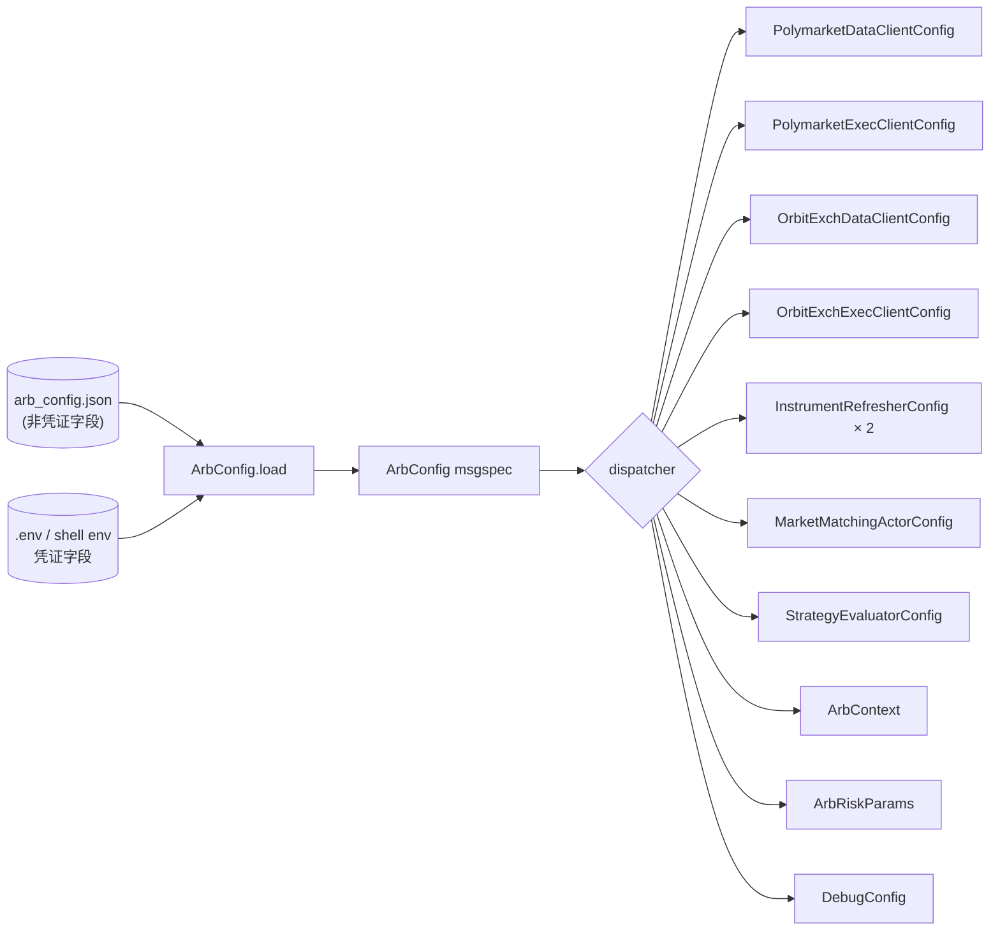

# 横切:Configuration 详细设计

> **定位**:详细设计。理由 / 历史(Q22-Q27 拍板)见初设 `refactor.md` 对应修订条目。
> 冲突时:**有把握 → 以本文为准并回写 refactor.md;没把握 → 讨论**。
> **横切机制**(配置面贯穿 data / discovery / matching / strategy / risk / execution / debug 各组件,
> 无单一自然归属,符合 P11 横切判据)。

---

## 1. 总览



**单一真理源**:每个字段一份(JSON 或 env,不重复);launcher 走唯一 entry `ArbConfig.load(path)`。

---

## 2. ArbConfig schema(`src/arbitrage/config/schema.py`)

顶层 + 分组件子 config,全 msgspec `frozen=True, kw_only=True`:

```python
class ArbConfig(Struct, kw_only=True):
    discovery:  DiscoveryConfig
    matching:   MatchingConfig
    venues:     VenuesConfig
    strategy:   StrategySectionConfig
    risk:       RiskSectionConfig
    execution:  ExecutionSectionConfig
    web:        WebSectionConfig          # Step 7 监控 + 控制台(enabled/host/port/start_halted;默认 enabled=false)
    debug:      DebugSectionConfig | None = None


class DiscoveryConfig(Struct, kw_only=True):
    enabled:           bool = True
    refresh_interval_secs: float = 60.0     # 给 InstrumentRefresher
    polymarket: VenueDiscoveryConfig         # sport → competitions[]
    orbitexch:  VenueDiscoveryConfig


class VenueDiscoveryConfig(Struct, kw_only=True):
    enabled: bool = True
    sports:  list[SportFilter]               # [{sport, competitions}]


class SportFilter(Struct, kw_only=True):
    sport:        str                        # "Tennis" / "Soccer" / ...
    competitions: list[str]                  # ["atp"] / ["Men's Roland Garros 2026"] / ...


class MatchingConfig(Struct, kw_only=True):
    enabled:                bool = True
    min_similarity:         float = 1.0
    sport_aliases:          dict[str, str] = {}     # {"soccer": "Soccer"}
    competition_aliases:    dict[str, str] = {}     # {"atp": "ATP", "Men's Roland Garros 2026": "ATP"}
    competition_max_matches: dict[str, int] = {}    # {"ATP": 1}


class VenuesConfig(Struct, kw_only=True):
    polymarket: PolymarketSectionConfig
    orbitexch:  OrbitExchSectionConfig


class PolymarketSectionConfig(Struct, kw_only=True):
    clob_url:                 str = "https://clob.polymarket.com"
    ws_url:                   str = "wss://ws-subscriptions-clob.polymarket.com/ws/"
    relayer_url:              str = "https://relayer-v2.polymarket.com/"
    polygon_rpc_url:          str = "https://polygon-rpc.com/"
    proxy_url:                str | None = None  # PM HTTP/WS 代理;loader 可从 env 注入
    signature_type:           int = 0            # EOA=0;Polymarket proxy/funder 钱包通常为 2
    max_retries:              int | None = None  # 透传 PM ExecClient;默认不改上游 retry 语义
    retry_delay_initial_ms:   int | None = None
    retry_delay_max_ms:       int | None = None
    # 凭证字段(loader 阶段从 env 注入,不入 JSON;详见 §4)
    clob_api_key:             str | None = None
    clob_api_secret:          str | None = None
    clob_passphrase:          str | None = None
    private_key:              str | None = None
    funder:                   str | None = None
    user_address:             str | None = None
    eoa_address:              str | None = None
    # builder relayer(可选)
    builder_api_key:          str | None = None
    builder_api_secret:       str | None = None
    builder_passphrase:       str | None = None


class OrbitExchSectionConfig(Struct, kw_only=True):
    base_url:                 str = "https://www.orbitexch.com"
    api_url:                  str = "https://www.orbitexch.com/customer/api"
    zoom_level:               float = 0.8
    page_load_timeout_sec:    float = 120.0
    page_refresh_sec:         int = 600
    staleness_timeout_sec:    int = 300
    headless:                 bool = True
    browser_type:             str = "chromium"
    user_data_dir:            str | None = None
    cdp_url:                  str | None = None
    # 凭证(从 env 注入)
    username:                 str | None = None
    password:                 str | None = None
    # 下单
    default_persistence:      str = "LAPSE"
    default_order_type:       str = "GTC"
    discount:                 float = 1.0
    take_off:                 float = 0.0
    market_order_enabled:     bool = False
    supported_market_types:   list[str] = ["home", "draw", "away"]


class StrategySectionConfig(Struct, kw_only=True):
    enabled:         bool = True
    log_evaluations: bool = False
    # 用户定义信号 / Check / Action 实现 + JSON 配置(§7 Strategy 解析)
    signals:         dict[str, SignalDefConfig] = {}
    strategies:      dict[str, StrategyJsonConfig] = {}
    bindings:        list[StrategyBindingConfig] = []  # scope → strategy_id


class StrategyBindingConfig(Struct, kw_only=True):
    scope:       str          # "pair:<pair_id>" / "competition:<name>" / "sport:<name>"
    strategy_id: str          # 引用 strategies.<id>


class RiskSectionConfig(Struct, kw_only=True):
    enabled:           bool = True
    execution_enabled: bool = True
    share:             float = 22.5
    max_leg_share:     float | None = None  # 单 outcome 最大 share;None=关闭 adjusted-size gate
    fx:                float = 1.33
    match_tp:          float = 0.05
    match_sl:          float = -0.05
    global_sl:         float = -0.10  # 旧配置兼容字段;Risk 不再执行全局止盈/止损
    health_check_interval_sec: float = 120.0
    match_overrides:   dict = {}


class ExecutionSectionConfig(Struct, kw_only=True):
    enabled:                       bool = True
    tracking_timeout_sec:          float = 30.0
    tracking_check_interval_sec:   float = 5.0
    max_failure_retries:           int = 5
    # #110:health_check_interval_sec 已删(PM 无 HealthCheckLoop;merge/redeem 走 NT position 对账)
    cleanup_enabled:               bool = True
    cleanup_merge_enabled:         bool = True
    cleanup_claim_enabled:         bool = True
    staleness_timeout_sec:         int = 300


class DebugSectionConfig(Struct, kw_only=True):
    """与 `src/arbitrage/debug/config.py:DebugConfig` schema 对齐,loader 转换。"""
    enabled:    bool = False
    overrides:  dict = {}      # {name: {enabled, value}}
    mock_data:  dict = {}      # {id: {category, enabled, data, conditions, priority}}
```

`strategy.enabled=false` 的语义是**禁用策略决策 / Action**,不是关闭 `StrategyEvaluator`
Actor。原因:当前 `StrategyEvaluator` 同时承担 `MatchedPair → SubscribeOrderBookDeltas`
的订阅桥职责;如果直接不装 Actor,PM/OE OBD 也不会被订阅。dispatcher 因此在 disabled 时让
`to_strategy_registry(cfg)` 返回空 registry:Evaluator 仍接收 `MatchedPair` 并发起 OBD 订阅,
但查不到策略后 no-op,不会触发 `PlaceBetsAction` / submit。

---

## 3. JSON 文件 schema(用户视角)

`arb_config.json`(沿用旧 `default_config.json` 字段名,Q27 1:1 兼容)。**凭证字段在 JSON 中留空 / 省略,从 env 读**:

```json
{
  "discovery": {
    "enabled": true,
    "refresh_interval_secs": 60,
    "polymarket": {"enabled": true, "sports": [{"sport": "Tennis", "competitions": ["atp"]}]},
    "orbitexch":  {"enabled": true, "sports": [{"sport": "Tennis", "competitions": ["Men's Roland Garros 2026"]}]}
  },
  "matching": {
    "enabled": true, "min_similarity": 1,
    "competition_aliases": {"atp": "ATP", "Men's Roland Garros 2026": "ATP"},
    "competition_max_matches": {"ATP": 1}
  },
  "venues": {
    "polymarket": {"clob_url": "https://clob.polymarket.com", "...": "其他非凭证字段"},
    "orbitexch":  {"base_url": "https://www.orbitexch.com", "headless": true}
  },
  "risk": {"share": 22.5, "max_leg_share": null, "fx": 1.33, "match_tp": 0.05, "match_sl": -0.05},
  "execution": {"tracking_timeout_sec": 30, "...": "..."},
  "strategy": {
    "enabled": true,
    "signals": {"rebate": {"params": {"rate": 0.03}}, "pre_match": {"params": {}}},
    "strategies": {
      "tennis_prematch": {
        "arbitrage_tree": {
          "self_hits": {"AND": [{"signal": "rebate"}, {"signal": "pre_match"}]},
          "sub_conditions": [],
          "checktion": [{"type": "rebate_check", "params": {"min_rate": 0.03}}],
          "action": {"type": "place_bet", "params": {}}
        },
        "compensation_tree": null
      }
    },
    "bindings": [{"scope": "competition:ATP", "strategy_id": "tennis_prematch"}]
  },
  "debug": {"enabled": false}
}
```

---

## 4. Env 变量(凭证字段唯一通道,Q23)

| 变量 | 字段 | 来源 |
|---|---|---|
| `ORBITEXCH_USERNAME` | `venues.orbitexch.username` | 沿用旧码 |
| `ORBITEXCH_PASSWORD` | `venues.orbitexch.password` | 沿用 |
| `POLYMARKET_CLOB_API_KEY` | `venues.polymarket.clob_api_key` | 沿用 |
| `POLYMARKET_CLOB_SECRET` | `venues.polymarket.clob_api_secret` | 沿用(注意旧码用 `_SECRET` 不是 `_API_SECRET`)|
| `POLYMARKET_CLOB_PASSPHRASE` | `venues.polymarket.clob_passphrase` | 沿用 |
| `POLYMARKET_SIGNATURE_TYPE` | `venues.polymarket.signature_type` | NT 上游 CLOB 签名类型;EOA=0,proxy/funder 钱包=2 |
| `POLYMARKET_PRIVATE_KEY` | `venues.polymarket.private_key` | 沿用 |
| `POLYMARKET_FUNDER` | `venues.polymarket.funder` | 沿用 |
| `POLYMARKET_USER_ADDRESS` *(或 `POLYMARKET_ADDRESS` 兼容)* | `venues.polymarket.user_address` | 沿用 |
| `POLYMARKET_EOA_ADDRESS` | `venues.polymarket.eoa_address` | 沿用 |
| `POLYMARKET_API_KEY` *(builder relayer)* | `venues.polymarket.builder_api_key` | 沿用 |
| `POLYMARKET_API_SECRET` | `venues.polymarket.builder_api_secret` | 沿用 |
| `POLYMARKey_PASSPHRASE` | `venues.polymarket.builder_passphrase` | 沿用 |

**规则**:
- 凭证字段 **env 唯一**;JSON 里写了也会被 env 覆盖(loader 顺序:JSON → env override)。
- 非凭证字段 **env 不覆盖**(URL / timeout / sports 等只走 JSON,避免重复)。
- 凭证段在 JSON 里推荐**根本不写**,但 schema 允许 `null`/omit。

---

## 5. Loader 接口(`src/arbitrage/config/loader.py`)

```python
def load_arb_config(path: str | Path) -> ArbConfig:
    """读 JSON → msgspec.json.decode(ArbConfig) → 凭证段 env override → return。
    
    顺序:
      1. open(path) read bytes
      2. msgspec.json.decode(data, type=ArbConfig)        # schema 校验
      3. for each credential field in env map: setattr if env var set
      4. validate post-conditions(必填凭证缺则 raise; venue.enabled=true 时)
    """
```

**错误路径**:JSON 解析失败 / schema 不匹配 → `ConfigError`;启用了 venue 但凭证缺 → `ConfigError(missing env: ...)`。

---

## 6. Dispatcher 接口(`src/arbitrage/config/dispatcher.py`)

纯函数,无副作用(易测):

```python
def to_polymarket_data_client_config(cfg: ArbConfig) -> PolymarketDataClientConfig: ...
def to_polymarket_exec_client_config(cfg: ArbConfig) -> PolymarketExecClientConfig: ...
def to_orbitexch_data_client_config(cfg: ArbConfig) -> OrbitExchDataClientConfig: ...
def to_orbitexch_exec_client_config(cfg: ArbConfig) -> OrbitExchExecClientConfig: ...
def to_instrument_refresher_configs(cfg: ArbConfig) -> tuple[InstrumentRefresherConfig, InstrumentRefresherConfig]: ...
def to_market_matching_actor_config(cfg: ArbConfig) -> MarketMatchingActorConfig: ...
def to_strategy_evaluator_config(cfg: ArbConfig) -> StrategyEvaluatorConfig: ...
def to_web_gateway_config(cfg: ArbConfig) -> WebGatewayConfig: ...   # Step 7 只读监控(portfolio/loop 经 deps 注入)
def to_arb_risk_params(cfg: ArbConfig) -> ArbRiskParams: ...
def to_arb_context_init_kwargs(cfg: ArbConfig) -> dict: ...     # prepare_arb_context(**dict)
def to_debug_config(cfg: ArbConfig) -> DebugConfig | None: ...
```

PM dispatcher 必须把 `venues.polymarket.signature_type` 同时透传给 Data/Exec config。否则
proxy/funder 钱包会按 EOA(`0`)查 CLOB collateral,表现为 NT 账户余额 `0.000000 USDC.e`,
而同一凭证用 `signature_type=2` 才能读到真实 proxy 钱包余额。

`to_strategy_evaluator_config` 只把 `cfg.strategy.log_evaluations` 映射到
`StrategyEvaluatorConfig.log_evaluations`;registries / store / portfolio / execution-active callable
等运行时依赖仍由 launcher 经 `_RuntimeDeps` 注入。`log_evaluations` 默认 `False`;仅在专项诊断时临时设
`true` 输出 strategy evaluate 的 schedule / skip / result / fire 锚点,常规 smoke / 示例配置保持关闭。

`to_strategy_registry(cfg)` 消费 `cfg.strategy.enabled`:为 `False` 时直接返回空
`StrategyRegistry`,即便 JSON 里仍有 `strategies/bindings`。这用于 live observe / smoke 只看 discovery
→ matching → OBD 数据链路,不触发策略 Action。

OE `venues.orbitexch.page_load_timeout_sec` 是共享页面加载超时,dispatcher 转为毫秒后同时传给
`OrbitExchDataClientConfig.page_timeout`、`OrbitExchExecClientConfig.page_timeout` 和 discovery scraper
`BrowserConfig.timeout_ms`。默认 120s 与 OE 页面等待策略一致;30s/60s/90s 在 OE 首页或 competition 页
均出现过 timeout。

**OE DataClient 健康检查 cadence**(宿主=DataClient,详设见 data `architecture.md`):
`to_orbitexch_data_client_config` 把 `venues.orbitexch` 字段直传进 `OrbitExchDataClientConfig`:

| `venues.orbitexch` 字段 | → `OrbitExchDataClientConfig` | 默认 | 含义 |
|---|---|---|---|
| `staleness_timeout_sec` | `staleness_timeout_secs` | 300s | #109:competition 页 WS handler **内部 liveness timeout**——超此无任何帧(含 SockJS 心跳 ~25s,空闲盘口实测见 execution §4.3bis(4))→ WS 死 → `on_disconnect` → reload |

**健康检查全退役(#108/#109/#110)**:
- OE `health_interval_sec`(`HealthCheckLoop` tick)+ `health_check_exec_reload_enabled`(leg_settled reload)→ #109 删;competition 页存活封装进 WS handler(事件驱动,无周期 loop)。
- PM `health_check_interval_sec` + ArbContext `pm_health_interval_secs`/`pm_positions_fetcher` + OE `oe_health_interval_secs` 死接线 → #110/#109 删;PM merge/redeem 改由 NT 连续 position 对账(launcher `position_check_interval_secs=300`)驱动。
- 执行真相可信度由 `VenueExecutionLiveness` + Risk gate 表达(synchronization §8.5)。

Polymarket `ws_url` 传给 NT 上游 `PolymarketWebSocketClient` 时必须是 base URL
(`.../ws/`),因为上游 client 会按 channel 自行拼接 `market` / `user`。dispatcher 兼容旧
`.../ws/market` / `.../ws/user` 写法,统一归一化为 `.../ws/`,避免 DataClient 生成
`.../ws/marketmarket`、ExecClient 生成 `.../ws/marketuser`。

Polymarket `proxy_url` 传给 NT 上游 `PolymarketDataClientConfig` / `PolymarketExecClientConfig`。
若 JSON 未显式配置,loader 按 `POLYMARKET_PROXY_URL` → `https_proxy` / `HTTPS_PROXY` →
`http_proxy` / `HTTP_PROXY` 顺序兜底注入。原因:NT pyo3 `WebSocketClient` 不自动读取系统代理;
PM CLOB market WS 在部分网络下直连会 `Operation timed out`,显式 `proxy_url` 后可正常握手。

Polymarket `max_retries` / `retry_delay_initial_ms` / `retry_delay_max_ms` 透传给
NT 上游 `PolymarketExecClientConfig` 的共享 `RetryManagerPool`。默认仍为 `None`
(当前等价不重试),避免无意改变真钱 submit/cancel 语义;若为周期 order/position 对账测试显式开启,
必须同时意识到同一 upstream retry pool 也覆盖 PM CLOB submit/cancel/report。

---

## 7. Strategy JSON parser(Q25,框架层)

依赖 Q21 框架(`BoolExpr` / `Condition` / `Check` / `Action`)+ **类型 registry**:

### 7.1 Check/Action registry(`src/arbitrage/strategy/registry_types.py`,新增)

```python
_CHECK_REGISTRY: dict[str, type[Check]] = {}
_ACTION_REGISTRY: dict[str, type[Action]] = {}

def register_check(name: str, cls: type[Check]) -> None: ...
def register_action(name: str, cls: type[Action]) -> None: ...
def build_check(spec: dict) -> Check:
    """{"type": "<name>", "params": {...}} → cls(**params)"""
def build_action(spec: dict) -> Action: ...
```

**框架层只提供 registry + builder,不预注册任何具体 Check/Action**(slice 9 由用户落具体类 + 在 launcher main 顶部调 `register_check("rebate", RebateCheck)`)。

### 7.2 BoolExpr JSON 解析(`src/arbitrage/strategy/bool_expr.py` 扩展)

```python
def bool_expr_from_json(spec) -> BoolExpr:
    """
      {"signal": "name"}             → SignalRef("name")
      {"AND": [<sub>, <sub>, ...]}   → AndExpr([bool_expr_from_json(s) for s in subs])
      {"OR":  [<sub>, ...]}          → OrExpr(...)
      {"NOT": <sub>}                 → NotExpr(...)
    """
```

### 7.3 Condition JSON 解析(`src/arbitrage/strategy/condition.py` 扩展)

```python
def condition_from_json(spec: dict | None) -> Condition | None:
    """递归构造 Condition 树。
      {
        "self_hits": <bool_expr> | None,
        "sub_conditions": [<spec>, <spec>, ...],   # 递归
        "checktion":  [{"type": ..., "params": ...}, ...],
        "action":     {"type": ..., "params": ...} | None,
      }
    """
```

### 7.4 Strategy 装配

```python
def strategy_from_json(strategy_id: str, spec: dict, scope: str) -> Strategy:
    """spec.arbitrage_tree → Condition;spec.compensation_tree → Condition | None;
       组合成 Strategy(scope_key=scope, ...)。"""
```

### 7.5 dispatcher 串起 strategies + bindings

```python
def to_strategy_registry(cfg: ArbConfig) -> StrategyRegistry:
    """从 cfg.strategy.strategies + cfg.strategy.bindings 装配 StrategyRegistry。"""
```

`cfg.strategy.enabled=false` 时返回空 registry;这保留 `StrategyEvaluator` 的 OBD 订阅桥,
但禁用策略树评估与 Action。

**错误路径**:Check/Action `type` 不在 registry → `ConfigError(unknown check type: ...)`;binding 引用未知 strategy_id → `ConfigError`。

---

## 8. 与各组件的咬合

| 组件 | 输入 |
|---|---|
| `PolymarketDataClient` / `ExecClient` | `to_polymarket_data_client_config(cfg)` / `to_polymarket_exec_client_config(cfg)` |
| `OrbitExchDataClient` / `ExecutionClient` | 同上 OE 版 |
| `InstrumentRefresher`(PM / OE) | `to_instrument_refresher_configs(cfg)` × 2 |
| `MarketMatchingActor` | `to_market_matching_actor_config(cfg)`(含 aliases / max_matches)|
| `StrategyEvaluator` | `to_strategy_evaluator_config(cfg)` + `to_strategy_registry(cfg)` |
| `WebGatewayActor`(Step 7,只读监控)| `to_web_gateway_config(cfg)`;`enabled=false` 时 launcher 不构造;`portfolio`/`loop` 经 `WebGatewayDeps` 注入 |
| `ArbitrageLiveRiskEngine` | `wire_arbitrage_runtime(node, params=to_arb_risk_params(cfg))` |
| `ArbitragePortfolio` | `fx` 经 `wire_arbitrage_runtime`;`outcome_exposures` 输出每个 outcome 的绝对金额 `net_profit/liability`;`way_rebate` 分母取按 outcome 聚合后的最大实际 share |
| `ArbContext`(session / debug / pair_registry / settlement) | `prepare_arb_context(**to_arb_context_init_kwargs(cfg))` |
| `DebugConfig`(Q11) | `to_debug_config(cfg)`(`enabled=False` → None)|

---

## 9. 凭证 / 安全(P11 落点)

- 凭证字段 **不进任何 commit-able 文件**(`.gitignore` 已加 `default_config.json` / `.env` / `*.credentials.json`)
- 旧 `src/arbitrage/services/web_gateway/default_config.json` 含历史明文凭证,**已在 git 历史**,需:
  1. 用户**轮换所有凭证**(PM API key / OE 账户密码)
  2. `git rm --cached <file>` + commit 停止跟踪
  3. (可选)`git filter-repo` 重写历史
- 新 `arb_config.json` schema **不接受**凭证字段从 JSON 注入,loader 在 §5 检测到 JSON 中存在凭证字段时 → `ConfigWarning` 提醒

---

## 10. 落地清单(slices)

- [x] **slice 2(本文)**:详设落定 ✅ #41
- [x] **slice 3**:`config/schema.py`(msgspec)+ `config/loader.py`(JSON + env)+ 单测 ✅ #42(15 passed)
- [x] **slice 4**:`config/dispatcher.py` 各 `to_*` 函数 + 单测 ✅ #43(17 passed)
- [x] **slice 5**:Strategy JSON parser(`bool_expr_from_json` / `condition_from_json` / `strategy_from_json` / Check-Action registry)+ 单测 ✅ #44(34 passed)
- [x] **slice 6**:`launchers/arb_node.py` 骨架(`build_trading_node_config` / `prepare_runtime_state` / `register_factories` / `bootstrap_and_build` / `main`)+ 单测 ✅ #45(11 passed);**不含 Actors**(留 slice 8)
- [x] **slice 7A**:OE data factory 真接 scraper + Provider aliases 注入 ✅ #46(+9 passed);PM enricher 真写 + PM 按 sport 过滤留 7B/7C 或 slice 9 一并;**known divergence**:`OrbitExchScraper` 自管 browser 不走 BrowserManager(Q2 原意只覆盖 Data+Exec,discovery 是第三方 + unauthenticated 够用)
- [x] **slice 8A**:Actors 接线(InstrumentRefresher × 2 + MarketMatchingActor + StrategyEvaluator)✅ #47 + #48 Q19 真接修正(+10 passed 累计);Provider 经 ArbContext 共享(data factory 回写 + launcher post-build 读 + Refresher 装入同一实例);**Q19 `is_execution_active` 已真接**(`_make_is_execution_active(node)` 遍历 `node.kernel.exec_engine._clients`,任一 client `_execution_active=True` → True;`ArbExecutionSessionMixin` 维护的 ref-count `len(_active_sessions) > 0`)
- [x] **slice 8B / #110 settlement 接线(2026-06-21)**:launcher 构造 `PolymarketContractService` + `PolymarketSettlement` 注入 `ArbContext.pm_settlement`;`positions_fetcher` 已随 #110 退役(同一次 NT position reconcile 的 `_last_raw_positions` 喂 settlement)。cleanup 关闭/缺 PM 链上凭证/contract 初始化失败 → settlement=None,节点继续启动;凭证齐全且初始化成功 → PM 连续 position 对账可 fire-and-forget 触发 merge/redeem。
- [x] **slice 10a**:`EvalContext.submitter` + 真出单链路 ✅ #50(+6 passed)— `make_submitter(cache, msgbus, clock, trader_id, log)` module-level 工厂构 NT LimitOrder + SubmitOrder cmd → `msgbus.send("ExecEngine.execute", cmd)`,经 NT ExecEngine 路由到 venue ExecClient(debug.skip_execution=true 时 SkipExecutionClient 兜底 mock 全成);`PlaceBetsAction` 双路径(submitter 注入→真出单 / submitter None→log-only)。**#106 目标设计已改为 submitter 发送 `RiskEngine.execute`,由 Execution opportunity barrier 收齐同机会 risk-pass legs 后再 release**;落地时以 `architectures/_cross-cutting/synchronization.md §8.4bis` 和 strategy §3.9 为准。
- [x] **slice 7B PM enricher 真写 + event_slug_builder filter**(#53):**Gap D 修**(PM 端 6-key enricher 占位)+ **Gap B 修**(PM 全量 crawl 无 sport filter):① PM enricher 真写(`nautilus_trader/adapters/polymarket/arb_provider.py:enrich_pm_six_key_info`):market_info["events"][0].ticker 嵌入无需另调 gamma,ticker 解析 `{comp}-{home}-{away}-YYYY-MM-DD` + selection_role 由 market_slug 推 + sub-markets 返空 → matching 跳;② `build_pm_event_slugs_from_arb_context` callable + `PolymarketInstrumentProviderConfig.event_slug_builder` 配置;**关键 audit**:`tag_slug=atp` 错配(返 outright winners),**`series_slug=atp`** 才返 match-level events;③ ArbContext.pm_event_slug_tags + dispatcher to_pm_event_slug_tags 派生自 `cfg.discovery.polymarket.sports[].competitions`;④ launcher timeout_connection 当时 20→120s,现随 #105 启动对账统一为 180s。**14 单测** + **live smoke 验**:0 ERROR,PM 35s load 2026 instruments from 100 events(原 50K+ crawl 5 分钟未完);4 Actors RUNNING,Refresher 双 venue 各 1+ tick。**MatchedPair 不 fire 符合市场逻辑**:PM `series_slug=atp` 100 events 多为 Roland Garros JUNIORS / 次级赛(`atp-matisse-thomas-2026-06-01` = "Roland Garros Juniors, Boys: Matisse Martin vs Flynn Thomas"),OE config 锁的"Men's Roland Garros 2026"是主赛 — 不同赛事不可匹。详见 `discovery/architecture.md §3.2`(PM 端 6-key 真写段)
- [x] **slice 10d 修 Gap A + E**(#52):**Gap A** `MarketMatchingActor` + `StrategyEvaluator` `Actor.subscribe_data` 强制路由 SubscribeData cmd 经 DataEngine 需 client_id/instrument_id 报 ERROR × 3 — **改 `self._msgbus.subscribe(topic=f"data.{TypeName}", handler=self.on_data)` 直订**(NT `publish_data` 内部正是 publish 到 `data.<TypeName>` topic);**MVP 不预订 OrderBookDeltas**(strategy 端 MatchedPair 触发即够,OBD-driven 重评待 slice 10e per-iid 接);**Gap E** `InstrumentRefresher._on_alert` 创建 task 未跟踪 → dispose 时 "Task was destroyed but it is pending" warning × 1 — **改存 `self._tick_task` + on_stop cancel**。**live smoke 验**:subscribe_data ERROR 3→**0**,pending task warning 1→**0**,OE refresh 3 次推进正常;仅剩 1 PM PolyApi 网络异常(无关本 slice,与 [[bug_polymarket_order_version_mismatch]] 同 PM 上游类问题)。`MatchedPair` 仍 0 fire 符合 slice 7B PM enricher 未写预期(`_both_recent()` 闸 Q5 守门)。详见 `matching/architecture.md §3.3` + `strategy/architecture.md §3.5` + `discovery/architecture.md §3.3`
- [x] **slice 10c 第一次 live smoke**(#51):跑 `python -m launchers.arb_node --config arb_config.example.json`;OE 端 connect+discovery 全链路通,**真发现 Tennis × Men's Roland Garros 2026 共 28 个 instruments**;PM 端 connect 通 + Account RegisteredCache + PM gamma crawl 跑(10000+ markets,无 sport filter)。**Smoke 期间修 5 处**:① `launchers/arb_node.py` 加 `load_dotenv(.env)`(launcher 进程不自动 load);② `dispatcher:to_instrument_refresher_configs` 加 `ComponentId("InstrumentRefresher-{venue}")`(两 Actor 默认 ID 冲突 NT raise RuntimeError);③ `BrowserManager.start()` 幂等(`if self._context is not None: return` — 共享多次起);④ `OrbitExchDataClient._connect` 改用 `start + create_page`(原 bug:`get_page` 只读返 None);⑤ `SkipExecutionOrbitExchClient._connect/_disconnect` skip 模式 no-op(base OE Exec NotImplementedError)。**浮上未修 5 gaps**留后续:**Gap A** Actor `subscribe_data` API 误用(custom DataType 缺 client_id/instrument_id 报 ERROR,actor RUNNING 但 routing 可能没真订)→ slice 10d;**Gap B** PM Provider 没 sport filter 全量 crawl → slice 7B;**Gap C** OE Exec 真接线缺(login/page/WS)→ slice 10b;**Gap D** PM 6-key enricher 未写,matching 永远不出 MatchedPair → slice 7B;**Gap E** InstrumentRefresher._on_alert pending task at shutdown → slice 10d。
- [x] **slice 9**:`mean_rebate` 测试策略落地 ✅ #49(+32 passed)— **超出原计划**:(a) 用户写 Check/Action 子类(`PreMatchCheck` / `MeanRebateCheck` / `PlaceBetsAction`,放 `src/arbitrage/strategy/{checks,actions}/`);(b) launcher 加 `register_builtin_checks_and_actions()` 在 main 顶部;(c) `arb_config.example.json` strategy 段填 checktion 短路 AND;(d) 框架小改 3 件:`EvalContext.scratch`(per-eval Check→Action 传 legs)/ `SignalStore.view(pair_id)`(per-pair 持久态隔离)/ `OpportunitySnapshot` 加 `in_play`+`instrument_info` 字段;(e) OE DataClient 透 `marketDefinition.inPlay` 到 `cache.instrument.info["in_play"]`(`write_inplay_to_instrument_info` helper,Strategy snapshot 派生自此,避走 SignalStore 二跳)。详见 `architectures/strategy/architecture.md §3.8` + `architectures/data/architecture.md §4`
- [ ] **slice 10**:`/live-test` skip_execution=true smoke

---

## 11. 不做(P7,留占位)

- ❌ 配置热重载(改完重启 process;同 Q11.1 Debug)
- ❌ Web UI(slice 10 之后再考虑;UI 是 config schema 的消费者,本文档不约束)
- ❌ TOML / YAML 支持(Q24,JSON only)
- ❌ 配置版本号 / migration 机制(YAGNI;有需要再加)
