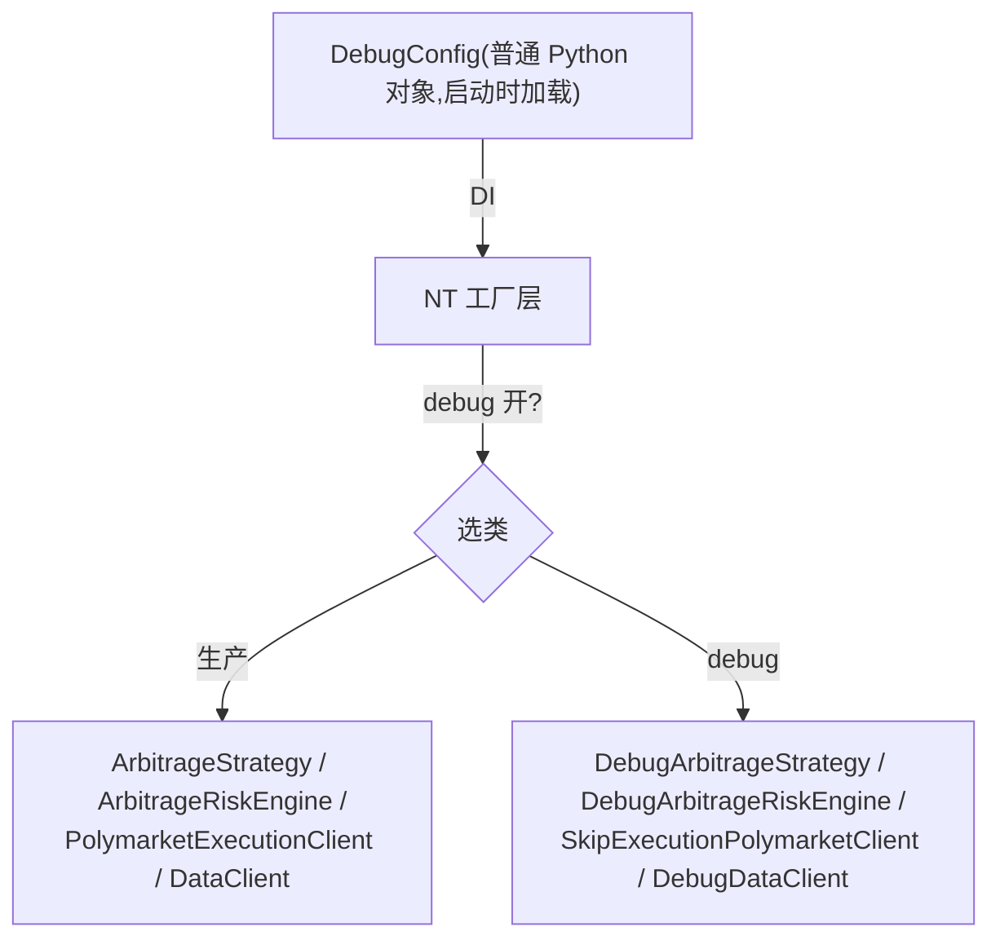

# 横切:Debug 注入框架详细设计

> **定位**:详细设计。理由/历史见初设 `refactor.md §6.6`(Q11)+ #38(2026-05-24 框架基础落地)。
> 冲突时:**有把握 → 以本文为准并回写 `refactor.md` 修订记录;没把握 → 讨论**。
> **横切机制**(贯穿 data / strategy / risk / execution 各组件的测试注入)。

**落地状态(2026-05-24 #38 + 2026-05-26 #39,更新至 2026-06-10 #93)**:
- ✅ `DebugConfig`(`src/arbitrage/debug/config.py`)— 普通对象,DI 注入,**去 `DebugManager` 单例**(撤销 `services/debug/`,Q11.5)
- ✅ `DebugArbitrageLiveRiskEngine.skip_check_size`(`src/arbitrage/debug/risk.py`)— Q11.2 落地;`_check_order` 跳 NT 父类、只跑应用层 `_check_balance` + `_check_rebate_gates`(用户审问后撤"粒度"伪问题:就是 `super` 不调,~10 行)
- ✅ `bootstrap.install_arbitrage_engines(debug_config=...)`— `enabled` 时装 `_KernelInjectedDebugEngine` 闭包包装类(kernel 不传 `debug=`,从闭包注入);`enabled=False` 或 None → 装生产
- ✅ `ArbContext.debug_config` 字段(launcher → factory DI)
- ✅ **#39/#91 `Debug{PM,OE}DataClient`(Q11.A)**(`src/arbitrage/debug/data_clients.py`)— `_DebugDataClientMixin` 拦 `_handle_data`,`_maybe_substitute(data) → data|None`;PM/OE data factory 读 `ArbContext.debug_config` 分支(`enabled` → 装 Debug 子类)。#91 起内置最小 `MockCategory.ODDS` → NT `OrderBookDeltas` 替换:conditions 可按 `instrument_id` / `venue` / `market_type` / `selection_role` 匹配;`data.bid|back` 生成 BUY 档,`data.ask|lay` 生成 SELL 档,输出 snapshot `CLEAR + ADD`。更复杂场景仍通过用户子类化覆盖 `_maybe_substitute`。
- ✅ **#40/#93 `SkipExecution{PM,OE}Client`(Q11.3)**(`src/arbitrage/debug/execution_clients.py`)— `is_override_active("skip_execution")` 真时:`_submit_order` **保留 `_begin_session` / `execution.started/finished` / per-pair gate 生命周期**,只跳真 venue 上送;随后 `generate_order_accepted` + `generate_order_filled` mock 全成交(PM=USDC_POS / OE=GBP,commission=0,liquidity=TAKER,venue_order_id=`MOCK-{cid}`)。`_begin_session` 返回 False(cancel-only / residual open order)时不 mock fill。**`_cancel_order`/`_cancel_all_orders`/(OE)`_cancel_residual_one` no-op**(mock 单已终态全成,且不可拿 MOCK id 去真 venue 撤)。未激活透传 super。**当前是"立即全成"**,不实现部分填 / 拒单 / 撤单时序(Q11.4 `timeline.py` 仅在真需要订单 lifecycle 模拟时才做)。
- ✅ **#66 `skip_execution` 语义统一 =「真连接 + mock 订单 IO」,PM/OE 对齐**(取代 #51 的 OE `_connect` no-op):**为什么改** —— #51 让 OE `_connect` 在 skip 下 no-op,纯属当时 Gap C `_connect` 还是 `NotImplementedError` 的权宜之计;而 PM 的 `SkipExecutionPolymarketClient` 从来只覆盖 `_submit_order`、`_connect` 照常真跑(真 CLOB 鉴权+余额),**两 venue 语义不一致**。Gap C `_connect`(#63)落地后该 no-op 已无理由。**定论**:skip 下两 venue都尽量真连接(OE 真登录/page/general WS/初始账户状态;PM 真 CLOB+user WS),只 **mock 订单 IO**(submit/cancel)。`SkipExecutionOrbitExchClient` 删去 `_connect`/`_disconnect` 覆盖(继承 base真连接)。**#79/#98 PM transport / preflight 容错**:仅在 `skip_execution` 激活时,PM `_connect` 若因 `py_clob_client_v2.exceptions.PolyApiException(status_code=None)` transport 级失败(典型 `Request exception!`)或 #98 geoblock/REST preflight `RuntimeError` 失败,则记录 warning、启动健康检查循环并返回 connected,避免无真单 smoke 被 PM 余额端点 / 当前出口 geoblock 卡住;API 级错误(如 invalid api key,有 status_code)仍 re-raise。生产 `ArbPolymarketExecutionClient` 不变,真下单模式仍必须通过 geoblock preflight 并读到余额。**收益**:`skip_execution=true` 本身即「安全验连接路径(登录/WS/账户状态/余额帧/CURRENT_BETS 读侧)而不下真单」的 smoke;PM transport 容错只保证 mock 订单 IO 不受 transient balance read / preflight 影响,不声称 PM exec 余额或交易可用路径已验证。**唯一代价**:skip 下 OE 会真登录账户(与 PM 真连 CLOB 一致;"完全不碰真账户"模式本就不存在,PM 一直在真连)。
- ⬜ `timeline.py` NT Clock 状态机(Q11.4)— 只在 SkipExecution 真要 mock 订单 lifecycle 时才需要
- ❌ **撤回 `DebugArbitrageStrategy` 整条**(#39):Q21 框架下 strategy 参数(min_rebate / price / size)是具体 `Check`/`Action` 的**构造参数**,不是 Strategy 类的 hook。**直接配置 debug 版 Strategy 实例**(同 scope,`Check`/`Action` 用极端值参数)即可,**不需要任何 Strategy 层 Debug 子类**。旧"候选 (a) `EvalContext.debug_overrides` 注入"+"候选 (b) Debug Check/Action 子类替换"**都取消** —— (a) 违反 P10,(b) 工程量大但实际需求(参数 override)已被参数化 first-class 吸收。
- ❌ **"下单价格掉包"不放 execution**(#39):execution 一直规划为透明传递层(只决定要不要执行 / 怎么报告,不改 order content)。下单价的极端 override 由 Strategy 层 Action 参数化处理(如 `PMSubmitAction(price_override=0.01)`)。

---

## 1. 原则(P10)

所有可被 debug 改写的行为(数据流 / 客户端选择 / Strategy 决策参数 / Risk 校验 / 订单状态流转)统一用:

**生产类干净 + Debug 子类覆盖 hook + 工厂层选择**。

→ **生产代码零 `if self._debug` 分支**(架构对称、关注点分离、测试隔离)。生产类**不导入也不感知** `DebugConfig`。

---

## 2. 注入机制



- **DebugConfig**:普通对象,启动时加载,经 NT 工厂层 DI 分发;**不进 NT Cache**(Q11.5,YAGNI)。
- **工厂选择**:工厂根据 DebugConfig 决定 new 生产类还是 Debug 子类;生产类不变。
- **不实现热重载**(Q11.1):改完**重启进程**。

---

## 3. 子类覆盖点(各组件)

| 组件 | Debug 子类 | 覆盖的 hook / 行为 |
|---|---|---|
| Strategy | `DebugArbitrageStrategy` | `min_rebate_rate` / `polymarket_price` / `orbitexch_price` / `polymarket_size` / `orbitexch_size` 等 override hook(强制覆盖真实最优价/size/阈值) |
| Risk | `DebugArbitrageRiskEngine` | `skip_check_size`:`_check_order` 子类覆盖,跳过 NT 父类最小限额检查(让小单过用于链路测试)。**粒度待 Step 6 核实**(只跳 min_quantity 不跳 max/notional 是否可行) |
| Execution(PM) | `SkipExecutionPolymarketClient` | `_submit_order` 进入 session 后 `generate_order_filled` mock(不真正下单);OE 同构子类 |
| Execution(settlement) | (子类/开关) | `skip_settlement`:健康检查路径不真正上链 / mock `TxResult` |
| Data | `DebugDataClient` | 注入 mock 行情帧 / 控制数据流;内置 ODDS mock 把 `bid|back`、`ask|lay` 转成 NT `OrderBookDeltas` |
| (订单状态流转) | `timeline.py` | NT `Clock.set_timer` 驱动订单状态变化(Q11.4:NT-pure 重写,非平移旧实现) |

---

## 4. 目录与文件(`src/arbitrage/debug/`)

```
src/arbitrage/debug/
  config.py         # DebugConfig 单例(普通对象,不进 Cache)
  data_clients.py   # DebugDataClient
  strategy.py       # DebugArbitrageStrategy(override hooks)
  risk.py           # DebugArbitrageRiskEngine(skip_check_size)
  factories.py      # 工厂层:按 DebugConfig 选生产/Debug 类
  timeline.py       # 订单状态流转引擎(NT Clock.set_timer,Q11.4 重写)
```

> PM 的 `SkipExecutionPolymarketClient` 放 adapter 子类或 debug/(实施时定);OE 同构。

---

## 5. Q11 子问题锁定

| # | 问题 | 锁定 |
|---|---|---|
| Q11.1 | 热重载 | ❌ 不实现,改完重启进程 |
| Q11.2 | `skip_check_size` 落点 | `DebugArbitrageRiskEngine._check_order` 子类覆盖(跳 NT 最小限额)。应用层 `MIN_SIZE_*` 常量 / `check_min_size` 全删 |
| Q11.3 | `skip_execution` | `SkipExecutionPolymarketClient._submit_order` 保留 session/gate 生命周期,只把 venue IO 替换为 mock `generate_order_filled` |
| Q11.4 | timeline 引擎 | NT-pure 重写,`Clock.set_timer` 触发状态变化(不平移旧实现) |
| Q11.5 | DebugConfig 进 Cache? | ❌ 不进,只经工厂层 DI(YAGNI) |
| 全局 | 架构对称 | 所有 debug 行为变化 = 子类化 + 工厂选择;生产代码零 `if self._debug` |

---

## 6. 落地清单

- [ ] `DebugConfig` + 工厂层选择(生产/Debug)
- [ ] 各组件 Debug 子类(覆盖 hook,不改生产类)
- [ ] `timeline.py`(NT Clock.set_timer 状态机)
- [ ] 验证生产代码**零** `if self._debug`(静态检查)
- [ ] 对应测试:`tests/arbitrage/debug/README.md`
