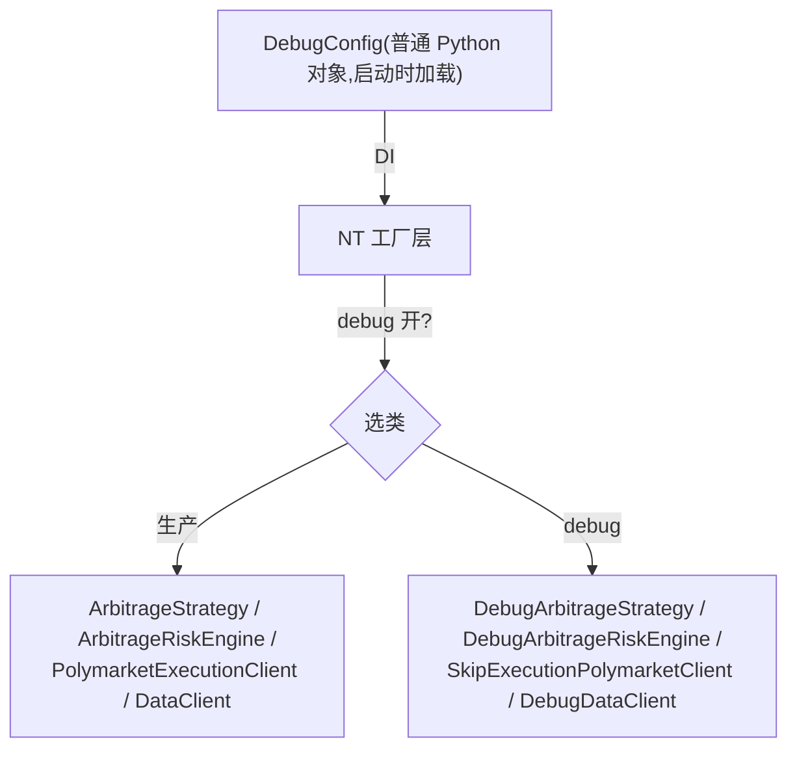

# 横切:Debug 注入框架详细设计

> **定位**:详细设计。理由/历史见初设 `refactor.md §6.6`(Q11)。
> 冲突时:**有把握 → 以本文为准并回写 `refactor.md` 修订记录;没把握 → 讨论**。
> **横切机制**(贯穿 data / strategy / risk / execution 各组件的测试注入)。

---

## 1. 原则(P10)

所有可被 debug 改写的行为(数据流 / 客户端选择 / Strategy 决策参数 / Risk 校验 / 订单状态流转)统一用:

**生产类干净 + Debug 子类覆盖 hook + 工厂层选择**。

→ **生产代码零 `if self._debug` 分支**(架构对称、关注点分离、测试隔离)。生产类**不导入也不感知** `DebugConfig`。

---

## 2. 注入机制



- **DebugConfig**:普通对象,启动时加载,经 NT 工厂层 DI 分发;**不进 NT Cache**(Q11.5,YAGNI)。
- **工厂选择**:工厂根据 DebugConfig 决定 new 生产类还是 Debug 子类;生产类不变。
- **不实现热重载**(Q11.1):改完**重启进程**。

---

## 3. 子类覆盖点(各组件)

| 组件 | Debug 子类 | 覆盖的 hook / 行为 |
|---|---|---|
| Strategy | `DebugArbitrageStrategy` | `min_rebate_rate` / `polymarket_price` / `orbitexch_price` / `polymarket_size` / `orbitexch_size` 等 override hook(强制覆盖真实最优价/size/阈值) |
| Risk | `DebugArbitrageRiskEngine` | `skip_check_size`:`_check_order` 子类覆盖,跳过 NT 父类最小限额检查(让小单过用于链路测试)。**粒度待 Step 6 核实**(只跳 min_quantity 不跳 max/notional 是否可行) |
| Execution(PM) | `SkipExecutionPolymarketClient` | `_submit_order` 直接 `generate_order_filled` mock(不真正下单);OE 同构子类 |
| Execution(settlement) | (子类/开关) | `skip_settlement`:健康检查路径不真正上链 / mock `TxResult` |
| Data | `DebugDataClient` | 注入 mock 行情帧 / 控制数据流 |
| (订单状态流转) | `timeline.py` | NT `Clock.set_timer` 驱动订单状态变化(Q11.4:NT-pure 重写,非平移旧实现) |

---

## 4. 目录与文件(`src/arbitrage/debug/`)

```
src/arbitrage/debug/
  config.py         # DebugConfig 单例(普通对象,不进 Cache)
  data_clients.py   # DebugDataClient
  strategy.py       # DebugArbitrageStrategy(override hooks)
  risk.py           # DebugArbitrageRiskEngine(skip_check_size)
  factories.py      # 工厂层:按 DebugConfig 选生产/Debug 类
  timeline.py       # 订单状态流转引擎(NT Clock.set_timer,Q11.4 重写)
```

> PM 的 `SkipExecutionPolymarketClient` 放 adapter 子类或 debug/(实施时定);OE 同构。

---

## 5. Q11 子问题锁定

| # | 问题 | 锁定 |
|---|---|---|
| Q11.1 | 热重载 | ❌ 不实现,改完重启进程 |
| Q11.2 | `skip_check_size` 落点 | `DebugArbitrageRiskEngine._check_order` 子类覆盖(跳 NT 最小限额)。应用层 `MIN_SIZE_*` 常量 / `check_min_size` 全删 |
| Q11.3 | `skip_execution` | `SkipExecutionPolymarketClient._submit_order` 直接 mock `generate_order_filled` |
| Q11.4 | timeline 引擎 | NT-pure 重写,`Clock.set_timer` 触发状态变化(不平移旧实现) |
| Q11.5 | DebugConfig 进 Cache? | ❌ 不进,只经工厂层 DI(YAGNI) |
| 全局 | 架构对称 | 所有 debug 行为变化 = 子类化 + 工厂选择;生产代码零 `if self._debug` |

---

## 6. 落地清单

- [ ] `DebugConfig` + 工厂层选择(生产/Debug)
- [ ] 各组件 Debug 子类(覆盖 hook,不改生产类)
- [ ] `timeline.py`(NT Clock.set_timer 状态机)
- [ ] 验证生产代码**零** `if self._debug`(静态检查)
- [ ] 对应测试:`tests/arbitrage/debug/README.md`
