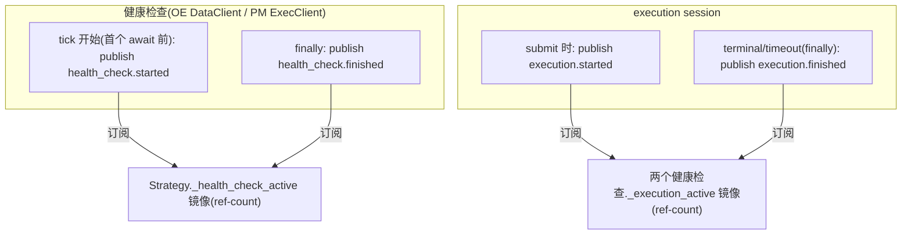
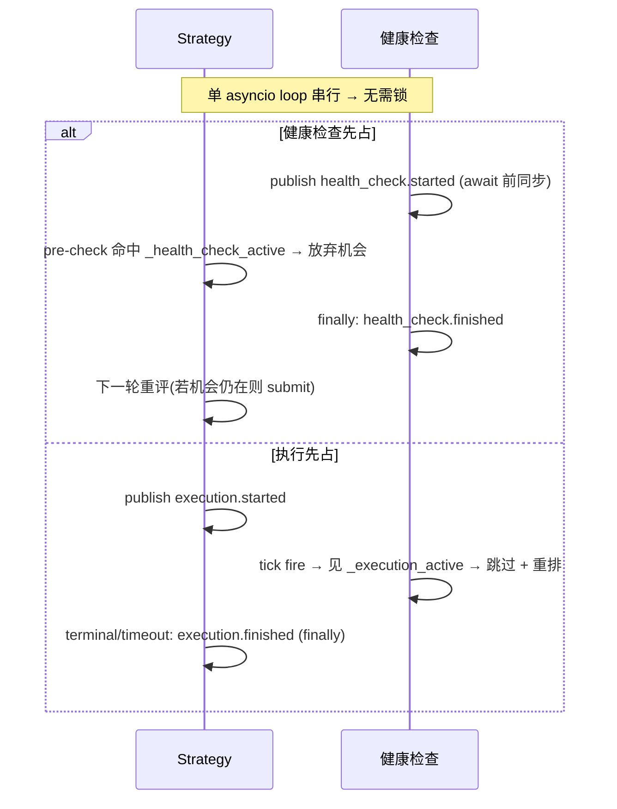

# 横切:组件间同步(健康检查 ⊥ 执行)详细设计

> **定位**:详细设计。理由/历史见初设 `refactor.md §6.10`(Q19)。
> 冲突时:**有把握 → 以本文为准并回写 `refactor.md` 修订记录;没把握 → 讨论**。
> **这是横切协议**(P11:无单一归属)—— 由 **4 个组件共同实现同一契约**:Strategy、OE 健康检查(`OrbitExchDataClient`)、PM 健康检查(PM ExecClient 子类)、execution session。任一实现者以本文为准。

---

## 1. 要解决的问题

健康检查(OE 页面 reload / PM report 拉取 + merge/redeem)与订单执行(submit + tracking)若并发会互相破坏:
- OE reload 冲掉执行页面;
- merge/redeem 改链上持仓时执行在飞;
- report reconcile 与 tracking 抢 `leg_settled`。

**锁定方案 = 全局互斥**(最粗粒度):任一健康检查 tick 在跑 → Strategy 放弃所有机会;任一执行在飞 → 所有健康检查推迟。

---

## 2. 状态与消息

### 2.1 两个全局状态(ref-count)

| 状态 | 含义 | 维护 |
|---|---|---|
| `_health_check_active` | 任一 venue 健康检查 tick 进行中 | ref-count(OE/PM 各发各的消息,消费方计数;count 可达 2) |
| `_execution_active` | 一次执行 session 从 submit 到 terminal/timeout | ref-count |

> **OE/PM 各维护各的健康检查、各发各的 `health_check.*`**(两套独立组件 / 独立 NT clock / 独立节奏);但因全局互斥,消费方把两路 **ref-count 并成一个**全局态(`started`→++,`finished`→--,`>0` 即"有健康检查在跑")。**不是两个独立互斥域**。

### 2.2 msgbus 消息(前后都发)

| 消息 topic | 发布者 | 订阅者 |
|---|---|---|
| `health_check.started` / `.finished` | OE 健康检查、PM 健康检查(各发各的) | Strategy(维护 `_health_check_active`) |
| `execution.started` / `.finished` | execution session | OE 健康检查、PM 健康检查(维护 `_execution_active`) |

---

## 3. 协议(各组件实现什么)

| 组件 | 实现 |
|---|---|
| **Strategy** | **执行同步前置**:决策点 pre-check `if _health_check_active: 放弃机会, early return`(与 settled pre-check 并列)。**不是执行中途打断,而是健康检查期间根本不开新执行**。submit 时发 `execution.started`,session 到 terminal/timeout 发 `execution.finished` |
| **OE / PM 健康检查** | tick callback 开头 `if _execution_active: 跳过本 tick`(`finally` 照常重排下次 alert);否则首个 await 前 publish `health_check.started`、`finally` publish `health_check.finished` |
| **execution session** | 见 execution 文档 §3.4(发 `execution.*`) |

---

## 4. 为什么单 loop 无需锁(P1,NT 原语)

NT `LiveClock` 回调、Actor handler、`msgbus` 派发**都在同一 asyncio event loop 串行**。只要"**检查 + 置位 + publish 在首个 `await` 之前同步完成**",就不存在交错——Strategy 的 submit 决策回调与健康检查回调不会真正并行;`msgbus.publish` 同步派发,`publish health_check.started` 返回时 Strategy 镜像已置位。

**实施纪律(硬约束)**:
- 置位必须在任何 `await` 之前同步做;
- 清位放 `finally`(terminal **和** timeout 两条路径都要清,否则 `_execution_active` 泄漏 → 健康检查永久饿死)。

---

## 5. 代价(已接受)

- 执行在飞时所有健康检查暂停 → staleness 检测延迟 += 执行时长(上界 = execution tracking timeout)。
- 健康检查跑时 Strategy 放弃机会 → 下一轮(alert 重排后)重评。
- 全局粒度换取实现最简 + 最安全。

**连带红利**:全局互斥使"同时在飞的执行 ≤ 1",直接把 Strategy 机会快照(Q20)的并发数压到 ≤1,快照回收变 trivial(见 strategy 文档)。

---

## 6. 落地清单

- [ ] 定义 msgbus topic 常量:`health_check.started/finished`、`execution.started/finished`
- [ ] Strategy:订 `health_check.*` 维护 ref-count 镜像 + submit pre-check + 发 `execution.*`
- [ ] OE/PM 健康检查:订 `execution.*` 维护 ref-count 镜像 + tick 开头跳过判断 + 发 `health_check.*`
- [ ] 置位在 await 前、清位在 finally(代码审查硬检查)
- [ ] 对应测试:`strategy-4.{15,16}`、`pm-adapter-5.health.5`、`oe-adapter-2.health.5`

---

## 7. per-pair 机会串行闸(§6.10 的 per-pair 维度,#84)

### 7.1 为什么 §1-6 的全局互斥不够

§1-6 的 `_execution_active` / `execution.*` 是**全局**态(针对所有 pair),且**发布点在 `_begin_session`** —— 那是 NT **异步** `_submit_order` 任务的末端,在「OBD 回调 → 评估决策 → `submit_order` → RiskEngine(同步)」这条同步链的**下游**。后果:

- strategy 评估是 `create_task` **并发**派发(`actor.py:_route_eval`),`leg_settled`(`_begin_session` arm)/ `execution.started`(`_begin_session` publish)都在异步执行链才置;
- **同一 OBD 突发的多个评估,在任何在飞信号置位之前就已各自决策并下单** → 同一 pair 重复 fire(实测:一批 OBD → 4 笔 OE 单同毫秒,见 refactor.md #82 复盘);
- settled gate(Portfolio way_rebate / RiskEngine,§6.8.2)、cancel-only(§6.8.5)同样读这些下游信号 → 对同毫秒并发**全部漏过**(串行轮次有效,并发突发无效)。

**结论**:全局互斥 + settled gate 解决「健康检查 ⊥ 执行」「跨轮重入」,但**结构上拦不住同一 pair 同一瞬间的并发评估/fire**(信号永远在异步下游)。需要一道**同步**的 per-pair 闸。

### 7.2 不变量

- **per-pair:同一 pair 同时只有 1 笔套利在「评估 → 执行」生命周期内**(不同 pair 互不影响,可并发);
- 推论:per-pair 不同时评估多个机会、不同时执行多个机会。

### 7.3 机制 —— 同步 per-pair 闸(`PairInFlightGate`)

共享 registry(launcher 经 `ArbContext` 注入给 **StrategyEvaluator + execution session**,同 `leg_settled` 套路)。**所有置位/清位都在首个 `await` 前同步做**(复用 §4 单 loop 无锁纪律)。

| 时机 | 组件 | 动作 |
|---|---|---|
| OBD 回调 `_route_eval`(**同步**,`create_task` 之前) | Strategy | `try_enter(pair)`:已在飞 → **直接放弃**(`return`,不 create_task);否则置位 |
| `_evaluate_and_fire` 收尾(finally) | Strategy | **未 fire**(无机会/abort/异常)→ `release_eval(pair)`;**已 fire** → 不释放(所有权交执行) |
| `_begin_session`(per-leg,同步段) | execution | `exec_started(pair)`:per-pair execution session 计数 ++ |
| `_end_session`(terminal/timeout) | execution | `exec_finished(pair)`:计数 --;**归 0 → 释放 in-flight** |

**交接(strategy → execution)无空窗**:strategy fire 后**不释放**(in-flight 持续置位),异步 `_submit_order` 到 `_begin_session` 才 `exec_started` —— 这中间 in-flight 一直由 strategy 持有,并发 OBD 进来即被 `try_enter` 挡掉。执行全部结束(双腿 session 计数归 0)由 execution 释放。

**防泄漏(硬约束)**:
- **fire 了但一腿 session 都没起**(全被 RiskEngine deny / cancel-only 丢弃)→ in-flight 无人清 → 用 **`try_enter` 的 max-hold 陈旧自愈**:in-flight 带时间戳,超过 `max_hold`(> 单笔套利最长耗时,取 `≥2×tracking_timeout`)即视为空闲可重入。罕见兜底,正常路径不依赖。
- `release_eval` 只在 `exec_count==0` 时清(fire 后 exec_count>0 则是 no-op,交执行清)。

### 7.4 与既有机制的关系

- **正交于全局互斥(§1-6)**:全局闸管「执行 ⊥ 健康检查」「≤1 全局执行」;per-pair 闸管「同 pair 不并发评估/执行」。两者并存,前置 pre-check 并列(`_health_check_active` / 全局 `_execution_active` / **per-pair in-flight** / settled / RiskEngine)。
- **补 settled gate / cancel-only 的并发洞**:它们读异步下游信号,对同毫秒并发无效;per-pair 闸在 OBD 回调同步置位,正好堵这个洞。

### 7.5 落地清单

- [ ] `src/arbitrage/common/pair_inflight.py`:`PairInFlightGate`(`try_enter` / `release_eval` / `exec_started` / `exec_finished`,带 max-hold 自愈)
- [ ] `ArbContext` + launcher 注入(StrategyEvaluator deps + execution session `_init_arb_session`)
- [ ] Strategy `_route_eval` 同步 `try_enter`(create_task 前)+ `_evaluate_and_fire` finally `release_eval`(未 fire)
- [ ] execution `_begin_session` `exec_started` / `_end_session` `exec_finished`
- [ ] 测试:strategy 并发同 pair 只 fire 一次 / 不同 pair 可并发 / fire 后执行持有到 session 归 0 / 未 fire 即释放 / max-hold 自愈
