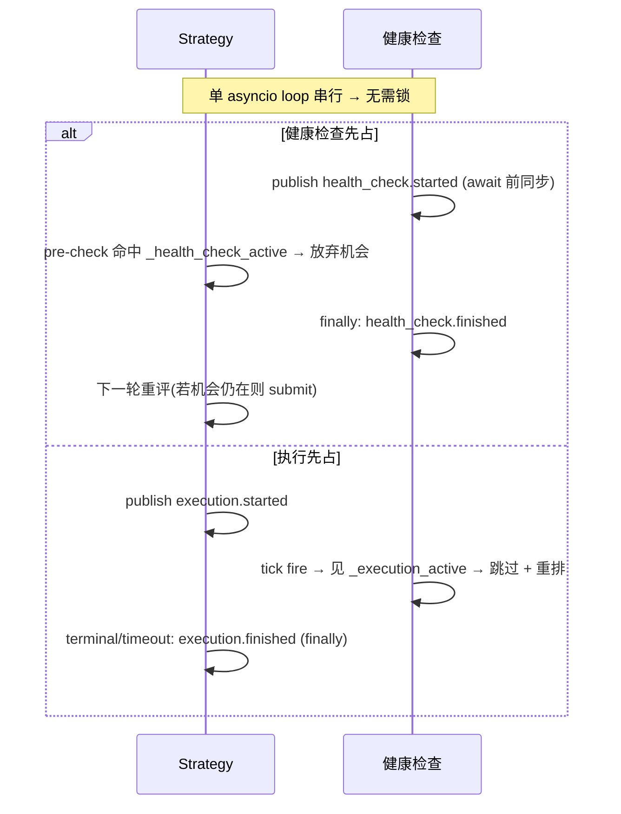

# 横切:组件间同步(健康检查 ⊥ 执行)详细设计

> **定位**:详细设计。理由/历史见初设 `refactor.md §6.10`(Q19)。
> 冲突时:**有把握 → 以本文为准并回写 `refactor.md` 修订记录;没把握 → 讨论**。
> **这是横切协议**(P11:无单一归属)—— 由 **4 个组件共同实现同一契约**:Strategy、OE 健康检查(`OrbitExchDataClient`)、PM 健康检查(PM ExecClient 子类)、execution session。任一实现者以本文为准。

---

## 1. 要解决的问题

健康检查(OE 页面 reload / PM report 拉取 + merge/redeem)与订单执行(submit + tracking)若并发会互相破坏:
- OE reload 冲掉执行页面;
- merge/redeem 改链上持仓时执行在飞;
- report reconcile 与 tracking 抢 `leg_settled`。

**锁定方案 = 互斥**(#89 修正为 **per-venue**,非全局):
- **健康检查 ⊥ 执行 = per-venue**:每 venue 的健康检查只在**该 venue** 有执行在飞时推迟 —— OE reload 只跟 OE 下单冲突,PM merge/redeem 只跟 PM 执行冲突,互不干涉。
- **Strategy ⊥ 健康检查 = 任一**:**任一** venue 健康检查在跑 → Strategy 放弃机会(strategy fire 跨 PM+OE 双腿,任一 venue 健检在跑都可能撞下单)。

---

## 2. 状态与消息

### 2.1 两个状态

| 状态 | 消费方 | 含义 | 维护 |
|---|---|---|---|
| `_hc_running`(健康检查在跑) | **Strategy** | **任一** venue 健康检查 tick 进行中 | strategy 订 `health_check.*`,维护**在跑 source 集合**(per-venue 信号位,**非 ref-count**;`started`→add / `finished`→discard;非空即活) |
| `_execution_active`(本 venue 执行在飞) | **每 venue 健康检查** | **本 venue** 一条执行 session 从 submit 到 terminal/timeout | **per-venue**(#89):PM 直接读 `self._execution_active`(自己的 session);OE DataClient 订 `execution.*` 但**按 msg instrument venue 过滤、只数 OE 自己的腿** |

> **per-venue(#89)**:`execution.*` 是全局 topic(PM/OE 共发),但消费方**各只数自己 venue 的腿** —— OE 健检数 OE 腿、PM 健检数 PM 腿,互不并入。Strategy 侧 `_hc_running` 则是「任一健检在跑」(per-venue 信号位集合,非空即活),因 strategy fire 跨双腿。

### 2.2 msgbus 消息(前后都发)

```mermaid
flowchart TB
  subgraph 健康检查["健康检查(OE DataClient / PM ExecClient)"]
    HCs["tick 开始(首个 await 前): publish health_check.started"]
    HCf["finally: publish health_check.finished"]
  end
  subgraph 执行["execution session"]
    EXs["submit 时: publish execution.started"]
    EXf["terminal/timeout(finally): publish execution.finished"]
  end
  HCs & HCf -->|订阅| STR["Strategy._hc_running 镜像(per-venue source 集合,任一非空即活)"]
  EXs & EXf -->|订阅(按 venue 过滤)| HCsub["每 venue 健康检查._execution_active(只数本 venue 腿,#89)"]
```

| 消息 topic | 发布者 | 订阅者 |
|---|---|---|
| `health_check.started` / `.finished` | OE 健康检查、PM 健康检查(各发各的) | Strategy(维护 `_health_check_active`) |
| `execution.started` / `.finished` | execution session | OE 健康检查、PM 健康检查(维护 `_execution_active`) |

---

## 3. 协议(各组件实现什么)

| 组件 | 实现 |
|---|---|
| **Strategy** | **执行同步前置**:决策点 pre-check `if _hc_running(任一 venue 健检在跑): 放弃机会, early return`(与 settled / per-pair pre-check 并列)。**健康检查期间根本不开新执行**。submit 时发 `execution.started`,session 到 terminal/timeout 发 `execution.finished`。**收 `health_check.finished` 且全不在跑 + leg_settled 全 true → `pair_inflight.clear_all()`**(§7.6) |
| **OE / PM 健康检查** | tick callback 开头 `if _execution_active(**本 venue**): 跳过本 tick`(`finally` 照常重排下次 alert);否则首个 await 前 publish `health_check.started`、`finally` publish `health_check.finished`。**OE 订 `execution.*` 按 venue 过滤只数 OE 腿(#89)**;PM 直接读自己 session |
| **execution session** | 见 execution 文档 §3.4(发 `execution.*`) |



---

## 4. 为什么单 loop 无需锁(P1,NT 原语)

NT `LiveClock` 回调、Actor handler、`msgbus` 派发**都在同一 asyncio event loop 串行**。只要"**检查 + 置位 + publish 在首个 `await` 之前同步完成**",就不存在交错——Strategy 的 submit 决策回调与健康检查回调不会真正并行;`msgbus.publish` 同步派发,`publish health_check.started` 返回时 Strategy 镜像已置位。

**实施纪律(硬约束)**:
- 置位必须在任何 `await` 之前同步做;
- 清位放 `finally`(terminal **和** timeout 两条路径都要清,否则 `_execution_active` 泄漏 → 健康检查永久饿死)。

---

## 5. 代价(已接受)

- **本 venue** 执行在飞时该 venue 健康检查暂停 → staleness 检测延迟 += 执行时长(上界 = execution tracking timeout)。
- 任一健康检查跑时 Strategy 放弃机会 → 下一轮(alert 重排后)重评。
- per-venue 粒度:OE/PM 健康检查互不阻塞(OE 不再因 PM 执行而多等,#89)。

**「≤1 执行」的来源(per-venue 后不再是本互斥的红利)**:"同时在飞的套利 ≤ 1" 现由 **Strategy 全局 `is_execution_active`(聚合所有 exec client)+ per-pair 闸(§7)** 保证,不再是 health-check⊥execution 互斥的连带红利(后者已 per-venue,PM/OE 各自独立)。Q20 机会快照并发数 ≤1 仍成立(靠 strategy 侧那道)。

---

## 6. 落地清单

- [ ] 定义 msgbus topic 常量:`health_check.started/finished`、`execution.started/finished`
- [ ] Strategy:订 `health_check.*` 维护 ref-count 镜像 + submit pre-check + 发 `execution.*`
- [ ] OE/PM 健康检查:订 `execution.*` 维护 ref-count 镜像 + tick 开头跳过判断 + 发 `health_check.*`
- [ ] 置位在 await 前、清位在 finally(代码审查硬检查)
- [ ] 对应测试:`strategy-4.{15,16}`、`pm-adapter-5.health.5`、`oe-adapter-2.health.5`

---

## 7. per-pair 机会串行闸(§6.10 的 per-pair 维度,#84)

### 7.1 为什么 §1-6 的全局互斥不够

§1-6 的 `_execution_active` / `execution.*` 是**全局**态(针对所有 pair),且**发布点在 `_begin_session`** —— 那是 NT **异步** `_submit_order` 任务的末端,在「OBD 回调 → 评估决策 → `submit_order` → RiskEngine(同步)」这条同步链的**下游**。后果:

- strategy 评估是 `create_task` **并发**派发(`actor.py:_route_eval`),`leg_settled`(`_begin_session` arm)/ `execution.started`(`_begin_session` publish)都在异步执行链才置;
- **同一 OBD 突发的多个评估,在任何在飞信号置位之前就已各自决策并下单** → 同一 pair 重复 fire(实测:一批 OBD → 4 笔 OE 单同毫秒,见 refactor.md #82 复盘);
- settled gate(Portfolio way_rebate / RiskEngine,§6.8.2)、cancel-only(§6.8.5)同样读这些下游信号 → 对同毫秒并发**全部漏过**(串行轮次有效,并发突发无效)。

**结论**:全局互斥 + settled gate 解决「健康检查 ⊥ 执行」「跨轮重入」,但**结构上拦不住同一 pair 同一瞬间的并发评估/fire**(信号永远在异步下游)。需要一道**同步**的 per-pair 闸。

### 7.2 不变量

- **per-pair:同一 pair 同时只有 1 笔套利在「评估 → 执行」生命周期内**(不同 pair 互不影响,可并发);
- 推论:per-pair 不同时评估多个机会、不同时执行多个机会。

### 7.3 机制 —— 同步 per-pair 闸(`PairInFlightGate`)

共享 registry(launcher 经 `ArbContext` 注入给 **StrategyEvaluator + execution session**,同 `leg_settled` 套路)。**所有置位/清位都在首个 `await` 前同步做**(复用 §4 单 loop 无锁纪律)。

| 时机 | 组件 | 动作 |
|---|---|---|
| OBD 回调 `_route_eval`(**同步**,`create_task` 之前) | Strategy | `try_enter(pair)`:已在飞 → **直接放弃**(`return`,不 create_task);否则置位 |
| `_evaluate_and_fire` 收尾(finally) | Strategy | **未 fire**(无机会/abort/异常)→ `release_eval(pair)`;**已 fire** → 不释放(所有权交执行) |
| `_begin_session`(per-leg,同步段) | execution | `exec_started(pair)`:per-pair execution session 计数 ++ |
| `_end_session`(terminal/timeout) | execution | `exec_finished(pair)`:计数 --;**归 0 → 释放 in-flight** |

**交接(strategy → execution)无空窗**:strategy fire 后**不释放**(in-flight 持续置位),异步 `_submit_order` 到 `_begin_session` 才 `exec_started` —— 这中间 in-flight 一直由 strategy 持有,并发 OBD 进来即被 `try_enter` 挡掉。执行全部结束(双腿 session 计数归 0)由 execution 释放。

**防泄漏(异常路径让 in-flight / exec_count 卡死,两层兜底)**:
泄漏场景:`_end_session` 在 `exec_finished` 前抛异常 / fire 了但一腿 session 都没起(全 deny / cancel-only 丢弃)/ 超时 alert 丢失 → `_inflight` 或 `_exec_count` 卡住,该 pair 之后被永久挡住。

1. **健康检查触发 `clear_all`(主,#85,见 §7.6)**:strategy 收到 `health_check.finished` 且**全部健康检查不在跑** 且 **`leg_settled` 全 true**(无腿「已发未确认」=确无 arb 在飞)→ `clear_all()`(清 `_inflight` **+ `_exec_count`**)。主动、且连脏计数一起清。
2. **`try_enter` 的 max-hold 陈旧自愈(辅)**:in-flight 带时间戳,超过 `max_hold`(`≥2×tracking_timeout`)即视为空闲可重入。被动、只清 `_inflight`(清不到 `_exec_count`),作健检也卡住时的最后防线。
- `release_eval` 只在 `exec_count==0` 时清(fire 后 exec_count>0 则是 no-op,交执行清)。

### 7.4 与既有机制的关系

- **正交于全局互斥(§1-6)**:全局闸管「执行 ⊥ 健康检查」「≤1 全局执行」;per-pair 闸管「同 pair 不并发评估/执行」。两者并存,前置 pre-check 并列(`_health_check_active` / 全局 `_execution_active` / **per-pair in-flight** / settled / RiskEngine)。
- **补 settled gate / cancel-only 的并发洞**:它们读异步下游信号,对同毫秒并发无效;per-pair 闸在 OBD 回调同步置位,正好堵这个洞。

### 7.6 健康检查触发的兜底 `clear_all`(#85)

**strategy 订 `health_check.*`**(本次才落地 —— §1-6 设计有此互斥但代码一直没接):
- `on_start` 订 `health_check.started`/`finished`;维护**在跑的 source 集合** `_hc_running`(`started`→add、`finished`→discard)。**用 per-venue 信号位集合,不是 ref-count**(用户拍板):OE/PM 各是各的 source、幂等、`set` 非空即「有健康检查在跑」。
- **strategy ⊥ 健康检查互斥**:`_route_eval` pre-check `if _hc_running: 放弃 fire`(补上 §3 Strategy 行那条一直没实现的方向 —— 避免在 OE 健检 reload 页面期间下单撞页)。
- **兜底 `clear_all`**:收到任一 `finished` → 移除该 source 后,**若 `_hc_running` 空(全不在跑)且 `leg_settled.has_any_unsettled()==False`** → `pair_inflight.clear_all()`。

**为什么判据用 `leg_settled` 全 true 而非 `is_execution_active`**(用户拍板):`leg_settled[leg]=false` = 「该腿已发未确认 = 正在执行」,**arb 级**、和 per-pair 闸同粒度。`leg_settled` 全 true = 确无腿处于「已发未确认」→ 残留闸都是泄漏可清。`accept→terminal` 窗口(腿已 accept、session 还活)即便清掉也无害 —— 全局 `is_execution_active` 兜新 fire,故**不再叠加 `is_execution_active False` 条件**。

> 注:「执行 ⊥ 健康检查」已是 **per-venue(#89,见 §2.1/§1)** —— OE DataClient 订 `execution.*` 按 msg instrument venue 过滤、只数 OE 自己的腿;PM 直接读自己 session。clear_all 判据用 `leg_settled` 不是 execution-active,与此正交。

### 7.5 落地清单

- [x] `src/arbitrage/common/pair_inflight.py`:`PairInFlightGate`(`try_enter` / `release_eval` / `exec_started` / `exec_finished` / **`clear_all`**,带 max-hold 自愈)
- [x] `ArbContext` + launcher 注入(StrategyEvaluator deps + execution session `_init_arb_session`)
- [x] Strategy `_route_eval` 同步 `try_enter`(create_task 前)+ `_evaluate_and_fire` finally `release_eval`(未 fire)
- [x] execution `_begin_session` `exec_started` / `_end_session` `exec_finished`
- [x] **(#85)Strategy 订 `health_check.*` → `_hc_running` per-venue 集合 + `_route_eval` 互斥 pre-check + `finished` 时(全不在跑 + leg_settled 全 true)`clear_all`;注入 `leg_settled`**
- [x] 测试:`test_pair_inflight.py`(含 `clear_all`)+ `test_evaluator.py` eval.15-19(并发只 fire 一次 / 不同 pair 不阻塞 / 健检在跑放弃 / 健检结束+全 settled→clear / 有腿未结算→不 clear)
