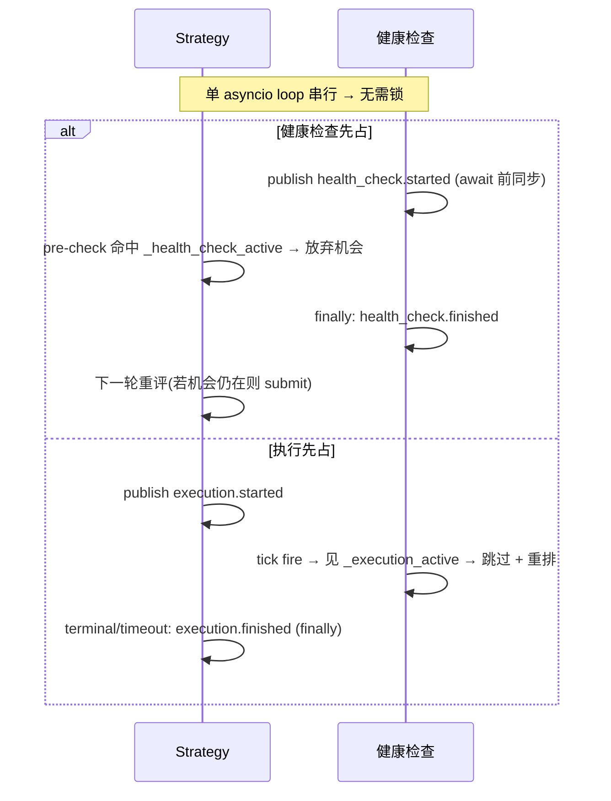

# 横切:组件间同步(健康检查 ⊥ 执行)详细设计

> **定位**:详细设计。理由/历史见初设 `refactor.md §6.10`(Q19)。
> 冲突时:**有把握 → 以本文为准并回写 `refactor.md` 修订记录;没把握 → 讨论**。
> **这是横切协议**(P11:无单一归属)—— 由 **4 个组件共同实现同一契约**:Strategy、OE 健康检查(`OrbitExchDataClient`)、PM 健康检查(PM ExecClient 子类)、execution session。任一实现者以本文为准。

> ⚠️ **失效指针(#105,2026-06-13,设计/待落地)**:§1–7 描述的是**自写 HealthCheckLoop 时代**的同步设计。**#105 决定把健康检查迁移到 NT 原生 reconciliation**,据此:
> - **`health_check.*` 消息 + Strategy `_hc_running` + strategy⊥健康检查互斥(§1 第二条、§2.1 `_hc_running`、§3 Strategy 行、§7.6)→ 退役**(由 OE ExecClient 页锁取代其存在理由);
> - **健康检查⊥执行 per-venue 互斥(§1 第一条、§2.1 `_execution_active`、§3 健康检查行)→ 退役**(NT 不串行化 reconciliation⊥execution,改由 OE 页锁在资源层串行);
> - **pair_inflight 兜底 `health_check→clear_all`(§7.6)+ max-hold(§7.3)已全部删除(#105 ②,2026-06-15)→ in-flight 出口靠结构保证:opportunity barrier 出口 + session `exec_started`↔watchdog 原子(§7.3)**。
> 读 §1–7 时务必先读 **§8**(迁移后的现状真理源);§1–7 保留为迁移前设计记录。**2026-06-15 修正**:`leg_settled` 退役,由 §8.5 `VenueExecutionLiveness` 取代;per-pair `PairInFlightGate` 机制本体保留,兜底触发已删除。

---

## 1. 要解决的问题

健康检查(OE 页面 reload / PM report 拉取 + merge/redeem)与订单执行(submit + tracking)若并发会互相破坏:
- OE reload 冲掉执行页面;
- merge/redeem 改链上持仓时执行在飞;
- report reconcile 与 tracking 抢 `leg_settled`。

**锁定方案 = 互斥**(#89 修正为 **per-venue**,非全局):
- **健康检查 ⊥ 执行 = per-venue**:每 venue 的健康检查只在**该 venue** 有执行在飞时推迟 —— OE reload 只跟 OE 下单冲突,PM merge/redeem 只跟 PM 执行冲突,互不干涉。
- **Strategy ⊥ 健康检查 = 任一**:**任一** venue 健康检查在跑 → Strategy 放弃机会(strategy fire 跨 PM+OE 双腿,任一 venue 健检在跑都可能撞下单)。

---

## 2. 状态与消息

### 2.1 两个状态

| 状态 | 消费方 | 含义 | 维护 |
|---|---|---|---|
| `_hc_running`(健康检查在跑) | **Strategy** | **任一** venue 健康检查 tick 进行中 | strategy 订 `health_check.*`,维护**在跑 source 集合**(per-venue 信号位,**非 ref-count**;`started`→add / `finished`→discard;非空即活) |
| `_execution_active`(本 venue 执行在飞) | **每 venue 健康检查** | **本 venue** 一条执行 session 从 submit 到 terminal/timeout | **per-venue**(#89):PM 直接读 `self._execution_active`(自己的 session);OE DataClient 订 `execution.*` 但**按 msg instrument venue 过滤、只数 OE 自己的腿** |

> **per-venue(#89)**:`execution.*` 是全局 topic(PM/OE 共发),但消费方**各只数自己 venue 的腿** —— OE 健检数 OE 腿、PM 健检数 PM 腿,互不并入。Strategy 侧 `_hc_running` 则是「任一健检在跑」(per-venue 信号位集合,非空即活),因 strategy fire 跨双腿。

### 2.2 msgbus 消息(前后都发)

```mermaid
flowchart TB
  subgraph 健康检查["健康检查(OE DataClient / PM ExecClient)"]
    HCs["tick 开始(首个 await 前): publish health_check.started"]
    HCf["finally: publish health_check.finished"]
  end
  subgraph 执行["execution session"]
    EXs["submit 时: publish execution.started"]
    EXf["terminal/timeout(finally): publish execution.finished"]
  end
  HCs & HCf -->|订阅| STR["Strategy._hc_running 镜像(per-venue source 集合,任一非空即活)"]
  EXs & EXf -->|订阅(按 venue 过滤)| HCsub["每 venue 健康检查._execution_active(只数本 venue 腿,#89)"]
```

| 消息 topic | 发布者 | 订阅者 |
|---|---|---|
| `health_check.started` / `.finished` | OE 健康检查、PM 健康检查(各发各的) | Strategy(维护 `_health_check_active`) |
| `execution.started` / `.finished` | execution session | OE 健康检查、PM 健康检查(维护 `_execution_active`) |

---

## 3. 协议(各组件实现什么)

| 组件 | 实现 |
|---|---|
| **Strategy** | **执行同步前置**:决策点 pre-check `if _hc_running(任一 venue 健检在跑): 放弃机会, early return`(与 settled / per-pair pre-check 并列)。**健康检查期间根本不开新执行**。submit 时发 `execution.started`,session 到 terminal/timeout 发 `execution.finished`。**收 `health_check.finished` 仅移除 source(#105 ② 后不再 `clear_all`,§7.6)** |
| **OE / PM 健康检查** | tick callback 开头 `if _execution_active(**本 venue**): 跳过本 tick`(`finally` 照常重排下次 alert);否则首个 await 前 publish `health_check.started`、`finally` publish `health_check.finished`。**OE 订 `execution.*` 按 venue 过滤只数 OE 腿(#89)**;PM 直接读自己 session |
| **execution session** | 见 execution 文档 §3.4(发 `execution.*`) |



---

## 4. 为什么单 loop 无需锁(P1,NT 原语)

NT `LiveClock` 回调、Actor handler、`msgbus` 派发**都在同一 asyncio event loop 串行**。只要"**检查 + 置位 + publish 在首个 `await` 之前同步完成**",就不存在交错——Strategy 的 submit 决策回调与健康检查回调不会真正并行;`msgbus.publish` 同步派发,`publish health_check.started` 返回时 Strategy 镜像已置位。

**实施纪律(硬约束)**:
- 置位必须在任何 `await` 之前同步做;
- 清位放 `finally`(terminal **和** timeout 两条路径都要清,否则 `_execution_active` 泄漏 → 健康检查永久饿死)。

---

## 5. 代价(已接受)

- **本 venue** 执行在飞时该 venue 健康检查暂停 → staleness 检测延迟 += 执行时长(上界 = execution tracking timeout)。
- 任一健康检查跑时 Strategy 放弃机会 → 下一轮(alert 重排后)重评。
- per-venue 粒度:OE/PM 健康检查互不阻塞(OE 不再因 PM 执行而多等,#89)。

**「≤1 执行」的来源(per-venue 后不再是本互斥的红利)**:"同时在飞的套利 ≤ 1" 现由 **Strategy 全局 `is_execution_active`(聚合所有 exec client)+ per-pair 闸(§7)** 保证,不再是 health-check⊥execution 互斥的连带红利(后者已 per-venue,PM/OE 各自独立)。Q20 机会快照并发数 ≤1 仍成立(靠 strategy 侧那道)。

---

## 6. 落地清单

- [ ] 定义 msgbus topic 常量:`health_check.started/finished`、`execution.started/finished`
- [ ] Strategy:订 `health_check.*` 维护 ref-count 镜像 + submit pre-check + 发 `execution.*`
- [ ] OE/PM 健康检查:订 `execution.*` 维护 ref-count 镜像 + tick 开头跳过判断 + 发 `health_check.*`
- [ ] 置位在 await 前、清位在 finally(代码审查硬检查)
- [ ] 对应测试:`strategy-4.{15,16}`、`pm-adapter-5.health.5`、`oe-adapter-2.health.5`

---

## 7. per-pair 机会串行闸(§6.10 的 per-pair 维度,#84)

### 7.1 为什么 §1-6 的全局互斥不够

§1-6 的 `_execution_active` / `execution.*` 是**全局**态(针对所有 pair),且**发布点在 `_begin_session`** —— 那是 NT **异步** `_submit_order` 任务的末端,在「OBD 回调 → 评估决策 → `submit_order` → RiskEngine(同步)」这条同步链的**下游**。后果:

- strategy 评估是 `create_task` **并发**派发(`actor.py:_route_eval`),`leg_settled`(`_begin_session` arm)/ `execution.started`(`_begin_session` publish)都在异步执行链才置;
- **同一 OBD 突发的多个评估,在任何在飞信号置位之前就已各自决策并下单** → 同一 pair 重复 fire(实测:一批 OBD → 4 笔 OE 单同毫秒,见 refactor.md #82 复盘);
- settled gate(Portfolio way_rebate / RiskEngine,§6.8.2)、cancel-only(§6.8.5)同样读这些下游信号 → 对同毫秒并发**全部漏过**(串行轮次有效,并发突发无效)。

**结论**:全局互斥 + settled gate 解决「健康检查 ⊥ 执行」「跨轮重入」,但**结构上拦不住同一 pair 同一瞬间的并发评估/fire**(信号永远在异步下游)。需要一道**同步**的 per-pair 闸。

### 7.2 不变量

- **per-pair:同一 pair 同时只有 1 笔套利在「评估 → 执行」生命周期内**(不同 pair 互不影响,可并发);
- 推论:per-pair 不同时评估多个机会、不同时执行多个机会。

### 7.3 机制 —— 同步 per-pair 闸(`PairInFlightGate`)

共享 registry(launcher 经 `ArbContext` 注入给 **StrategyEvaluator + execution session**,同 `leg_settled` 套路)。**所有置位/清位都在首个 `await` 前同步做**(复用 §4 单 loop 无锁纪律)。

| 时机 | 组件 | 动作 |
|---|---|---|
| OBD 回调 `_route_eval`(**同步**,`create_task` 之前) | Strategy | `try_enter(pair)`:已在飞 → **直接放弃**(`return`,不 create_task);否则置位 |
| `_evaluate_and_fire` 收尾(finally) | Strategy | **未 fire**(无机会/abort/异常)→ `release_eval(pair)`;**已 fire** → 不释放(所有权交执行) |
| `_begin_session`(per-leg,同步段) | execution | `exec_started(pair)`:per-pair execution session 计数 ++ |
| `_end_session`(terminal/timeout) | execution | `exec_finished(pair)`:计数 --;**归 0 → 释放 in-flight** |

**交接(strategy → execution)无空窗**:strategy fire 后**不释放**(in-flight 持续置位),异步 `_submit_order` 到 `_begin_session` 才 `exec_started` —— 这中间 in-flight 一直由 strategy 持有,并发 OBD 进来即被 `try_enter` 挡掉。执行全部结束(双腿 session 计数归 0)由 execution 释放。

**置位一定有出口 —— 靠结构保证,无兜底猜测(#105 ②,2026-06-15)**:
不再有 max-hold 陈旧自愈,也不再有健检 `clear_all`。每条 in-flight 的清除都由确定的结构路径兜到底,枚举如下:

| fire 后所有权去向 | 清除路径 |
|---|---|
| 未 fire(无机会/abort/异常) | strategy `_evaluate_and_fire` finally `release_eval`(`exec_count==0` → 清) |
| 进 execution(submit+track / cancel-only 残单) | `exec_started`↔`exec_finished` 配对;**`exec_finished` 一定走到** —— `_begin_session` 把 watchdog 与 `exec_started` 原子置位(watchdog 先 arm,见 execution §4.2),终态或绝对超时必触发 `_end_session`;`_end_session` 把 `exec_finished` 提到 publish 之前,publish 抛也不漏减 |
| 全腿被 risk deny / barrier 超时(没进 venue) | opportunity barrier 出口:risk `_deny_order` publish `risk.opportunity.leg_denied` / barrier timeout → `_finish` → `release_eval`(此刻 `exec_count==0`,可清);连一腿都没 pass(ctx 为 None)时用 `pair_id` 合成 ctx 仍 `release_eval`(execution §3.5 / engine.py) |

- `release_eval` 只在 `exec_count==0` 时清(fire 后 exec_count>0 则 no-op,交 `exec_finished` 清),故 barrier 出口与执行交接互不误清。

### 7.4 与既有机制的关系

- **正交于全局互斥(§1-6)**:全局闸管「执行 ⊥ 健康检查」「≤1 全局执行」;per-pair 闸管「同 pair 不并发评估/执行」。两者并存,前置 pre-check 并列(`_health_check_active` / 全局 `_execution_active` / **per-pair in-flight** / settled / RiskEngine)。
- **补 settled gate / cancel-only 的并发洞**:它们读异步下游信号,对同毫秒并发无效;per-pair 闸在 OBD 回调同步置位,正好堵这个洞。

### 7.6 健康检查互斥(#85;#105 ② 后**不再清闸**)

**strategy 订 `health_check.*`**:
- `on_start` 订 `health_check.started`/`finished`;维护**在跑的 source 集合** `_hc_running`(`started`→add、`finished`→discard)。**用 per-venue 信号位集合,不是 ref-count**:OE/PM 各是各的 source、幂等、`set` 非空即「有健康检查在跑」。
- **strategy ⊥ 健康检查互斥**:`_route_eval` pre-check `if _hc_running: 放弃 fire`(避免在 OE 健检 reload 页面期间下单撞页)。
- **#105 ②:`finished` 不再触发 `clear_all`** —— 移除该 source 即止。in-flight 出口由 §7.3 的结构路径保证(barrier 出口 + session `exec_started`↔watchdog 原子),健检不再参与清闸,也不再依赖 `leg_settled` 注入到 strategy。

### 7.5 落地清单

- [x] `src/arbitrage/common/pair_inflight.py`:`PairInFlightGate`(`try_enter(pair)` / `release_eval` / `exec_started` / `exec_finished`;**无 max-hold、无 `clear_all`**)
- [x] `ArbContext` + launcher 注入(StrategyEvaluator deps + execution session `_init_arb_session`)
- [x] Strategy `_route_eval` 同步 `try_enter`(create_task 前)+ `_evaluate_and_fire` finally `release_eval`(未 fire)
- [x] execution `_begin_session` `exec_started`(与 watchdog 原子)/ `_end_session` `exec_finished`(先于 publish)
- [x] **Strategy 订 `health_check.*` → `_hc_running` per-venue 集合 + `_route_eval` 互斥 pre-check**(`finished` 仅移除 source,**不再 `clear_all`**)
- [x] 测试:`test_pair_inflight.py`(try_enter/release/交接/负计数防御)+ `test_evaluator.py` eval.15-17(并发只 fire 一次 / 不同 pair 不阻塞 / 健检在跑放弃)+ `test_session.py`(watchdog 与 exec_started 原子、`_end_session` 出口对称)

---

## 8. 迁移:健康检查 → NT 原生 reconciliation 的同步影响(#105,设计/待落地 as-of 2026-06-13)

> **本节是 §1–7 的现状真理源**(规则 6 失效就地标记已在文首挂出)。理由/决策史见 `refactor.md #105`。
> 本节只收**横切同步**部分(页锁层次 / 状态位迁移 / pair_inflight 兜底 / "NT 不串行化"事实);OE 取 order/position 的 reload 接口、single-flight、`_current_bets` 双视图、WS 存活检测属 **OE ExecClient 组件家**,见 execution `architecture.md`。

### 8.1 关键事实:NT 不串行化 reconciliation ⊥ execution

NT `LiveExecutionEngine` 把命令处理设计成**并发、无互斥**:

- **所有命令 `create_task` fire-and-forget**(`live/execution_client.py` `submit_order` / `cancel_order` / `query_order` 等均 `self.create_task(self._<handler>(command))`)→ submit/cancel 与 reconciliation 的 `query_order` 是**独立 task,在同一事件循环上各跑各的、在每个 `await` 点交错**;cmd 队列不阻塞。
- `reconciliation_active`(`live/execution_client.py:451`)**只写不读**,不是闸。
- 无 page 锁、无 client 锁、无"对账期间挂起执行"机制。

**为什么 NT 这样**:它假设 venue 是**无状态 REST 端点**(并发 query + submit 无害)——对 **PM(REST)成立**;对 **OE(共享可变 Playwright 页)不成立**:query/reload 与 place/cancel 在同一页交错 = 页面状态损坏(历史上"同时下单丢回执"即此类)。**所以迁到 NT 原生后,OE 侧的页互斥不会消失,只从 HealthCheckLoop 搬到 OE ExecClient 的资源层。**

### 8.2 OE 页级互斥(取代 strategy⊥健康检查 + 健康检查⊥执行两道旧互斥)

- **机制 = OE ExecClient 内一把 `asyncio.Lock`(页锁)**,串行所有"碰 OE execution 页"的操作:`place_order` / `cancel_order` / `reload`(无论 reload 由 in-flight / open / position check 还是存活闸触发)。reload 再叠 **single-flight**(窗口内合并多次触发为一次,见 execution 文档)。
- **取代关系**:旧 `_hc_running`(strategy⊥健康检查)存在的唯一理由是"没有页锁时 reload 会撞进正在进行的下单"。页锁补上后此理由消失 → **`_hc_running` + `health_check.*` 退役,且不引入 `reconcile_in_progress`**。OE 因此与 PM 对称:reconciliation 与 execution 共存,只在资源层(OE 页锁 / PM 无需)串行。
- **唯一 PM 没有、OE 有的不对称**:OE reload 是**阻塞**操作(拆页重建),PM reconcile 是**非阻塞** REST。所以 fire 撞进一次(稀有的)reload 时 OE 腿会卡在页锁上等。两点缓解:① 新设计 reload 很稀(健康态读实时 `_current_bets`,只 WS 判死/单卡死才 reload);② 真正会触发 reload 的时刻往往正是 OE exec 通道不健康之时——那本不该发 OE 单。**真正该补的闸是 venue-exec-liveness(待议),不是 reconcile_in_progress**。

### 8.3 `place_bets` 顺序提交 → 回到并发(页锁补在正确层后)

`place_bets.py` 的逐腿 `for leg: await submitter` 串行,是"OE 页并发 placeBets 丢回执"的上层 workaround。页锁把根因治在资源层后,该 workaround 多余 → **回到并发 `gather`**(PM/OE 腿并行提交,对冲窗口更窄)。⚠️ **必须 live 重验**(原问题是真盘观测的丢回执,验收锚点=并发下两腿回执都收到、`_current_bets` 都更新)。页锁还顺带覆盖**跨 pair 的 OE 页争用**(顺序 `place_bets` 只管单 arb 内的腿),故严格更稳。

### 8.4 pair_inflight 兜底迁移(`PairInFlightGate` 本体保留,触发改变)

`leg_settled` 与 `PairInFlightGate`(§7)**机制本体保留**;变的是**防泄漏兜底**:

> **设计转向(2026-06-14,用户拍板)**:**去掉所有"兜底/猜测"机制(max-hold / A5 / health_check→clear_all),改为"保证每条 execution 结束时一定置位"**。判据:`PairInFlightGate` 的 `exec_count→0` 就是"本 pair 执行会话结束"(那一刻所有 session 都 `_end_session` 了、`_submit_order` 都返回了 → 无该 pair 任务在执行),**race-free**(exec_count 只在最后一条归 0)。关键是让**每一种 execution 都纳入 `exec_count`**,exec_count→0 自然兜到底,不需要任何 backstop。

- **submit+track session(已有)**:`_begin_session` `exec_started` / `_end_session`(terminal **或** watchdog 超时,`session.py:103` NT clock 绝对 alert,不随 session 任务异常取消)`exec_finished`。
- **cancel-only 的撤单(✅ #105 已落地 2026-06-14)**:**撤单也是一次执行,纳入 exec_count** —— base `_cancel_residual_orders` 对每条残单**同步 `exec_started`**(先全加完,避免某条先完成提前清)+ `create_task(_tracked_residual_cancel)`;`_tracked_residual_cancel` 在 `finally` `exec_finished`。子类只实现 `_cancel_residual_one`(真实 venue 撤单)。**这堵住了"`exec_count→0`(session 结束)时撤单 task 还在跑"** —— 撤单 task 在跑则 exec_count>0,不会提前清。`test_orbitexch_client.py::test_cancel_residual_tracked_*`。
- **watchdog 保留**:它是"session 起了但 terminal 不来(卡单)"的保证 —— **session 一定结束**(`_end_session`→`exec_finished`),卡单本身(订单在 venue 上死活)是 leg_settled 的事,不是 in-flight 的事。**#105 ②**:watchdog 与 `exec_started` 在 `_begin_session` 内**原子置位**(watchdog 先 arm),保证"只要 exec_count++ 就一定有出口"。
- **deny 已解决(✅ #105 barrier,2026-06-14)**:strategy fired、全腿被 risk deny → 不进 execution(`exec_count==0`)曾会漏 in-flight。现由 **opportunity barrier**(§8.4bis)兜:risk `_deny_order` publish `risk.opportunity.leg_denied` → barrier `_finish` → `release_eval`(`exec_count==0` 可清);连一腿都没 pass(ctx 为 None)时用 `pair_id` 合成 ctx 仍 `release_eval`。barrier timeout 同走 `_finish`。**deny 不再需要 max-hold。**
- **退役(✅ 2026-06-15,用户拍板"都撤")**:① **A5 desync 兜底**(2026-06-14 回退:误清 fire→`_begin_session` handoff 窗口);② **max-hold 陈旧自愈** + ③ **`health_check.finished→clear_all`** —— 已**全部删除**。`try_enter(pair)` 不再带时间戳参数;`PairInFlightGate` 不再有 `clear_all`;strategy 不再注入 `leg_settled`。前置 ①(barrier 兜 deny)与 ②(watchdog↔exec_started 原子 + `_end_session` 出口对称)落地后,所有 in-flight 出口已靠结构保证(§7.3),兜底删除安全。

### 8.4bis opportunity execution barrier(已落地代码,待 live 验证,2026-06-14)

> **状态**:代码已落地(`common/opportunity.py`、`strategy/actions/place_bets.py`、`strategy/actor.py`、`risk/engine.py`、`execution/engine.py`、`bootstrap.py`),离线单测通过;尚未 live 验证。本文是跨 Strategy / Risk / Execution / `PairInFlightGate` 的单一真理源;各组件文档只写本方职责并交叉引用本节。

**目标**:一次 opportunity 的所有真实腿先完成 Risk 决策,再决定是否进入 venue execution。任一腿被 Risk deny 时,整次 opportunity 走 execution 统一出口结束,不让已 pass 的其它腿进入 venue,也不由分支代码直接释放 `pair_inflight`。

**关键事实**:
- NT 原生 `SubmitOrderList` 只支持同一个 `instrument_id` 的订单列表,不能表达 PM/OE 跨 venue 或同 venue 多 selection 的套利机会。
- 当前套利机会要继续用多条 `SubmitOrder`,但每条必须先走 `RiskEngine.execute`;Risk pass 后才由 NT RiskEngine 回送 `ExecEngine.execute`。
- opportunity barrier 位于 **Risk pass 之后、ExecutionClient 之前**;它只控制是否 release 到 venue,不替代 RiskEngine 的逐单校验。

**metadata 契约**(Strategy 写,Risk/Execution 读):

| 字段 | 落位 | 含义 |
|---|---|---|
| `arb:opportunity_id=<id>` | `Order.tags` | 本轮机会 ID,隔离同 pair 连续机会 |
| `arb:pair_id=<pair>` | `Order.tags` | `PairRegistry` 产出的 pair_id,用于统一出口释放 per-pair 闸 |
| `arb:leg_key=<key>` | `Order.tags` | 本轮机会内腿标识,如 `pm_home` / `oe_home` |
| `arb:expected_legs=a,b,...` | `Order.tags` | 本轮应收齐的真实腿集合,包含自己;不发 0 qty 空单 |
| `arb:intent=<intent>` | `Order.tags` | 既有 intent 契约(`arbitrage` / `recovery`) |

> metadata 放 `Order.tags`,不是仅放 `SubmitOrder.params`,因为 Risk deny 时 `_deny_order(order, reason)` 直接拿到的是 `order`;Execution 处理 `OrderDenied` 时也可经 cache 反查 order tags。

**消息 / 入口**:
- Strategy submitter:生成带 metadata 的 `SubmitOrder`,发送到 `RiskEngine.execute`。
- Risk pass:NT RiskEngine 原生 `_send_to_execution(command)` → `ExecEngine.execute`;Execution barrier 暂存该 leg。
- Risk deny:Risk 保留原生 `OrderDenied`,同时额外发布领域消息 `risk.opportunity.leg_denied`:

```json
{
  "opportunity_id": "...",
  "pair_id": "...",
  "leg_key": "oe_home",
  "client_order_id": "...",
  "reason": "..."
}
```

Execution barrier 以领域消息为主消费 deny;若需要容错,也可从 `OrderDenied` 经 cache 反查 tags。

**Execution context 状态机**:

```text
OPEN
  risk-pass leg 到达 → pending.allowed[leg_key] = SubmitOrder
  risk-denied leg 到达 → DENIED
  expected_legs 全部 pass → RELEASED
  barrier timeout → TIMED_OUT

RELEASED
  release 所有 pending SubmitOrder 到原生 ExecutionEngine._execute_command
  后续由各 ExecutionClient session 结束汇总到同一个 execution 出口

DENIED / TIMED_OUT
  不 release 任何 leg 到 ExecutionClient
  对已暂存但未执行的 pass legs 生成本地 OrderDenied
  以 zero-session execution 进入统一出口
```

**统一出口**:
- opportunity context 有一个统一 finish outlet,负责清 pending、取消 timer、发布 opportunity finished(若需要)、释放 `PairInFlightGate`。
- `pair_inflight` **不得**在 Risk deny 分支或 barrier cleanup 分支直接释放;pass / deny / timeout 都必须经该统一出口释放。
- pass 路径进入 venue 后,现有 per-leg session 的 `_end_session` / cancel-only tracked cancel 仍负责报告 session 完成;最终由 opportunity context 汇总“所有真实 session finished”后走同一 finish outlet。deny / timeout 路径没有 venue session,session 数为 0,立即走同一 outlet。

**timeout**:
- barrier timeout 使用 NT 原生 clock:`set_time_alert_ns` / `cancel_timer`。
- timeout 只覆盖 Risk decision 收齐窗口,建议短值(如 1-2s);release 到 ExecutionClient 后由既有 per-session watchdog 负责 venue 回执/成交等待。
- timeout 命中等同 opportunity denied:不进 venue,暂存 pass legs 补本地 `OrderDenied`,再走统一出口。

**边界**:
- barrier 只能保证“所有腿 Risk pass 后才进入 venue”,不能保证 venue 原子成交;release 后的 accepted/rejected/timeout 仍归 execution session 与后续 recovery 机制处理。
- 不发送 0 qty 空单。没有真实下单的 outcome 不进 `expected_legs`;若未来确需显式 noop,应新增领域 marker,不能伪造 NT `SubmitOrder`。

### 8.5 VenueExecutionLiveness 与迁移后状态位最终图景(2026-06-15 设计)

> **状态**:设计已锁定,待落地。理由/历史见 `refactor.md` 修订记录 #108。  
> **归属**:横切机制(P11),由 execution/reconciliation 写、Risk 读、Strategy/Portfolio 不读。单一真理源在本节;Risk/Execution/Strategy 文档只写本方职责并引用本节。

#### 8.5.1 目标与边界

`leg_settled` 退役。旧语义把“某条腿是否收到过 venue 确认”“portfolio 是否可算 rebate”“strategy 是否可 fire”混在一起,且 order/position 事实没有拆开。新机制改为 venue 级执行真相可信度:

| 状态 | 含义 | 写入方 | 读取方 |
|---|---|---|---|
| `venue_order_alive[venue]` | 该 venue 的订单真相可信:order/in-flight/open-order reconcile 已拿到完整真实 response | venue ExecutionClient / NT reconciliation 接线 | Risk |
| `venue_position_alive[venue]` | 该 venue 的持仓真相可信:position reconcile 已拿到完整真实 response | venue ExecutionClient / NT reconciliation 接线 | Risk |

`venue_alive` **不存第三份状态**,只作为派生判断:

```text
venue_alive(venue) = venue_order_alive[venue] && venue_position_alive[venue]
```

PM 必须拆 order/position:从 `false → true` 需要等待 order reconcile 和 position reconcile 都成功。OE 也保持同样结构;即使当前 order/position 都来自 `CURRENT_BETS`,也分别写两个事实位,避免未来拆源时改接口。

#### 8.5.2 状态转换

默认 fail-closed:进程启动后每个 venue 的 order/position liveness 初始为 `false/unknown`,直到首次完整 reconcile 成功才置 `true`。

不会在每次下单前置 false。普通 submit 不是健康失效事件;下单期间的生命周期由 `PairInFlightGate` + session watchdog + opportunity barrier 管。只有进入“执行真相不可信”的路径才置 false:

| 触发 | 状态变化 |
|---|---|
| in-flight stuck 检测进入 retry/reconcile session | 相关 venue 的 `order_alive=false` |
| order/open-order reconcile 失败、超时、或没有拿到完整 order response | `order_alive=false` |
| order/open-order reconcile 成功并拿到完整真实 response | `order_alive=true` |
| position reconcile 失败、超时、或没有拿到完整 position response | `position_alive=false` |
| position reconcile 成功并拿到完整真实 response | `position_alive=true` |
| venue client 明确断连且 order/position 真相不再可信 | 对应事实位按失败类型置 false |

WS 静默本身不直接判 dead;它只触发探测 reconcile。真正裁决 liveness 的是 reconcile 成败。

#### 8.5.3 Risk 门控,不是 Strategy 前置

Strategy 计算机会前**不看** venue liveness。Strategy 只负责发现机会、生成带 opportunity metadata 的订单。统一安全出口在 `ArbitrageLiveRiskEngine`:

```text
effective risk gate =
  NT TradingState gate
  + required venues liveness gate
  + balance gate
  + rebate/recovery gate
```

Risk 的 liveness gate 不能只检查当前 order 自己的 venue。若订单带 opportunity metadata,从 `arb:expected_legs` 解析本次机会的所有真实腿,再推导 required venues:

```text
expected_legs=("pm:home:0", "oe:away:1")
required_venues={POLYMARKET, ORBITEXCH}
```

因此 PM leg 和 OE leg 都检查同一组 required venues。任一 required venue 不 alive,所有腿都会在 Risk 侧一致 deny;Execution opportunity barrier 收到 `risk.opportunity.leg_denied` 后结束整次 opportunity,不会半边进入 venue。

`arb:expected_legs` 已带 partner 信息;暂不新增 `required_venues` tag。Risk 只需要一个稳定映射:

| leg key 前缀 | Venue |
|---|---|
| `pm` / `polymarket` | `POLYMARKET` |
| `oe` / `orbitexch` | `ORBITEXCH` |

无 opportunity metadata 的普通订单可退化为只检查 `order.instrument_id.venue`。

#### 8.5.4 与 NT TradingState 的分工

NT `TradingState` 保持原生语义,不扩展、不复用、不与 venue liveness 同步:

| NT 状态 | 用途 |
|---|---|
| `ACTIVE` | 全局允许 submit,继续进入本系统 liveness/balance/rebate gate |
| `HALTED` | 全局硬停,新 submit 全拒;cancel 仍走原生 cancel 通路 |
| `REDUCING` | NT 原生按单个 instrument 的 net position 判断是否增加敞口 |

`TradingState` 是全局互斥状态,不是 bitmask,不能组合成 `REDUCING | ACTIVE`;也不能表达“PM order 不 alive / PM position 不 alive / OE alive”。人工或系统级全局停机可用 `set_trading_state(HALTED)`,但 venue reconcile 成败不得自动调用 `set_trading_state(ACTIVE/HALTED)`,避免覆盖人工硬停或误伤其它 venue。

#### 8.5.5 Portfolio 纯化

`ArbitragePortfolio` 移除 `LegSettledRegistry` 依赖。`way_rebate` / `global_min_rebate_sum` 只根据当前 NT Cache positions 计算领域指标,不再承担执行健康判断。是否允许用这些指标触发新 submit,由 Risk 的 liveness/rebate gates 决定。

#### 8.5.6 迁移后状态位表

| 机制 | 去留 | 维护 / 读取 |
|---|---|---|
| `leg_settled` / `LegSettledRegistry` | **退役** | 由 `VenueExecutionLiveness` + Risk gate 取代;Portfolio 不再读取执行健康状态 |
| `VenueExecutionLiveness` | **新增(设计已锁定,待落地)** | execution/reconciliation 写 `venue_order_alive`/`venue_position_alive`;Risk 按 opportunity required venues 读;Strategy/Portfolio 不读 |
| `PairInFlightGate`(per-pair) | **保留**(兜底改 §8.4) | strategy `_route_eval` 同步 `try_enter` / execution `exec_started`·`exec_finished` |
| opportunity execution barrier | **已落地代码,待 live 验证** | Risk pass 后暂存 legs;Risk deny / timeout / 全 pass 都走 execution context 统一出口 |
| per-session 超时 watchdog | **保留**(pair_inflight 主防线) | `_begin_session` 挂 NT clock alert |
| `execution.started/finished` 消息 | **退役** | 旧消费者(OE DataClient 互斥)随迁移消失;strategy 改直读 callable → 无消费者 |
| 全局 `is_execution_active` callable | **新增** | launcher 注入 strategy;OR(PM `_execution_active`, OE `_execution_active`)= 各自 `len(_active_sessions)`;供 try_enter 兜底 |
| `health_check.started/finished` + `_hc_running` | **退役** | —(页锁取代) |
| `_execution_active` / per-venue 健康检查⊥执行互斥 | **退役** | —(NT 不串行化,页锁在资源层串行) |
| max-hold 自愈 / `health_check→clear_all` / A5 desync 兜底 | **✅ 已删除(#105 ②,2026-06-15)** | —(opportunity barrier 出口 + session `exec_started`↔watchdog 原子取代,§7.3) |
| `reconcile_in_progress` | **不引入** | —(PM 没有;OE 页锁解决资源串行,VenueExecutionLiveness 解决可交易门控) |
| strategy venue-liveness 预闸 | **不引入** | Strategy 不看 liveness;统一由 Risk gate 拦截 |

### 8.6 落地清单(设计/待落地)

- [~] OE ExecClient 页锁(`asyncio.Lock`)串行碰页操作:**place/cancel ✅ 已落地(2026-06-13,`execution.py` `_page_lock` 包 `_place_via_executor`/`_cancel_one`;`test_orbitexch_client.py::test_page_lock_serializes_concurrent_page_ops`)**;reload + single-flight 待 reload-then-report 落地一并接
- [x] `place_bets` 顺序提交 → `gather`(**✅ 已落地 2026-06-13,`place_bets.py`;`test_action_place_bets.py`**);⚠️ **仍需 live 重验**两腿回执(页锁串行兜底,真盘确认不丢回执)
- [ ] 退役 `health_check.*` topic + Strategy `_hc_running` + 健康检查⊥执行 per-venue 互斥(§1–7 对应代码)
- [x] `PairInFlightGate`:删 max-hold / clear_all / A5 兜底(#105 ②)
- [x] opportunity execution barrier:Strategy 写 opportunity tags 并走 `RiskEngine.execute`;Risk 额外发布 `risk.opportunity.leg_denied`;Execution 用 NT clock 等齐/deny/timeout,统一 outlet 释放 `pair_inflight`(**离线 43 passed,待 live 验证**)
- [ ] launcher 注入全局 `is_execution_active` callable(OR PM/OE `_execution_active`)给 strategy;**退役 `execution.*` 消息**(无消费者)
- [ ] `VenueExecutionLiveness`:新增共享对象;order/position alive 默认 false;reconcile 成功/失败写入
- [ ] Risk 注入 liveness;从 `expected_legs` 推导 required venues;任一 required venue 不 alive → `_deny_order` + `risk.opportunity.leg_denied`
- [ ] Portfolio 移除 `LegSettledRegistry` 依赖;`way_rebate/global_min_rebate_sum` 不再 settled gate
- [ ] Execution/adapter 移除 `leg_settled.arm/mark` 写入;PM/OE reconcile 写 `VenueExecutionLiveness`
- [ ] 测试:synchronization / risk / strategy / execution README 已补设计用例,py 待落地

---

## 8.7 协调切换 cutover 计划(顺序 / feature flag / live 验收 / 回滚)

> reload-then-report 接线、退役旧健康检查、开 NT reconciliation、leg_settled remark、退役旧消息**互相依赖,必须一次切**(单独上会出现旧 DataClient reload 与新 ExecClient reload 两条不协调 reload 路径,见 §8.1/§4.3bis)。本节定 cutover 顺序,把风险压到"翻一个 flag"。
> **scope**:本 cutover 只切 **execution-page reconciliation**;competition/OBD 页 Phase-1 staleness → WS 存活的迁移(DataClient)是**另一独立子步**,不在此。

**feature flag**:`oe_native_reconcile_enabled`(config,**默认 False = 旧行为**)。Phase A 全部加性、不改 default;flip 只翻 flag。

### Phase A — 预备(可逐项独立 land + 测,加性、default 行为不变)
- [x] **A1** `_last_frame_ns` 存活锚(**✅ 已落地 2026-06-13**):WS handler `on_frame` 每帧(含 SockJS 心跳 `'h'`)回调 → ExecClient `_mark_exec_frame` 刷 `_last_frame_ns`;`_exec_ws_fresh()` 读(idle=300s);`test_orbitexch_client.py::test_handler_on_frame_fires_*`/`test_exec_ws_fresh_lifecycle`。**`_exec_ws_fresh` 暂未驱动 reload(A2/flip 接入)**。
- [x] **A2** `_reload_exec_page` + `_ensure_exec_snapshot_fresh`(reload + single-flight + 存活闸,`§4.3bis(3)`,**✅ 已落地 2026-06-13**):`_exec_ws_fresh` 真→不 reload;假→single-flight reload(走页锁)+ 等 CURRENT_BETS 重推(`_last_current_bets_ns`>reload_ts,超时=失败=venue dead)。`test_orbitexch_client.py::test_ensure_fresh_*`/`test_reload_exec_page_timeout_returns_false`(4 case)。**flag off,未接入 `generate_*_reports`**。
- [x] **A3** leg_settled 在 `_on_current_bets` 加 mark(**✅ 已落地 2026-06-13**):`LegSettledRegistry.mark_venue(venue_value)`(该 venue 所有 armed 腿置 true,缺席快照=已澄清没成功亦置)+ `_on_current_bets` → `mark_venue(ORBITEXCH)`;**与旧 funnel mark 并存(幂等)**,flip(B4)删 funnel。`test_leg_settled.py::test_mark_venue_*` + `test_orbitexch_client.py::test_on_current_bets_marks_oe_legs_settled`。**只挂 order 真值,position 解耦**(§4.3bis(5) 统一原则)。
- [x] **A4** 全局 `is_execution_active` callable(**✅ 已现成**:launcher `_make_is_execution_active` OR PM/OE `_execution_active`,Q19 旧接线复用)。⚠️ per-venue `is_<venue>_alive` callable 不再引入;由 `VenueExecutionLiveness` 共享对象 + Risk gate 接管(§8.5)。
- [x] **A5** `try_enter` desync 兜底 —— **❌ 已删除(回退于 2026-06-14,正式删于 2026-06-15 #105 ②)**:它会误清 fire→`_begin_session` 的 handoff 窗口 → 同突发重复 fire。被 opportunity barrier 出口(§8.4bis)取代。
- [ ] **A6** position 聚合(`generate_position_status_reports`)**✅ 已落地**(本身不被实时调用,见 `§4.3bis(2)`)。

### Phase B — flip(翻 `oe_native_reconcile_enabled=True`;先 dev/纸面验,再 live)
- [ ] **B1** `generate_*_reports` 接 `_ensure_exec_snapshot_fresh`(reload-then-report 实时生效)。
- [ ] **B2** DataClient HealthCheckLoop **Phase-2 exec reload 关**(flag on → 不挂 / 跳过 `_reload_execution_page`)。
- [ ] **B3** NT reconciliation 配置:`reconciliation=True` + `timeout_connection≥180s` + `open/position check 关` + `inflight 开`(`§4.3bis(7)`)。
- [ ] **B4** `leg_settled` 全面退役:删 funnel mark / `_on_current_bets mark_venue` / Portfolio settled gate / strategy settled pre-check。
- [ ] **B5** 退役 `_hc_running` + `health_check.*`(strategy 不订/不挡)→ **VenueExecutionLiveness 由 Risk 读取**,不接入 strategy fire pre-check。
- [x] **B6** `PairInFlightGate` **删 max-hold + clear_all + A5**(✅ #105 ②,2026-06-15,独立于 flag 先行)。原"fired 但一腿 session 都没起(全 deny / cancel-only 丢弃)"的漏:全 deny 由 opportunity barrier 出口 `release_eval` 兜(§8.4bis),cancel-only 丢弃由残单 tracked cancel 的 exec_count 兜(§8.4);二者落地后兜底删除安全。剩 **退役 `execution.*` 消息**(strategy 改 callable 直读)仍随 flip。

### live 验收锚点(flip 后真盘 / mock 验)
1. 下单 → Accepted → fill 全链路正常;`place_bets` 并发两腿回执都收到(slice 1 的 live 待办一并验)。
2. 制造 **reconcile 失败**(reload 失败 / 一直拿不到新 CURRENT_BETS)→ 对应 `venue_order_alive` 或 `venue_position_alive`=False → **Risk liveness gate deny 本 opportunity 所有腿** + reconcile 持续重试 → 一旦 reconcile **成功**(拿到真值)→ alive + Risk 放开。**注**:WS 静默本身**不判死**(只触发探测 reconcile,§4.3bis(4)),探测成功即 alive;死活裁决一律是 reconcile 成败。
3. Path B(stuck order 无真实 response)→ `venue_order_alive=false`;NT cache 可收口本地 order,但 Risk 继续 fail-closed,直到真实 order reconcile 成功。
4. 注入 pair_inflight 泄漏(`_exec_count` 卡)→ try_enter 经 execution-alive 兜底清。

### 回滚
**`oe_native_reconcile_enabled` → False 即回旧健康检查**(DataClient HealthCheckLoop + funnel mark + `_hc_running` 恢复)。因 Phase A 加性、Phase B 全部 flag-gated,**回滚只翻 flag、无需 revert 代码**。
> 注:pair_inflight 兜底删除(max-hold / clear_all / A5,#105 ②)**独立于本 flag**、已先行 land,**不随 flag 回滚恢复**(其替代物 barrier + watchdog 原子不依赖 reconcile 切换)。
