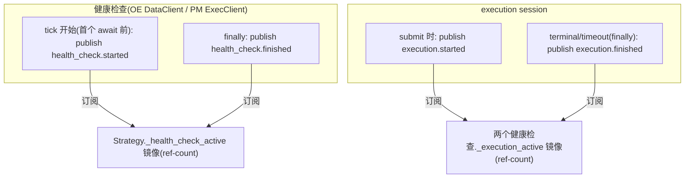
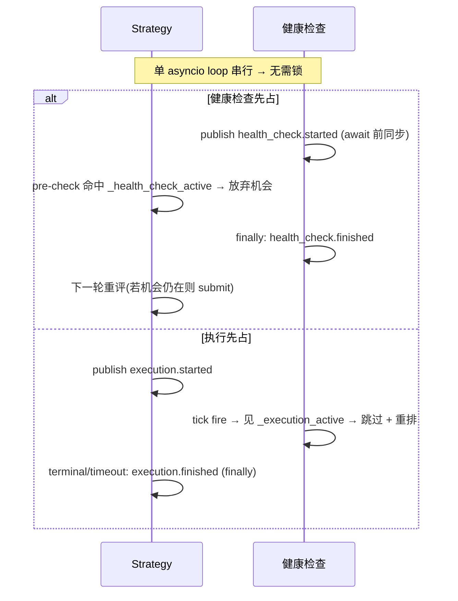

# 横切:组件间同步(健康检查 ⊥ 执行)详细设计

> **定位**:详细设计。理由/历史见初设 `refactor.md §6.10`(Q19)。
> 冲突时:**有把握 → 以本文为准并回写 `refactor.md` 修订记录;没把握 → 讨论**。
> **这是横切协议**(P11:无单一归属)—— 由 **4 个组件共同实现同一契约**:Strategy、OE 健康检查(`OrbitExchDataClient`)、PM 健康检查(PM ExecClient 子类)、execution session。任一实现者以本文为准。

---

## 1. 要解决的问题

健康检查(OE 页面 reload / PM report 拉取 + merge/redeem)与订单执行(submit + tracking)若并发会互相破坏:
- OE reload 冲掉执行页面;
- merge/redeem 改链上持仓时执行在飞;
- report reconcile 与 tracking 抢 `leg_settled`。

**锁定方案 = 全局互斥**(最粗粒度):任一健康检查 tick 在跑 → Strategy 放弃所有机会;任一执行在飞 → 所有健康检查推迟。

---

## 2. 状态与消息

### 2.1 两个全局状态(ref-count)

| 状态 | 含义 | 维护 |
|---|---|---|
| `_health_check_active` | 任一 venue 健康检查 tick 进行中 | ref-count(OE/PM 各发各的消息,消费方计数;count 可达 2) |
| `_execution_active` | 一次执行 session 从 submit 到 terminal/timeout | ref-count |

> **OE/PM 各维护各的健康检查、各发各的 `health_check.*`**(两套独立组件 / 独立 NT clock / 独立节奏);但因全局互斥,消费方把两路 **ref-count 并成一个**全局态(`started`→++,`finished`→--,`>0` 即"有健康检查在跑")。**不是两个独立互斥域**。

### 2.2 msgbus 消息(前后都发)

| 消息 topic | 发布者 | 订阅者 |
|---|---|---|
| `health_check.started` / `.finished` | OE 健康检查、PM 健康检查(各发各的) | Strategy(维护 `_health_check_active`) |
| `execution.started` / `.finished` | execution session | OE 健康检查、PM 健康检查(维护 `_execution_active`) |

---

## 3. 协议(各组件实现什么)

| 组件 | 实现 |
|---|---|
| **Strategy** | **执行同步前置**:决策点 pre-check `if _health_check_active: 放弃机会, early return`(与 settled pre-check 并列)。**不是执行中途打断,而是健康检查期间根本不开新执行**。submit 时发 `execution.started`,session 到 terminal/timeout 发 `execution.finished` |
| **OE / PM 健康检查** | tick callback 开头 `if _execution_active: 跳过本 tick`(`finally` 照常重排下次 alert);否则首个 await 前 publish `health_check.started`、`finally` publish `health_check.finished` |
| **execution session** | 见 execution 文档 §3.4(发 `execution.*`) |

---

## 4. 为什么单 loop 无需锁(P1,NT 原语)

NT `LiveClock` 回调、Actor handler、`msgbus` 派发**都在同一 asyncio event loop 串行**。只要"**检查 + 置位 + publish 在首个 `await` 之前同步完成**",就不存在交错——Strategy 的 submit 决策回调与健康检查回调不会真正并行;`msgbus.publish` 同步派发,`publish health_check.started` 返回时 Strategy 镜像已置位。

**实施纪律(硬约束)**:
- 置位必须在任何 `await` 之前同步做;
- 清位放 `finally`(terminal **和** timeout 两条路径都要清,否则 `_execution_active` 泄漏 → 健康检查永久饿死)。

---

## 5. 代价(已接受)

- 执行在飞时所有健康检查暂停 → staleness 检测延迟 += 执行时长(上界 = execution tracking timeout)。
- 健康检查跑时 Strategy 放弃机会 → 下一轮(alert 重排后)重评。
- 全局粒度换取实现最简 + 最安全。

**连带红利**:全局互斥使"同时在飞的执行 ≤ 1",直接把 Strategy 机会快照(Q20)的并发数压到 ≤1,快照回收变 trivial(见 strategy 文档)。

---

## 6. 落地清单

- [ ] 定义 msgbus topic 常量:`health_check.started/finished`、`execution.started/finished`
- [ ] Strategy:订 `health_check.*` 维护 ref-count 镜像 + submit pre-check + 发 `execution.*`
- [ ] OE/PM 健康检查:订 `execution.*` 维护 ref-count 镜像 + tick 开头跳过判断 + 发 `health_check.*`
- [ ] 置位在 await 前、清位在 finally(代码审查硬检查)
- [ ] 对应测试:`strategy-4.{15,16}`、`pm-adapter-5.health.5`、`oe-adapter-2.health.5`
