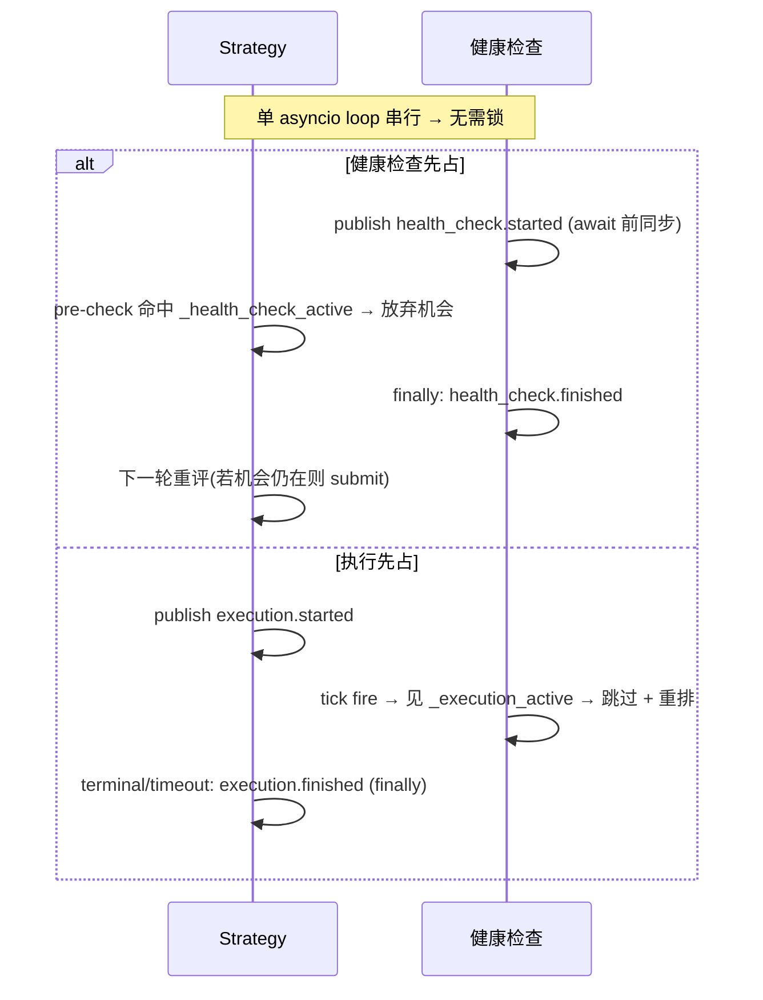

# 横切:组件间同步(健康检查 ⊥ 执行)详细设计

> **定位**:详细设计。理由/历史见初设 `refactor.md §6.10`(Q19)。
> 冲突时:**有把握 → 以本文为准并回写 `refactor.md` 修订记录;没把握 → 讨论**。
> **这是横切协议**(P11:无单一归属)—— 由 **4 个组件共同实现同一契约**:Strategy、OE 健康检查(`OrbitExchDataClient`)、PM 健康检查(PM ExecClient 子类)、execution session。任一实现者以本文为准。

> ⚠️ **失效指针(#105,2026-06-13,历史设计草案)**:§1–7 描述的是**自写 HealthCheckLoop 时代**的同步设计。**#105 决定把健康检查迁移到 NT 原生 reconciliation**,据此:
> - **`health_check.*` 消息 + Strategy `_hc_running` + strategy⊥健康检查互斥(§1 第二条、§2.1 `_hc_running`、§3 Strategy 行、§7.6)→ ✅ 已退役删除(#108,2026-06-16)**(执行页 reload 撞下单的原始理由随执行页 reconcile 迁移消失;OE 下单 `page.evaluate` 与焦点无关);
> - **健康检查⊥执行 per-venue 互斥(§1 第一条、§2.1 `_execution_active`、§3 健康检查行)→ ✅ 已退役删除(#108)**;OE `execution.*` ref-count 删。**PM 的 HealthCheckLoop 也已删(#110)**:merge/redeem 改由 NT 连续 position 对账驱动；#283/#285 起 report 协程 await settlement，尝试过 merge 后无论成功失败均重拉 positions，再向 NT 返回 reports；同步链上 IO 已丢线程池，不阻塞 app loop，并发由 single-flight 守卫;
> - **pair_inflight 兜底 `health_check→clear_all`(§7.6)+ max-hold(§7.3)已全部删除(#105 ②,2026-06-15)→ in-flight 出口靠结构保证:opportunity barrier 出口 + session `exec_started`↔watchdog 原子(§7.3)**。
> 读 §1–7 时务必先读 **§8**(迁移后的现状真理源);§1–7 保留为迁移前设计记录。**2026-06-15 修正**:`leg_settled` 退役,由 §8.5 `VenueExecutionLiveness` 取代;per-pair `PairInFlightGate` 机制本体保留,兜底触发已删除。

---

## 1. 要解决的问题

健康检查(OE 页面 reload / PM report 拉取 + merge/redeem)与订单执行(submit + tracking)若并发会互相破坏:
- OE reload 冲掉执行页面;
- merge/redeem 改链上持仓时执行在飞;
- report reconcile 与 tracking 抢 `leg_settled`。

**锁定方案 = 互斥**(#89 修正为 **per-venue**,非全局):
- **健康检查 ⊥ 执行 = per-venue**:每 venue 的健康检查只在**该 venue** 有执行在飞时推迟 —— OE reload 只跟 OE 下单冲突,PM merge/redeem 只跟 PM 执行冲突,互不干涉。
- **Strategy ⊥ 健康检查 = 任一**:**任一** venue 健康检查在跑 → Strategy 放弃机会(strategy fire 跨 PM+OE 双腿,任一 venue 健检在跑都可能撞下单)。

---

## 2. 状态与消息

### 2.1 两个状态

| 状态 | 消费方 | 含义 | 维护 |
|---|---|---|---|
| `_hc_running`(健康检查在跑) | **Strategy** | **任一** venue 健康检查 tick 进行中 | strategy 订 `health_check.*`,维护**在跑 source 集合**(per-venue 信号位,**非 ref-count**;`started`→add / `finished`→discard;非空即活) |
| `_execution_active`(本 venue 执行在飞) | **每 venue 健康检查** | **本 venue** 一条执行 session 从 submit 到 terminal/timeout | **per-venue**(#89):PM 直接读 `self._execution_active`(自己的 session);OE DataClient 订 `execution.*` 但**按 msg instrument venue 过滤、只数 OE 自己的腿** |

> **per-venue(#89)**:`execution.*` 是全局 topic(PM/OE 共发),但消费方**各只数自己 venue 的腿** —— OE 健检数 OE 腿、PM 健检数 PM 腿,互不并入。Strategy 侧 `_hc_running` 则是「任一健检在跑」(per-venue 信号位集合,非空即活),因 strategy fire 跨双腿。

### 2.2 msgbus 消息(前后都发)

```mermaid
flowchart TB
  subgraph 健康检查["健康检查(OE DataClient / PM ExecClient)"]
    HCs["tick 开始(首个 await 前): publish health_check.started"]
    HCf["finally: publish health_check.finished"]
  end
  subgraph 执行["execution session"]
    EXs["submit 时: publish execution.started"]
    EXf["terminal/timeout(finally): publish execution.finished"]
  end
  HCs & HCf -->|订阅| STR["Strategy._hc_running 镜像(per-venue source 集合,任一非空即活)"]
  EXs & EXf -->|订阅(按 venue 过滤)| HCsub["每 venue 健康检查._execution_active(只数本 venue 腿,#89)"]
```

| 消息 topic | 发布者 | 订阅者 |
|---|---|---|
| `health_check.started` / `.finished` | OE 健康检查、PM 健康检查(各发各的) | Strategy(维护 `_health_check_active`) |
| `execution.started` / `.finished` | execution session | OE 健康检查、PM 健康检查(维护 `_execution_active`) |

---

## 3. 协议(各组件实现什么)

| 组件 | 实现 |
|---|---|
| **Strategy** | **执行同步前置**:决策点 pre-check `if _hc_running(任一 venue 健检在跑): 放弃机会, early return`(与 settled / per-pair pre-check 并列)。**健康检查期间根本不开新执行**。submit 时发 `execution.started`,session 到 terminal/timeout 发 `execution.finished`。**收 `health_check.finished` 仅移除 source(#105 ② 后不再 `clear_all`,§7.6)** |
| **OE / PM 健康检查** | tick callback 开头 `if _execution_active(**本 venue**): 跳过本 tick`(`finally` 照常重排下次 alert);否则首个 await 前 publish `health_check.started`、`finally` publish `health_check.finished`。**OE 订 `execution.*` 按 venue 过滤只数 OE 腿(#89)**;PM 直接读自己 session |
| **execution session** | 见 execution 文档 §3.4(发 `execution.*`) |



---

## 4. 为什么单 loop 无需锁(P1,NT 原语)

NT `LiveClock` 回调、Actor handler、`msgbus` 派发**都在同一 asyncio event loop 串行**。只要"**检查 + 置位 + publish 在首个 `await` 之前同步完成**",就不存在交错——Strategy 的 submit 决策回调与健康检查回调不会真正并行;`msgbus.publish` 同步派发,`publish health_check.started` 返回时 Strategy 镜像已置位。

**实施纪律(硬约束)**:
- 置位必须在任何 `await` 之前同步做;
- 清位放 `finally`(terminal **和** timeout 两条路径都要清,否则 `_execution_active` 泄漏 → 健康检查永久饿死)。

---

## 5. 代价(已接受)

- **本 venue** 执行在飞时该 venue 健康检查暂停 → staleness 检测延迟 += 执行时长(上界 = execution tracking timeout)。
- 任一健康检查跑时 Strategy 放弃机会 → 下一轮(alert 重排后)重评。
- per-venue 粒度:OE/PM 健康检查互不阻塞(OE 不再因 PM 执行而多等,#89)。

**「≤1 执行」的来源(per-venue 后不再是本互斥的红利)**:"同时在飞的套利 ≤ 1" 现由 **Strategy 全局 `is_execution_active`(聚合所有 exec client)+ per-pair 闸(§7)** 保证,不再是 health-check⊥execution 互斥的连带红利(后者已 per-venue,PM/OE 各自独立)。Q20 机会快照并发数 ≤1 仍成立(靠 strategy 侧那道)。

---

## 6. 历史落地清单(已退役,不作为当前待办)

本节属于 §1-6 的自写 HealthCheckLoop 时代设计。`health_check.*` / `execution.*`
消息、Strategy `_hc_running`、健康检查⊥执行互斥已按 #108/#110 退役;当前真理源见
§8.6。

- ~~定义 msgbus topic 常量:`health_check.started/finished`、`execution.started/finished`~~
- ~~Strategy:订 `health_check.*` 维护 ref-count 镜像 + submit pre-check + 发 `execution.*`~~
- ~~OE/PM 健康检查:订 `execution.*` 维护 ref-count 镜像 + tick 开头跳过判断 + 发 `health_check.*`~~
- ~~置位在 await 前、清位在 finally~~
- ~~对应测试:`strategy-4.{15,16}`、`pm-adapter-5.health.5`、`oe-adapter-2.health.5`~~

---

## 7. per-pair 机会串行闸(§6.10 的 per-pair 维度,#84)

### 7.1 为什么 §1-6 的全局互斥不够

§1-6 的 `_execution_active` / `execution.*` 是**全局**态(针对所有 pair),且**发布点在 `_begin_session`** —— 那是 NT **异步** `_submit_order` 任务的末端,在「OBD 回调 → 评估决策 → `submit_order` → RiskEngine(同步)」这条同步链的**下游**。后果:

- strategy 评估是 `create_task` **并发**派发(`actor.py:_route_eval`),`leg_settled`(`_begin_session` arm)/ `execution.started`(`_begin_session` publish)都在异步执行链才置;
- **同一 OBD 突发的多个评估,在任何在飞信号置位之前就已各自决策并下单** → 同一 pair 重复 fire(实测:一批 OBD → 4 笔 OE 单同毫秒,见 refactor.md #82 复盘);
- 旧 settled gate(Portfolio 指标 / RiskEngine,§6.8.2)、cancel-only(§6.8.5)同样读这些下游信号 → 对同毫秒并发**全部漏过**(串行轮次有效,并发突发无效)。

**结论**:全局互斥 + settled gate 解决「健康检查 ⊥ 执行」「跨轮重入」,但**结构上拦不住同一 pair 同一瞬间的并发评估/fire**(信号永远在异步下游)。需要一道**同步**的 per-pair 闸。

### 7.2 不变量

- **per-pair:同一 pair 同时只有 1 笔套利在「评估 → 执行」生命周期内**(不同 pair 互不影响,可并发);
- 推论:per-pair 不同时评估多个机会、不同时执行多个机会。

### 7.3 机制 —— 同步 per-pair 闸(`PairInFlightGate`)

共享 registry(launcher 经 `ArbContext` 注入给 **StrategyEvaluator + execution session**,同 `VenueExecutionLiveness` / `PairRegistry` 等共享对象套路)。**所有置位/清位都在首个 `await` 前同步做**(复用 §4 单 loop 无锁纪律)。

| 时机 | 组件 | 动作 |
|---|---|---|
| OBD 回调 `_dispatch_eval`(**同步**,`create_task` 之前) | Strategy | `try_enter(pair)`:已在飞 → **直接放弃**(`return`,不 create_task);否则置位 |
| 评估 task 完成(`_on_eval_done`,done-callback) | Strategy | **无条件** `release(pair)` —— 正常返回 / 抛异常 / 被取消都释放(#261)。加锁与释放同层对称 |

**#261:execution 侧两行已删除。** `_begin_session`/`_end_session` 不再参与本闸;
全局 ≤1 执行由 barrier 判定(§7.5)。

**#261 后不再有"交接"** —— 闸的作用域就是评估 task 本身。原先"fire 后不释放、交给 execution"的
跨组件交接是持有型 token 的根源,已删除;执行期间的互斥改由 barrier 读派生态实现(§7.5)。

**置位一定有出口(#261 后极简)**:闸只在评估 task 存活期间持有,出口只有一个 ——
`_on_eval_done`(该 task 的 done-callback),**无条件** `release`:正常返回 / 抛异常 / 被取消都释放。
`_dispatch_eval` 里排程失败(`_create_task` 抛)的分支也在同层 `release`(协程从未排程,释放安全)。

> **为什么不再需要出口枚举表**:#260 之前闸跨 strategy → barrier → session 传递所有权,
> 于是存在三种所有权状态、每种要有自己的出口,而**枚举会漏** —— `#105 ②` 就漏了「action 链零提交」
> 那一态(`PlaceBetsAction` 4 个零提交 early return、上游 action 5 处清空 `legs`,其中 `remaining<=0`
> 是打满 share limit 的常态路径),导致该 pair 永久停止评估。#261 取消跨组件交接后,
> **不存在"该不该释放"的判据,也就没有可漏的出口**。

### 7.5 全局 ≤1 执行(#261,barrier 单点 + 纯派生态)

**判定点**:`ArbLiveExecutionEngine._handle_opportunity_pass` —— 新 opportunity 入场(`ctx is None`)时
调 `_other_execution_in_flight()`,为真则整个机会丢弃(`_deny_order` 各腿;不重试不排队,
下一个 OBD tick 重评,同 cancel-only 既有纪律)。

**两个派生源**(都由现存状态派生,不维护独立布尔锁):

| 源 | 覆盖 |
|---|---|
| `_arb_command_groups` 中的**非墓碑** ctx(`terminal is None`) | 统一覆盖 SubmitOrder 等腿与 tagged CancelOrder 等撤单命令 |
| 任一 exec client 的 `_execution_active`(= `len(_active_sessions) > 0`) | session 建立 → 终态/超时(含撤单 session) |

**为什么不需要锁**:所有 `SubmitOrder` / `CancelOrder` 经 `LiveExecutionEngine` 的单 `asyncio.Queue`、
单 task 逐条 `_execute_command`,**构造上串行**,判定天然原子。

**为什么不需要 `opportunity_id` 参数**:只在 `ctx is None`(全新机会)时调用,故在飞的执行必然不是它的
—— 三个出口 `_release`/`_finish`/`_cancel_only` 都会 pop ctx。方案**不依赖识别执行归属**
(`_active_sessions` 只存 `pair_id`,本就无法回答「属于哪次机会」;要更细的判定须先补该字段)。

**承重前提(两条,改动时必须重新核对)**:
1. `ctx is None` ⟺ 全新机会 ⟹ 在飞执行必非它的(依赖上面三个出口都 pop);
2. **每条被 release 的 submit/cancel 必须同步产生 session** —— 故
   `ArbExecutionSessionMixin.submit_order` / `cancel_order` 都覆盖 NT 同步入口，先建立对应 session，
   再交 NT `create_task` 做 venue IO。否则 barrier pop ctx 之后到 session 出现之间派生态为空,
   而队列非空时 `await queue.get()` 不让出控制权,`[A1,A2,B1,B2]` 会让两个机会**双双执行**。

**墓碑(`terminal="denied"`)**:被拒的机会照常建 ctx 并 **arm timer**,只是标 `terminal` ——
使后到的腿命中 `ctx.terminal is not None` 分支被立刻拒,避免「B1 被拒 → A 执行结束 → B2 另建 ctx 空等 2s」
挡住合法新机会。`ctx.terminal_keys`(**独立于 `commands`**;后者会被 finish 遍历生成本地失败终态,
混用会重复拒单)集齐 `expected` 即提前 close。**barrier timer 保留为结构保证** —— 某腿可能根本没发出
(`make_submitter` 的 `cache.instrument is None` 分支),`denied` 永远凑不齐时只能靠 timer。
提前清理是路径,timer 是保证;**只留路径会漏**。
`_other_execution_in_flight` 必须跳过墓碑,否则墓碑自己会挡住别人。

### 7.4 与既有机制的关系

- **正交于全局互斥(§1-6)**:全局闸管「执行 ⊥ 健康检查」「≤1 全局执行」;per-pair 闸管「同 pair 不并发评估/执行」。两者并存,前置 pre-check 并列(`_health_check_active` / 全局 `_execution_active` / **per-pair in-flight** / settled / RiskEngine)。
- **补 settled gate / cancel-only 的并发洞**:它们读异步下游信号,对同毫秒并发无效;per-pair 闸在 OBD 回调同步置位,正好堵这个洞。

### 7.6 健康检查互斥(#85;#105 ② 后**不再清闸**)

**strategy 订 `health_check.*`**:
- `on_start` 订 `health_check.started`/`finished`;维护**在跑的 source 集合** `_hc_running`(`started`→add、`finished`→discard)。**用 per-venue 信号位集合,不是 ref-count**:OE/PM 各是各的 source、幂等、`set` 非空即「有健康检查在跑」。
- **strategy ⊥ 健康检查互斥**:`_route_eval` pre-check `if _hc_running: 放弃 fire`(避免在 OE 健检 reload 页面期间下单撞页)。
- **#105 ②:`finished` 不再触发 `clear_all`** —— 移除该 source 即止。in-flight 出口由 §7.3 的结构路径保证(barrier 出口 + session `exec_started`↔watchdog 原子),健检不再参与清闸,也不再依赖 `leg_settled` 注入到 strategy。

### 7.5 落地清单

- [x] `src/arbitrage/common/pair_inflight.py`:`PairInFlightGate`(**#261 后只剩** `try_enter` / `release` / `is_in_flight`;无 max-hold、无 `clear_all`、无 exec 记账)
- [x] `ArbContext` + launcher 注入(StrategyEvaluator deps + execution session `_init_arb_session`)
- [x] Strategy `_dispatch_eval` 同步 `try_enter`(create_task 前)+ `_on_eval_done` done-callback **无条件** `release`(#261)
- [x] ~~execution `_begin_session` `exec_started` / `_end_session` `exec_finished`~~ —— **#261 删除**(execution 不再参与本闸);改为 `submit_order` 同步建 session 供 barrier 读派生态(§7.5)
- [x] **Strategy 订 `health_check.*` → `_hc_running` per-venue 集合 + `_route_eval` 互斥 pre-check**(`finished` 仅移除 source,**不再 `clear_all`**)
- [x] 测试:`test_pair_inflight.py`(try_enter / 无条件 release / 执行段 API 已删除守卫)+ `test_evaluator.py` eval.15-16 + gate.1-5 + `test_session.py`(watchdog 原子、`submit_order` 同步建 session)+ `test_engine_barrier.py`(全局 ≤1,#261)

---

## 8. 迁移:健康检查 → NT 原生 reconciliation 的同步影响(#105,当前真理源)

> **本节是 §1–7 的现状真理源**(规则 6 失效就地标记已在文首挂出)。理由/决策史见 `refactor.md #105`。
> 本节只收**横切同步**部分(页锁层次 / 状态位迁移 / pair_inflight 兜底 / "NT 不串行化"事实);OE 取 order/position 的 reload 接口、single-flight、`_current_bets` 双视图、WS 存活检测属 **OE ExecClient 组件家**,见 execution `architecture.md`。

### 8.1 关键事实:NT 不串行化 reconciliation ⊥ execution

NT `LiveExecutionEngine` 把命令处理设计成**并发、无互斥**:

- **所有命令 `create_task` fire-and-forget**(`live/execution_client.py` `submit_order` / `cancel_order` / `query_order` 等均 `self.create_task(self._<handler>(command))`)→ submit/cancel 与 reconciliation 的 `query_order` 是**独立 task,在同一事件循环上各跑各的、在每个 `await` 点交错**;cmd 队列不阻塞。
- `reconciliation_active`(`live/execution_client.py:451`)**只写不读**,不是闸。
- 无 page 锁、无 client 锁、无"对账期间挂起执行"机制。

**为什么 NT 这样**:它假设 venue 是**无状态 REST 端点**(并发 query + submit 无害)——对 **PM(REST)成立**;对 **OE(共享可变 Playwright 页)不成立**:query/reload 与 place/cancel 在同一页交错 = 页面状态损坏(历史上"同时下单丢回执"即此类)。**所以迁到 NT 原生后,OE 侧的页互斥不会消失,只从 HealthCheckLoop 搬到 OE ExecClient 的资源层。**

### 8.2 OE 页级互斥(取代 strategy⊥健康检查 + 健康检查⊥执行两道旧互斥)

- **机制 = OE ExecClient 内一把 `asyncio.Lock`(页锁)**,串行所有"碰 OE execution 页"的操作:`place_order` / `cancel_order` / `reload`(无论 reload 由 in-flight / open / position check 还是存活闸触发)。reload 再叠 **single-flight**(窗口内合并多次触发为一次,见 execution 文档)。
- **取代关系**:旧 `_hc_running`(strategy⊥健康检查)存在的唯一理由是"没有页锁时 reload 会撞进正在进行的下单"。页锁补上后此理由消失 → **`_hc_running` + `health_check.*` 退役,且不引入 `reconcile_in_progress`**。OE 因此与 PM 对称:reconciliation 与 execution 共存,只在资源层(OE 页锁 / PM 无需)串行。
- **唯一 PM 没有、OE 有的不对称**:OE reload 是**阻塞**操作(拆页重建),PM reconcile 是**非阻塞** REST。所以 fire 撞进一次(稀有的)reload 时 OE 腿会卡在页锁上等。两点缓解:① 新设计 reload 很稀(健康态读实时 `_current_bets`,只 WS 判死/单卡死才 reload);② 真正会触发 reload 的时刻往往正是 OE exec 通道不健康之时——那本不该发 OE 单。**真正该补的闸是 venue-exec-liveness(待议),不是 reconcile_in_progress**。

### 8.3 `place_bets` 顺序提交 → 回到并发(页锁补在正确层后)

`place_bets.py` 的逐腿 `for leg: await submitter` 串行,是"OE 页并发 placeBets 丢回执"的上层 workaround。页锁把根因治在资源层后,该 workaround 多余 → **回到并发 `gather`**(PM/OE 腿并行提交,对冲窗口更窄)。⚠️ **必须 live 重验**(原问题是真盘观测的丢回执,验收锚点=并发下两腿回执都收到、`_current_bets` 都更新)。页锁还顺带覆盖**跨 pair 的 OE 页争用**(顺序 `place_bets` 只管单 arb 内的腿),故严格更稳。

### 8.4 pair_inflight 兜底迁移(`PairInFlightGate` 本体保留,触发改变)

`PairInFlightGate`(§7)**机制本体保留**;变的是**防泄漏兜底**(注:`leg_settled` 已 #108 退役,执行健康真相改由 `VenueExecutionLiveness` 表达,见 §8.5):

> **设计转向(2026-06-14,用户拍板)**:**去掉所有"兜底/猜测"机制(max-hold / A5 / health_check→clear_all),改为"保证每条 execution 结束时一定置位"**。判据:`PairInFlightGate` 的 `exec_count→0` 就是"本 pair 执行会话结束"(那一刻所有 session 都 `_end_session` 了、`_submit_order` 都返回了 → 无该 pair 任务在执行),**race-free**(exec_count 只在最后一条归 0)。关键是让**每一种 execution 都纳入 `exec_count`**,exec_count→0 自然兜到底,不需要任何 backstop。

> **⚠️ #261(2026-07-22)起本小节的 `exec_count` 叙事已失效。** pair 闸不再进入执行段
> (`exec_started`/`exec_finished`/`_exec_count` 已删除),下述"撤单纳入 exec_count""deny 由 barrier
> `release_eval` 兜"等机制随之退役。执行期互斥的现状真理源是 **§7.5**(barrier 单点 + 纯派生态)。
> 本小节保留为 #105 的历史设计记录。

- **submit+track session(已有)**:`_begin_session` `exec_started` / `_end_session`(terminal **或** watchdog 超时,`session.py:103` NT clock 绝对 alert,不随 session 任务异常取消)`exec_finished`。
- **cancel-only 的撤单(✅ #105 已落地 2026-06-14)**:**撤单也是一次执行,纳入 exec_count** —— base `_cancel_residual_orders` 对每条残单**同步 `exec_started`**(先全加完,避免某条先完成提前清)+ `create_task(_tracked_residual_cancel)`;`_tracked_residual_cancel` 在 `finally` `exec_finished`。子类只实现 `_cancel_residual_one`(真实 venue 撤单)。**这堵住了"`exec_count→0`(session 结束)时撤单 task 还在跑"** —— 撤单 task 在跑则 exec_count>0,不会提前清。`test_orbitexch_client.py::test_cancel_residual_tracked_*`。
- **watchdog 保留**:它是"session 起了但 terminal 不来(卡单)"的保证 —— **session 一定结束**(`_end_session`→`exec_finished`),卡单本身(订单在 venue 上死活)是 venue liveness / 订单终态的事(reconcile 写 `VenueExecutionLiveness`),不是 in-flight 的事。**#105 ②**:watchdog 与 `exec_started` 在 `_begin_session` 内**原子置位**(watchdog 先 arm),保证"只要 exec_count++ 就一定有出口"。
- **deny 已解决(✅ #105 barrier,2026-06-14)**:strategy fired、全腿被 risk deny → 不进 execution(`exec_count==0`)曾会漏 in-flight。现由 **opportunity barrier**(§8.4bis)兜:risk `_deny_order` publish `risk.opportunity.leg_denied` → barrier `_finish` → `release_eval`(`exec_count==0` 可清);连一腿都没 pass(ctx 为 None)时用 `pair_id` 合成 ctx 仍 `release_eval`。barrier timeout 同走 `_finish`。**deny 不再需要 max-hold。**
- **退役(✅ 2026-06-15,用户拍板"都撤")**:① **A5 desync 兜底**(2026-06-14 回退:误清 fire→`_begin_session` handoff 窗口);② **max-hold 陈旧自愈** + ③ **`health_check.finished→clear_all`** —— 已**全部删除**。`try_enter(pair)` 不再带时间戳参数;`PairInFlightGate` 不再有 `clear_all`;strategy 不再注入 `leg_settled`。前置 ①(barrier 兜 deny)与 ②(watchdog↔exec_started 原子 + `_end_session` 出口对称)落地后,所有 in-flight 出口已靠结构保证(§7.3),兜底删除安全。**⚠️ #260(2026-07-22)修正**:此处「fired 但一腿 session 都没起」只拆了「全 deny」「cancel-only 丢弃」两个子情形,**漏了第三个:action 链零提交**(上游清空 legs / action abort / 中途抛异常 → 连 `SubmitOrder` 都没到 Risk,barrier 与 session 均不触发)。删 max-hold 之前该情形由 max-hold 自愈掩盖,删后成为永久泄漏。现由 §7.3 状态 1 的 `_on_eval_done` 出口覆盖。

### 8.4bis opportunity execution barrier(已落地代码,待 live 验证,2026-06-14)

> **状态**:代码已落地(`common/opportunity.py`、`strategy/actions/place_bets.py`、`strategy/actor.py`、`risk/engine.py`、`execution/engine.py`、`bootstrap.py`),离线单测通过;尚未 live 验证。本文是跨 Strategy / Risk / Execution 的单一真理源;各组件文档只写本方职责并交叉引用本节。

**目标**:一次 opportunity 的所有真实腿先完成 Risk 决策,再决定是否进入 venue execution。任一腿被 Risk deny 时,整次 opportunity 在 barrier 内结束,不让已 pass 的其它腿进入 venue。

**关键事实**:
- NT 原生 `SubmitOrderList` 只支持同一个 `instrument_id` 的订单列表,不能表达 PM/OE 跨 venue 或同 venue 多 selection 的套利机会。
- 当前套利机会要继续用多条 `SubmitOrder`,但每条必须先走 `RiskEngine.execute`;Risk pass 后才由 NT RiskEngine 回送 `ExecEngine.execute`。
- opportunity barrier 位于 **Risk pass 之后、ExecutionClient 之前**;它只控制是否 release 到 venue,不替代 RiskEngine 的逐单校验。

**metadata 契约**(Strategy 写,Risk/Execution 读):

| 字段 | 落位 | 含义 |
|---|---|---|
| `arb:opportunity_id=<id>` | `Order.tags` | 本轮机会 ID,隔离同 pair 连续机会 |
| `arb:pair_id=<pair>` | `Order.tags` | `PairRegistry` 产出的 pair_id,用于 pair-wide residual 与 open-order 校验 |
| `arb:leg_key=<key>` | `Order.tags` | 本轮机会内腿标识,如 `pm_home` / `oe_home` |
| `arb:expected_legs=a,b,...` | `Order.tags` | 本轮应收齐的真实腿集合,包含自己;不发 0 qty 空单 |
| `arb:open_orders_digest=<sha256>` | `Order.tags` | Strategy 评估开始时该 pair 的 open-order 基线；同机会所有腿必须相同 |
| `arb:positions_digest=<sha256>` | `Order.tags` | Strategy 评估开始时该 pair 的 position 基线；同机会所有腿必须相同 |
| `arb:intent=<intent>` | `Order.tags` | 既有 intent 契约(`arbitrage` / `recovery`) |

> metadata 放 `Order.tags`,不是仅放 `SubmitOrder.params`,因为 Risk deny 时 `_deny_order(order, reason)` 直接拿到的是 `order`;Execution 处理 `OrderDenied` 时也可经 cache 反查 order tags。

**消息 / 入口**:
- Strategy submitter:生成带 metadata 的 `SubmitOrder`,发送到 `RiskEngine.execute`。
- Risk pass:NT RiskEngine 原生 `_send_to_execution(command)` → `ExecEngine.execute`;Execution barrier 暂存该 leg。
- Risk deny:Risk 保留原生 `OrderDenied`,同时额外发布领域消息 `risk.opportunity.leg_denied`:

```json
{
  "opportunity_id": "...",
  "pair_id": "...",
  "leg_key": "oe_home",
  "client_order_id": "...",
  "reason": "..."
}
```

Execution barrier 以领域消息为主消费 deny;若需要容错,也可从 `OrderDenied` 经 cache 反查 tags。

**Execution context 状态机**:

```text
OPEN
  risk-pass leg 到达 → pending.commands[leg_key] = SubmitOrder
  risk-denied leg 到达 → DENIED
  expected_legs 全部 pass → CANCEL_ONLY、BASELINE_DENIED 或 RELEASED
  barrier timeout → TIMED_OUT

CANCEL_ONLY
  任一 risk-pass leg 的 instrument 有 residual open order
  → 撤 residual,丢弃本轮所有新 submit
  → 走统一 finish outlet

RELEASED
  pair 当前 open-order / position digest 均与评估基线相同
  release 所有 pending SubmitOrder 到原生 ExecutionEngine._execute_command
  后续由各 ExecutionClient 独立维护 session 生命周期

BASELINE_DENIED / DENIED / TIMED_OUT
  不 release 任何 leg 到 ExecutionClient
  对已暂存但未执行的 pass legs 生成本地 OrderDenied
  在 barrier 内生成本地终态并清理 context
```

**opportunity-level cancel-only(已落地代码 + 离线单测,2026-06-19)**:
- 归属在 `ArbLiveExecutionEngine` barrier,判定点在 `expected_legs` 全部 Risk pass 之后、release 到任何 venue `ExecutionClient` 之前。
- 触发条件是任一 risk-pass leg 对应 instrument 在 NT cache 中存在 residual open order；整次 opportunity 判定为 cancel-only。
- submit group 的 `commands` 中只有真实 `SubmitOrder`。显式补偿撤单使用下述
  CancelOrder policy，
  不再伪造 `arb:intent=cancel` 的下单腿，也不能绕过 residual cancel-only。
- cancel-only 触发后,barrier 不调用 `super()._execute_command` release 任何新 submit;它按 residual 所在 instrument 调用对应 execution client 的 residual cancel 能力,复用 `ArbExecutionSessionMixin._cancel_residual_orders(...)` 的 tracked cancel session。
- 对本轮所有新 submit 生成本地 deny/reject 结果,reason 指向 `opportunity cancel-only: residual open orders present`;这些新 submit 不排队、不延后,Strategy 下一轮重新评估后再决定是否重发。
- per-client `_begin_session` 的 residual 检查保留为防御性 fallback:无 opportunity metadata、barrier 未接管或非本协议订单仍可在 client 入口退化为单 instrument cancel-only;带完整 metadata 的 opportunity 以 barrier 判定为主,避免跨 venue 半边撤旧半边开新。

**共享 grouped-command barrier 与 CancelOrder policy(#296,已落地代码 + 离线单测,2026-07-30)**:
- SubmitOrder 与 tagged CancelOrder 共用同一个 `_arb_command_groups` registry、同一种
  `CommandGroupContext`、同一套 create/add/terminal-key/close 操作和
  `arb_group_timeout:{kind}:{group_id}` timer。`kind=submit/cancel` 只选择不同业务 policy，
  不维护第二套 barrier 状态机。
- `spread_cancel_recovery` 胜出后，Strategy 重读该 pair 全部 open orders，并逐单调用 NT
  `Strategy.cancel_order(order, params=...)`。同组命令共享 `opportunity_id / pair_id /
  expected_cancels`，每条以 `client_order_id` 作为 `cancel_key`。
- CancelOrder policy 位于 `ArbLiveExecutionEngine`，不经过 Risk，也不复用 SubmitOrder
  residual cancel-only。它只拦截带 `arb_cancel_opportunity` 参数的 `CancelOrder`；
  未标记的人工/运维撤单保持 NT 原生直通。
- 收齐 `expected_cancels` 后，按确定顺序把每条原生 `CancelOrder` 释放给对应
  ExecutionClient。Strategy 在发命令时已把订单推进到 `PENDING_CANCEL`；若同一时刻已有
  execution、metadata 不一致或 barrier timeout，则对已到达命令生成标准
  `OrderCancelRejected`，由 NT 状态机回退撤单请求状态。
- release 时若某目标订单已被其它事件推进为 closed，跳过该目标的 venue 请求，其余目标照常
  release。每条实际释放的撤单由 `ArbExecutionSessionMixin.cancel_order` 同步建立独立
  cancel session，随后仍由 PM/OE/SE 各自的终态事件或 watchdog 收口。
- grouped barrier 保证的是“同组撤单命令全部就绪后才开始向 venue 派发”，不是交易所侧原子
  撤单；release 后仍可能出现某 venue 成功、另一 venue 拒绝或超时。

**评估窗口 execution-state 校验(#266/#284)**:
- Strategy 不冻结 order book/instrument；在 evaluation 开始记录 pair-wide open-order 与
  position 两份 digest，并随每条真实腿透传。
- position digest 直接读取 NT `Cache.positions(instrument_id=...)`，投影
  `position/account/instrument/strategy id + side + quantity + avg_px_open/close + realized_pnl`
  后排序、序列化、SHA256；不持有会被 cache 原地更新的 `Position` 引用。使用全部 positions
  而非仅 open positions，SELL 全平后 closed position 的 realized/均价变化也可见。
- barrier 收齐全部 risk-pass legs 后，先执行既有 residual cancel-only；若未触发，再用同一
  common helpers 对 pair registered instruments 重算两份 digest。
- 任一 digest 缺失、腿间不同或当前值变化均 fail-closed，整组拒绝。比较只做一次，不能拆到各
  venue 分支，否则会重新引入腿间时序窗口。
- 两份 digest 都只观察**已经写入 NT Cache** 的状态。链上 merge 正在等待、第二次
  `/positions` 尚未返回并由 NT reconcile 应用时，position digest 仍是旧值；按用户裁定不为
  该窗口恢复临时 position liveness，也不另加 settlement epoch。
- 当前边界有意不覆盖 ABA：评估期间状态变化、比较前又完整恢复同一字段投影时，digest 无法
  识别；不另加 fill epoch。

**统一出口**:
- opportunity context 的统一 finish outlet 只负责清 pending、取消 timer,并为尚未 release 的订单生成本地终态。
- `PairInFlightGate` 自 #261 起只属于 Strategy evaluation task:`_dispatch_eval` 进入,`_on_eval_done` 无条件释放。barrier 与 execution session 均不接管或释放该闸。
- pass 路径 release 后,各 venue session 独立跟踪 accepted/fill/cancel/timeout;barrier 不等待或汇总 session。全局“同时至多一个 execution”由 barrier contexts 与各 client 的 `_execution_active` 派生。

**timeout**:
- barrier timeout 使用 NT 原生 clock:`set_time_alert_ns` / `cancel_timer`。
- timeout 只覆盖 Risk decision 收齐窗口,建议短值(如 1-2s);release 到 ExecutionClient 后由既有 per-session watchdog 负责 venue 回执/成交等待。
- timeout 命中等同 opportunity denied:不进 venue,暂存 pass legs 补本地 `OrderDenied`,再走统一出口。

**边界**:
- barrier 只能保证“所有腿 Risk pass 后才进入 venue”,不能保证 venue 原子成交;release 后的 accepted/rejected/timeout 仍归 execution session 与后续 recovery 机制处理。
- 不发送 0 qty 空单。没有真实下单的 outcome 不进 `expected_legs`;若未来确需显式 noop,应新增领域 marker,不能伪造 NT `SubmitOrder`。

### 8.5 VenueExecutionLiveness 与迁移后状态位最终图景(2026-06-15 已落地)

> **状态**:代码已落地。理由/历史见 `refactor.md` 修订记录 #108。  
> **归属**:横切机制(P11),由 execution/reconciliation 写、Risk 读、Strategy/Portfolio 不读。单一真理源在本节;Risk/Execution/Strategy 文档只写本方职责并引用本节。

#### 8.5.1 目标与边界

`leg_settled` 退役。旧语义把“某条腿是否收到过 venue 确认”“portfolio 是否可算 rebate”“strategy 是否可 fire”混在一起,且 order/position 事实没有拆开。新机制改为 venue 级执行真相可信度:

| 状态 | 含义 | 写入方 | 读取方 |
|---|---|---|---|
| `venue_order_alive[venue]` | 该 venue 的订单真相可信:order/in-flight/open-order reconcile 已拿到完整真实 response | venue ExecutionClient / NT reconciliation 接线 | Risk |
| `venue_position_alive[venue]` | 该 venue 的持仓真相可信:position reconcile 已拿到完整真实 response | venue ExecutionClient / NT reconciliation 接线 | Risk |

`venue_alive` **不存第三份状态**,只作为派生判断:

```text
venue_alive(venue) = venue_order_alive[venue] && venue_position_alive[venue]
```

PM 必须拆 order/position:从 `false → true` 需要等待 order reconcile 和 position reconcile 都成功。OE 也保持同样结构;即使当前 order/position 都来自 `CURRENT_BETS`,也分别写两个事实位,避免未来拆源时改接口。

#### 8.5.2 状态转换

默认 fail-closed:进程启动后每个 venue 的 order/position liveness 初始为 `false/unknown`,直到首次完整 reconcile 成功才置 `true`。

不会在每次下单前置 false。普通 submit 不是健康失效事件;下单期间的生命周期由 `PairInFlightGate` + session watchdog + opportunity barrier 管。只有进入“执行真相不可信”的路径才置 false:

| 触发 | 状态变化 |
|---|---|
| in-flight stuck 检测进入 retry/reconcile session | 相关 venue 的 `order_alive=false` |
| order/open-order reconcile 失败、超时、或没有拿到完整 order response | `order_alive=false` |
| order/open-order reconcile 成功并拿到完整真实 response | `order_alive=true` |
| position reconcile 失败、超时、或没有拿到完整 position response | `position_alive=false` |
| position reconcile 成功并拿到完整真实 response | `position_alive=true` |
| venue client 明确断连且 order/position 真相不再可信 | 对应事实位按失败类型置 false |

WS 静默本身不直接判 dead;它只触发探测 reconcile。真正裁决 liveness 的是 reconcile 成败。

#### 8.5.3 Risk 门控,不是 Strategy 前置

Strategy 计算机会前**不看** venue liveness。Strategy 只负责发现机会、生成带 opportunity metadata 的订单。统一安全出口在 `ArbitrageLiveRiskEngine`:

```text
effective risk gate =
  NT TradingState gate
  + required venues liveness gate
  + balance gate
  + rebate/recovery gate
```

Risk 的 liveness gate 不能只检查当前 order 自己的 venue。若订单带 opportunity metadata,从 `arb:expected_legs` 解析本次机会的所有真实腿,再推导 required venues:

```text
expected_legs=("pm:home:0", "oe:away:1")
required_venues={POLYMARKET, ORBITEXCH}
```

因此 PM leg 和 OE leg 都检查同一组 required venues。任一 required venue 不 alive,所有腿都会在 Risk 侧一致 deny;Execution opportunity barrier 收到 `risk.opportunity.leg_denied` 后结束整次 opportunity,不会半边进入 venue。

`arb:expected_legs` 已带 partner 信息;暂不新增 `required_venues` tag。Risk 只需要一个稳定映射:

| leg key 前缀 | Venue |
|---|---|
| `pm` / `polymarket` | `POLYMARKET` |
| `oe` / `orbitexch` | `ORBITEXCH` |
| `se` / `sharpexch` | `SHARPEXCH` |

解析统一调用 `common.venues.venue_id_from_leg_key`,不在 Risk 内维护私有映射。若 `expected_legs` 中出现无法解析的 leg key(例如误把 `pmsports:*` non-tradable anchor 写入),Risk fail-closed,不能退化成只检查当前 order venue。无 opportunity metadata 的普通订单可退化为只检查 `order.instrument_id.venue`。

#### 8.5.4 与 NT TradingState 的分工

NT `TradingState` 保持原生语义,不扩展、不复用、不与 venue liveness 同步:

| NT 状态 | 用途 |
|---|---|
| `ACTIVE` | 全局允许 submit,继续进入本系统 liveness/balance/rebate gate |
| `HALTED` | 全局硬停,新 submit 全拒;cancel 仍走原生 cancel 通路 |
| `REDUCING` | NT 原生按单个 instrument 的 net position 判断是否增加敞口 |

`TradingState` 是全局互斥状态,不是 bitmask,不能组合成 `REDUCING | ACTIVE`;也不能表达“PM order 不 alive / PM position 不 alive / OE alive”。人工或系统级全局停机可用 `set_trading_state(HALTED)`,但 venue reconcile 成败不得自动调用 `set_trading_state(ACTIVE/HALTED)`,避免覆盖人工硬停或误伤其它 venue。

#### 8.5.5 Portfolio 纯化

`ArbitragePortfolio` 移除 `LegSettledRegistry` 依赖。当前只保留 `outcome_exposures` / `outcome_shares` 这类 position 派生指标,不承担执行健康判断。是否允许触发新 submit,由 Risk 的 liveness / profit / share-limit gates 决定。

#### 8.5.6 迁移后状态位表

| 机制 | 去留 | 维护 / 读取 |
|---|---|---|
| `leg_settled` / `LegSettledRegistry` | **退役** | 由 `VenueExecutionLiveness` + Risk gate 取代;Portfolio 不再读取执行健康状态 |
| `VenueExecutionLiveness` | **已落地** | execution/reconciliation 写 `venue_order_alive`/`venue_position_alive`;Risk 按 opportunity required venues 读;Strategy/Portfolio 不读 |
| `PairInFlightGate`(per-pair) | **保留但 #261 收窄为评估串行** | strategy `_dispatch_eval` `try_enter` / `_on_eval_done` 无条件 `release`;execution 不再参与 |
| opportunity execution barrier | **已落地代码,待 live 验证** | Risk pass 后暂存 legs;Risk deny / timeout / 全 pass 都走 execution context 统一出口 |
| per-session 超时 watchdog | **保留**(pair_inflight 主防线) | `_begin_session` 挂 NT clock alert |
| `execution.started/finished` 消息 | **退役** | 旧消费者(OE DataClient 互斥)随迁移消失;strategy 改直读 callable → 无消费者 |
| 全局 `is_execution_active` callable | **新增** | launcher 注入 strategy;OR(PM `_execution_active`, OE `_execution_active`)= 各自 `len(_active_sessions)`;供 try_enter 兜底 |
| `health_check.started/finished` + `_hc_running` | **退役** | —(页锁取代) |
| `_execution_active` / per-venue 健康检查⊥执行互斥 | **退役** | —(NT 不串行化,页锁在资源层串行) |
| max-hold 自愈 / `health_check→clear_all` / A5 desync 兜底 | **✅ 已删除(#105 ②,2026-06-15)** | —(opportunity barrier 出口 + session `exec_started`↔watchdog 原子取代,§7.3) |
| `reconcile_in_progress` | **不引入** | —(PM 没有;OE 页锁解决资源串行,VenueExecutionLiveness 解决可交易门控) |
| strategy venue-liveness 预闸 | **不引入** | Strategy 不看 liveness;统一由 Risk gate 拦截 |

### 8.6 落地清单(当前状态)

- [x] OE ExecClient 页锁(`asyncio.Lock`)串行碰页操作:**place/cancel ✅ 已落地(2026-06-13,`execution.py` `_page_lock` 包 `_place_via_executor`/`_cancel_one`;`test_orbitexch_client.py::test_page_lock_serializes_concurrent_page_ops`)**;reload + single-flight 已接入 reports 入口(2026-06-15,`test_reconcile_reports_stale_snapshot_*`)
- [x] `place_bets` 顺序提交 → `gather`(**✅ 已落地 2026-06-13,`place_bets.py`;`test_action_place_bets.py`**);⚠️ **仍需 live 重验**两腿回执(页锁串行兜底,真盘确认不丢回执)
- [x] **退役 `health_check.*` + Strategy `_hc_running` + 健康检查⊥执行互斥(✅ #108,2026-06-16)**。查证:OE 下单是 `page.evaluate`(与页面焦点无关),competition 页 reload 在**另一张页**、不进执行页锁;旧执行页 reload(撞下单的真正理由)已迁 NT reconciliation。故:strategy 删 `_hc_running` + `health_check.*` 订阅 + `_route_eval` 预检;OE DataClient 删 `execution.*` 订阅 + ref-count(HealthCheckLoop `is_execution_active=lambda: False`);HealthCheckLoop 停 publish `health_check.*`。**保留**:PM 的 `is_execution_active`(merge/redeem⊥执行,直读自身 session,与消息无关)。残留观察项:competition reload 的 `bring_to_front` 可能短暂背景化执行页 → 若执行页 order socket 也受可见性影响,回执可短暂延迟(session watchdog + venue_liveness 兜,留 live 观察)。
- [x] `PairInFlightGate`:删 max-hold / clear_all / A5 兜底(#105 ②)
- [x] opportunity execution barrier:Strategy 写 opportunity tags 并走 `RiskEngine.execute`;Risk 额外发布 `risk.opportunity.leg_denied`;Execution 用 NT clock 等齐/deny/timeout,统一 outlet 释放 `pair_inflight`(**离线 43 passed,待 live 验证**)
- [x] launcher 注入全局 `is_execution_active` callable(OR PM/OE `_execution_active`)给 strategy(Q19 旧接线复用,见 A4)。`execution.*` 消息**已退役(✅ #108)**:唯一消费者(OE DataClient 健康⊥执行 ref-count)已删,session 不再 publish;strategy 的全局 `is_execution_active` 本就直读 ExecClient `_execution_active`,与该消息无关。
- [x] `VenueExecutionLiveness`:新增共享对象;order/position alive 默认 false;reconcile 成功/失败写入
- [x] Risk 注入 liveness;从 `expected_legs` 推导 required venues;任一 required venue 不 alive → `_deny_order` + `risk.opportunity.leg_denied`
- [x] Portfolio 移除 `LegSettledRegistry` 依赖;Portfolio 指标不再承担 settled gate
- [x] Execution/adapter 移除 `leg_settled.arm/mark` 写入;PM/OE reconcile 写 `VenueExecutionLiveness`
- [x] 测试:synchronization / risk / strategy / execution README 已补设计用例;核心 py 已落地

---

## 8.7 协调切换 cutover 计划(顺序 / feature flag / live 验收 / 回滚)

> 本节是 #105 迁移计划的历史记录。2026-06-15 已完成 `leg_settled` 退役、DataClient exec reload 退役、Risk liveness gate 接入;NT reconciliation 开关本身仍可按 live 验证节奏独立调整。
> **scope**:本 cutover 只切 **execution-page reconciliation**;competition/OBD 页的健康是**另一独立子步**,该子步现已**全部落地**:**#109(2026-06-16)** competition 页存活封装进 WS handler(内部心跳超时 + close → `on_disconnect`),DataClient 事件驱动 reload、**彻底去 HealthCheckLoop**,对称 PM —— 单一真理源见 **data §4.3**(取代 #105 的 `_comp_last_frame_ns` poll + #108 的 close-driven+staleness 双路);+ **`health_check.*` / `_hc_running` / `execution.*` 消息+互斥退役**(#108,见 §8.6 / B5)。

> **实际执行(2026-06-15):无 feature flag**。原计划设 `oe_native_reconcile_enabled` 分期 flip,实际 codex **直接一次切**(NT `reconciliation=True` 常开 + leg_settled→VenueExecutionLiveness 同改)。下方 Phase A/B 仅作**已完成项的核对清单**,`oe_native_reconcile_enabled` 字样保留为历史措辞,**代码中不存在该 flag**。

### Phase A — 预备(已落地)
- [x] **A1** `_last_frame_ns` 存活锚(**✅ 已落地 2026-06-13**):WS handler `on_frame` 每帧(含 SockJS 心跳 `'h'`)回调 → ExecClient `_mark_exec_frame` 刷 `_last_frame_ns`;`_exec_ws_fresh()` 读(idle=300s);`test_orbitexch_client.py::test_handler_on_frame_fires_*`/`test_exec_ws_fresh_lifecycle`。reports 入口已由 A2/B1 消费该锚点。
- [x] **A2/B1** `_reload_exec_page` + `_ensure_exec_snapshot_fresh`(reload + single-flight + 存活闸,`§4.3bis(3)`,**✅ 已接入 reports 2026-06-15**):`_exec_ws_fresh` 真→不 reload;假→single-flight reload(走页锁)+ 等 CURRENT_BETS 重推(`_last_current_bets_ns`>reload_ts,超时=失败=venue dead)。`generate_order_status_report(s)` / `generate_position_status_reports` 入口先 fresh,失败即按维度 mark dead。`test_orbitexch_client.py::test_ensure_fresh_*`/`test_reload_exec_page_timeout_returns_false`/`test_reconcile_reports_stale_snapshot_*`。
- [x] **A3/B4 修正(2026-06-15)**:`leg_settled` 路径已整体替换为 `VenueExecutionLiveness`。`_on_current_bets` 标记 OE order/position alive;旧 `mark_venue` 与 funnel mark 已删除。
- [x] **A4** 全局 `is_execution_active` callable(**✅ 已现成**:launcher `_make_is_execution_active` OR PM/OE `_execution_active`,Q19 旧接线复用)。⚠️ per-venue `is_<venue>_alive` callable 不再引入;由 `VenueExecutionLiveness` 共享对象 + Risk gate 接管(§8.5)。
- [x] **A5** `try_enter` desync 兜底 —— **❌ 已删除(回退于 2026-06-14,正式删于 2026-06-15 #105 ②)**:它会误清 fire→`_begin_session` 的 handoff 窗口 → 同突发重复 fire。被 opportunity barrier 出口(§8.4bis)取代。
- [x] **A6** position 聚合(`generate_position_status_reports`)已落地(见 `§4.3bis(2)`;现由 reports 入口 + `_on_current_bets` 写 `venue_position_alive`)。

### Phase B — 切换(已直接落地,无 flag flip)
- [x] **B1** `generate_*_reports` 接 `_ensure_exec_snapshot_fresh`(reload-then-report 实时生效)。
- [x] **B2** DataClient HealthCheckLoop **Phase-2 exec reload 关**:`_reload_execution_page` / `health_check_exec_reload_enabled` 已退役,DataClient 只管 competition 页。
- [x] **B3** NT reconciliation 配置:`reconciliation=True` + `timeout_connection=180s` + `open_check_interval_secs=300`(#111:全局连续 order 对账,驱动 order liveness 恢复;OE 健康时只读 `_current_bets` 内存,WS stale 时才 reload) + `position_check_interval_secs=300`(#110:全局连续 position 对账,驱动 PM merge/redeem 与 venue position liveness) + `inflight` 开(`§4.3bis(7)`)。
- [x] **B4** `leg_settled` 全面退役:删 funnel mark / `_on_current_bets mark_venue` / Portfolio settled gate / strategy settled pre-check。
- [x] **B5** 退役 `_hc_running` + `health_check.*` + `execution.*` 健康⊥执行互斥(✅ #108,2026-06-16,见 §8.6 同名条)。查证后删:OE 下单 `page.evaluate` 与焦点无关 + competition reload 在另一张页,strategy⊥健康检查 / 健康⊥执行两层互斥的原始理由(执行页 reload 撞下单)已随执行页 reconcile 迁移消失。PM 的 HealthCheckLoop 后来也删了；#283 的 settlement await 仅挂起 report 协程，不恢复旧健康检查互斥。
- [x] **B6** `PairInFlightGate` **删 max-hold + clear_all + A5**(✅ #105 ②,2026-06-15,独立于 flag 先行)。原"fired 但一腿 session 都没起(全 deny / cancel-only 丢弃)"的漏:全 deny 由 opportunity barrier 出口 `release_eval` 兜(§8.4bis),cancel-only 丢弃由残单 tracked cancel 的 exec_count 兜(§8.4);二者落地后兜底删除安全。(`execution.*` 消息不退役 —— 仍被 OE DataClient 消费,见 §8.6。)

### live 验收锚点(flip 后真盘 / mock 验)
1. 下单 → Accepted → fill 全链路正常;`place_bets` 并发两腿回执都收到(slice 1 的 live 待办一并验)。
2. 制造 **reconcile 失败**(reload 失败 / 一直拿不到新 CURRENT_BETS)→ 对应 `venue_order_alive` 或 `venue_position_alive`=False → **Risk liveness gate deny 本 opportunity 所有腿** + reconcile 持续重试 → 一旦 reconcile **成功**(拿到真值)→ alive + Risk 放开。**注**:WS 静默本身**不判死**(只触发探测 reconcile,§4.3bis(4)),探测成功即 alive;死活裁决一律是 reconcile 成败。
3. Path B(stuck order 无真实 response)→ `venue_order_alive=false`;NT cache 可收口本地 order,但 Risk 继续 fail-closed,直到真实 order reconcile 成功。
4. pair_inflight 无兜底(#105 ②):验**全 deny 一次机会后该 pair 能再次评估**(barrier `release_eval` 已清 in-flight)、以及 OE submit 抛异常时 session watchdog 收口、pair 不卡死(替代旧 execution-alive 兜底)。

### 回滚
**无 flag,回滚 = `git revert` #105/#108 相关提交**。leg_settled / funnel mark / DataClient exec reload / max-hold / clear_all 均已**删除代码**,不存在"翻 flag 即恢复旧健康检查"的路径(原计划设想的 `oe_native_reconcile_enabled` 已废弃)。若 live 验证发现回归,只能 revert 提交或前向修复,不能靠开关切回。
