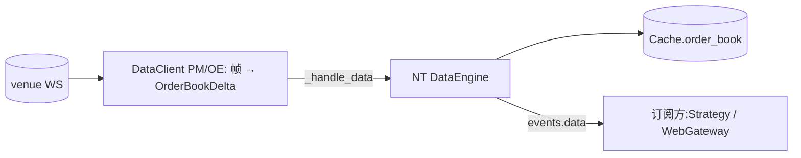

# Data 组件详细设计(占位)

> **状态:占位**。初设 `refactor.md §5.2` 仅到**概要**。按 **P7**,只记职责 + 数据流骨架 + 已锁点 + 待展开;真启动 Step 2 时按标准模板详化。
> 对应初设 Step 2(DataClient)。

## 1. 职责

| 件 | 基类 | 职责 |
|---|---|---|
| PM DataClient | 上游 `PolymarketDataClient` | **零代码**。WS 订阅 → 输出 NT 标准 `OrderBookDelta` |
| OE DataClient | 自写 `OrbitExchDataClient(LiveMarketDataClient)` | 包装 Playwright IO 为 NT 契约;WS 帧 → `OrderBookDelta` / `QuoteTick`;**宿主 OE 健康检查/页面 reload** |

- 订阅去重由 NT `DataEngine` 引用计数自动完成(无需自管)。
- **OE 健康检查(页面 staleness + leg_settled reconcile)代码住本组件(`OrbitExchDataClient`)**,但属执行完整性 —— **详细设计见 `execution/architecture.md §4.3`**,本组件只提供 page 宿主。

## 2. 数据流骨架

## 3. 已锁点

- 输出 **NT 标准 `OrderBookDelta`**(取代旧自研 dict)
- 订阅去重 = `DataEngine` 引用计数
- OE page 来自共享 `BrowserManager`,`get_page("data")`(Q2)
- OE 健康检查 staleness **仅在健康检查 tick 评估**,不立即刷新(§6.8.3,详见 execution 文档)

## 4. 待 Step 2 启动展开

- OE 半成品 `data.py` 整体重写为 NT 契约
- OE WS 帧 → `OrderBookDelta` 的解析(back/lay → bid/ask)
- 详细接口 / 时序 / 消息接线(标准模板 7 节)
- 与 InstrumentRefresher 的联动(refresh 后下游订阅联通)
