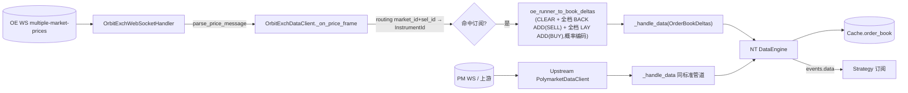

# Data 组件详细设计

> 设计理由 / 决策史(Q2/Q9 + #34/#35)见初设 `refactor.md §5.2`。
> 冲突时:有把握 → 以本文为准并回写;没把握 → 提出讨论。对应初设 Step 2。

---

## 1. 职责与边界

| 件 | 基类 | 职责 |
|---|---|---|
| PM `PolymarketDataClient` | 上游 + 本项目小补丁 | WS 订阅 → 输出 NT 标准 `OrderBookDelta`;订阅启动阶段 WS connect 失败时保留订阅并自动重试 |
| `ArbPolymarketLiveDataClientFactory` | `LiveDataClientFactory` | **薄子类**,只为换用 `ArbPolymarketInstrumentProvider`(后者给 PM instrument.info 补 matching 字段;#35) |
| `PolymarketSportsDataClient` / `PolymarketSportsInstrumentProvider` | 自写 `LiveMarketDataClient` + `InstrumentProvider` | 公开 Gamma discovery 产出 `.PMSPORTS` non-tradable synthetic event anchors + Sports WS firehose 产出 `SportsGameUpdate` |
| `OrbitExchDataClient` | 自写 `LiveMarketDataClient` | WS `multiple-market-prices` 帧 → NT 标准 `OrderBookDeltas`(snapshot CLEAR + **全档** ADDs,#256 深度改造,取代 #85 的 top-of-book-only);BACK→SELL/ask 侧 / LAY→BUY/bid 侧,存入值是 `probability_from_price` 换算后的隐含概率(⚠️ 非原始赔率,详见 §3.1);路由 market_id+selection_id → InstrumentId |
| `OrbitExchLiveDataClientFactory` | `LiveDataClientFactory` | 构造 OE data client,共享 `PlaywrightBrowserManager`(§6.2 单例) |

**位置**(refactor.md #33):venue-coupled 全在 `nautilus_trader/adapters/{polymarket,orbitexch}/`(P9 唯一例外)。

**明确不做**:
- ❌ DataClient 不拥 BrowserManager 生命周期(共享单例由 factory 持;`_connect` 只 `get_page("data")`)
- ❌ 不输出旧自研 dict(全 NT 标准 `OrderBookDelta`)
- ❌ 订阅去重不自管(NT `DataEngine` 引用计数自动)

---

## 2. 数据流



要点:
- OE WS 给的是 **snapshot of N levels**(`bdatb`/`bdatl` 各档),`oe_runner_to_book_deltas` 在源头归一为 `OrderBookDeltas`(1×CLEAR + 全档 BACK + 全档 LAY)入标准管道(#256 深度改造,⚠️ 取代此前 #85 的"只发 top-of-book"设计,决策见 refactor.md #256 条目)。
- decimal odds side 映射不变:BACK 写入 `BookOrder side = SELL`(ask/back),LAY 写入 `BookOrder side = BUY`(bid/lay)。但**存入值不再是原始赔率,是 `probability_from_price(venue, raw_odds, claim)` 换算后的隐含概率**——NT book 的固定排序规则(ask 取原始值 min 为 best、bid 取 max 为 best)跟"back 越高越好、lay 越低越好"这种反向语义不匹配,只发一档时靠 N=1 退化掩盖;发全档后必须让存入值单调方向配平,`1/price`(claim=yes)对 price 严格递减、`1-1/price`(claim=no)严格递增,恰好在换位后仍自洽。Web/Strategy 用 NT 标准 `best_ask_price()`/`best_bid_price()` 仍能拿到"业务最优概率",但**要拿真实赔率(下单价、展示价)必须再经 `price_from_probability` 逆变换**——不能像改造前那样直接把 book 值当赔率用。既有读取点(`strategy/checks/quote_legs.py`、`matching/actor.py`、`web/actor.py`)均已按此改造；#287 起 Execution 的 marketable LAY 还会读取真实执行 instrument 的 `bids()[-1]`，将最差概率档逆换算为最终 LAY 限价。
- 未订阅市场的帧静默丢弃(routing 表查不到)。
- PM CLOB market WS 由上游 `PolymarketWebSocketClient` 连接;`base_url_ws` 必须是 `.../ws/`,由 client 自行拼接 `market`。项目 dispatcher 兼容旧 `.../ws/market` 配置并归一化。`proxy_url` 由配置显式给出后透传给上游 client(#276:loader 不再从 env 注入,未配置=直连;政策与全接线表见 configuration.md「网络代理路由」);NT pyo3 WS client 不自动读取系统代理,直连 PM WS 在当前网络下会超时。若启动订阅后的第一次 connect 因网络超时失败,`PolymarketDataClient._delayed_connect` 记录 warning 并按至少 5s 间隔重试,避免一次 transient timeout 后永久无 PM 盘口。PM DataClient 也记录首个 `PM OrderBookDeltas published` 低噪声锚点,用于 live smoke 区分"WS 已连"与"盘口已进入 NT 数据管道"。
- PM HTTP/CLOB client 由 `get_polymarket_http_client()` 统一构造为 `py_clob_client_v2.ClobClient`(#97)。#98 起该 factory 同时把 `venues.polymarket.proxy_url` 接到 v2 SDK 的共享 HTTP transport,确保 PM Data/Provider 的 CLOB REST 读取与 PM WS 使用同一显式路由;#276 起无论显式与否均 `trust_env=False`(未配置=直连,不读进程代理;曾因 arb_factories 覆写工厂漏传 `proxy_url` 致 CLOB REST 直连超时,已修并由 factory 测试钉住)。共享 `HTTPTransport(retries=1)` 只重试一次连接建立错误(`ConnectError` / `ConnectTimeout`),Data/Provider 与 Execution CLOB 请求共用;上层业务 retry 仍归 Execution config。DataClient 不执行 geoblock 拦截;geoblock 只约束 PM Execution 真下单 preflight。DataClient 行为不变:仍只使用该 client 的 market/public/provider 能力,行情输出仍为 NT 标准 `OrderBookDelta(s)`。
- Gamma discovery(PM `ArbPolymarketInstrumentProvider` 与 PMSPORTS `PolymarketSportsInstrumentProvider`)与 CLOB 同路由(#274):两 provider 的普通请求统一走 `common/gamma_markets.fetch_gamma_json`，series events 统一走 `fetch_gamma_events_keyset` 的20条游标分页；底层均为 factory 注入的 NT pyo3 `HttpClient(timeout_secs=30, proxy_url=venues.polymarket.proxy_url)`(PMSPORTS 侧 proxy 经 dispatcher `to_sports_data_client_config` 传入;#276 crate 补丁后 `proxy_url=None` 强制直连不读 env)。不再各自裸建 `httpx.AsyncClient`。discovery 失败仍 fail-soft：keyset 任意页失败则该 series 本轮返回0，不发布部分结果，下轮周期发现再试，cache 保留 last-good。

---

## 3. 接口

### 3.1 `OrbitExchDataClient`(`nautilus_trader/adapters/orbitexch/data.py`)

**页面模型(#68):每 competition 一页,新开/刷新统一**。OE 赔率来自 competition 页(`/customer/sport/{sport_id}/competition/{competition_id}`)的价格 WS —— **不是**单一 `inplay/highlights` 页(那只给概览、不含完整盘口;旧"单页多市场"设计废止)。`BettingInstrument` 已带 `competition_id`(`event.competition_id`)+ `event_type_id`(=sport_id),订阅时即可定位开哪页。

并发约束:同一 `MatchedPair` 会同时订阅 home/away 两腿,因此 `_ensure_competition_page` 必须用 `_comp_pages_lock` 包住 page_key 检查 + 首次 open,避免两个协程在 `create_page` 前同时判断"未开"而双开同一 competition 页。

可见性约束(#87):2026-06-09 DevTools/CDP 复核确认,前台 competition 页会创建 `multiple-market-prices` WS 并推送目标 market 帧;但 NT live node 曾出现 competition 页打开摘要先只有 `general` WS 的样本。OE 前端 bundle 会读取 `document.visibilityState` / market 可见性参数来决定价格订阅,因此 data client 在新开或 reload competition 页前必须 `page.bring_to_front()`,`PlaywrightBrowserManager` 也固定 `document.hidden=false`、`visibilityState='visible'`、`hasFocus=true`,并把 `IntersectionObserver` 结果视为可见,避免 data/exec 共享浏览器时后台页不触发 prices WS。

观测约束:OE `OrbitExchWebSocketHandler` 必须使用调用方组件 logger(不能自建 stdlib logger 后丢在 NT 日志之外),并记录低噪声断点:`OE WS connected(type=prices/orders/unknown)`,每类 WS 首帧 `OE WS first frame received(type/kind/bytes)`。`OrbitExchDataClient` 还必须记录 competition 页打开后的 `ws_count/ws_types`,首个 routed price frame,首个 `OrderBookDeltas` publish。live smoke 判断 OE 盘口链路时只用 Playwright handler 这一条运行锚点分层定位:未见 `prices` connected = Playwright 未捕获价格 WS;见 connected 但无 first frame = prices WS 无下行;见 first frame 但无 routed = 解析/market 路由问题。#95 的 CDP `Network` 旁路探针已按 #100 撤回,避免 open/reload 两条路径出现不同观测锚点。

```python
class OrbitExchDataClient(LiveMarketDataClient):
    async def _connect(self):
        await self._browser_manager.start()          # 幂等(共享单例)
        # 不再开 highlights 页 / 不再起单一 ws_handler;competition 页按订阅 eager 开。
        await self._instrument_provider.load_all_async()   # 发现(用 provider 自己的 scraper 浏览器)
        self._send_all_instruments_to_data_engine()
        # ... _update_instruments 周期 task(slice A,不变)

    async def _subscribe_order_book_deltas(self, command):
        iid = command.instrument_id
        inst = self._cache.instrument(iid)
        page_key = f"{inst.event_type_id}_{inst.competition_id}"   # sport_id_competition_id
        self._register_instrument_routing(iid)                     # 全局 routing(price 帧带 market_id)
        await self._ensure_competition_page(page_key)              # eager:订阅即开页(#61 要赔率流);内部加锁去重

    async def _ensure_competition_page(self, page_key):
        """每 competition 一页 + WS handler(去重);已存在则复用。"""
        if page_key in self._comp_pages:
            return
        await self._open_or_reload_competition_page(page_key, sport_id, competition_id)

    async def _open_or_reload_competition_page(self, page_key, sport_id, competition_id):
        """**新开/刷新统一入口**(对齐老 odds_client `_open_or_reload_page`;#68)。
        page 不存在 → create_page + 挂 WS 监听(#67 先挂后 goto)+ goto;
        已存在 → reload(page-level 监听跨 reload 存活,#67 实测,无需重挂)。
        健康检查只复用本方法的 competition 页 reload 分支;execution 页 reload 已迁到
        OrbitExchExecutionClient 的 reload-then-report。"""
        url = f"{base_url}/customer/sport/{sport_id}/competition/{competition_id}"
        # #68:competition 页加载重(走代理 + 页面 JS 建价格 WS 握手),对齐老 odds_client:
        # networkidle + cfg.venues.orbitexch.page_load_timeout_sec → page_timeout,默认 120s。
        timeout_ms = self._config.page_timeout
        page = self._comp_pages.get(page_key)
        if page is None:
            page = await self._browser_manager.create_page(f"comp-{page_key}")
            handler = OrbitExchWebSocketHandler(page, logger=self._log)
            handler.on_price_update(self._on_price_frame)
            await handler.start()                     # #67:先挂监听
            await page.bring_to_front()               # #87:触发 OE 可见 market 的 prices WS 订阅
            await page.goto(url, wait_until="networkidle", timeout=timeout_ms)   # 再导航(价格 WS 此时建,被抓)
            # goto 成功后才登记;失败时 stop handler + close page,避免下一腿复用未加载成功的 page。
            self._comp_pages[page_key] = page
            self._comp_handlers[page_key] = handler
        else:
            await page.bring_to_front()               # #87:reload 前同样保持 competition 页可见
            await page.reload(wait_until="networkidle", timeout=timeout_ms)      # 监听自动捕获新 WS(#67)

    def _on_price_frame(self, message):     # 所有 competition 页共用(routing 按 market_id 分流)
        parsed = self._parser.parse_price_message(message)
        if not parsed: return
        routing = self._market_to_instruments.get(str(parsed["market_id"]))
        if not routing: return
        ts = self._clock.timestamp_ns()
        for runner in parsed["runners"]:
            iid = routing.get(str(runner["selection_id"]))
            if iid is None: continue
            deltas = oe_runner_to_book_deltas(iid, runner, ts)
            if deltas is not None: self._handle_data(deltas)

    async def _disconnect(self):            # **不**关 browser(共享);停所有 competition 页 handler
        for h in self._comp_handlers.values(): await h.stop()
```

- **routing 表**:`dict[market_id_str, dict[selection_id_str, InstrumentId]]`,订阅时从 `cache.instrument(id)` 读 `BettingInstrument.market_id` / `.selection_id` 建。**全局**(跨所有 competition 页),price 帧自带 market_id 直接分流。
- **页面注册表**:`_comp_pages: dict[page_key, Page]` + `_comp_handlers: dict[page_key, WS handler]`,每 competition 一组。
- **周期发现容错(2026-06-29 overnight 修)**:`_update_instruments(interval)` 是 60min 级别的 instrument rediscovery,不是行情 WS 恢复路径。每轮 `provider.load_all_async()` / `initialize(reload=True)` 的普通异常只记录 warning 并等下一轮继续;只有 `CancelledError` 退出 task。否则一次 `ERR_NAME_NOT_RESOLVED` / `ERR_INTERNET_DISCONNECTED` 会让 NT `create_task` 记录 `Error running '_update_instruments'` 后整个周期发现永久停止。
- **开页时机 = 订阅即开(eager)**:#61 的目的是"`MatchedPair`→订阅→策略拿真实赔率";赔率住 competition 页 WS,故订阅时立即开页,不推迟(老 odds_client 推迟到健康检查)。
- **关页 = 退订归零对称关闭(#251,废除 #68"保持打开")**:`_unsubscribe_order_book_deltas` 清路由后,若该 competition 页已无任何剩余 market 订阅(`_market_to_page_key` 反查),**整个关闭动作持 `_comp_pages_lock`**:摘 `_comp_pages/_comp_handlers`(断开回调因此 no-op,不触发 reload)→ stop handler → `close_page`,关闭完成前锁住同 competition 的再订阅开页(防同名新页竞态)。#250 eviction 驱动真实退订后,空页 = Chromium tab + 价格 WS 泄漏,与 engine 侧归零回收(book/Store)对称。订阅状态机抽为模块级纯函数 `oe_subscription_plan_from_instrument` / `oe_update_subscription_state` / `oe_remove_subscription_state`(对齐 SE 风格,可单测;client 方法只留 cache 读取与 warning);remove 同步清空 market 条目与 `market_to_page_key`(旧实现残留导致 `_delayed_reopen` 的"已解订"判据永不生效,一并修复)。
- **competition 页存活 = WS handler 自洽封装(#109,2026-06-16;#111 feed-specific 修正,2026-06-19,✅ 已落地代码 + 离线测 + 心跳已 live 验证 prices ~25s 空闲)**:**存活检测封装进 `OrbitExchWebSocketHandler`**(像 PM 把 ping-timeout 藏在 pyo3 WS client 里),DataClient 只收事件、对称 PM。**单一真理源 = 本节**;handler 是契约定义者,DataClient 是消费者(规则 3 主判据:单一自然归属 → 不单独成章)。
  - **handler 内部(契约定义者)**:可选传 `clock` / `loop` / `liveness_timeout_secs`(传了才开存活;**执行页 general WS 不传 → 行为不变**)与 `liveness_ws_type`(为空=任一 WS 非空帧刷新;指定=仅该 feed 刷新)。`_on_frame_received` 对命中 feed 的非空帧(含 SockJS 心跳 `'h'`)更新 `_last_frame_ns`(廉价);单个 **lazy self-rescheduling** NT clock alert 到期读它 —— 还活着(`now-last_frame<timeout`)就重排到 `last_frame+timeout`,死了(心跳停=静默死亡)fire `on_disconnect`。重排前必须先 `cancel_timer(name)` 再 `set_time_alert_ns(...)`,因为 LiveClock callback 执行期间同名 timer 仍占用 name。**prices WS close** 也 fire `on_disconnect`(干净关闭快路)。**零 per-frame timer churn**(每帧只写 ns,不碰 timer)。暴露 `on_disconnect(callback)`。
  - **DataClient(消费者,对称 PM)**:competition 页开 handler 时传 `liveness_ws_type="prices"`;因此只有 prices feed 的数据/心跳能证明盘口存活,`orders/general` 心跳不能掩盖 prices WS 未出现或不下发。开页时 `handler.on_disconnect(lambda pk=page_key: <schedule reload>)`;收到 → reload 该页(`_reload_comp_on_disconnect`,带 `_disconnecting` / `_comp_reloading` / `_COMP_RELOAD_COOLDOWN_SECS` 三重防护防自触发/关停/风暴)。**DataClient 无 HealthCheckLoop、无周期 scan、无自身 watchdog** —— 纯事件驱动(`on_disconnect` 事件 + 开页失败重试 + 死页逃生口),与 PM `_schedule_delayed_connect` 对称。
  - **死页逃生口(2026-07-21 #258,已落地)**:reload 分支进入前先判 `page.is_closed()`,死页 → 摘 `_comp_pages`/`_comp_handlers` + `handler.stop()` + `close_page()`(OE `_discard_dead_competition_page` / SE `se_discard_dead_competition_page`,**要求调用方已持 `_comp_pages_lock`**)→ fallthrough 走新建分支。**必要性**:reload 对已死 page 永不可能成功,而死 page 占着 `_comp_pages` 会让 `_open_or_reload_competition_page` 永远进不了新建分支 → 每轮 `liveness_timeout` 只是重复 reload 报错、盘口静默停更;且 data 侧**不接** `VenueExecutionLiveness`(见下「退役」条),venue 仍 alive、风控不拦、策略拿冻结 book 继续下单 —— 与 exec 侧「reload 失败 → `mark_dead` → fail-closed」不对称,故必须在 data 侧自愈。判据用公开的 `page.is_closed()` 而非私有 `is_target_closed_error`(target 一关 `is_closed()` 必为 True,等价)。**只对确实已死的 page 升级**:reload 抛异常但 page 未死不升级,留给下一次 `on_disconnect` 事件重试 —— 否则普通网络抖动会把「每 `staleness_timeout` 重试一次 reload」变成「`_delayed_reopen` 每 `_COMP_REOPEN_RETRY_SECS`(5s)重建 tab」,venue 长时间不可用时 churn 显著放大。
  - **connect-retry 事件化**:`_ensure_competition_page` / 开页失败 → `create_task` 延迟重试(像 PM `_delayed_connect`),不再靠 health tick 补开。
  - **机制差异(诚实记录)**:PM WS client **主动发 ping** → pong 超时 disconnect;OE handler **被动盯入向帧(含心跳)+ close** → fire `on_disconnect`。**接口对称、内脏不同**。
  - ✅ **前提已验证(2026-06-16 `oe_heartbeat_probe.py` re-probe 空闲盘口)**:被动盯心跳依赖赔率(prices)WS 真发心跳——实测**空闲盘口** 600s 内 prices 仅 5 个 data 帧、却有 **23 个心跳 `'h'`(median 25.0s,max 35.4s)** → prices WS **空闲时照发心跳**,安静市场靠心跳保活、不误判 disconnect;`staleness_timeout=300s`(≈12 个心跳余量)充足。(此前据 2026-06-13 活跃盘口 probe 误以为 prices 无心跳,已证伪。)
  - **退役**:`HealthCheckLoop`(OE DataClient 不再用;**PM ExecClient 也已删 #110**,merge/redeem 改 NT 连续 position 对账驱动)、`_run_health_check` staleness 维度、DataClient 侧 `_comp_last_frame_ns`/`_mark_comp_frame`/`_on_comp_ws_close`/watchdog(全搬进 handler)。`leg_settled` 状态维度更早已退役(#108);执行真相可信度由 `OrbitExchExecutionClient` 写 `VenueExecutionLiveness`(见 execution §4.3bis / synchronization §8.5)。

**纯映射** `oe_runner_to_book_deltas(instrument_id, runner, ts) -> OrderBookDeltas | None`:模块级,可单测。runner 全空(back+lay 都空 / 全 size<=0)返 None,调用方不 publish 避空簿噪音。⚠️ 2026-07-20/21(#256)起**全档发布**(取代此前"只发 top-of-book"):BACK/LAY 各列所有合法档(price>0 且 size>0)都发 ADD,存入值是 `probability_from_price(venue, raw_odds, claim)` 换算后的隐含概率,不是原始赔率——原因与推导见 §2 要点及 refactor.md #256 决策记录。

### 3.1b OE/SE 3-way 腿模型:合成 no instrument(#228,已落地 2026-07-15)

OE/SE 的 3-way(1X2)在 venue 上是一个 market 三个 selection,每个 selection 一个 back/lay 盘口;
不存在 "xx-NO" 产品——**买 no 的动作就是对同一 selection 下 lay 单**。为满足 #228 的
"pair 内每 venue 每 outcome 恰好一条 instrument 腿"(matching §3.2 不变量),discovery 对
**3-way 的每个 selection 产两条 instrument**(2-way 一律不变):

- **yes instrument**:现状那条,id 不变,info 增 `claim="yes"`(3-way 腿全部显式带 claim,strategy §3.7 约定)。
- **合成 no instrument**(当前形态,#237):`BettingInstrument` 的 symbol 由
  `(market_id, selection_id, handicap)` 决定。fractional handicap 会让 Symbol 含 `.`，而 NT 会把
  这类 Symbol 当成 composite，DataEngine 不会为其创建普通 OrderBook。因此合成 no 的缓存 identity
  使用 **`selection_id=-(venue_selection_id+1)` + null handicap**，真实 selection 写入
  `info["venue_selection_id"]` 供 DataClient 路由；id 示例
  `1-259837227--10372254-None.ORBITEXCH`，且 `symbol.is_composite()==False`。`market_name`
  带 `-NO` 后缀供人读。info = 同 4-key + 同 `selection_role` + `claim="no"` +
  `quote_claim="no"` + `venue_selection_id` + **`exec_instrument_id`(= 同真实 selection 的 yes instrument id)**。
  它是同一 selection 的 **lay 投影,只作行情/身份载体**:无独立 venue 产品、无独立订阅、
  **不直接下单**——执行时 place_bets 经 `exec_instrument_id` 把 SELL@lay 重定向到 yes
  instrument。执行重定向保证 venue 对账(CURRENT_BETS 的 LAY=SHORT 落在真 selection)与 NT 订单/持仓
  在同一 instrument 上闭合；合成 selection 只存在于不可执行的行情 identity，不进入 venue payload。

**book 写入(换位不变量,#228 原设;⚠️ 2026-07-20/21 #256 起"cache 只存 venue 原始价"
这条假设已失效,见下)**:`oe_runner_to_book_deltas` 收到同一 runner frame
时产**两份** `OrderBookDeltas`(同帧原子,每帧全量 CLEAR+ADD 故无镜像同步问题):

```text
yes book(现状):ask ← BACK 列, bid ← LAY 列
no  book(现状):ask ← LAY 列,  bid ← BACK 列(两侧换位重挂,size 跟随对应列)
```

⚠️ **#256 修订**:上面这条"换位"结构不变——变的是每一档存的**数值**。此前(#228 原设,到
2026-07-19)book 存的是 venue 原始赔率,零换算,下单价直通;#256(深度改造,详见 §2 要点
+ refactor.md #256 决策记录)之后,**每一档存的是 `probability_from_price(venue, raw_odds,
claim)` 换算后的隐含概率**,不是原始赔率。原因:decimal odds"back 越高越好、lay 越低越好"
跟 NT book 固定排序规则(ask 取原始值 min 为 best、bid 取 max 为 best)方向不一致,只发一档
时靠 N=1 退化掩盖,发全档后必须做这个变换才能让 NT 原生排序继续正确识别 best/worst。
换算方向由 claim 决定(与换位用的是同一个 `claim` 参数,数学上恰好让 back/lay 两列在换位
后都能配平,见 §2 要点)。真实下单价不再"直通"——要拿真实赔率必须在读侧用
`price_from_probability(venue, probability, quote_claim)` 逆变换(真理源仍是 venues.md §4,
新增反函数);`quote_claim=no` 对应 `1/(1−probability)`。
真实 2-way away runner 虽然逻辑 `claim=no`,但没有 `quote_claim=no`,book 和概率仍按普通
(quote_claim 默认 yes)公式处理,这条判据本身不受 #256 影响。

**路由**:data client 的 `_market_to_instruments[market_id][selection_id]` 从单值改多值
(同一 selection → yes/no 两条),price frame 回调对两条各 publish 一份 deltas。
某侧列为空(如 lay 无报价)时该侧对应 book 一侧为空,消费端按"该腿本轮无报价"自然处理
(strategy §3.7 ≥2 条腿规则 / matching §4.2.1 PENDING)。

SE 同构(`sharpexch/data.py` 的 price frame → deltas 路径)。

### 3.2 `ArbPolymarketInstrumentProvider`(`adapters/polymarket/arb_provider.py`)

PM instrument 的下单下限字段由共享 parsing 定义：`minimum_order_size → info.min_buy_quantity`，`min_quantity=None`；这是 BUY-only 元数据。`info.order_size_increment=0.01` 是两侧下单网格提示：SELL 向下取整，BUY 正常四舍五入。DataClient 只负责把 instrument 写入 Cache，不解释或改写这些侧别约束。具体契约见 discovery §1/§3，消费方见 strategy/risk。

```python
class ArbPolymarketInstrumentProvider(PolymarketInstrumentProvider):
    def _parse_instrument(self, market_info, token_id, outcome):
        instrument = super()._parse_instrument(...)
        if isinstance(instrument.info, dict):
            instrument.info.update(enrich_pm_six_key_info(market_info, outcome))
        return instrument
```

> **实写已落地(superseded,2026-06-21 核实;2026-07-29 更新)**:本节描述的 `enrich_pm_six_key_info` best-effort seam(只填 `sport`、其余空串)是早期结构草案。**实际 wired 的是 `ArbPolymarketInstrumentProvider`(`adapters/polymarket/arb_provider.py`)**,`load_all_async` 走 gamma `/sports`(competition→sport + ordering)+ `/events/keyset?series_id=`(内嵌 teams),`_load_moneyline_market` 直接把 matching 字段(`sport/competition/home_team/away_team/selection_role`)和 `game_id` 写入 `info`;`start_ts` 不再是 matching info 字段。下面的 seam 版仅作历史参照,extraction 不再是当前待办。

`enrich_pm_six_key_info(market_info, outcome) -> dict`(历史 seam,已被 arb_provider 取代):
- `sport` ← `market_info.get("category")`(PM gamma 给的最接近字段)
- `competition` / `home_team` / `away_team` / `selection_role` 当时为空值(seam 阶段空串)

PM 侧现已**正常参与匹配**(arb_provider 填全 matching 字段);matching `events_from_instruments` 见必需字段任一空才跳过该 instrument。

**#228 PM 3-way 暴露 NO token(已落地 2026-07-15)**:PM 3-way 是 3 个独立 `[YES,NO]` binary market
(slug `ticker-{abbr}` 聚合);历史上 `_load_moneyline_market` 跳过 `outcome != "Yes"` 的 token
(b7b0581bd9)。#228 起 3-way 的 NO token 也产 instrument(真 token、真盘口、独立订阅——PM 的
NO 盘口是独立流动性,且下买 NO 单需要 NO token_id):info = 同 4-key + 同 `selection_role`
(= 所属 market 的 role;role 是"属于哪个 market"的维度)+ `claim="no"`;同 market 的 YES token
info 增 `claim="yes"`。**2-way 完全不动**(不暴露 claim/NO;2-way 的 no≡对面 yes,无新信息)。
一场 3-way 比赛 PM 共 6 条 instrument,按 role 两两落进 3 个拆分 pair(matching §4.2.2)。

### 3.3 Factory(`adapters/polymarket/arb_factories.py` + `adapters/orbitexch/factories.py` + `adapters/sharpexch/factories.py`)

OE Data config 的唯一 NT 节点构造入口是项目 dispatcher;旧 `config_loader`
不再导出 client-config factory。配置边界见 `_cross-cutting/configuration.md §6`。

- `ArbPolymarketLiveDataClientFactory.create()`:同上游 `PolymarketLiveDataClientFactory`,只把 provider 替为 `ArbPolymarketInstrumentProvider`(用上游 `PolymarketDataClient` 不变;P1 复用)。HTTP client 使用 `py_clob_client_v2.ClobClient`,与 PM execution 共用同一 factory 约束(#97)。构造完 provider 后回写 `instrument_provider_by_venue["POLYMARKET"]`。
- `OrbitExchLiveDataClientFactory.create()`:只从 `ArbContext.discovery_config_by_venue["ORBITEXCH"]` / `*_aliases_by_venue["ORBITEXCH"]` / `browser_manager_by_venue["ORBITEXCH"]` 读取依赖;通过 `ctx_map_get_or_create` 复用或创建 `PlaywrightBrowserManager`,并把 `ArbContext.arbitrage_params.fx` 注入 `OrbitExchInstrumentProvider`,用于把 OE 最小 stake 7 GBP 写成 adapter 外 USD 口径的 `min_notional = Money(7 * fx, USD)`。OE discovery 不开 `oe-discovery` 页、不登录、不持锁,等共享 BrowserContext 的 `CSRF-TOKEN`(exec 登录写入)后用 context request 调 `sport/details`。SE 由于 Cloudflare/TLS 差异已改为临时 page-native fetch,不再与 OE 共用该 IO 实现;两者仍共享“不由 discovery 登录”的边界。构造完 provider 后回写 `instrument_provider_by_venue["ORBITEXCH"]`。
- `SharpExchLiveDataClientFactory.create()`:仅在 `venues.sharpexch.enabled=true` 时由 launcher 注册;只从 `ArbContext.discovery_config_by_venue["SHARPEXCH"]` / `*_aliases_by_venue["SHARPEXCH"]` / `browser_manager_by_venue["SHARPEXCH"]` 读取依赖(discovery 不用锁;`browser_lock_by_venue` 仅 exec 兼容入口)。browser manager 通过 `ctx_map_get_or_create` 复用或创建;discovery config 存在时构造带 browser `json_fetcher_session` 的 `SharpExchDiscoveryClient` + `SharpExchInstrumentProvider`,整轮用临时 page-native fetch;缺失时使用 fallback `InstrumentProvider()`。构造完 provider 后回写 `instrument_provider_by_venue["SHARPEXCH"]`。
- **`PolymarketSportsLiveDataClientFactory.create()`(#60/#127)**:构造 `PolymarketSportsDataClient` + `PolymarketSportsInstrumentProvider`;provider 读取 `target_competitions_by_data_source["PMSPORTS"]` / `competition_to_sport_by_data_source["PMSPORTS"]`,产出 PMSPORTS synthetic event anchors。

### 3.4 `PolymarketSportsDataClient`(`adapters/polymarket/sports.py`,#60)—— 比分 firehose

PM **Sports WebSocket**(`wss://sports-api.polymarket.com/ws`,公开/无订阅/无鉴权/事件驱动稀疏)→ 实时赛事状态。**P11:`SportsGameUpdate` 事件的单一自然归属 = 本生产者**(消费者 matching/strategy 只读)。
PMSPORTS event anchor 见 `_cross-cutting/sports-event-anchor.md`:该 data-only client 同时执行公开
Gamma discovery,产出 `.PMSPORTS` non-tradable synthetic instruments 供 matching 作为 event anchor;
它不拥有 execution/account/position,也不进入套利下单流。

- `_connect` 先 `PolymarketSportsInstrumentProvider.load_all_async()` + `_handle_data(instrument)` 灌入 NT cache,再开 WS firehose;`update_instruments_interval_mins` 默认 60min,单轮失败只 warning,下一轮重试。
- synthetic anchor 每场一条 `BettingInstrument(venue=PMSPORTS, market_type=EVENT_ANCHOR)`, `info` 含 matching 字段 + `game_id` + `tradable=False` + `anchor=True`。它只给 Matching 识别 event,不代表可交易 selection。
- WS firehose 无 instrument 订阅;IO 使用 NT 原生 pyo3 `WebSocketClient`，显式复用
  `venues.polymarket.proxy_url`。初次连接在后台 task 中执行，失败不阻塞 DataEngine 启动并按
  5s 重试；连接成功后的断线、退避重连由 NT client 负责。`heartbeat=None` 不发送客户端主动
  keepalive，协议层 ping/pong 由 client 处理，仍兼容 app-level text `"ping"`→`"pong"`；
  `_disconnect` 先取消初连 task，再断开 client。不得改回 `websockets.connect`：其 15/16
  新 asyncio 代理实现存在握手超时后的清理竞态，会额外抛出 callback traceback。
- 每 `sport_result` → `parse_sport_result` → `SportsGameUpdate`；processor 对至少有一个已订阅
  channel 的比赛先写 `SportsGameStateStore`，再按变化通道以
  `CustomData(sports_data_type(game_id, channel), update)` 交给 DataEngine，路由到该场该通道的 topic。
- **映射键 `game_id`** == gamma `event["gameId"]`(`arb_provider` 抽入 `info["game_id"]`,#60 实采证实双向对上);消费者经 game_id 查 pair。
- 消费:**matching** `ended`→eviction(matching §4.4);**strategy** 收到该场更新后触发评估，
  条件判断按需查询 `SportsGameStateStore`。详见 strategy architecture §3.1/§3.8.1。

#### 3.4.1 CustomData 状态管线(#250,已落地)

旧 `SportsGameUpdate` 直接裸发 MessageBus,只有事件语义,没有像 NT 内置
`OrderBookDeltas` 那样形成"最新状态在 Cache、事件只负责通知"的读模型。本架构**严格对标
NT/OE 赔率链路**:消费者按键下发订阅命令 → client 持订阅注册表 → 未订阅帧在源头静默丢弃
→ 命中帧归一后经 DataEngine 路由到 per-key topic。实现位于 `adapters/polymarket/sports.py`。

**订阅模型:`(game_id, channel)` 即订阅键。**

```python
sports_data_type(game_id, "phase")
# = DataType(SportsGameUpdate, metadata={"game_id": gid, "channel": "phase"})
# → topic "data.SportsGameUpdate.game_id=<gid>.channel=phase"
```

- 每场比赛的每个通道一个独立 DataType/topic。metadata 参与 DataType 身份(NT 泛型 SubscribeData 路径
  唯一的参数槽;`instrument_id` 变体不可用 —— engine 转发去重按 DataType 键,忽略 instrument_id),
  engine 因此**逐 `(game_id, channel)` 转发** subscribe/unsubscribe → 兴趣记账直接复用 **NT client 基类原生
  订阅注册表**(`subscribed_custom_data()`,engine 首订转发/归零退订时同步更新;
  对标 OE `_market_to_instruments` 路由表),不另建集合。
- 当前通道为 `phase` / `score`，payload 均为完整 `SportsGameUpdate`；通道只决定变化时唤醒谁。
  逐通道变化判据及 payload 契约见 §3.4.2。

**数据面固定顺序**(`SportsGameDataProcessor.process`):

1. **兴趣门控**:比赛没有任何 channel 订阅时整体丢弃,不存不推("定了就推,不定就不推")。
2. filter seam(二级占位,默认全收)。
3. **终态拒收**:Store 旧状态 `ended=True` 即终态,后续任何帧丢弃;ended 帧本身放行恰好一次
   (eviction 依赖),覆盖退订命令异步生效前的小窗。
4. **过期拒收**:`ts_event` 倒退整体丢弃,Store 不回退。
5. **逐通道 diff**:`phase` 比较三态，`score` 比较比分字符串；无已订阅通道发生变化时只刷新 Cache 时戳。
6. **先写 `SportsGameStateStore`**(key `pmsports:game:{gid}`,NT Cache 通用对象区,codec Store 私有)。
7. 对发生变化且已订阅的通道发布 `CustomData(sports_data_type(gid, channel), update)`
   → DataEngine → per-(game,channel) topic。

**错误边界**:Store 写失败 → 不发布(记录 error,后续帧重试);publish 失败 → Cache 不回滚。

**订阅生命周期与归零回收**:

| 消费者 | 订阅时机 | 退订时机 |
|---|---|---|
| Matching | candidate 产生时逐场订(#252;gid ∉ ended) | `_evict_game`(ended)或差集清理(candidate 消失且无 PASSED pair,#252) |
| Strategy | `MatchedPair` 到达(gid 经 PairRegistry `game_id_for_pair`)| 收到 ended、扇出分发完毕后 |

双侧退订汇合 → msgbus 订阅数归零 → engine 转发 unsubscribe → client `_unsubscribe`:
移出对应 channel；该场全部 channel 归零后才 **`store.delete(gid)` 回收 Store 条目**。
Store 条目生命周期 = 该场所有通道订阅的并集生命周期；进程重启即清(纯内存)。

**本轮 NT Cython 核心修补**(#250 定夺;升级合并时需保留):

| 位置 | 修补 |
|---|---|
| `data/engine.pyx` `_handle_unsubscribe_data` | 修上游 bug:归零判断误用 `f"data.{DataType}"`(`__str__` 人类格式)查 msgbus,与 metadata topic 永不匹配 → 首个退订即转发 client。改用订阅侧同款 `get_custom_data_topic` topic 串,归零计数变真实 |
| `data/engine.pyx` `_handle_unsubscribe_order_book` | 归零分支(断 client feed 后)新增 `cache.remove_order_book(iid)`:赔率 book 订阅归零即从 Cache 回收,不再留存陈旧值 |
| `cache/cache.pyx(.pxd)` | 新增 `delete(key)`(通用对象区删除;database facade 无对应 API,仅内存)与 `remove_order_book(instrument_id)` |

Strategy 侧配套:ended 分发完毕后除退订 sports 外,同时退订该场各 pair 腿的 OBD
(自记 `game→iids` 映射,不依赖 PairRegistry 以免与 matching unregister 抢顺序)→ OBD
订阅归零 → NT 收尾(断上游 feed、摘 managed book 维护 handler)+ **book 从 Cache 回收**。
matching 概率校验 handoff 不受影响:三阶段交接(register → publish → 释放校验订阅)保证
strategy 的订阅先于 matching 释放建立,校验 book 不会中途归零。

**已接受残差**:订阅建立前到达的帧丢弃(matching 在发现扫描即订,窗口极小;PMS 重复推送可补);
ended 的发布只有一次,无重复帧兜底(会话内 matching 订阅早于 WS 首帧,错过窗口不存在)。

#### 3.4.2 按变化分通道(#322,已落地 · live-unvalidated · as-of 2026-08-05)

> 承 §3.4.1。本节记录从旧“单通道整帧广播”演进到按语义分通道 + 每通道变化才发的
> 具体契约；§3.4.1 已回写为当前总流程。代码:`adapters/polymarket/sports.py`
> (`sports_data_type(game_id, channel)` / `sports_phase` / `SportsGameDataProcessor` 逐通道 diff)；
> 消费端 matching/strategy 当前均订 `phase` 通道。**live-unvalidated**(单元测试覆盖,实盘未验)。

**动机**:strategy 对 sports **只消费 `ended`**(唤醒+定位靠 game_id,状态判断从 Store 读,strategy §3.8.1);`score`/`elapsed`/`period` 帧对它是纯噪声唤醒。未来若有比分/阶段消费者,又需各订各的、互不惊动。

**通道 = DataType metadata 再加一个 `channel` 键**(复用 §3.4.1 那个"NT 泛型 SubscribeData 唯一参数槽",零新机制、零新 Cython 补丁):
```python
sports_data_type(gid, channel="score")   # → 独立 topic(metadata 两键进 topic 串)
sports_data_type(gid, channel="phase")   # → 另一个独立 topic
```
engine 逐 `(game, channel)` 转发 sub/unsub,client 基类 `subscribed_custom_data()` 原生记账,#250 的 `_handle_unsubscribe_data` metadata-topic 补丁照用。**消息带整份 `SportsGameUpdate` 对象(引用,零拷贝),不设 per-channel 切片 payload**(用户定,2026-08-05)。理由:sports 帧低频、in-process msgbus 传对象引用不序列化,"带整份"= 传已有引用零分配、**最快**;切片(各通道带各自字段)反而多一次对象分配/帧,且把"phase 切片装什么"重新拽回 per-sport 格式问题;纯唤醒(不带数据)逼消费者回 Store 解码,更慢。与 OBD 同模型:消息带数据,**消费者可直接读 payload、也可查 `SportsGameStateStore`(=Cache)**——通道只决定"变化时唤醒谁"(省 re-eval),不决定"给什么字段"。故 strategy 可继续从 payload 读 `game_id`/`ended`(actor.py 不改),Store 仍供"非唤醒时刻按需查状态"。

**每通道独立"变化才发"**:把 §3.4.1 step 5 的全字段去重(`_business_fields` 一刀切)换成**逐通道 diff**——写完 Store(仍单份全量真理、单次写)后,对每个通道各判:

| 通道 | 判据(new vs prev) | 语义 |
|---|---|---|
| score | `new.score != prev.score` | 比分变 |
| phase | `phase(new) != phase(prev)` | 三态跃迁 |

prev/new 同源(同一 Store 读),两 diff 独立;都不变 = 全不发(退化回 §3.4.1 的"只存不发")。**"只发不存"仍禁止**、Store 仍是 publish 前置(§3.4.1 错误边界不变)。

**phase 三态在 sport-agnostic 层派生**(关键:躲开跨 sport 格式差异):
```
PRE     = not live and not ended
IN_PLAY = live
POST    = ended
```
派生跑在**归一化后的扁平 `SportsGameUpdate`** 上,不在原始帧上——这是本设计能"零 per-sport 逻辑"的前提。**原始 firehose(`wss://sports-api.polymarket.com/ws`)结构逐 sport 并不统一**(实盘抓帧核实 2026-08-05):电竞(cs2/dota2/lol/mlbb/val/hok)扁平,顶层直接 `status/score/period/live/ended`(`status` 小写 `running/finished`,`score` 复合串如 `"000-000|1-0|Bo3"`,`period` 如 `2/3`);**网球/足球(challenger/wta/uwcl)嵌套在 `eventState` 里、顶层再复制一份**。这些差异被 **`parse_sport_result`(sports.py:313,只读顶层,依赖"顶层==eventState 同值"假设)吸收**,归一化后 `live`/`ended` 是统一布尔、`score` 是统一串 → score 通道(串 diff)与三态 phase 通道(布尔派生)在归一层零 per-sport 逻辑;归一化已保留 `status/period` 原始串,细粒度 phase 可纯下游做。**残留假设**:parser 的"顶层复制 eventState"(2026-08-05 抓帧旁证:0 赛前帧 ⇒ 网球/足球顶层确有 `live/ended`,否则会误判 PRE);若某帧顶层缺失而只有 `eventState` 有,网球/足球会误判——低概率、需 parser 兜底才彻底消除。

**承重不变量(与机制共址)**:
- **`ended` 必在 phase 通道恰好发一次** —— eviction(matching `_evict_game` / strategy `_release_game_subscriptions`)依赖它。POST 是一次 phase 跃迁 → 自然发一次;后续 POST 帧无跃迁 → 不发;叠加 §3.4.1 step 3 终态拒收(ended 后帧整体拦),与现语义一致。**若拆分实现破坏"ended 恰好一次",eviction 会漏 → 订阅永不归零、Store 不回收**,是本设计头号回归面。
- **细粒度 phase(半场/加时/点球/局节边界)= 唯一被 sport 格式咬住处**:需 per-sport 解析 `status`/`period`。落地时**所有 league 分支知识只住一个 `league → 规范 phase 枚举` 归一模块**(单一真理源),不得撒进 processor/strategy。**当前不做**(无消费者,YAGNI),留占位。

**待验证 / 待展开**:
- [x] **B(赛前帧)—— 已核实 2026-08-05(75s / 9 league / 64 帧)**:**0 帧赛前**(63 IN_PLAY + 1 POST),无一帧 `Scheduled`/`not_started`。窗口窄(仅电竞/网球/足球在打),非铁证但强烈倾向:**firehose 只推进行中比赛,赛前不作 live tick 推**。故 **PRE→IN_PLAY 跃迁基本不作为事件发生,一场比赛首帧即 IN_PLAY**;phase 通道有意义的事件 = 首帧(进 IN_PLAY)+ IN_PLAY→POST(ended)。PRE 订不订都基本收不到 tick,不必为它单开通道。
- [ ] 细粒度 phase per-league 归一模块(有消费者再上)。

**分期建议**:先落 agnostic 双通道 + 变化才发(strategy 改订 phase-only,甚至 ended-only);score 通道等真有消费者、细粒度 phase 等有需求再上。

---

## 4. 与横切的咬合

| 横切 | 约束 |
|---|---|
| Q9 matching key | OE/SE Provider 填全;PM 经 `ArbPolymarketInstrumentProvider`(`arb_provider.py`)`load_async` 走 gamma `/sports`+`/events` 填全 matching 字段(extraction 已实写,2026-06-21 核实;`start_ts` 不参与 matching info)|
| PMSPORTS event anchor | `PolymarketSportsInstrumentProvider` 复用公开 Gamma discovery 目标,产出 non-tradable `.PMSPORTS` matching instrument;Matching 负责把 anchor 与真实 tradable venues 聚合成 pair |
| §4.3 OE 健康检查 | **历史设计已失效**:execution 页 reload 宿主已迁到 `OrbitExchExecutionClient`;本文件只保留 competition 页健康检查,见 execution §4.3bis |
| 订阅去重 | NT `DataEngine` 引用计数自动,客户端不自管 |
| **Q11.A Debug 行情掉包**(#39) | `Debug{PM,OE}DataClient`(`src/arbitrage/debug/data_clients.py`)子类化 `_handle_data`,按 `DebugConfig.mock_data(ODDS)` 替换 / 注入;两 factory 读 `ArbContext.debug_config`,`enabled` → 装 Debug 子类,否则装生产。框架只提供 `_maybe_substitute(data) → data|None` 钩子(默认 passthrough),具体替换算法由 user 按 mock_data schema 子类化覆盖。详见 `_cross-cutting/debug-injection.md` |
| **#51 OE DataClient `_connect` 自管 BrowserManager**(slice 10c smoke 修) | 原设计注释"factory 层先调 `start()`",实际 factory 未接;**slice 10c 改 DataClient `_connect` 自管 `await self._browser_manager.start()`(幂等)+ `self._browser_manager.create_page("data")`**(原 bug:用 `get_page` — 只读,首次连返 None → `.goto` AttributeError)。共享 BrowserManager 仍由 OE Data/Exec/Discovery 三方使用;`start()` 幂等保护重复触发。 |

---

## 5. 落地清单(Step 2)

- [x] OE `LiveMarketDataClient` 子类(整体重写,`data.py`)+ `oe_runner_to_book_deltas` 纯映射 + routing(`tests/arbitrage/adapters/orbitexch/test_data_client_step2.py` 10 passed)
- [x] OE `OrbitExchLiveDataClientFactory`(同目录 `factories.py`)
- [x] PM `ArbPolymarketInstrumentProvider`(`arb_provider.py`)+ `ArbPolymarketLiveDataClientFactory`:真 matching info extraction 已实写(gamma `/sports`+`/events` → home/away/selection_role/competition),实盘 discovery/matching 已跑
- [x] PMSPORTS `PolymarketSportsInstrumentProvider` + `PolymarketSportsDataClient`:公开 Gamma discovery → non-tradable event anchors 入 cache;Sports WS 继续发布 `SportsGameUpdate`
- [x] ~~真 PM matching info extraction~~ 已落地(见上)。OE NT discovery 已迁移到 `OrbitExchDiscoveryClient` + `sport/details`;`start_ts` 从 `marketStartTime` / `event.openDate` 解析后只用于 NT instrument 时间字段,不写入 `instrument.info`。旧 `OrbitExchScraper` DOM 路径仅供 services 栈使用,不再作为当前待办。
- [x] OE competition 页存活封装进 `OrbitExchWebSocketHandler` + `on_disconnect` 事件化 reload;旧 `HealthCheckLoop` staleness / 补开已退役
- [ ] /live-test:双 venue OrderBookDelta 全链路 → strategy 收
