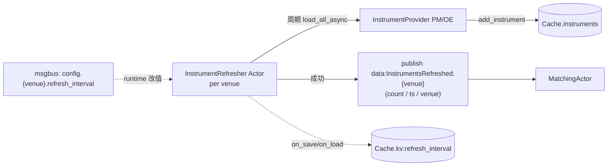
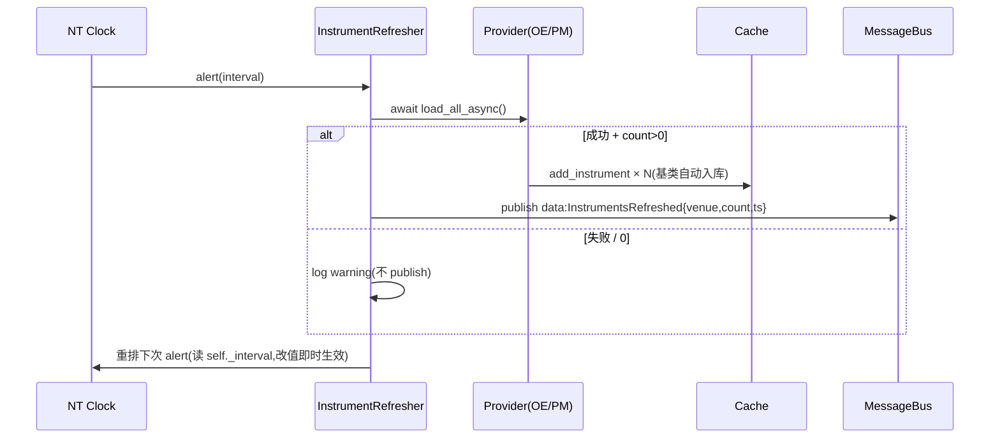

# Discovery 组件详细设计

> 设计理由 / 决策史(Q1/Q2/Q3/Q4/Q5/Q6/Q7/Q8/Q9)见初设 `refactor.md §5.1 / §5.2 / §6.3`。
> 冲突时:**有把握 → 以本文为准并回写;没把握 → 提出讨论,不擅自定**。
> 对应初设 Step 1(Provider)+ Step 2 调度(Refresher)。

---

## 1. 职责与边界

| 件 | 基类 | 职责 |
|---|---|---|
| PM InstrumentProvider | 上游 `PolymarketInstrumentProvider` | **零代码**,配置即用(P1)。产出 `BinaryOption`(`info` 由上游 + 我们配置补 6-key) |
| OE InstrumentProvider | 自写 `OrbitExchInstrumentProvider(InstrumentProvider)` | Playwright 抓赛事(包 `OrbitExchScraper.discover_events`)→ 每场 ≥2 个 `BettingInstrument`(home/draw/away),`info` 填全 6-key |
| ~~InstrumentRefresher~~ **(退役,#59)** | — | **已退役**:周期发现迁回 DataClient 原生 `_update_instruments`(NT bybit/binance 范式)。详见 §3.3 + refactor.md §5.2.3/#59。 |
| 周期发现(#59) | PM/OE **DataClient** | `_connect` 首抓 + `_update_instruments(interval)` task 周期 `provider.load_all_async()` → `_send_all_instruments_to_data_engine()`(`_handle_data`→DataEngine→cache + `on_instrument`);interval 经 client config `update_instruments_interval_mins` |

PM WS 配置约束:`ArbConfig.venues.polymarket.ws_url` 的推荐值是上游 base URL `.../ws/`。为兼容旧 discovery / odds 订阅配置,dispatcher 接受旧 full endpoint `.../ws/market` / `.../ws/user` 并归一化后再交给 PM Data/Exec client。

**明确不做**:
- ⚠️ ~~DataClient 不拥有调度(归 Refresher,Q8)~~ **#59 反转**:Q8 的"调度归 Refresher"被验证为重造 NT 原生(refresher 3 个 bug 都是脱离原生路径的症状)→ **调度迁回 DataClient 原生**(refactor.md #58/#59)。
- ❌ 不为每个 Refresher 单独建子目录(P8;两个 venue 共用一个类,实例化时区分)
- ❌ 单 venue refresh 失败**不发**事件(Q4:matching 自然 gate,不需 sentinel)

---

## 2. 数据流



要点:
- **失败不发事件**(Q4):Refresher 单轮 `load_all_async` 抛 / 0 instrument → log + 不 publish → MatchingActor 失去本轮触发(2×interval 窗口外即 gate)。
- **provider.add_instrument** 是 NT `InstrumentProvider` 基类自带,内部走 NT 标准入 cache 路径(下游 DataEngine / Strategy / Risk 经 cache 透明读)。

---

## 3. 接口设计

### 3.1 `InstrumentsRefreshed`(事件,`src/arbitrage/discovery/events.py`)

NT `@customdataclass` 注册的 Data 子类(可走 NT msgbus + 持久化通路):

```python
@customdataclass
class InstrumentsRefreshed:
    venue: str            # "POLYMARKET" / "ORBITEXCH"(消费方按 venue gate)
    count: int            # 本轮成功落库的 instrument 数(0 时不应被 publish)
    ts_event: int         # 本轮完成时间(ns)
    ts_init: int          # NT 标准字段
```

### 3.2 `OrbitExchInstrumentProvider`(`nautilus_trader/adapters/orbitexch/providers.py`)

```python
class OrbitExchInstrumentProvider(InstrumentProvider):
    """包 OrbitExchScraper,每场赛事产出 home/draw/away 各一个 BettingInstrument,
    `info` 填 Q9 六统一 key:sport/competition/home_team/away_team/start_ts/selection_role。"""

    def __init__(
        self,
        scraper: OrbitExchScraper,
        config: InstrumentProviderConfig | None = None,
        *,
        sport_aliases: dict[str, str] | None = None,        # slice 7A:写 info 时规范化
        competition_aliases: dict[str, str] | None = None,
    ) -> None: ...
```

**`info` 6-key 映射**(MatchEvent → 每条腿):
| info key | 来源 |
|---|---|
| `sport` | `sport_aliases.get(event.sport, event.sport)` —— **slice 7A 规范化**(`"soccer"` → `"Soccer"`)|
| `competition` | `competition_aliases.get(event.competition, event.competition)` —— **slice 7A 规范化**(`"Men's Roland Garros 2026"` → `"ATP"`,#46) |
| `home_team` | `event.home_team` |
| `away_team` | `event.away_team` |
| `start_ts` | **0(暂)**;待 scraper DOM 提取赛事开赛时间 |
| `selection_role` | `"home"` / `"draw"` / `"away"`(由本腿对应的 selection_id 决定) |

> **#46 落实"Provider 填 info 时已 alias"假设**:normalizer 此前注释假设 Provider 已规范化 sport/competition,
> 但旧 Provider 不查 aliases。slice 7A 加 `sport_aliases` / `competition_aliases` 构造参,
> launcher 经 `ArbContext.oe_sport_aliases` / `oe_competition_aliases` 注入(由 `ArbConfig.matching` 派生)。

> **PM 端市场发现 + 6-key(slice 7B → #55 series-based → #57 修发现链路)**:`ArbPolymarketInstrumentProvider(PolymarketInstrumentProvider)`
> **整体 override `load_all_async`**。撤掉 #53/#54 的 `_parse_instrument` enricher + upstream `event_slug_builder` 路径
> (ticker 拆队名对 3-way Yes/No 市场不成立);#55 改 series-based;#57 修"发现链路漏主赛事"。
> `PolymarketInstrumentProvider` 持有的 CLOB HTTP client 由 factory 统一构造为 `py_clob_client_v2.ClobClient`(#97);
> #98 起该 client 的 REST transport 显式使用 `venues.polymarket.proxy_url`(若配置/环境注入),避免 discovery/provider 读取与 WS 行情走不同出口;geoblock 只作为 PM Execution 真下单 preflight,不阻断 discovery/provider 只读市场发现;
> provider 使用的 `get_market` / `get_markets` / `get_order_book(s)` / `get_tick_size` / `get_neg_risk`
> 均在 v2 client surface 内,发现语义不变。
>
> 发现链路(每 competition 一次请求):
> 1. `GET /sports` → 每 competition:`sport`(如 `atp`)+ `series` id + **`ordering`**(home/away);按 `ArbContext.pm_event_slug_tags` 过滤目标 competition。
> 2. `GET /events?series_id={id}&closed=false&active=true&limit=500` → **一次拉全本 series 的 H2H 比赛**(每 event **内嵌** `teams`+`markets`,含主赛事,无需二跳 `/events?id=`)。
>    - 旧版(#55)用 `/series/{id}` 只内嵌截断的 ~10 条 events → **漏主赛事**;默认 `limit=20` 是页面"懒加载"同源根因 → 调大即全量。
>    - **`series_slug` 不通用**:只 atp/wta 的 series slug 恰好 == league slug;足球/棒球查 == 0,故必须走 `/sports` 取 series **id**。
> 3. 每 event 筛 `markets` 内 `sportsMarketType == "moneyline"` 建 instrument(其余 tennis/soccer props 跳过)。
>
> 6-key:
> - **home/away 队名**:权威源 `event["teams"]`(`name`+`ordering`+`abbreviation`,列表顺序无关);缺则 fallback `_parse_team_names(title)`。
> - **selection_role**:
>   - 2-way / 单市场 3-outcome(`slug == ticker`):按 **competition `ordering`** 选映射 —— `home`→`[home,(draw),away]`;`away`→反排 `[away,(draw),home]`(如 MLB)。**不赌 outcomes 固定顺序**(MLB `ordering=away` 时 `[away,home]`,按固定下标会错位)。
>   - 3-way binary(`slug == ticker-{abbr}`):仅 `Yes` token;`abbr` 取自 `teams.abbreviation`;`-{home_abbr}`→home / `-{away_abbr}`→away / `-draw`→draw;其它(`No` token / 未知后缀)→ 跳过。
> - **sport**:`ArbContext.pm_competition_to_sport` 查表(config 派生)。
> - **competition**:写 `info` 时经 `oe_competition_aliases` 标准化(matching `(sport,competition)` 分组键两边对齐:PM "atp" / OE 别名 → 同值)。**start_ts** 从 market/event `startDate` → ns。
>
> **关键 audit**:`tag_id=101232`(ATP tag)在 gamma `/events` 只返 5 个 outright winners;match-level H2H 在 **series**(`series_id=10365`)里;`/series/{id}` 内嵌 events 截断,`/events?series_id=&limit=N` 才全量。
> **性能**:单请求拿全(ATP ~70、足球 ~100,每 event 内嵌 markets),无 per-event 二跳。launcher `timeout_connection` 120s(初次 load connect 窗口)。

### 3.3 周期发现:DataClient 原生 `_update_instruments`(#59;替代退役的 `InstrumentRefresher`)

**#59(slice A)**:`InstrumentRefresher` Actor **已退役** —— 它实为从零重造 NT 原生 `DataClient._update_instruments`(bybit/binance 范式),且本会话 3 个 bug(pending-task / cache 桥接缺失 / topic 通配)皆脱离原生路径的症状。周期发现迁回 DataClient:

- **PM**(上游 `PolymarketDataClient` 已自带 `_update_instruments`):`_connect` → `initialize()` + `_send_all_instruments_to_data_engine()`;周期 task `initialize(reload=True)` + `_send_all`。**前提**:arb factory 强制 `instrument_config.load_all=True`(否则 `initialize` 走 "No loading configured" 加载 0;Gap α,refactor.md #59)。
- **OE**(`adapters/orbitexch/data.py`,#59 新增):`_send_all_instruments_to_data_engine()`(`provider.get_all()`→`_handle_data`)+ `_update_instruments(interval)` task(**直调 `load_all_async`**,Gap-α-proof)+ `_connect` 首抓 + `_disconnect` cancel;config `update_instruments_interval_mins`(默认 60)。
- **灌 cache 路径**:`_handle_data(inst)` → DataEngine `_handle_instrument` → `cache.add_instrument` **且** 通知 `on_instrument` 订阅者(原生,替代旧 refresher 裸 `cache.add_instrument`)。
- `InstrumentsRefreshed` 事件 + matching 的事件触发**一并退役**(matching 改自 timer,§matching §3.3/§4.4)。Q3/Q6 的运行时改 interval + 持久化**迁移中降级**(按需经 client config 恢复)。

> 下方旧 `InstrumentRefresher` 设计**仅存档**(`refresher.py` 暂留 dead code,smoke 验后删):

```python
class InstrumentRefresher(Actor):
    def __init__(self, config: InstrumentRefresherConfig): ...
    # NT Actor 生命周期
    def on_start(self): self._schedule_first()
    def on_stop(self): self._cancel_loop()
    # 周期循环(NT clock 自重排,§6.8.4.5 同节奏)
    async def _tick(self) -> None: ...
    # 持久化(Q3/Q6)
    def on_save(self) -> dict[bytes, bytes]: return {b"refresh_interval": str(self._interval).encode()}
    def on_load(self, state: dict[bytes, bytes]) -> None: ...
    # 运行时改值(msgbus 命令)
    def _on_config_command(self, msg) -> None: ...   # 订 config.{venue}.refresh_interval
```

**`InstrumentRefresherConfig`**:`venue`, `refresh_interval_default`(secs,默认 30), `min_interval`(secs,默认 5,运行时改值下界);Provider 实例经 `_RuntimeDeps(provider, loop)` 注入。

**slice 10d(#52)Gap E:clean shutdown**:`_on_alert` 创建的 `_tick_task` 跟踪到 `self._tick_task`;`on_stop` cancel 未完成 task,避免 NT dispose 时 "Task was destroyed but it is pending" warning。**slice 10d live smoke 验:0 pending warning**(对比 #51 1 条)。

**slice 8A(#47)Provider 共享机制**:Refresher 必须跟 DataClient 用**同一个 Provider 实例**(否则 add 的 instrument 双方各持一份,cache 视图分裂)。落地:
- PM `ArbPolymarketLiveDataClientFactory.create` + OE `OrbitExchLiveDataClientFactory.create` 构造完 Provider 后**回写** `ArbContext.{pm,oe}_instrument_provider = provider`
- launcher `add_actors` 在 `node.build()` 之后(provider 已构造)从 `ArbContext` 读出,构造 `InstrumentRefresher(deps=RefresherDeps(provider=ctx.{pm,oe}_instrument_provider, loop=asyncio.get_event_loop()))`,经 `node.trader.add_actor` 入 NT
- **provider 缺失场景**(discovery 禁用 / 占位 `InstrumentProvider()`):launcher 跳过该 venue 的 Refresher 装载(不 raise)

### 3.4 消息接线

| 类 | 接收 | 发布 |
|---|---|---|
| `InstrumentRefresher` | `config.{venue}.refresh_interval` 命令(运行时改值) | `data:InstrumentsRefreshed`(成功后) |
| `MatchingActor`(§matching) | `data:InstrumentsRefreshed`(两 venue 都订) | `data:MatchedPair` |

---

## 4. 算法

### 4.1 OE 腿构造(`_build_legs`)

对每个 `MatchEvent`,**有 selection_id 的方向才产出腿**(没 draw 时 OE 不给 draw_selection_id):
```
for role, sel_id in [("home", event.home_selection_id),
                     ("draw", event.draw_selection_id),
                     ("away", event.away_selection_id)]:
    if sel_id:
        yield BettingInstrument(
            venue_name="ORBITEXCH",
            market_id=event.market_id,
            selection_id=int(sel_id),
            ...上游必填字段...,
            info={"sport": ..., "competition": ..., "home_team": ..., "away_team": ...,
                  "start_ts": 0, "selection_role": role},
        )
```

### 4.2 周期循环(对齐 §6.8.4.5 同节奏)

- NT `Clock.set_time_alert_ns` 自重排 one-shot alert,callback `try/finally`:try 跑 `load_all_async + publish`,finally 按当前 `_interval` 重排;异常路径也重排(不卡死)。
- `trigger_now()`:外部立即触发(预留;现不需要)。

### 4.3 失败语义(Q4)

`load_all_async` 抛异常 → log + **不 publish**;0 instrument → 也不 publish(`MatchingActor` 看 venue 长时无事件即 gate);连续失败由健康检查体系(execution §4.3 的页面 reload 机制)兜底,与 Refresher 本身无关。

---

## 5. 与横切的咬合

| 横切 | 约束 |
|---|---|
| Q9 六统一 key | Provider 层硬契约:OE 实现 + PM post-processor 都必须填全;matching 只读不写 |
| §6.10 同步 | Refresher tick 与 execution 无关,不接 `_execution_active` |
| §6.3 NT 持久化 | `on_save/on_load` 走 `CacheDatabaseAdapter`(Redis backing)→ refresh_interval 跨重启保留 |
| P8 目录 | `src/arbitrage/discovery/` 装 Provider + Refresher + events;不再为单 Actor 单建子目录 |

---

## 6. 时序:一轮 refresh



---

## 7. 落地清单(Step 1/2 调度)

- [x] `InstrumentsRefreshed` Data 类(`@customdataclass` from `model.custom`)+ 测构造/字段(`src/arbitrage/discovery/events.py`,3 passed)
- [x] `OrbitExchInstrumentProvider`:`load_all_async` 包 scraper、`_build_legs` 填 info 6-key(start_ts=0 标 TODO)(`nautilus_trader/adapters/orbitexch/providers.py`,6 passed)
- [x] `InstrumentRefresher` Actor:周期 NT clock 自重排 + try/finally + on_save/on_load + `config.{venue}.refresh_interval` 命令运行时改值 + Q4 静默失败(`src/arbitrage/discovery/refresher.py`,11 passed)
- [ ] PM info 6-key post-processor(或上游 provider 子类)接线点 —— launcher 层,Step 1/2 全链路启动时定
- [ ] **Step 1 待补**:scraper DOM 提取 `start_ts`(否则 matching 无法用时间窗过滤过期赛事)
- [ ] /live-test 验:OE Provider 真抓(browser/page);双 venue Refresher 在 TradingNode 内并行;`InstrumentsRefreshed` msgbus 全链路被 MatchingActor 收到

> **未决/讨论**:启动顺序(Refresher 首轮同步等 vs 异步等;MatchingActor 启动初无 InstrumentsRefreshed 时如何展示);PM info 6-key 注入方式(post-processor vs 子类化)—— Step 1 启动时定。
