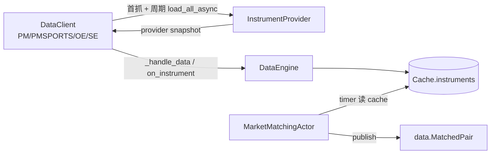

# Discovery 组件详细设计

> 设计理由 / 决策史(Q1/Q2/Q3/Q4/Q5/Q6/Q7/Q8/Q9)见初设 `refactor.md §5.1 / §5.2 / §6.3`。
> 冲突时:**有把握 → 以本文为准并回写;没把握 → 提出讨论,不擅自定**。
> 对应初设 Step 1(Provider)+ Step 2 周期发现。Step 2 已从 Refresher Actor 反转为 DataClient 原生 `_update_instruments`。

---

## 1. 职责与边界

| 件 | 基类 | 职责 |
|---|---|---|
| PM InstrumentProvider | 上游 `PolymarketInstrumentProvider` | **零代码**,配置即用(P1)。产出 `BinaryOption`(`info` 由上游 + 我们配置补 6-key) |
| PMSPORTS InstrumentProvider | 自写 `PolymarketSportsInstrumentProvider` | 公开 Gamma sports discovery → 每场一个 `.PMSPORTS` non-tradable synthetic event anchor,供 matching 做事件锚点 |
| OE InstrumentProvider | 自写 `OrbitExchInstrumentProvider(InstrumentProvider)` | Playwright 抓赛事(包 `OrbitExchScraper.discover_events`)→ 每场 ≥2 个 `BettingInstrument`(home/draw/away),`info` 填全 6-key |
| ~~InstrumentRefresher~~ **(退役,#59)** | — | **已退役**:周期发现迁回 DataClient 原生 `_update_instruments`(NT bybit/binance 范式)。详见 §3.3 + refactor.md §5.2.3/#59。 |
| 周期发现(#59) | PM/OE **DataClient** | `_connect` 首抓 + `_update_instruments(interval)` task 周期 `provider.load_all_async()` → `_send_all_instruments_to_data_engine()`(`_handle_data`→DataEngine→cache + `on_instrument`);interval 经 client config `update_instruments_interval_mins` |

PM WS 配置约束:`ArbConfig.venues.polymarket.ws_url` 的推荐值是上游 base URL `.../ws/`。为兼容旧 discovery / odds 订阅配置,dispatcher 接受旧 full endpoint `.../ws/market` / `.../ws/user` 并归一化后再交给 PM Data/Exec client。

最小下单元数据契约:PM 的 venue 最小值是 **share 数量 5**,写入 `BinaryOption.min_quantity`;OE 的 venue 最小值是 **stake 7 GBP**,但 adapter 外部 OE `quantity` 统一按 USD stake 解释,因此 Provider 写入 `BettingInstrument.min_notional = Money(7 * arbitrage.fx, USD)`。Risk 不另维护 venue 常量,只经 NT 父类读取 instrument 元数据。

**明确不做**:
- ⚠️ ~~DataClient 不拥有调度(归 Refresher,Q8)~~ **#59 反转**:Q8 的"调度归 Refresher"被验证为重造 NT 原生(refresher 3 个 bug 都是脱离原生路径的症状)→ **调度迁回 DataClient 原生**(refactor.md #58/#59)。
- ❌ 不为每个 Refresher 单独建子目录(P8;两个 venue 共用一个类,实例化时区分)
- ❌ 单 venue refresh 失败**不发**事件(Q4:matching 自然 gate,不需 sentinel)

---

## 2. 数据流



要点:
- 周期发现由各 DataClient 拥有,与 NT adapter 范式一致;普通异常只影响本轮,不得杀死后续周期 task。
- Matching 不再依赖 discovery 事件或 fresh window gate,而是 timer 读 cache + cache 非空 latch。

---

## 3. 接口设计

### 3.1 `InstrumentsRefreshed`(退役)

`InstrumentsRefreshed` 事件与 `InstrumentRefresher` Actor 已删除。当前 discovery 成功信号是 instruments 经 DataEngine 进入 cache;Matching 由 timer 主动读取 cache,不再订阅 discovery 事件。

### 3.2 `OrbitExchInstrumentProvider`(`nautilus_trader/adapters/orbitexch/providers.py`)

```python
class OrbitExchInstrumentProvider(InstrumentProvider):
    """包 OrbitExchScraper,每场赛事产出 home/draw/away 各一个 BettingInstrument,
    `info` 填 Q9 六统一 key:sport/competition/home_team/away_team/start_ts/selection_role。"""

    def __init__(
        self,
        scraper: OrbitExchScraper,
        config: InstrumentProviderConfig | None = None,
        *,
        sport_aliases: dict[str, str] | None = None,        # slice 7A:写 info 时规范化
        competition_aliases: dict[str, str] | None = None,
    ) -> None: ...
```

**`info` 6-key 映射**(MatchEvent → 每条腿):
| info key | 来源 |
|---|---|
| `sport` | `sport_aliases.get(event.sport, event.sport)` —— **slice 7A 规范化**(`"soccer"` → `"Soccer"`)|
| `competition` | `competition_aliases.get(event.competition, event.competition)` —— **slice 7A 规范化**(`"Men's Roland Garros 2026"` → `"ATP"`,#46) |
| `home_team` | `event.home_team` |
| `away_team` | `event.away_team` |
| `start_ts` | `OrbitExchDiscoveryClient.events_from_sport_details()` 从 `marketStartTime` / `event.openDate` 毫秒时间转 ns |
| `selection_role` | `"home"` / `"draw"` / `"away"`(由本腿对应的 selection_id 决定) |

> **#46 落实"Provider 填 info 时已 alias"假设**:normalizer 此前注释假设 Provider 已规范化 sport/competition,
> 但旧 Provider 不查 aliases。slice 7A 加 `sport_aliases` / `competition_aliases` 构造参,
> launcher 经 `ArbContext.sport_aliases_by_venue["ORBITEXCH"]` /
> `competition_aliases_by_venue["ORBITEXCH"]` 注入(由 `ArbConfig.matching` 派生)。

**OE competition 页懒加载处理(2026-06-29)**:`OrbitExchScraper` discovery 浏览器独立于 Data/Exec 登录浏览器,仍需在 `add_init_script`
中注入与赔率页一致的可见性欺骗:固定 `document.hidden=false` / `visibilityState="visible"` / `hasFocus()=true`,
并拦截 `IntersectionObserver` 让被观察元素立即以 `isIntersecting=true` 上报。否则 OE 未登录 competition 页首屏只渲染约 20 个
`role="row"`;注入后 Wimbledon competition live probe 从 20 行提升到 96 行。该逻辑只影响 discovery 页面渲染,不改变后续
`extract_matches()` 的 selector/字段提取规则。

> **PM 端市场发现 + 6-key(slice 7B → #55 series-based → #57 修发现链路)**:`ArbPolymarketInstrumentProvider(PolymarketInstrumentProvider)`
> **整体 override `load_all_async`**。撤掉 #53/#54 的 `_parse_instrument` enricher + upstream `event_slug_builder` 路径
> (ticker 拆队名对 3-way Yes/No 市场不成立);#55 改 series-based;#57 修"发现链路漏主赛事"。
> `PolymarketInstrumentProvider` 持有的 CLOB HTTP client 由 factory 统一构造为 `py_clob_client_v2.ClobClient`(#97);
> #98 起该 client 的 REST transport 显式使用 `venues.polymarket.proxy_url`(若配置/环境注入),避免 discovery/provider 读取与 WS 行情走不同出口;geoblock 只作为 PM Execution 真下单 preflight,不阻断 discovery/provider 只读市场发现;
> provider 使用的 `get_market` / `get_markets` / `get_order_book(s)` / `get_tick_size` / `get_neg_risk`
> 均在 v2 client surface 内,发现语义不变。
>
> 发现链路(每 competition 一次请求):
> 1. `GET /sports` → 每 competition:`sport`(如 `atp`)+ `series` id + **`ordering`**(home/away);按 `ArbContext.target_competitions_by_data_source["PMSPORTS"]` 过滤目标 competition。
> 2. `GET /events?series_id={id}&closed=false&active=true&limit=500` → **一次拉全本 series 的 H2H 比赛**(每 event **内嵌** `teams`+`markets`,含主赛事,无需二跳 `/events?id=`)。
>    - 旧版(#55)用 `/series/{id}` 只内嵌截断的 ~10 条 events → **漏主赛事**;默认 `limit=20` 是页面"懒加载"同源根因 → 调大即全量。
>    - **`series_slug` 不通用**:只 atp/wta 的 series slug 恰好 == league slug;足球/棒球查 == 0,故必须走 `/sports` 取 series **id**。
> 3. 每 event 筛 `markets` 内 `sportsMarketType == "moneyline"` 建 instrument(其余 tennis/soccer props 跳过)。
>
> 6-key:
> - **home/away 队名**:权威源 `event["teams"]`(`name`+`ordering`+`abbreviation`,列表顺序无关);缺则 fallback `_parse_team_names(title)`。
> - **selection_role**:
>   - 2-way / 单市场 3-outcome(`slug == ticker`):按 **competition `ordering`** 选映射 —— `home`→`[home,(draw),away]`;`away`→反排 `[away,(draw),home]`(如 MLB)。**不赌 outcomes 固定顺序**(MLB `ordering=away` 时 `[away,home]`,按固定下标会错位)。
>   - 3-way binary(`slug == ticker-{abbr}`):仅 `Yes` token;`abbr` 取自 `teams.abbreviation`;`-{home_abbr}`→home / `-{away_abbr}`→away / `-draw`→draw;其它(`No` token / 未知后缀)→ 跳过。
> - **sport**:`ArbContext.competition_to_sport_by_data_source["PMSPORTS"]` 查表(config 派生)。
> - **competition**:写 `info` 时经 `competition_aliases_by_venue["POLYMARKET"]` 标准化(matching `(sport,competition)` 分组键两边对齐:PM "atp" / OE 别名 → 同值)。**start_ts** 从 market/event `startDate` → ns。
>
> **关键 audit**:`tag_id=101232`(ATP tag)在 gamma `/events` 只返 5 个 outright winners;match-level H2H 在 **series**(`series_id=10365`)里;`/series/{id}` 内嵌 events 截断,`/events?series_id=&limit=N` 才全量。
> **性能**:单请求拿全(ATP ~70、足球 ~100,每 event 内嵌 markets),无 per-event 二跳。launcher `timeout_connection` 现为 180s(初次 load + OE 登录 + 启动对账窗口);#53 曾从 20s 提到 120s,后随 #105 reconciliation 接入统一到 180s。
> **交易最小值**:Gamma/CLOB 归一化字段 `minimum_order_size` 是 PM limit order 的最小 share 数,Provider 产出的 `BinaryOption.min_quantity` 必须填该值(当前默认/实盘为 5),使 NT RiskEngine 能在本地拒绝 `quantity < 5` 的 PM 订单。

**PMSPORTS event anchor discovery(#127,已落地 slice B)**:
`PolymarketSportsInstrumentProvider` 复用同一组公开 Gamma discovery 目标(`ArbContext.target_competitions_by_data_source["PMSPORTS"]`,
`competition_to_sport_by_data_source["PMSPORTS"]`,competition aliases),但每个 `event["gameId"]` 只产一条 `.PMSPORTS`
synthetic `BettingInstrument`:
- `venue=PMSPORTS`, `market_type=EVENT_ANCHOR`, `selection_name="event"`。
- `info` 填 Q9 6-key + `game_id` + `tradable=False` + `anchor=True`。
- 不解析 PM token / outcome / order size,不产出可交易腿;PM 可交易腿仍由 `ArbPolymarketInstrumentProvider`
  产出 `.POLYMARKET`。
- `PolymarketSportsDataClient._connect` 首轮 load 后 `_handle_data` 灌 cache,并按
  `update_instruments_interval_mins` 周期重抓;单轮普通异常只 warning,下轮继续。

### 3.3 周期发现:DataClient 原生 `_update_instruments`(#59;替代退役的 `InstrumentRefresher`)

**#59(slice A)**:`InstrumentRefresher` Actor **已退役** —— 它实为从零重造 NT 原生 `DataClient._update_instruments`(bybit/binance 范式),且本会话 3 个 bug(pending-task / cache 桥接缺失 / topic 通配)皆脱离原生路径的症状。周期发现迁回 DataClient:

- **PM**(上游 `PolymarketDataClient` 已自带 `_update_instruments`):`_connect` → `initialize()` + `_send_all_instruments_to_data_engine()`;周期 task `initialize(reload=True)` + `_send_all`。**前提**:arb factory 强制 `instrument_config.load_all=True`(否则 `initialize` 走 "No loading configured" 加载 0;Gap α,refactor.md #59)。
- **PMSPORTS**(`adapters/polymarket/sports.py`,#127):`_connect` → `PolymarketSportsInstrumentProvider.load_all_async()` + `_send_all_instruments_to_data_engine()`;周期 task 直调 provider `load_all_async()`。WS firehose 与 discovery 同属 data-only client,但 synthetic anchors 不接 order book 订阅。
- **OE/SE**(`adapters/{orbitexch,sharpexch}/data.py`):`_send_all_instruments_to_data_engine()`(`provider.get_all()`→`_handle_data`)+ `_update_instruments(interval)` task(**直调 `load_all_async`**,Gap-α-proof)+ `_connect` 首抓 + `_disconnect` cancel;config `update_instruments_interval_mins`(默认 60)。OE/SE discovery 同构(2026-07-10 OE 对齐 SE):不创建页面、不登录、不导航、不持锁,只等待共享 BrowserContext 中的 `CSRF-TOKEN`(由 execution 登录写入,最长等 `config.page_timeout`)后用 context request API 请求 `sport/details`;启动首轮若 CSRF 尚未出现,记录 warning 并保留周期 task 等下一轮。
- **单轮失败语义(2026-06-29 overnight 修;SE 2026-07-10 对齐)**:周期发现 task 每轮单独 catch 普通异常并继续下一轮;断网 / DNS / Playwright `goto` / SE CSRF 暂未就绪等临时失败只损失本轮 rediscovery,不得杀死整个 `_update_instruments` task。`CancelledError` 仍表示组件 stop,正常退出。这个容错只覆盖 instrument rediscovery;行情 WS/competition 页恢复仍归 data §3.1 的 WS handler/reload 机制。
- **灌 cache 路径**:`_handle_data(inst)` → DataEngine `_handle_instrument` → `cache.add_instrument` **且** 通知 `on_instrument` 订阅者(原生,替代旧 refresher 裸 `cache.add_instrument`)。
- `InstrumentsRefreshed` 事件 + matching 的事件触发**一并退役**(matching 改自 timer,§matching §3.3/§4.4)。Q3/Q6 的运行时改 interval + 持久化**迁移中降级**(按需经 client config 恢复)。

**Provider 共享机制**:Provider 实例仍由对应 Data factory 构造并回写 `ArbContext.instrument_provider_by_venue`,供测试/观测/后续 adapter 迁移使用;不再供 Refresher 消费。落地:
- PM `ArbPolymarketLiveDataClientFactory.create` + OE `OrbitExchLiveDataClientFactory.create` 构造完 Provider 后**只回写** `instrument_provider_by_venue["POLYMARKET"|"ORBITEXCH"]`。SE 在 `venues.sharpexch.enabled=true` 时由 `SharpExchLiveDataClientFactory` 同形回写 `instrument_provider_by_venue["SHARPEXCH"]`。PM/PMSPORTS targets、OE/SE discovery config 与 aliases 均从 keyed map 读取,不存在 `ctx.pm_*` / `ctx.oe_*` / `ctx.se_*` 兼容兜底。
- launcher `add_actors` 在 `node.build()` 之后构造 Matching / Strategy / optional WebGateway;InstrumentRefresher 已退役,不会再从 `ArbContext` 读取 provider 构造 Refresher。Provider 回写只作为运行时共享/测试/后续 adapter 迁移入口保留;browser manager 等 discovery 共享件通过 `ctx_map_get_or_create` 写入 keyed map(discovery 不再使用 browser lock);SE runtime 为显式 opt-in,默认 PM/OE discovery 流程不变。
- **provider 缺失场景**(discovery 禁用 / fallback `InstrumentProvider()`):对应 DataClient 不产生该 venue instruments;Matching 由 cache 非空 latch 自然跳过。

### 3.4 消息接线

| 类 | 接收 | 发布 |
|---|---|---|
| PM/PMSPORTS/OE/SE DataClient | client config + venue/data-source keyed context | instruments 经 DataEngine 入 cache;行情/体育状态按各自 Data 类型发布 |
| `MatchingActor`(§matching) | NT clock timer + cache instruments + `data.SportsGameUpdate*` ended 事件 | `data:MatchedPair` / `MatchedPairRemoved` |

---

## 4. 算法

### 4.1 OE 腿构造(`_build_legs`)

对每个 `MatchEvent`,**有 selection_id 的方向才产出腿**(没 draw 时 OE 不给 draw_selection_id):
```
for role, sel_id in [("home", event.home_selection_id),
                     ("draw", event.draw_selection_id),
                     ("away", event.away_selection_id)]:
    if sel_id:
        yield BettingInstrument(
            venue_name="ORBITEXCH",
            market_id=event.market_id,
            selection_id=int(sel_id),
            ...上游必填字段...,
            currency="USD",
            min_notional=Money(Decimal("7") * Decimal(str(fx)), USD),  # OE 最小 stake 的 USD 数值
            info={"sport": ..., "competition": ..., "home_team": ..., "away_team": ...,
                  "start_ts": 0, "selection_role": role},
        )
```

OE 的 `quantity` 在 adapter 外部表示 **USD stake**;`BettingInstrument.notional_value(quantity, price)` 只做数值比较,不会做货币换算。因此最小 stake 7 GBP 在 provider 中按当前 `arbitrage.fx` 写成 `min_notional = Money(7 * fx, USD)`,由 NT `_check_orders_risk_for_account` 拦截;不额外在 Risk 组件维护 `MIN_SIZE_ORBITEXCH`。若 Web 热改 `fx`,执行/余额边界会即时生效;已入 cache 的 instrument 最小值随下一轮 OE discovery 重建刷新。

### 4.2 周期循环(对齐 §6.8.4.5 同节奏)

- NT `Clock.set_time_alert_ns` 自重排 one-shot alert,callback `try/finally`:try 跑 `load_all_async + publish`,finally 按当前 `_interval` 重排;异常路径也重排(不卡死)。
- `trigger_now()`:外部立即触发(预留;现不需要)。

### 4.3 失败语义(Q4)

`load_all_async` 抛异常 → log + **不 publish**;0 instrument → 也不 publish(`MatchingActor` 看 venue 长时无事件即 gate);连续失败由健康检查体系(execution §4.3 的页面 reload 机制)兜底,与 Refresher 本身无关。

---

## 5. 与横切的咬合

| 横切 | 约束 |
|---|---|
| Q9 六统一 key | Provider 层硬契约:OE 实现 + PM post-processor 都必须填全;matching 只读不写 |
| §6.10 同步 | discovery 周期与 execution 无关,不接 `_execution_active` |
| §6.3 NT 持久化 | 周期发现 interval 走 DataClient config;不再通过 Refresher `on_save/on_load` 热持久化 |
| P8 目录 | `src/arbitrage/discovery/` 只保留 discovery capability 公共入口;具体 Provider/DataClient 归各 adapter |

---

## 6. 时序:一轮 refresh

```mermaid
sequenceDiagram
  participant DC as DataClient
  participant PV as Provider(OE/PM)
  participant DE as DataEngine
  participant CA as Cache
  participant MM as MarketMatchingActor
  participant MB as MessageBus

  DC->>PV: await load_all_async()
  alt 成功
    DC->>DE: _handle_data(instrument) × N
    DE->>CA: cache.add_instrument + on_instrument
  else 普通异常
    DC->>DC: warning;下一轮继续
  end
  MM->>CA: timer 读 cache
  MM->>MB: publish MatchedPair/MatchedPairRemoved
```

---

## 7. 落地清单(Step 1/2 调度)

- [x] `OrbitExchInstrumentProvider`:`load_all_async` 包 `OrbitExchDiscoveryClient`,`_build_legs` 填 info 6-key;`start_ts` 由 `sport/details` 的 `marketStartTime` / `event.openDate` 解析(`nautilus_trader/adapters/orbitexch/{discovery_client.py,providers.py}`)
- [x] `PolymarketSportsInstrumentProvider`:公开 Gamma discovery 产出 `.PMSPORTS` non-tradable synthetic event anchor(`tests/arbitrage/adapters/polymarket/test_sports.py`)
- [x] PM/PMSPORTS/OE/SE 周期发现迁入各 DataClient 原生 `_update_instruments`;Matching timer 读 cache,不订 `InstrumentsRefreshed`
- [x] PM info 6-key 由 `ArbPolymarketInstrumentProvider` series-based discovery 注入
- [ ] /live-test 或上层 e2e 验:DataClient 原生发现 → cache → matching timer → MatchedPair 全节点链路

> **未决/讨论**:MatchingActor 启动初 cache 为空时如何在 Web 上展示 discovery pending 状态;`start_ts` 是否继续作为 matching 过期过滤字段,还是完全交给 PMSPORTS ended eviction。
