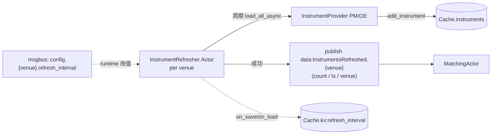
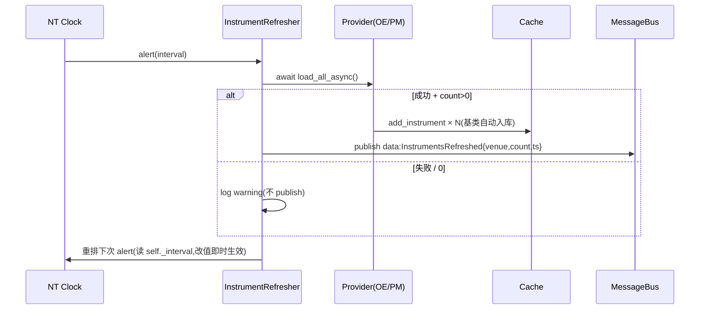

# Discovery 组件详细设计

> 设计理由 / 决策史(Q1/Q2/Q3/Q4/Q5/Q6/Q7/Q8/Q9)见初设 `refactor.md §5.1 / §5.2 / §6.3`。
> 冲突时:**有把握 → 以本文为准并回写;没把握 → 提出讨论,不擅自定**。
> 对应初设 Step 1(Provider)+ Step 2 调度(Refresher)。

---

## 1. 职责与边界

| 件 | 基类 | 职责 |
|---|---|---|
| PM InstrumentProvider | 上游 `PolymarketInstrumentProvider` | **零代码**,配置即用(P1)。产出 `BinaryOption`(`info` 由上游 + 我们配置补 6-key) |
| OE InstrumentProvider | 自写 `OrbitExchInstrumentProvider(InstrumentProvider)` | Playwright 抓赛事(包 `OrbitExchScraper.discover_events`)→ 每场 ≥2 个 `BettingInstrument`(home/draw/away),`info` 填全 6-key |
| InstrumentRefresher | NT `Actor`,每 venue 一个 | 周期调 `provider.load_all_async()` → instrument 入 Cache → publish `InstrumentsRefreshed.{venue}`;`refresh_interval` 经 NT `on_save/on_load` 持久化 + msgbus `config.{venue}.refresh_interval` 命令运行时改值 |

**明确不做**:
- ❌ DataClient 不拥有调度 / 不持 `refresh_interval`(归 Refresher,Q8)
- ❌ 不为每个 Refresher 单独建子目录(P8;两个 venue 共用一个类,实例化时区分)
- ❌ 单 venue refresh 失败**不发**事件(Q4:matching 自然 gate,不需 sentinel)

---

## 2. 数据流



要点:
- **失败不发事件**(Q4):Refresher 单轮 `load_all_async` 抛 / 0 instrument → log + 不 publish → MatchingActor 失去本轮触发(2×interval 窗口外即 gate)。
- **provider.add_instrument** 是 NT `InstrumentProvider` 基类自带,内部走 NT 标准入 cache 路径(下游 DataEngine / Strategy / Risk 经 cache 透明读)。

---

## 3. 接口设计

### 3.1 `InstrumentsRefreshed`(事件,`src/arbitrage/discovery/events.py`)

NT `@customdataclass` 注册的 Data 子类(可走 NT msgbus + 持久化通路):

```python
@customdataclass
class InstrumentsRefreshed:
    venue: str            # "POLYMARKET" / "ORBITEXCH"(消费方按 venue gate)
    count: int            # 本轮成功落库的 instrument 数(0 时不应被 publish)
    ts_event: int         # 本轮完成时间(ns)
    ts_init: int          # NT 标准字段
```

### 3.2 `OrbitExchInstrumentProvider`(`nautilus_trader/adapters/orbitexch/providers.py`)

```python
class OrbitExchInstrumentProvider(InstrumentProvider):
    """包 OrbitExchScraper,每场赛事产出 home/draw/away 各一个 BettingInstrument,
    `info` 填 Q9 六统一 key:sport/competition/home_team/away_team/start_ts/selection_role。"""

    def __init__(self, scraper: OrbitExchScraper, config: InstrumentProviderConfig | None = None): ...

    async def load_all_async(self, filters: dict | None = None) -> None:
        events = await self._scraper.discover_events()
        for ev in events:
            for instrument in self._build_legs(ev):
                self.add(instrument)   # 基类 add → cache 入库

    def _build_legs(self, event: MatchEvent) -> list[BettingInstrument]:
        """每方向一条腿(home / draw 可选 / away)。Q1 InstrumentId 形如
        `{market_id}-{selection_id}.ORBITEXCH`。`start_ts` Step 1 待 scraper 补足 → 暂 0。"""
        ...
```

**`info` 6-key 映射**(MatchEvent → 每条腿):
| info key | 来源 |
|---|---|
| `sport` | `event.sport` |
| `competition` | `event.competition`(= pair_id,risk/strategy 聚合键) |
| `home_team` | `event.home_team` |
| `away_team` | `event.away_team` |
| `start_ts` | **0(暂)**;待 scraper DOM 提取赛事开赛时间 |
| `selection_role` | `"home"` / `"draw"` / `"away"`(由本腿对应的 selection_id 决定) |

> **PM 端**:上游 `PolymarketInstrumentProvider` 不写 info["competition"/"market_type"]——这些是套利领域 key。**launcher 在 provider 注入后挂一层 post-processor**(或子类化 upstream provider 重载 `_parse_instrument`),给每个 `BinaryOption.info` 补全 6-key,具体接线点 Step 1 启动时定。

### 3.3 `InstrumentRefresher`(`src/arbitrage/discovery/refresher.py`)

```python
class InstrumentRefresher(Actor):
    def __init__(self, config: InstrumentRefresherConfig): ...
    # NT Actor 生命周期
    def on_start(self): self._schedule_first()
    def on_stop(self): self._cancel_loop()
    # 周期循环(NT clock 自重排,§6.8.4.5 同节奏)
    async def _tick(self) -> None: ...
    # 持久化(Q3/Q6)
    def on_save(self) -> dict[bytes, bytes]: return {b"refresh_interval": str(self._interval).encode()}
    def on_load(self, state: dict[bytes, bytes]) -> None: ...
    # 运行时改值(msgbus 命令)
    def _on_config_command(self, msg) -> None: ...   # 订 config.{venue}.refresh_interval
```

**`InstrumentRefresherConfig`**:`venue`, `provider`(注入,Provider 实例由 factory 提供), `refresh_interval_default`(secs,默认 30), `min_interval`(secs,默认 5,运行时改值下界)。

### 3.4 消息接线

| 类 | 接收 | 发布 |
|---|---|---|
| `InstrumentRefresher` | `config.{venue}.refresh_interval` 命令(运行时改值) | `data:InstrumentsRefreshed`(成功后) |
| `MatchingActor`(§matching) | `data:InstrumentsRefreshed`(两 venue 都订) | `data:MatchedPair` |

---

## 4. 算法

### 4.1 OE 腿构造(`_build_legs`)

对每个 `MatchEvent`,**有 selection_id 的方向才产出腿**(没 draw 时 OE 不给 draw_selection_id):
```
for role, sel_id in [("home", event.home_selection_id),
                     ("draw", event.draw_selection_id),
                     ("away", event.away_selection_id)]:
    if sel_id:
        yield BettingInstrument(
            venue_name="ORBITEXCH",
            market_id=event.market_id,
            selection_id=int(sel_id),
            ...上游必填字段...,
            info={"sport": ..., "competition": ..., "home_team": ..., "away_team": ...,
                  "start_ts": 0, "selection_role": role},
        )
```

### 4.2 周期循环(对齐 §6.8.4.5 同节奏)

- NT `Clock.set_time_alert_ns` 自重排 one-shot alert,callback `try/finally`:try 跑 `load_all_async + publish`,finally 按当前 `_interval` 重排;异常路径也重排(不卡死)。
- `trigger_now()`:外部立即触发(预留;现不需要)。

### 4.3 失败语义(Q4)

`load_all_async` 抛异常 → log + **不 publish**;0 instrument → 也不 publish(`MatchingActor` 看 venue 长时无事件即 gate);连续失败由健康检查体系(execution §4.3 的页面 reload 机制)兜底,与 Refresher 本身无关。

---

## 5. 与横切的咬合

| 横切 | 约束 |
|---|---|
| Q9 六统一 key | Provider 层硬契约:OE 实现 + PM post-processor 都必须填全;matching 只读不写 |
| §6.10 同步 | Refresher tick 与 execution 无关,不接 `_execution_active` |
| §6.3 NT 持久化 | `on_save/on_load` 走 `CacheDatabaseAdapter`(Redis backing)→ refresh_interval 跨重启保留 |
| P8 目录 | `src/arbitrage/discovery/` 装 Provider + Refresher + events;不再为单 Actor 单建子目录 |

---

## 6. 时序:一轮 refresh



---

## 7. 落地清单(Step 1/2 调度)

- [x] `InstrumentsRefreshed` Data 类(`@customdataclass` from `model.custom`)+ 测构造/字段(`src/arbitrage/discovery/events.py`,3 passed)
- [x] `OrbitExchInstrumentProvider`:`load_all_async` 包 scraper、`_build_legs` 填 info 6-key(start_ts=0 标 TODO)(`nautilus_trader/adapters/orbitexch/providers.py`,6 passed)
- [x] `InstrumentRefresher` Actor:周期 NT clock 自重排 + try/finally + on_save/on_load + `config.{venue}.refresh_interval` 命令运行时改值 + Q4 静默失败(`src/arbitrage/discovery/refresher.py`,11 passed)
- [ ] PM info 6-key post-processor(或上游 provider 子类)接线点 —— launcher 层,Step 1/2 全链路启动时定
- [ ] **Step 1 待补**:scraper DOM 提取 `start_ts`(否则 matching 无法用时间窗过滤过期赛事)
- [ ] /live-test 验:OE Provider 真抓(browser/page);双 venue Refresher 在 TradingNode 内并行;`InstrumentsRefreshed` msgbus 全链路被 MatchingActor 收到

> **未决/讨论**:启动顺序(Refresher 首轮同步等 vs 异步等;MatchingActor 启动初无 InstrumentsRefreshed 时如何展示);PM info 6-key 注入方式(post-processor vs 子类化)—— Step 1 启动时定。
