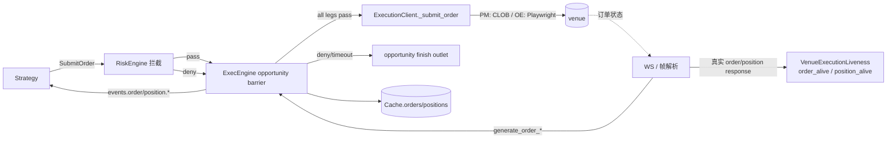
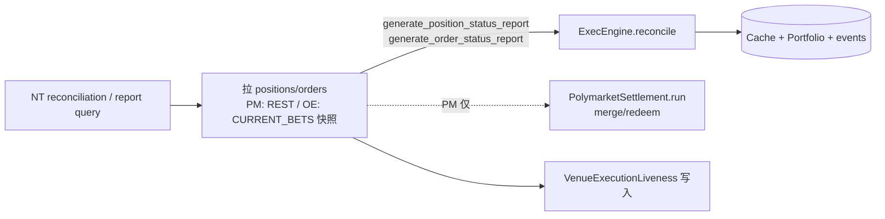
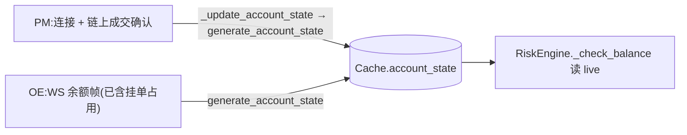
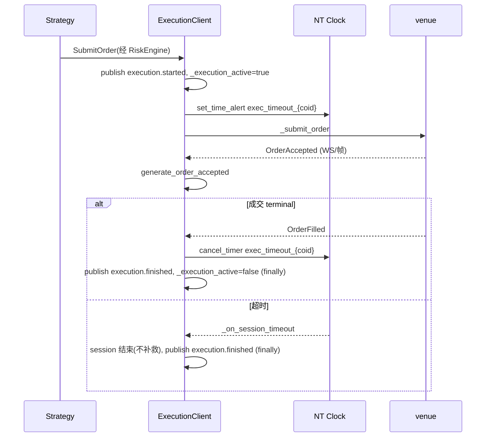
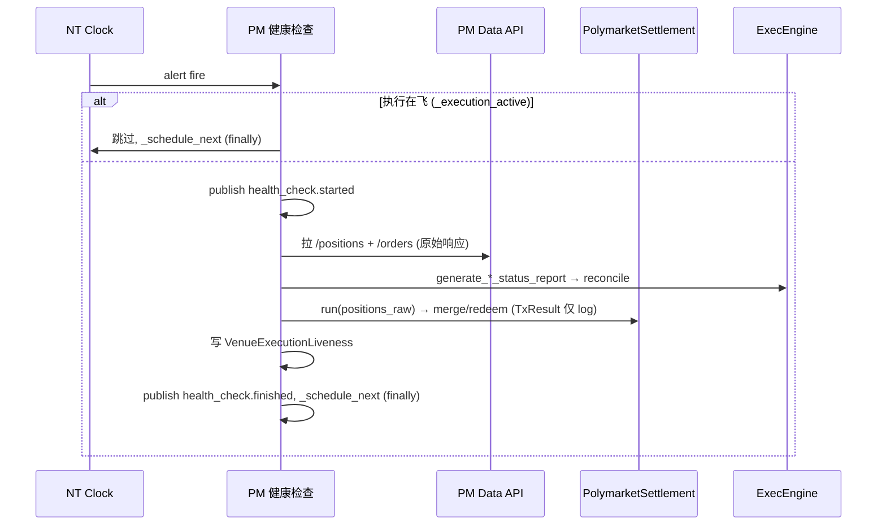

# Execution 组件详细设计

> **定位**:详细设计,面向代码落地。设计理由/历史见初设 `refactor.md §5.5 / §5.8 / §6.8`(Q13/Q15/Q17/Q18/Q19)。
> 冲突时:**有把握 → 以本文为准并回写 `refactor.md` 修订记录;没把握 → 提出讨论,不擅自定**。
> 对应初设 Step 5 + merge/claim(§5.8)+ 健康检查(§6.8)。

---

## 1. 职责与边界

| 组件 | 基类 | 职责 |
|---|---|---|
| **ArbLiveExecutionEngine** | NT `LiveExecutionEngine` 薄子类 | opportunity execution barrier:Risk pass 后暂存同机会 legs,等齐/deny/timeout 后决定 release 或 zero-session finish;统一释放 `pair_inflight` |
| **PM ExecutionClient** | 上游 `PolymarketExecutionClient` **薄子类** | 订单 IO(CLOB,上游现成)+ 账户状态(事件驱动)+ reconcile reports + **PM 健康检查**(report 对账 + merge/redeem settlement)+ `VenueExecutionLiveness` 写入 |
| **OE ExecutionClient** | 自写 `LiveExecutionClient` | 订单 IO(Playwright 提交)+ **订单帧解析**(现 stub→实写)+ 账户状态(WS 余额帧)+ reconcile reports + `VenueExecutionLiveness` 写入 |
| `PolymarketSettlement` | 普通类 | merge/redeem 编排(被 PM 健康检查调用,见 §4.6) |

**单一职责契约(Q13)**:execution = **执行 + 追踪**,不做决策。一次 session 单一职责;**移除内部 recovery loop**;补救 / 撤后再下 / 单腿失败补偿 **全归 Strategy**。

**执行健康归属**:order/position 真相可信度由各 venue ExecutionClient / NT reconciliation 写入 `VenueExecutionLiveness`;Risk 读取并门控。OE DataClient 只负责 competition 页行情健康,不再 reload execution 页。

**不做**:recovery / re-plan / retry;裸单补救;跨腿对冲。

---

## 2. 数据流

### 2.1 下单 + 回写



### 2.2 Reconcile / report(走 NT report 通路,§4.3bis)



### 2.3 账户状态维护


> 健康检查**不拉余额**(Q17):PM 完全靠事件、OE 完全靠 WS。可用余额由 RiskEngine 按 venue 非对称自算(详见 risk 文档)。

---

## 3. 接口设计

### 3.1 PM ExecutionClient(`adapters/polymarket/execution.py` 薄子类)

上游 `PolymarketExecutionClient` **已实现**(直接用):`_submit_order`/`_cancel_order`/`_modify_order`(`py_clob_client_v2` 签名 + CLOB L2)、`generate_order_*`(WS USER channel 回写)、`_update_account_state`、`generate_order_status_reports`/`generate_position_status_reports`。

**PM CLOB SDK 约束(#97,已落地 / 待 live 复验)**:2026-06-10 NT live probe 中,旧 `py_clob_client` 虽可本地签名,但 POST `/order` 被 PM API 拒绝为 `invalid order version, please use the latest clob-client`;官方文档当前以 `py_clob_client_v2` / `@polymarket/clob-client-v2` 为下单、撤单、查询 L2 client。项目 PM adapter 主 HTTP client 因此统一由 `get_polymarket_http_client()` 构造 `py_clob_client_v2.ClobClient`。关键 v2 差异:
- `generate_order_status_reports` 调 `get_open_orders(...)`,不再调旧 `get_orders(...)`。
- 单笔撤单调 `cancel_order(OrderPayload(orderID=...))`。
- 批量撤单调 `cancel_orders(order_hashes)`。
- 市场撤单调 `cancel_market_orders(OrderMarketCancelParams(...))`。
- 下单仍走两步 `create_order/create_market_order` → `post_order/post_orders`,并使用 v2 `PostOrdersArgs`。

该约束由 `tests/arbitrage/execution/test_polymarket_client.py::test_polymarket_execution_uses_py_clob_client_v2_surface` 锁定;下一次 PM cancel-only live 验收必须先看到 `orderID` / `venue_order_id` 落 cache,再继续验证下一轮 cancel-only。

**PM cancel REST 回写约束(#99/#113,已落地)**:CLOB cancel 成功响应形如 `{"canceled":[order_id], "not_canceled":{}}`;该 REST 响应本身就是撤单确认,必须立即 `generate_order_canceled` 写回 NT cache / session terminal,不能只等 USER WS cancellation。`not_canceled` 中的失败原因仍走 `_generate_cancel_event` → `generate_order_cancel_rejected`,其中 `"already canceled or matched"` 保持既有抑制语义(等待 WS/成交事件给出正确终态)。REST 与 USER WS 都可能回报同一撤单终态,两侧都必须幂等:① cache 当前 `order.status == CANCELED` 时跳过;② cache 尚未 apply 第一条 `OrderCanceled`、但同一 `client_order_id` 的 cancel terminal 已由 PM client 发出时,用有界 `_cancel_terminal_client_ids` 窗口跳过第二条,避免向 NT 重放 `CANCELED -> CANCELED`。覆盖范围:单笔 `_cancel_order`、deferred cancel、批量 `_batch_cancel_orders`、`_cancel_all_orders`、USER WS cancellation;全局/market cancel 仍是 fire-and-forget 日志路径。

**PM CLOB REST 路由 / geoblock 约束(#98,已落地 / JP 误拦已修正)**:`get_polymarket_http_client()` 必须把 `PolymarketExecClientConfig.proxy_url` 接到 `py_clob_client_v2` 的共享 `httpx.Client`,并在显式 `proxy_url` 存在时关闭环境代理继承(`trust_env=False`)。原因:PM WS 由 NT pyo3 client 显式吃 `proxy_url`,而 v2 CLOB REST SDK 默认读进程 `HTTP_PROXY/HTTPS_PROXY`;若两者走不同出口,会出现"PM/OE WS 正常、PM REST 下单 / open-orders reset 或 timeout"。`PolymarketExecutionClient._connect` 在真连接前按官方 `https://polymarket.com/api/geoblock` 做只读 preflight,但不能把 `blocked=true` 一刀切解释为 API 禁止:官方文档列 `JP` 为 `Frontend UI restricted`(API 本身不受限),因此 JP 只记录 geoblock 响应并继续;`AU/US/...` API-blocked、`PL/SG/TH/TW` close-only、以及 CA/ON、UA 指定地区仍 fail fast,不进入真实下单。launcher 的 `--preflight-polymarket` 还会用同一路由跑 CLOB `get_server_time()` + authenticated `get_open_orders()` + `get_balance_allowance()` 三个只读检查;余额为 0 或 v2 SDK transport 失败时返回 2 并打印单行错误,用于提前暴露 proxy wallet 常见的 `signature_type` 配错或代理链路不可用。2026-06-10 JP 出口实测 `server_time` 可读、`open_order_count=0`、`balance=67.916080 USDC.e`。

WS 接线约束:上游 `PolymarketWebSocketClient` 要求 `base_url_ws=.../ws/`,内部按 USER channel 拼接 `user`;项目 dispatcher 兼容旧 `.../ws/market` / `.../ws/user` 配置并统一归一化。否则 ExecClient user WS 会误连 `.../ws/marketuser`。

**PM 持仓成本映射约束(#100,已落地)**:`generate_position_status_reports` 的数据源是 PM Data API `/positions`。该接口返回的是按 token 聚合后的当前持仓,其中 `size` 是 share 数量,`avgPrice`/`avg_price` 是平均开仓成本。翻译成 NT 通用 `PositionStatusReport` 时必须同时填 `quantity` 与 `avg_px_open`;若 Data API 未返回平均成本,`avg_px_open` 保持 `None`(未知),不得在 strategy/risk 侧用当前盘口估算或把未知成本当 0。这样 `ArbitragePortfolio.outcome_exposures/outcome_shares` 与 `mean_rebate_recovery` 继续只读 NT cache position,成本权威仍在 execution adapter 的 venue report 翻译层。

**套利子类新增**:
```python
class ArbPolymarketExecutionClient(PolymarketExecutionClient):
    def __init__(...):
        self._settlement = PolymarketSettlement(contract_service, ...)   # §4.6
        self._venue_liveness = VenueExecutionLiveness                    # 由 ArbContext 注入
    async def generate_order_status_reports(...): ...     # super + mark_order_alive/dead
    async def generate_position_status_reports(...): ...  # super + mark_position_alive/dead
    async def _run_health_check(...): ...                 # PM positions fetcher + settlement + position_alive
```

### 3.2 OE ExecutionClient(`adapters/orbitexch/execution.py` 自写)

```python
class OrbitExchExecutionClient(LiveExecutionClient):
    # NT 契约(自写,Playwright 经 manager.get_page("execution"))
    async def _submit_order(self, command: SubmitOrder) -> None: ...
    async def _cancel_order(self, command: CancelOrder) -> None: ...
    async def _modify_order(self, command: ModifyOrder) -> None: ...
    # reconcile
    async def generate_order_status_reports(...) -> list[OrderStatusReport]: ...
    async def generate_position_status_reports(...) -> list[PositionStatusReport]: ...
    # `general` 频道帧解析(2026-05-22 实测抓帧锁定,见下)
    def _on_general_frame(self, msg): ...   # parser.parse_general_frame → 按 type 分派
    def _on_balance_frame(self, parsed): ...          # type=balance → generate_account_state
    def _on_current_bets_frame(self, parsed): ...     # type=current_bets → generate_order_*/reports
```

**OE `general` 频道帧格式(2026-05-22 实测,`message_parser.parse_general_frame` 已实现 + 测试)**:
- 同一个 `general` WS(SockJS,下行 `a[...]`)承载**多类帧,按顶层 key 分型**,未知 key 忽略。`OrbitExchExecutionClient` 构造 handler 时必须传入自身 logger,使 `OE WS connected` / `OE WS first frame received` 进入 NT node 日志;这用于区分 general WS 未捕获、捕获但无下行、下行已到但解析/回调未生效。
  - `{"BALANCE":{"balance":"37.49","avBalance":null}}` → 账户余额(`balance` 是**字符串**;WS 侧**已含挂单占用**,RiskEngine 不再减,Q17)→ `generate_account_state`。
  - `{"CURRENT_BETS":[<bet>,...]}` → 当前注单 → `generate_order_*` / position report。
- payload 兼容:真实 general 帧可能出现顶层 key 下再包一层 JSON 字符串(`{"BALANCE":"{\"balance\":\"37.49\"}"}` / `{"CURRENT_BETS":"[...]"}`);parser 先解嵌套 JSON,再校验 `BALANCE` 必须是 dict、`CURRENT_BETS` 必须是 list,非 dict bet item 过滤,避免 `Order callback error: 'str' object has no attribute 'get'`。
- 上行订阅请求 `["{\"BALANCE\":{\"subscribe\":true,...}}"]`(无 `a`、无数据)。
- **已确认**:帧 envelope + 分型 + BALANCE schema + nested JSON string payload 兼容(`tests/arbitrage/adapters/orbitexch/test_ws_general_frames.py`)。
- **`CURRENT_BETS` 单 bet item schema —— 2026-06-06 live 抓帧实测确认**(place_and_cancel 真单 live 时 odds_client 抓到):
  ```
  {"offerId":"221832455","selectionId":"19924823","averagePrice":0.0,"profitNet":"0.00","liability":"0.00"}
  ```
  - **修正旧假设**:订单 join key 是 **`offerId`(== NT order 的 `venue_order_id`**,executor 下单时从响应 `offerIds` map 写入),**不是** `marketId`(`marketId` 是分组键)。
  - **完整字段(权威来源 = 老 `orchestrator`/`tracker`/`odds_client` 实读,非精选 debug log)**:`offerId`/`marketId`/`selectionId`/**`side`(BACK/LAY)**/**`sizePlaced`(原始量)**/`sizeRemaining`(>0 → working)/`sizeMatched`(累积成交,>0 → position)/`averagePrice`/`price`/`placedDate`/`profitNet`/`liability`。⚠️ 早先误判"bet 无 side"(只看了 odds_client 那条**精选 5 字段** debug log)——实际 bet **自带 `side`/`sizePlaced`**,reconcile 可直接用、无需反查 NT order(支持外部/重启单)。**字段语义单一真理源 = 老代码**;exec 侧 `current_bets_to_fills`/`bet_order_progress` 复用语义、产 NT 事件/report。
  - **仅 unmatched 态已实测**;**matched 态填充值**(sizeMatched>0/averagePrice>0)待**真成交**确认([[gap_c_oe_exec_live_validated]])。
```python
# (上方 OrbitExchExecutionClient 续)
```

### 3.3 消息接线(订阅 / 发布)

| 方向 | 内容 |
|---|---|
| **接收**(NT 管道路由) | `SubmitOrder` / `SubmitOrderList` / `CancelOrder` / `ModifyOrder` |
| **接收**(订阅 topic) | `execution.*` 镜像不需要(自己是发起方);健康检查订 `execution.*` 以让路(见 §3.4) |
| **发布**(NT 标准) | `generate_order_*` → `events.order.{strategy_id}`;`generate_account_state` → `AccountState`;reconcile 经 ExecEngine 发 `events.position.*` |
| **发布**(同步,§6.10) | session:`execution.started`(submit 时)/ `execution.finished`(terminal/timeout);PM 健康检查:`health_check.started/finished` |

### 3.4 同步参与(Q19 / §6.10,详见 `_cross-cutting`)

- **execution session**:submit 时 publish `execution.started` + 置 `_execution_active`(首个 await 前同步);terminal **或** timeout 时 publish `execution.finished` + 清(放 `finally`,两条路径都清,防健康检查永久饿死)。
- **PM 健康检查 tick**:开头 `if _execution_active: 跳过`;否则 publish `health_check.started`→ 跑 → `finally` publish `health_check.finished`。
- 单 asyncio loop 串行,置位/清位纪律见 §6.10。

### 3.5 `ArbLiveExecutionEngine` opportunity barrier(已落地代码,待 live 验证)

> 横切协议真理源见 `_cross-cutting/synchronization.md §8.4bis`;本节只写 execution 侧接口和出口。

`ArbLiveExecutionEngine` 通过 `bootstrap.install_arbitrage_engines()` 替换 `nautilus_trader.system.kernel.LiveExecutionEngine`,方式同 `ArbitrageLiveRiskEngine`。该类不改 NT `SubmitOrderList` 语义,只在单条 `SubmitOrder` 经过 Risk pass 回到 `ExecEngine.execute` 时检查 opportunity metadata。metadata 解析复用 `src/arbitrage/common/opportunity.py`。

**输入**:
- `ExecEngine.execute(SubmitOrder)`:Risk pass 后的真实腿;若 order 无 `arb:opportunity_id`,直接 `super()._execute_command(command)`。
- `risk.opportunity.leg_denied`:Risk deny 的领域消息;Execution barrier 以该消息关闭对应 opportunity。
- NT clock alert:`arb_opp_timeout:{opportunity_id}`。

**context 字段**:

| 字段 | 含义 |
|---|---|
| `opportunity_id` | 本轮机会 ID |
| `pair_id` | 用于 finish outlet 释放 `PairInFlightGate` |
| `expected_legs` | 应收齐的真实腿 key 集合 |
| `allowed` | `leg_key -> SubmitOrder`,尚未 release 到 venue |
| `terminal` | `None` / `denied` / `timeout` / `released` |

**出口**:
- `all allowed`:取消 barrier timer,先执行 opportunity-level cancel-only 判定;若不触发,把 `allowed` 中所有 command 逐条交回 `super()._execute_command(command)` 进入各 venue `ExecutionClient`;后续由现有 `ArbExecutionSessionMixin` 的 per-leg session 计数在最后一腿 `_end_session` 时释放 `PairInFlightGate`。
- `cancel-only`:任一 risk-pass leg 有 residual open order,且本轮 risk-pass legs 中没有显式撤单腿时触发;不 release 任何新 submit,按 residual instrument 调用对应 client 的 residual cancel 能力,并对本轮所有新 submit 生成本地 deny/reject。若 cache 已发现 residual 但 client 路由异常,仍 fail-closed 阻断本轮新 submit 并记录错误。live 验收锚点:`Opportunity cancel-only: residual open orders present`。详细条件与“撤单腿”边界见同步真理源 §8.4bis。
- `denied` / `timeout`:不 release 到 venue;对 `allowed` 中已暂存但未执行的 orders 生成本地 `OrderDenied`,reason 指向失败腿或 barrier timeout;然后以 zero-session execution 走统一 finish。
- `finish outlet`:清 context / 取消 timer / 发布可观测 finished 消息(如需要) / 释放 `PairInFlightGate`。代码中 deny / timeout 经 `_finish(...)` 一个出口;pass 路径交给已存在的 session `_end_session` 出口。`pair_inflight` 不在 Risk deny 分支释放。

**timeout**:使用 NT 原生 clock `set_time_alert_ns` / `cancel_timer`;只覆盖 Risk decision 收齐窗口,不替代 §4.2 per-session venue timeout。

---

## 4. 机制

### 4.1 Execution session(Q13)

| Session | 触发 | 动作 | 终点 |
|---|---|---|---|
| **cancel-only** | submit 时 instrument 上有**残留挂单** | 撤残留挂单,**丢弃**当次 submit | venue 推 CANCELED **或** timeout |
| **submit+track** | submit 时无残留 | 下单 → 追踪 | terminal(FILLED/CANCELED/REJECTED/EXPIRED)**或** timeout |

- 对带完整 opportunity metadata 的多腿套利,首选 §3.5 barrier 统一做 opportunity-level cancel-only:收齐所有 risk-pass legs 后,若任一 leg 有 residual 且 risk-pass legs 中没有显式撤单腿,则整次 opportunity 撤旧并丢弃所有新 submit,避免一边撤旧另一边开新。
- 本节 per-client cancel-only 仍保留为 fallback:无 metadata、非 opportunity 订单、或 barrier 未接管时,client submit 入口可按单 instrument 残留退化为 cancel-only。
- cancel-only 当次 submit **直接丢弃**(不排队、不延后);Strategy 每轮全量重算(快照 Q20),下轮自行重发。
- session mixin 只维护 `_active_sessions`、tracking timeout、`execution.started/finished` 和 `PairInFlightGate.exec_started/exec_finished`。它不再写执行健康状态;order/position liveness 由 venue ExecutionClient / reconcile 成功路径写入 `VenueExecutionLiveness`。
- **submit 异常收口(PM/OE 对称,#105 ①)**:submit 若在收到 venue ack 前发生本地/传输异常,
  **立刻**生成订单终态 + `_end_session`(收口 session / 释放 pair 闸),不干等 §4.2 watchdog 整个超时:
  - PM:`ArbPolymarketExecutionClient._submit_order` `try/except` → `generate_order_denied` + `_end_session`。
  - OE:`OrbitExchExecutionClient._submit_order` 把 `_place_via_executor` 的 await 包入 `try/except`
    (Playwright 崩 / executor 抛 / 页锁异常)→ `generate_order_rejected` + `_end_session`。
    (`_place_via_executor` **返回 None**(instrument/executor 缺失)走既有 rejected 分支;`try/except` 仅兜**抛异常**。)
  - `OrderDenied`/异常 `OrderRejected` 只负责收口,不把"未知是否到达 venue"误写成 execution liveness。

### 4.2 Tracking timeout(Q15,NT clock 绝对超时)

```python
def _start_session(self, coid):
    self._clock.set_time_alert_ns(f"exec_timeout_{coid}",
        self._clock.timestamp_ns() + secs_to_nanos(self._config.session_timeout_sec),
        callback=self._on_session_timeout)              # 绝对超时,从启动起算
def _on_order_terminal(self, coid):
    self._clock.cancel_timer(f"exec_timeout_{coid}")    # terminal 抢先取消
def _on_session_timeout(self, event):
    # 超时即结束 session,不撤不重试;order 在 venue 保持当时状态,留给 strategy 下一轮
    self._log.warning(f"Session timeout: {event.name}")
    self._end_session(coid, timed_out=True)
```
- **绝对超时**:partial / OrderAccepted **不重置** timer。
- 全局唯一超时配置(per-venue 不分);cancel session 超时仅 log warning。
- terminal 与 timeout 都触发 session 结束 → 都 publish `execution.finished` + 清 `_execution_active`。
- **watchdog 与 per-pair 计数原子(#105 ②,保证置位一定有出口)**:`_begin_session` 顺序固定为
  ① 先 arm watchdog(`set_time_alert_ns`,本块唯一可能抛的操作 —— 若抛则尚未改任何共享态,干净失败)
  → ② 再做纯 dict 置位(`_active_sessions` / `pair_inflight.exec_started`,不会抛)
  → ③ `_publish_execution` 收尾(非关键:即便抛,watchdog + session 已就位,终会 `_end_session`)。
  这样**只要 `exec_started` 自增了,就一定有人(终态或看门狗)来减**,不会出现"exec_count++ 却无看门狗"的永久泄漏。
  出口对称:`_end_session` 把 `pair_inflight.exec_finished` 提到 `cancel_timer`/`publish` **之前**,
  保证 publish 抛也不漏减。
- **2026-06-09 live 校准(#85)**:OE `placeBets` venue 回执已直接确认返回 `status=OK + offerIds`;
  NT `OrderAccepted` 无独立日志锚点,但代码路径会在成功 result 后调用 `generate_order_accepted`,且下一轮
  cancel-only 能从 cache open order 取到 `venue_order_id` 并撤旧单,可反证 open order 已落入 NT。
  若订单未成交/未撤销,submit+track session 按 Q15 继续等到 30s 绝对超时。当前代码不包含
  timeout cleanup / stale accepted 特例。

### 4.3 健康检查(§6.8.3 / §6.8.4,loop 节奏 §6.8.4.5)

> ⚠️ **失效横幅(#105/#108,2026-06-15 已落地迁移)**:本节(自写 `HealthCheckLoop` + `leg_settled` 状态维度)已不是现状真理源。当前:DataClient 只保留 competition 页时间维度健康检查;execution/order/position 健康由 venue ExecutionClient / NT reconciliation 写 `VenueExecutionLiveness`,Risk 读取门控。OE execution 页 reload Phase 2 与 `health_check_exec_reload_enabled` 已退役。§4.3 保留为迁移前设计记录;先读 §4.3bis 与 synchronization §8.5。

**归属 / 不变量(读这节先读这块;本节是健康检查详细设计的单一真理源,refactor.md §6.8.x 只留决策指针)**:
- **OE 健康检查宿主 = `OrbitExchDataClient`**(它持 competition 页,且经共享 `PlaywrightBrowserManager` 够到 execution 页);两触发维度都在它(时间维度 reload competition 页 / 状态维度 reload execution 页,见下表 + #68 澄清)。
- **PM 健康检查宿主 = PM ExecClient 薄子类**(唯一同时具 `generate_*_status_report` + 钱包 creds + tick)。
- **历史约束(已失效)**:OE ExecClient 不自跑健康检查,只在 tracking terminal 命中时写 `leg_settled`。当前 OE ExecClient 负责 execution 页 / CURRENT_BETS / reports / liveness 写入。
- 共享节奏 = `HealthCheckLoop`;执行在飞时整 tick 让路(Q19/§6.10)。

**统一 loop 节奏(OE/PM 共用)—— ✅ 已落地 `src/arbitrage/execution/health_check.py:HealthCheckLoop`(10 passed)**:NT `Clock` 自重排 one-shot alert —— sync callback → `loop.create_task(_tick)`;`_tick`(async)`try` 跑检查(`run_check` 失败吞掉不打断)+ `finally` 按**当前** interval 重排下次 alert(异常路径也重排,不永久卡死);`trigger_now()` 立即触发;`stop()` 取消 timer。**无** `asyncio.Event`/`monotonic`/block-unblock。
- **间隔 OE/PM 分别可设(用户 2026-05-22)**:`interval_secs_provider` 为**每实例独立** callable,每次重排时重读 → PM/OE 各自配置、运行时改值即时生效。配置落位:PM = PM ExecClient config 的 `health_interval_secs`,OE = OE DataClient config 的 `health_interval_secs`(各自字段,随 PM/OE 客户端落地接线)。
- **执行 ⊥ 健康检查互斥(Q19/§6.10)**:`is_execution_active` callable —— PM 传 `lambda: self._execution_active`(同对象);OE 传 msgbus 订阅 `execution.*` 维护的 ref-count 标志(DataClient 与 ExecClient 不同对象)。执行在飞 → 整 tick 跳过(不 publish `health_check.*`),但仍重排。
- `run_check` 是宿主真实检查(async):PM 拉 positions/orders→reports + settlement;OE DataClient 仅处理 competition 页行情健康。

| | OE 健康检查(宿主 `OrbitExchDataClient`) | PM 健康检查(宿主 PM ExecClient 子类) |
|---|---|---|
| 触发 | 时间维度(competition 页面 `clock.timestamp_ns()-last_update_ns>阈值`,**仅 tick 评估,不立即刷新**);历史状态维度已退役 | 默认周期 + 外部事件可立即触发 |
| 动作 | 页面 reload → 重订阅 → 拉持仓/挂单(**不拉余额**) | 拉持仓/挂单(**不拉余额**) |
| 回写 | `generate_position_status_report`/`generate_order_status_report`(NT report 通路) | 同 + **merge/redeem**(§4.6) |
| 收尾 | DataClient 不写 execution liveness;历史 `leg_settled` 收尾已退役 | reports 成功后写 `VenueExecutionLiveness` |

> ⚠️ **OE「动作」行是 #68 拆页前的概括**(单页同出赔率+持仓的旧心智)。#68 后按触发维度分落点(时间维度→competition 页 / 状态维度→execution 页),恢复机制 = reload→WS 重推(非 DOM 抓)——以下方「#68 拆页带来的数据源澄清」+「落地状态(分期)」为准。

- **走 NT report 通路(非直接覆盖 cache)**:保证 Order 状态机推进 / Position 派生 / Portfolio 一致 / Strategy 收 `events.*`(避免私有覆盖的 4 项隐藏代价)。
- ⚠️ **失效(2026-06-16,#109/#110)**:旧“执行在飞时整个 HealthCheckLoop tick 跳过”(§3.4 / Q19)随 PM/OE HealthCheckLoop 退役;现状见 §4.3bis / §4.6。
- **reload 后无需重挂 WS 监听(#67 实测,关键简化)**:NT 适配器用 Playwright `page.on('websocket')`(非老 odds_client 的 CDP)。实测(`/tmp/ws_reload_probe.py` 等价复现)`page.reload()` 后,页面新建的 WS **被同一监听自动捕获、帧正常收到**——监听挂在 page 对象上,reload 换 WS 不换 page。**对比老 CDP**:CDP session 会被 reload 重置,老代码每轮 reload 必须 detach 旧 CDP→重 setup 拦截→reload→补 `Network.enable`(`odds_client._open_or_reload_page`)。**故本 reload slice 比老代码简单**:reload 动作 = `page.reload()` + 重订阅 instrument(OBD),**WS 层零额外工作**;唯一留意 `handler._websockets` dict 跨 reload 累积(旧 WS close 触发清理,不影响帧处理)。

- **#68 拆页带来的数据源澄清(本节原文写于拆页前)**:§6.8.3 原描述"reload 页面 → 拉持仓/挂单"基于"单页同出赔率 + 持仓/挂单"的旧心智。#68 后页拆两类:**competition(数据)页**(`OrbitExchDataClient` 持有)上是**赔率**;**execution 页**(`OrbitExchExecutionClient` 持有)上才是 `BALANCE`+`CURRENT_BETS`(**持仓/挂单**)。当前 DataClient 只 reload competition 页;execution 页/`CURRENT_BETS` 属 OE ExecClient。
- **落地状态(分期)**:
  - ⚠️ **Phase 1 旧 HealthCheckLoop 实现已失效(2026-06-16,#109)**:早先 `adapters/orbitexch/data.py` 的 `_run_health_check` / `_comp_last_update_ns` / `health_interval_secs` 已退役。现状是 competition 页存活封装进 `OrbitExchWebSocketHandler`:每帧(含 SockJS 心跳)刷新 handler 内部 liveness,超 `staleness_timeout_secs` 或 WS close → `on_disconnect` → DataClient reload/reopen。现状单一真理源见 data `architecture.md §4.3`,测试见 `test_data_client_step2.py` / `test_ws_general_frames.py`。
  - **Phase 2 状态维度已退役(2026-06-15,#108)**:`leg_settled.has_any_unsettled() → reload execution 页` 与 `health_check_exec_reload_enabled` 已从 DataClient/factory/config 移除。CURRENT_BETS 仍是 OE 执行真值来源,但由 `OrbitExchExecutionClient._on_current_bets` 写 `VenueExecutionLiveness`。
  - ✅ **弹窗/CURRENT_BETS 隐患已 live 证伪(2026-06-08,用户实测)**:曾担心 `_reload_execution_page` 只裸 `exec_page.reload(networkidle)`、reload 后不重调 `_dismiss_post_login_popup`(该方法仅 `_login` 路径触发),若 OE 每次加载都弹窗会盖住页面堵死 general WS。**实测:已登录后 reload 不重现登录弹窗**(弹窗仅首次登录出现),且 `CURRENT_BETS` 如期重推 → **无需在 reload 后补 dismiss**,reload 对会话/弹窗/订单快照重推安全。**验证工具**:`scripts/phase2_exec_reload_probe.py`(真账户登录、**零下单**:arm 未结腿 → 驱动真实 `_run_health_check` 触发 reload → 报告登录态/弹窗/CURRENT_BETS 重推)。
  - **接线**:`venues.orbitexch.staleness_timeout_sec` → `OrbitExchDataClientConfig.staleness_timeout_secs` → WS handler liveness timeout;旧 `health_interval_sec` 已删除(详见 `_cross-cutting/configuration.md §6`)。

### 4.3bis OE 接 NT 原生 reconciliation / VenueExecutionLiveness（#105/#108,已落地代码路径,2026-06-15）

> **本小节是 OE 健康检查的现状真理源**(取代 §4.3 的 OE 部分)。决策史见 `refactor.md #105`;横切同步部分(页锁层次/状态位迁移/pair_inflight 兜底/NT 不串行化)见 `_cross-cutting/synchronization.md §8`,本节不复述。

**总体**:OE 不再自跑 `HealthCheckLoop`;改由 **NT 原生 reconciliation** 调 OE ExecClient 的 `generate_*_status_reports` 拉对账。PM 同理(merge/redeem 仍自写,§4.6)。`reconciliation`(engine 级)开关 + kernel 时序见 `refactor.md #105`(reconcile 时 OE 已登录;`timeout_connection` 须 > OE 登录最坏耗时)。

**(1) reload 抽成接口,"reload-then-report" 进 OE ExecClient**
- reload 宿主从 DataClient 搬到 **`OrbitExchExecutionClient` 自己**(同对象拥有 execution 页 + 报告方法 + 页锁,消掉跨对象 hack)。
- `generate_order_status_reports` / `generate_position_status_reports` 进来先 `await _ensure_exec_snapshot_fresh()`(见下),再读 `_current_bets` 出报告。
- **启动连接语义(2026-06-18)**:`_connect` 注册 WS handler 后导航 execution 页,并在返回 connected 前用有限等待确认 exec `general` WS 至少收到过一个非空帧(含 SockJS open/heartbeat/业务帧)。这只证明 WS 已开始流动,不写 `VenueExecutionLiveness`;`CURRENT_BETS` 是否已到、venue alive/dead 仍由 reports/reconciliation 的 reload-then-report 出口裁决。目的:避免 NT startup reconciliation 在页面 DOM ready 但 WS 首帧未到时误走 reload。

**(2) `_current_bets` 双视图(单一真理源)**
- `_current_bets`(offerId→全字段 bet 全量快照,`_on_current_bets` 每帧整体替换)是 OE venue 状态的单一真理源。**用户确认 CURRENT_BETS 保留全成交 bet** → 快照 = 完整 venue 真值。
- **order 视图**:逐条 `_build_order_report`(现有,读 `side/sizeMatched/sizeRemaining/averagePrice`)。
- **position 视图**(补 Q17 延后,#105;**✅ 已落地 2026-06-13**:`execution.py` 模块级纯函数 `current_bets_to_positions` + `generate_position_status_reports`(`_resolve_oe_instrument` 反查);`test_orbitexch_client.py::test_positions_*`/`test_generate_position_status_reports_aggregates`;launcher 已启启动期 `reconciliation=True`;#110 后连续 `position_check_interval_secs=300` 全局开启):按 `selectionId` 聚合 `_current_bets`(BACK=long、LAY=short,与现有 BACK↔BUY/LAY↔SELL 一致):
  - `net qty = Σ(BACK sizeMatched) − Σ(LAY sizeMatched)`(signed);`net>0→LONG / <0→SHORT / 0→FLAT`;
  - `avg_px = 主方向(=net 符号侧)的成交量加权 averagePrice`(net>0 → 只用 BACK 的 `Σ(sizeMatched×averagePrice)/Σ sizeMatched`;net<0 → 只用 LAY 的;**反方向当平仓只减 qty、不进 avg_px**,对齐 NT "avg_px_open 只算开仓侧" 语义,且不依赖 fill 时间顺序);`net==0` → FLAT、avg_px N/A;
  - 每 selection 一条 `PositionStatusReport(quantity, position_side, avg_px_open)`。
- **一次 reload 喂两个视图**:NT 启动后把 order/position 检查分开调度,但都落到"读同一份刚刷新的 `_current_bets`",经下面的 single-flight 合并为一次 reload。

**(3) single-flight + 存活闸:reload 退化为恢复动作**(**✅ A2/B1 已落地 2026-06-15**:`_reload_exec_page`/`_ensure_exec_snapshot_fresh`,且 `generate_order_status_report(s)` / `generate_position_status_reports` 入口已先 `await _ensure_exec_snapshot_fresh()`;`test_orbitexch_client.py::test_ensure_fresh_*` + `test_reconcile_reports_stale_snapshot_*`)
```
async def _ensure_exec_snapshot_fresh():
    if 已有 reload 在跑:  await 那个同一 future        # single-flight
    if exec WS 存活(快照实时新鲜): return             # 健康态不 reload
    起一次 reload(持页锁) ; await
```
- **健康态(WS 活)**:order 检查、position 检查都判"新鲜"→ **零 reload**,只读实时 `_current_bets`。
- **WS 判死 / 单卡死**:single-flight 守卫起**一次** reload(恢复),order+position 共享。WS close 本身**不主动 reload / 不直接 mark dead**;`close:orders` 只把 exec WS freshness 锚置 stale,下一次 report/reconciliation 经本入口决定是否 reload,并由 reload-then-report 成败裁决 alive/dead。
- single-flight **不发任何消息**(纯 asyncio 去重),只翻 future;它**不**驱动 strategy 互斥(见下,靠页锁 + Risk liveness gate,不引入 `reconcile_in_progress`,synchronization §8.2)。

**(4) venue 死活 = reconcile 成败(统一断线保护,#105 已定;OE/PM 同构)**
死活判据**不是"WS 断线"**,而是 **reconcile(取真值)成败**——同一组真实 response 写入 `VenueExecutionLiveness` 并驱动断线重试:

| | reconcile(取真值) | alive | dead |
|---|---|---|---|
| **OE** | reload-then-report | 拿到新 `CURRENT_BETS` | reload 超时/报错、无新帧 |
| **PM** | REST 拉 positions/orders | REST 正常返回 | REST 超时/报错 |

- **order/open-order reconcile 成功(真实 response)→ `venue_order_alive=true`**。
- **position reconcile 成功(真实 response)→ `venue_position_alive=true`**。
- **reconcile 失败 → 对应 order/position alive=false + 持续重试 reconcile 直到成功**(OE 重试 reload / PM 重试 REST;cadence/backoff 实现细节,待 live 调)。这是两 venue **对称**的断线保护,也是 Path B 后的恢复驱动。
- **何时探(silence 触发)**:平时业务帧(OE `CURRENT_BETS` / PM USER WS)持续到达 = 持续 alive;**帧静默超 `idle_timeout`(#2=300s,对齐 PM 安静的账户频道)→ 触发一次探测 reconcile**,其成败才是死活裁决。
  - OE 静默锚(**✅ 已落地 2026-06-15;#111 不受 DataClient feed-specific liveness 影响**):`websocket_handler.on_frame` 回调每帧(含 SockJS 心跳 `'h'`)→ ExecClient `_mark_exec_frame` 刷 `_last_frame_ns`;`_exec_ws_fresh()`(idle=300s)读。execution 页**不启用 handler 内部 liveness / `liveness_ws_type`**,而是只用外部 `on_frame` 锚;DataClient competition 页才传 `liveness_ws_type="prices"`。**用心跳而非业务帧做锚**(业务帧空闲时本就静默,否则误判)。`_exec_ws_fresh` 现在驱动 reports 入口的 reload-then-report。**心跳周期(live 实测,`scripts/oe_heartbeat_probe.py`):general/orders WS ≈35s(2026-06-13:median 35.5s、max 38.8s);prices WS ≈25s(2026-06-16 空闲盘口:median 25.0s、max 35.4s——2026-06-13 那次"无心跳"是活跃盘口假象,空闲时照发)**;**`idle_timeout=300s`**(保守,存活态心跳每 35s 刷锚故永不误触发;≈8 个心跳全丢才判死)。
  - OE close 锚(**✅ 已落地 2026-06-18**):ExecutionClient 注册 `OrbitExchWebSocketHandler.on_disconnect`;只消费 `close:orders`(general WS,`BALANCE`/`CURRENT_BETS` 来源)与未来可能的 `liveness_timeout`,把 `_last_frame_ns` 清零/置 stale。**不消费 execution 页 `close:prices`**(execution 真值不来自该 prices WS)。该事件只影响 freshness,不直接 reload、不直接写 `VenueExecutionLiveness`;下一次 NT reports/reconciliation 才走 `_ensure_exec_snapshot_fresh()`。
- **OE 不能主动心跳**(只读观察口、不能注入 ping)所以走这套被动 silence 触发;**PM 的 NT Rust `WebSocketClient` 自带 WS 层心跳/重连**保数据新鲜,但**venue 死活仍以 reconcile(REST 拉)成败为准**(两层:WS 重连保流、reconcile 成败定死活)。

**(5) VenueExecutionLiveness 写入不变量(2026-06-15 迁移修正,安全关键)**:`venue_order_alive=true ⟺ 拿到过 venue 真实 order response`;`venue_position_alive=true ⟺ 拿到过 venue 真实 position response`。

**(5) VenueExecutionLiveness 写入不变量(已落地,2026-06-15)**:
- `venue_order_alive=true` 只表示该 venue 的订单真相可信,即拿到真实 order/open-order response。
- `venue_position_alive=true` 只表示该 venue 的持仓真相可信,即拿到真实 position response。
- OE 当前 `CURRENT_BETS` 是完整 order/position 快照,所以 `_on_current_bets` 同时标记 OE `order_alive` 与 `position_alive`;`generate_order_status_report(s)` 和 `generate_position_status_reports` 先确认 `_ensure_exec_snapshot_fresh()` 成功且至少收到过 CURRENT_BETS,成功返回才分别标记对应维度,否则标记对应维度 dead。
- PM 子类包裹上游 `generate_order_status_report(s)` / `generate_position_status_reports`:成功标 alive,异常标 dead 后继续抛给 NT reconciliation。**PM order reports 额外处理上游 RetryManager 语义**:上游 `RetryManager.run()` 网络失败时会记录 ERROR 并返回 `None`,部分 report 方法随后把它当空结果返回;Arb 子类在 report 调用期间记录 `generate_order_status_report(s)` / `generate_fill_reports` 的 retry failure,若发生则重新抛 query failure 并 `mark_order_dead`,避免"无真实 response"被误判为 alive。PM position reports 由 Data API 异常直接抛出,成功标 `position_alive`。
- PM `generate_fill_reports` 读取用户历史 trades 时可能遇到当前未加载/未匹配的 instrument;这是目标市场外历史成交的正常跳过路径,只打 DEBUG,不影响 order/position liveness。open-order report 中未知 instrument 仍保留 WARNING,因为它代表当前 venue open-order response 无法映射到 NT instrument。
- PM ExecClient 上游 retry 参数(`max_retries` / `retry_delay_initial_ms` / `retry_delay_max_ms`)已通过 ArbConfig 显式透传,但默认仍为 None(不改变上游 submit/cancel/report 的共享 retry pool 语义)。周期 order 对账若要抗瞬时 SSL/proxy timeout,应通过显式配置启用,不能默认打开以免影响真钱 submit/cancel。
- `_send_order_event` 漏斗不再写健康状态。NT fabricate 的本地终态只能推进 NT 状态机,不能把 venue 真相置 alive。
- Risk 从 opportunity `expected_legs` 推导 required venues;任一 required venue `order_alive && position_alive` 不成立则 deny。Strategy/Portfolio 不读 liveness。

**(5b) in-flight check / reconcile 失败语义(#105 已定)**:
- **in-flight check 保持开**(全局,PM 需要;不为 OE 单独关)。OE 同步生成终态 + 页锁 → 订单几乎不滞留在飞 → 极少对 OE 触发。
- **reconcile"无真实 response"必须明确返回失败**:reload 在 timeout 内没等到新 `CURRENT_BETS` → 报告方法**返回 None / 抛 query-failed**(让 NT 当"查询失败"重试,不应用假的空快照对账;并按失败维度置 liveness false)。
- **Path B 后恢复驱动** = (4) 的统一 reconcile 重试(reconcile 失败 → 持续重试直到成功);残留:exec 通道真死时 NT 可能 Path B 错判 Reject 一个其实活着的 OE 单 → liveness 保持 false,新 submit 被 Risk 安全挡住,但 NT cache order 错置终态(通道其实在时需人工对账)。

**(6) 互斥**:reload 与 place/cancel 同页冲突由 **OE ExecClient 页锁**串行(NT 不串行化,详见 synchronization §8.1/§8.2);本节只负责"reload-then-report"读写 `_current_bets`,锁的归属与 strategy 侧状态位迁移在横切章。

**(7) NT 开关 / 配置(#105/#108/#110/#111 已定)**:launcher `LiveExecEngineConfig(reconciliation=True, open_check_interval_secs=300, position_check_interval_secs=300)`。启动期 reconciliation 是 `VenueExecutionLiveness` 从 false→true 的主要来源;连续 open/order 对账 #111 全局开启,用于 PM order liveness 失败后的自动恢复,OE 健康时只读 `_current_bets` 内存、WS stale 时才 reload execution 页;连续 position 对账 #110 全局开启,用于 PM merge/redeem 触发与 position liveness 刷新。`inflight_check` 保持默认开。`TradingNodeConfig.timeout_connection=180s`,覆盖 OE 登录 + PM 初次 instrument load + 启动对账前置耗时。

**仍待 live 确认(非阻塞)**:~~SockJS 心跳周期~~(✅ 2026-06-13 实测 ≈35s,idle=300s 定稿);reconcile 重试 cadence/backoff;`place_bets` 改并发后两腿回执 live 重验。

### 4.4 leg_settled 语义(§6.8.2,已失效)

> ⚠️ **失效**:`leg_settled` 退役。新机制为 `VenueExecutionLiveness`:order/position 拆分,execution/reconciliation 写,Risk 读,Strategy/Portfolio 不读。见 `_cross-cutting/synchronization.md §8.5`。

- 含义 = **execution 启动后通讯通道存活信号**(非"已完全成交")。
- `true` = 至少一次 venue 确认事件已落 cache(任何状态都算);`false` = "execution 启动但从未收到该腿任何事件"(submit 没到 / WS 死)——这才是健康检查兜底刷新的价值。
- 结构:`dict[pair_id, dict[instrument_id, bool]]` —— **腿键 = `instrument_id`**(一个 instrument = 一条腿,全局唯一,**不需 方向→下标 映射**;2026-05-22 定,取代原 `list[bool]`+整数下标)。**首次 execution 创建,不删,每次新 execution 用本轮提交的腿 instrument_id 集合整组重置 false**;非 execution 触发事件不创建 entry,但命中已有 entry 时也置 true(未知 instrument 忽略)。
- 写入侧:execution client 覆盖 `generate_order_*`(均 NT `cpdef void`,可子类覆盖)→ 拿 `order.instrument_id` + `info["competition"]` 解析 pair_id → `mark(pair_id, instrument_id)`;`_begin_session` 用本轮腿集合 `reset(pair_id, instrument_ids)`。
- 消费方:Strategy settled pre-check、ArbitragePortfolio settled gate(见 risk 文档 §4.2),只问 `any_unsettled(pair_id)`,与腿键无关。
- 历史共享对象 `LegSettledRegistry`(原 `src/arbitrage/common/leg_settled.py`,已删除):`reset(pair_id, instrument_ids)` / `arm(pair_id, instrument_id)` / `mark(pair_id, instrument_id)` / `any_unsettled(pair_id)` / `all_settled(pair_id)` / `has_entry(pair_id)` / `has_any_unsettled()`(全局,§4.3 Phase 2 状态维度触发)。

### 4.5 账户状态维护(Q17)

| Venue | 方式 | 触发 |
|---|---|---|
| PM | 主动 REST `get_balance_allowance` → `generate_account_state` | **连接时 + 链上成交确认**(`POLYMARKET_FINALIZED_TRADE_STATUSES`);**无周期 timer、健康检查不拉** |
| OE | WS 余额帧(已含挂单占用)→ `generate_account_state` | 被动 reactive(Step 5 实写第三类 WS 帧捕获) |

可用余额的"扣挂单"逻辑在 **RiskEngine**(PM 自扣 / OE 信 WS),非本组件。

### 4.6 settlement: merge / claim(§5.8,Q18)

**三层结构(Q18c;#110 触发改为 NT 连续 position 对账,2026-06-16)**:
```
PM ExecClient 子类(宿主+触发:NT 连续 position reconcile 内 fire-and-forget 调)
  └─ PolymarketSettlement(编排:按 condition 分组 / min 取量 / redeemable 门控)
       └─ contract.py:PolymarketContractService(链上 IO:Builder Relayer 调 mergePositions/redeemPositions)
```
> **落地**:编排层 = `src/arbitrage/settlement/settlement.py`(app 代码,`run(positions) → SettlementResult`;失败吞进 `result.errors` / `TxResult.success=False` 仅 log,不抛、不作健康判据);IO 层 `contract.py` 在 adapter 目录。

- **#110 触发 = NT 连续 position reconcile**(`LiveExecEngineConfig.position_check_interval_secs=300`,全局):NT 周期调 PM `generate_position_status_reports(instrument_id=None)`,**PM 彻底无 `HealthCheckLoop`/`_run_health_check`**(对齐 OE #109,健康检查全退役)。
- **一次拉喂两用(省一次 REST)**:`generate_position_status_reports` 内上游 `_fetch_user_positions` 全量拉一次 /positions,上游把**原始响应** stash 到 `_last_raw_positions`(含 `redeemable`/`neg_risk`/`condition_id`——NT 规范化 report 丢了这些);override 用 stash 喂 settlement,不再二次拉、不再需要注入 `_positions_fetcher`。
- **路由约束(#111)**:`_fetch_user_positions` 使用的 Data API async `HttpClient` 必须传 `PolymarketExecClientConfig.proxy_url`,与 PM WS、CLOB REST 同一路由;否则周期 `/positions` 对账可能绕过代理直连失败,导致 `pm_position_alive=false`。
- **liveness**:拉成功 → `mark_position_alive`;**拉失败(REST 报错/超时)→ `mark_position_dead` 并抛给 NT**(venue dead 逻辑,与 §4.3bis(4) 一致)。
- **结算 fire-and-forget + single-flight(安全关键)**:settlement 是链上 tx(提交 + `contract.wait()` 可能数秒)。两层防阻塞缺一不可:(1)`create_task(_run_settlement(raw))` 把派发从对账方法返回路径上解耦,`_settlement_inflight` 守卫前一次没跑完则本轮跳过(防并发重复提交);(2)**`contract.py` 的 `RelayClient.execute` / `resp.wait()` 是同步阻塞调用**,必须在 `merge_positions`/`redeem_positions` 内经 `loop.run_in_executor(None, ...)` 丢线程池——否则即便 `create_task`,协程跑起来仍会在同步 `.wait()` 处卡死整个 NT loop(data/exec WS + inflight 2s 检测全停)。`create_task` 只解耦调度,不让同步调用变非阻塞;两者都要(2026-06-21 修)。线程池里 `_execute_with_proxy` 对 `derive` 做全局 monkeypatch,由 single-flight + `_run_merges/_run_redeems` 顺序 await 保证同一时刻仅一个在跑,不自相竞争。
- **launcher 接线(2026-06-21 已落地)**:`launchers/arb_node.py` 在 `prepare_arb_context` 前构造 `PolymarketContractService` + `PolymarketSettlement` 并注入 `ctx.pm_settlement`。`execution.cleanup_enabled=false` 或缺 `POLYMARKET_PRIVATE_KEY` / `POLYMARKET_FUNDER` 时跳过 settlement;`PolymarketContractService.initialize()` 失败也只 warning + 注入 None,不阻塞节点启动。`cleanup_merge_enabled` / `cleanup_claim_enabled` 透传给 `PolymarketSettlement`。
- **merge**:同 condition ≥2 outcome 持仓 → `merge_positions(condition, min(sizes), neg_risk)`;**redeem**:`redeemable=true` → `redeem_positions(...)`。
- **`TxResult` 不作健康判据**:tx 失败仅 log + 下个 reconcile 周期重试(幂等 min(size)),不影响 `VenueExecutionLiveness`。
- 结果回流靠下次 reconcile + Portfolio outcome 指标 pull,不发事件、不直接改 cache。
- **验收锚点(低噪声)**:override 每轮对账打一条 INFO `PM position reconcile OK: N report(s), settlement dispatched/skipped (M raw positions)`(生产约 5 分钟一条),作"对账+结算子系统心跳"+ 可见暴露 settlement 是否真接线。
- ⚠️ **验证边界(2026-06-21)**:live 节点(skip_execution,interval 临时 60s)已实测 NT 连续 position 对账**周期触发 → 调到 override → `mark_position_alive` → dispatch 判定**,锚点稳定每周期一条 ✅。本次补齐 launcher settlement 对象接线与离线单测;**真实链上 merge/redeem 尚未 live 验证**(需要具备可 merge/redeem 持仓 + 用户明确授权,因为会提交 Builder Relayer 链上 tx)。

---

## 5. 与横切的咬合

| 横切 | 约束 |
|---|---|
| Q19 同步(§6.10) | session 发 `execution.*`;pair_inflight 出口由 barrier/session 结构保证 |
| Q20 快照 | execution 不读 strategy 快照;执行健康写 `VenueExecutionLiveness`,由 Risk 读 live |
| Q17 余额 | 账户状态本组件维护写 cache;可用余额计算在 Risk |
| §6.6 Debug | ✅ #40/#93 落地:`SkipExecution{PM,OE}Client`(`src/arbitrage/debug/execution_clients.py`)子类化 `_submit_order`;`is_override_active("skip_execution")` 真时**保留 `_begin_session` / `execution.started/finished` / per-pair gate 生命周期**,只跳真 venue IO,随后 `generate_order_accepted` + `generate_order_filled` mock 全成交(PM=USDC_POS / OE=GBP,commission=0,liquidity=TAKER);`_begin_session` 返回 False(cancel-only)时不 mock fill;否则透传 super。PM/OE exec factory 读 `ArbContext.debug_config` 分支(`enabled` → 装 Skip 子类传 `debug=cfg`)。**不实现订单 lifecycle 时序**(Q11.4 `timeline.py` 仅在真需要部分填 / 拒单 / 撤单时序时才做)。`skip_settlement`(健康检查路径不真上链)待后续。详见 `_cross-cutting/debug-injection.md` |
| §6.7 锁 | 上游 ClobClient 不加外层锁(初版);遇问题再子类化只对写操作加锁 |

---

## 6. 时序

### 6.1 submit+track session 生命周期



### 6.2 PM 健康检查 tick



---

## 7. 落地清单(Step 5 实施)

**PM(薄子类,上游为主)—— ✅ 子类骨架落地 `nautilus_trader/adapters/polymarket/arb_execution.py:ArbPolymarketExecutionClient`(集成 /live-test 验)**:
- [x] `class ArbPolymarketExecutionClient(ArbExecutionSessionMixin, PolymarketExecutionClient)`(MRO 验过:mixin 在上游前)+ `_init_arb_session` + 建 `HealthCheckLoop`(PM `health_interval_secs`,`lambda: self._execution_active`)+ 持 `PolymarketSettlement`
- [x] `_submit_order` 接 `_begin_session`;上游 PM submit 异常若发生在 venue ack 前 → `OrderDenied` + 结束 session(不写 liveness);`_cancel_residual_orders` 建 `CancelOrder`→上游 `_cancel_order`;`_connect/_disconnect` 起停 health loop;`_run_health_check`(positions_fetcher→settlement.run + `position_alive`)
- [x] 位置:**`nautilus_trader/adapters/polymarket/arb_execution.py`**(P9 唯一例外:venue-coupled 代码住 adapter 目录;**与上游 `execution.py` 同目录但不同文件名**避 upstream merge 冲突;#33 校准,settlement orchestration 仍按 Q18c 在 `src/arbitrage/settlement/`)。Data API /positions 拉取**注入** `positions_fetcher`(launcher 接,复用旧 `odds_client.fetch_positions` 的 `PolymarketPosition`);纯映射 `pm_position_to_settlement` 已单测
- [ ] **/live-test 验**:真 `ClobClient`/`ws_auth` 构造、`_submit_order`/`_run_health_check` 跑通;`order_version_mismatch` 已消失(memory bug);reconcile 走 NT report 通路(集成点,§4.3)
- [ ] settlement creds 注入(钱包与 execution config 共享 + builder/relayer);`_execute_with_proxy` monkey-patch 线程安全(单 loop 串行确认)

**OE(全自写)—— ✅ 客户端骨架 `nautilus_trader/adapters/orbitexch/execution.py:OrbitExchExecutionClient`(集成 /live-test 验)**:
- [x] `class OrbitExchExecutionClient(ArbExecutionSessionMixin, LiveExecutionClient)`(离线可构造:super 只需 instrument_provider+标准 NT 依赖,browser 仅 `_connect` 用);`_submit_order` 接 `_begin_session` + 结果映射(成功→`generate_order_accepted`/失败→`rejected`);`_modify_order`→`generate_order_modify_rejected`(OE 不支持改单)
- [x] **`general` 帧分型 + BALANCE 解析**(`parse_general_frame`,8 passed)+ **`_on_general_frame`:BALANCE→`generate_account_state`**(`oe_balance_to_account_balances`:WS 已净挂单 → total=free,GBP;已测)
- [x] **Gap C 接线已写(#63)+ 连接路径 live 验证通过(#67/#89)**:`_connect`(共享 BM `create_page("execution")` + 按 `cfg.venues.orbitexch.page_load_timeout_sec` 设置 page timeout + 登录 `/customer/` + `OrbitExchExecutor` + general WS `on_order_update(_on_general_frame)` + 初始 account state)、`_login`(+ `_dismiss_post_login_popup` 关登录后弹窗)、`_place_via_executor`(`nt_order_to_legacy_order`:market_id/selection_id 取自 OE instrument)、`_cancel_order`/`_cancel_all_orders`/`_cancel_residual_one`(executor + `generate_order_canceled/_cancel_rejected`)。**登录后弹窗语义(#89)**:不靠固定 sleep,而是在有限 timeout 内等待 `postLoginPopup` 容器可见;出现后点击主页面区域关闭,超时/无弹窗则静默继续,不阻断连接。**#67 关键时序**:`ws_handler.start()`(挂 `page.on('websocket')`)**必须早于 `goto/_login`**,否则错过登录导航期间建立的 general WS → 收不到 BALANCE/CURRENT_BETS。**live 验证**(`launchers/arb_node.py` + skip=true,2026-06-07):登录✓/关弹窗✓/general WS✓/真 BALANCE 帧 `0.00→37.49 GBP`✓。**#77 修正**:`_cancel_order` 传给 `executor.cancel_order` 的 legacy Order 必须带 `market_id`/`selection_id`;若 instrument 不足,从 `_current_bets[venue_order_id]` 回填。**注**:`place_and_cancel` scenario 跑老 `services/` 栈,**不验 NT client**([[gap_c_oe_exec_live_validated]])
- [x] **`_on_current_bets` → `generate_order_filled` + OE liveness**:`current_bets_to_fills` 纯函数(快照非增量 → `offerId` 算 `sizeMatched` delta;`test_execution_translation.py` 7 case)+ `_on_current_bets`(`offerId==venue_order_id` 反查 NT order → `generate_order_filled`,last_px=averagePrice,liquidity=MAKER 假设);accepted 由 `_submit_order` 同步发、撤单由 `_cancel_*` 发,此处只补成交;任一完整 CURRENT_BETS 快照同时标记 OE `order_alive`/`position_alive`
- [x] **#85 live 校准:venue 回执已到;未成交等待 30s timeout 属 Q15 默认语义**。`launchers/arb_node.py`
  真执行复验显示 OE 两笔 `placeBets` 均返回 `status=OK + offerIds`;NT accepted 事件本身无独立日志锚点,
  但下一轮机会先 cancel-only 撤旧 open order(`222032569`/`222032570`)再丢弃当次 submit,说明 cache 中已有
  open order + venue_order_id。此前“同页写 IO 并发导致 place 回包不返”是假设,诊断 lock/log 已撤回;
  当前不做 timeout cleanup / recovery。
- [x] **`generate_order_status_report(s)`(reconcile 已实写 + hardened)**:`_on_current_bets` 把 CURRENT_BETS 快照缓存到 `self._current_bets`;reports 遍历快照,`bet_order_progress`(纯函数:sizeRemaining/sizeMatched → accepted/partially_filled/filled,**bet 自带 `side`/`sizePlaced` 直接派生**)→ `_build_order_report` 优先用 bet 的 `side`(BACK→BUY/LAY→SELL)、`market_id+selection_id` 反查 instrument、`sizePlaced`/`price` —— **NT order 不在 cache(外部/重启单)也能出 report**;NT order 在则用其更权威的 qty/price。`test_execution_translation.py` reconcile +7 case。`generate_fill_reports`/`generate_position_status_reports` **有意返 []**(OE WS 无逐笔成交回放;持仓由 NT Portfolio 从 fills 自派生 + BALANCE 帧对账 Q17)
- [ ] **Gap C live 验分两档**:
  - **Tier 1(place + cancel,不成交) ✅ live 通过(#78)**:验真 `_submit_order`(Playwright 下单→venue_order_id)+ CURRENT_BETS working 态 + `generate_order_status_reports` 派生 + `_cancel_order` 撤掉。**探针**:`scripts/gapc_place_cancel_probe.py`(真账户、LAY@1.01 + OE 最小 stake 7,默认 dry-run 加 `--confirm` 真下单、撤单兜底;`--cleanup-only` 零下单 cancel/check)。**安全修正**:BACK 方向 odds 越大越好,`BACK@1.01` 是最差价格,不能作为不成交保护。**2026-06-08 live**:首跑 submit/CURRENT_BETS/reconcile 通过但 `_cancel_order` 暴露 `missing market_id` bug;残单清理后修复并补离线单测;修后复跑 offerId=221973242 三项全 ✓,cleanup-only 复查活单数 0。
  - **Tier 2(真成交) ✅ live 验完成(#82,2026-06-09)**:`scripts/gapc_fill_probe.py`(市价 **BACK@1.01** 立即成交 TAKER、最小注、默认 dry-run/`--confirm`、只下单+报告不撤不对冲)真下一笔成交单(offerId=222016509,BACK Roberto Bautista Agut £7)。**抓到真实 matched 帧**(此前只知 unmatched 态):`sizeMatched=7.00`/`averagePrice=2.3`/`sizeRemaining=0.00`/`price=1.01` —— BACK@1.01 限价在最优 back 赔率 **2.3** 成交(价格改善),`bet_order_progress` 正确派生 `status=filled,filled_qty=7.0,avg_px=2.3`。**`generate_order_filled` 探针内 0 次触发是探针局限非 bug**(无 ExecEngine → `OrderAccepted` 未 apply → cache 无 `venue_order_id` 索引 → `_on_current_bets` 的 voi 反查 None → 跳过);事件路径用真实值**离线补验**:`test_on_current_bets_matched_fires_generate_order_filled`(预置 `add_venue_order_id` → `generate_order_filled` 以 last_qty=7/last_px=2.3/liquidity=MAKER 触发)。**MAKER 硬编码已评估无害(#83)**:`_on_current_bets` 无条件 `liquidity_side=MAKER`,曾疑 taker 单不准;核查结论 **OE 无 maker/taker 概念**(博彩交易所,CURRENT_BETS 无该字段;maker/taker 是 PM CLOB 的,见 `services/.../tracker.py:on_polymarket_event`),且 OE fill `commission=0`、套利 outcome 指标在 strategy/risk/portfolio 层算不读此字段 → 该侧**纯名义、不驱动任何费用/返水**,留 MAKER 即可,不改。
  - 关联:OE DataClient 不再 reload execution 页;CURRENT_BETS / reports / liveness 属 OE ExecClient。`place_and_cancel` scenario 跑老栈不验 NT client([[gap_c_oe_exec_live_validated]])

**Launcher 接线 —— ✅ ArbContext + 自定义 factory(`adapters/polymarket/arb_factories.py` + `adapters/orbitexch/factories.py`,3 passed)**:
NT `LiveExecClientFactory.create(loop, name, config, msgbus, cache, clock)` 签名固定,**经
`src.arbitrage.bootstrap.ArbContext` 进程级共享件注入**额外依赖(venue_liveness / settlement /
positions_fetcher / 间隔)—— 同 `install_arbitrage_engines` 的 import-替换思路。

启动顺序(launcher):
1. `install_arbitrage_engines()` —— 替换 kernel.Portfolio / .LiveRiskEngine / .LiveExecutionEngine
2. `node = TradingNode(config)` —— kernel 原生构造 Arbitrage 子类
3. `prepare_arb_context(venue_liveness=, pm_settlement=, ...)` —— 填好共享件;#110 后不再注入 `pm_positions_fetcher` / `pm_health_interval_secs`
4. `node.add_exec_client_factory("POLYMARKET", ArbPolymarketLiveExecClientFactory)`、`("ORBITEXCH", ArbOrbitExchLiveExecClientFactory)`
5. `node.build()` —— factory.create 读 `get_arb_context()` 构造 Arb*ExecutionClient(注入 venue_liveness/settlement/fetcher/间隔);**漏调 prepare 早失败**(`RuntimeError: ArbContext.venue_liveness is None`)
6. `wire_arbitrage_runtime(node, params=)` —— configure_arb;不传 venue_liveness 时**复用 context 那份**(execution 与 risk 同一对象),并把 `pair_inflight` 注入 `ArbLiveExecutionEngine`
7. `node.run()`

**共用 —— ✅ session 核心已落地(`src/arbitrage/execution/session.py`,8 passed)**:
- [x] `ArbExecutionSessionMixin`:`_begin_session`(残留检测 → cancel-only 撤残留+`generate_order_rejected`丢弃 / submit+track)、覆盖 `_send_order_event` 做终态检测与 session 收口;不写 execution liveness
- [x] tracking timeout(NT clock 绝对超时,terminal 抢先 `cancel_timer`;超时即结束不补救)+ `execution.started/finished` publish + `_execution_active` = 在飞 session 数(ref-count,§6.10)
- [x] `VenueExecutionLiveness`:PM report/position health check 与 OE CURRENT_BETS/report 成功路径写入;Risk 读
- [x] 宿主接线:PM 子类 / OE 客户端 `_submit_order` 调 `_begin_session`、`__init__` 调 `_init_arb_session`、覆盖 `_cancel_residual_orders`(venue 撤单 IO)
- 测试:`tests/arbitrage/execution/test_session.py`(11 passed);宿主接线随 PM/OE 客户端落地

> **待核实**:~~OE `CURRENT_BETS` 单 bet item 字段~~(2026-06-06 已实测确认,见 §3.2:`offerId` 是订单 join key);**仍待**:matched 态填充值 + liquidity=MAKER 假设(真成交验);merge/redeem 频率是否要低于健康检查 tick。
