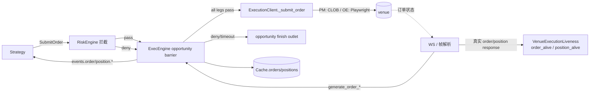
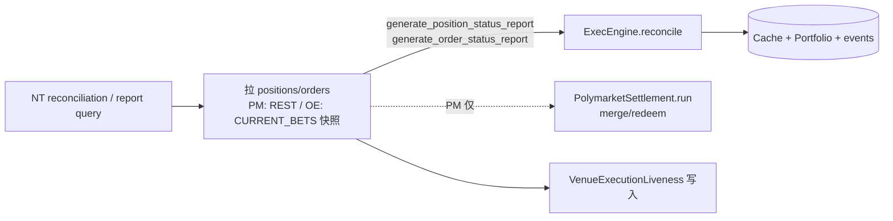
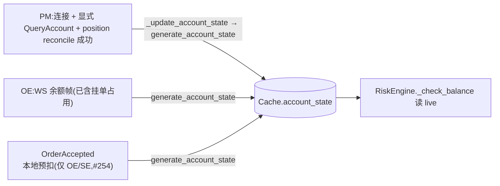
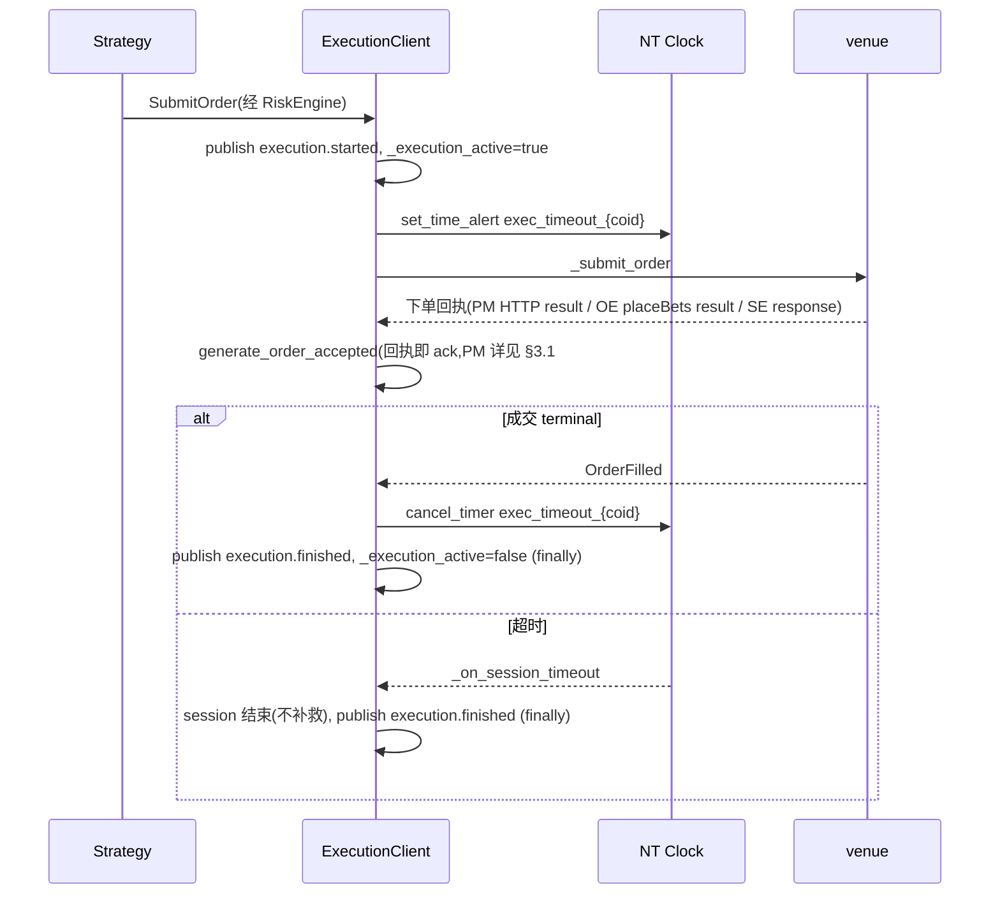
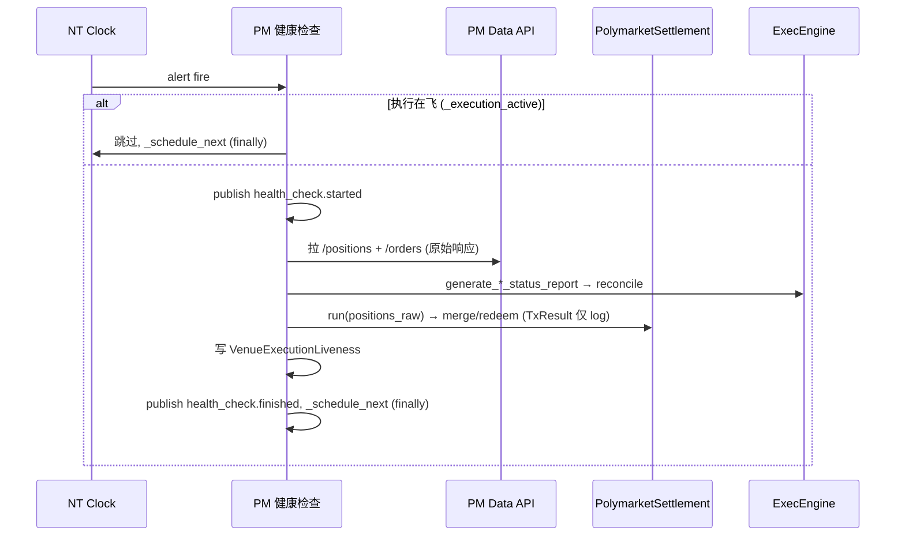

# Execution 组件详细设计

> **定位**:详细设计,面向代码落地。设计理由/历史见初设 `refactor.md §5.5 / §5.8 / §6.8`(Q13/Q15/Q17/Q18/Q19)。
> 冲突时:**有把握 → 以本文为准并回写 `refactor.md` 修订记录;没把握 → 提出讨论,不擅自定**。
> 对应初设 Step 5 + merge/claim(§5.8)+ 健康检查(§6.8)。

---

## 1. 职责与边界

| 组件 | 基类 | 职责 |
|---|---|---|
| **ArbLiveExecutionEngine** | NT `LiveExecutionEngine` 薄子类 | 单一 grouped-command barrier；SubmitOrder/CancelOrder 共用收齐、timer、墓碑和关闭状态机，再按 kind 执行各自 policy |
| **PM ExecutionClient** | 上游 `PolymarketExecutionClient` **薄子类** | 订单 IO(CLOB,上游现成)+ 账户状态(事件驱动)+ reconcile reports + **PM 健康检查**(report 对账 + merge/redeem settlement)+ `VenueExecutionLiveness` 写入 |
| **OE ExecutionClient** | 自写 `LiveExecutionClient` | 订单 IO(Playwright 提交)+ **订单帧解析**(现 stub→实写)+ 账户状态(WS 余额帧)+ reconcile reports + `VenueExecutionLiveness` 写入 |
| `PolymarketSettlement` | 普通类 | merge/redeem 编排(被 PM 健康检查调用,见 §4.6) |

**单一职责契约(Q13)**:execution = **执行 + 追踪**,不做决策。一次 session 单一职责;**移除内部 recovery loop**;补救 / 撤后再下 / 单腿失败补偿 **全归 Strategy**。

**执行健康归属**:order/position 真相可信度由各 venue ExecutionClient / NT reconciliation 写入 `VenueExecutionLiveness`;Risk 读取并门控。OE DataClient 只负责 competition 页行情健康,不再 reload execution 页。

**不做**:recovery / re-plan / retry;裸单补救;跨腿对冲。

---

## 2. 数据流

### 2.1 下单 + 回写



### 2.2 Reconcile / report(走 NT report 通路,§4.3bis)



### 2.3 账户状态维护


> 账户余额由 ExecutionClient 写入(Q17):PM 在连接、显式账户查询、position reconciliation 成功后各发一次余额请求,失败不在调用内重试;OE 靠 WS `BALANCE`;SE 靠 profile/balance response。accepted 后由 execution session 本地预扣(**仅 OE/SE;PM 关闭,#254 见 §4.5**);RiskEngine 统一读 cache `free`,不再按 venue 自算 open-order 占用。

SE 登录提交表单后，在同一个 deadline 内等待顶层 customer URL 或 customer iframe，
总预算统一取 `venues.sharpexch.page_load_timeout_sec`，不会先后各等待一轮；任一信号到达即继续。
随后等待并关闭登录后弹窗也使用该配置作为最大等待时间，弹窗出现即处理并提前返回，不是固定等待。
Cloudflare challenge 仍使用独立的 `cloudflare_timeout_sec`。

OE/SE 的初始业务状态 waiter 都必须在首次导航/登录之前建立：OE 等 general WS 的
`BALANCE + CURRENT_BETS`，SE 等 profile/balance response + general WS `CURRENT_BETS`。
这样登录期间先到的业务帧会直接完成 future，登录结束后的最多 30 秒等待不会丢失早到信号。
各 ExecutionClient 已负责初始业务状态，launcher 因此把 NT
`reconciliation_startup_delay_secs` 显式设为 `0`，startup reconciliation 后不再固定睡 10 秒；
不改变 startup reconciliation 本身及连续 reconciliation 的周期配置。

---

## 3. 接口设计

### 3.1 PM ExecutionClient(`adapters/polymarket/execution.py` 薄子类)

上游 `PolymarketExecutionClient` **已实现**(直接用):`_submit_order`/`_cancel_order`/`_modify_order`(`py_clob_client_v2` 签名 + CLOB L2)、`generate_order_*`(WS USER channel 回写)、`_update_account_state`、`generate_order_status_reports`/`generate_position_status_reports`。

**PM CLOB SDK 约束(#97,已落地 / 待 live 复验)**:2026-06-10 NT live probe 中,旧 `py_clob_client` 虽可本地签名,但 POST `/order` 被 PM API 拒绝为 `invalid order version, please use the latest clob-client`;官方文档当前以 `py_clob_client_v2` / `@polymarket/clob-client-v2` 为下单、撤单、查询 L2 client。项目 PM adapter 主 HTTP client 因此统一由 `get_polymarket_http_client()` 构造 `py_clob_client_v2.ClobClient`。关键 v2 差异:
- `generate_order_status_reports` 调 `get_open_orders(...)`,不再调旧 `get_orders(...)`。
- 单笔撤单调 `cancel_order(OrderPayload(orderID=...))`。
- 批量撤单调 `cancel_orders(order_hashes)`。
- 市场撤单调 `cancel_market_orders(OrderMarketCancelParams(...))`。
- 下单仍走两步 `create_order/create_market_order` → `post_order/post_orders`,并使用 v2 `PostOrdersArgs`。

该约束由 `tests/arbitrage/execution/test_polymarket_client.py::test_polymarket_execution_uses_py_clob_client_v2_surface` 锁定;下一次 PM cancel-only live 验收必须先看到 `orderID` / `venue_order_id` 落 cache,再继续验证下一轮 cancel-only。

**PM cancel 终态约束(#99/#113/#cancel-session,已落地)**:CLOB cancel 成功响应形如 `{"canceled":[order_id], "not_canceled":{}}`;当前把 `canceled[]` 解释为“撤单请求已被 CLOB 接收”,不再立即 `generate_order_canceled`。真实撤单完成以 USER WS `CANCELLATION` 事件为准,由 `_generate_cancel_success_event` 写回 NT cache / session terminal。`not_canceled` 中的失败原因仍走 `_generate_cancel_event` → `generate_order_cancel_rejected`,其中 `"already canceled or matched"` 保持既有抑制语义(等待 WS/成交事件给出正确终态)。REST 与 USER WS 都可能回报同一撤单终态,WS 侧必须幂等:① cache 当前 `order.status == CANCELED` 时跳过;② cache 尚未 apply 第一条 `OrderCanceled`、但同一 `client_order_id` 的 cancel terminal 已由 PM client 发出时,用有界 `_cancel_terminal_client_ids` 窗口跳过第二条,避免向 NT 重放 `CANCELED -> CANCELED`。覆盖范围:单笔 `_cancel_order`、deferred cancel、USER WS cancellation;全局/market cancel 仍是 fire-and-forget 日志路径。

**PM ack 语义:只来自 WS,不再回执即 ack(#256,2026-07-20 落地,取代 #253)**:

> ⚠️ **失效横幅**:#253(2026-07-19,"下单回执即 ack")已被本条取代——HTTP 回执现在只做
> `cache.add_venue_order_id` 预索引,不再 `generate_order_accepted`。原因:#253 解决了 taker
> 单无 ack 信号的问题,但用户复盘后判断"信任一次性 HTTP 响应"不是必须的——taker 单没有
> PLACEMENT,但 WS trade 消息(MATCHED/MINED/CONFIRMED)任一先到达本身就证明订单已被
> venue 接收,不需要额外依赖 receipt。

PM 的 `OrderAccepted` 现有两条**互相独立**的来源,分别在两个不同的 WS 消息处理方法里:
**order 消息**的 `PLACEMENT`/`CANCELLATION`/`UPDATE` 任一先到达(`_handle_ws_order_msg`;PLACEMENT
是 #253 就有的,CANCELLATION/UPDATE 是 2026-07-20 追加——三者任一到达都证明订单已被 venue
接收,判断放在 `match msg.type` **之前**统一做一次,`PLACEMENT` 分支因此简化为 `pass`);**trade 消息**的
`MATCHED`/`MINED`/`CONFIRMED` 任一先到达(`_handle_user_trade_in_ws_trade_msg`,在
finalized 门槛判断**之前**做 ack 尝试,故非 finalized 的 MATCHED/MINED 也能 ack)。两条来源
共用同一张 `_accepted_emitted` 去重表,谁先到谁 ack,互不知道对方存在。`_post_signed_order`/
`_process_batch_response` 成功分支只索引 `venue_order_id`(供后续任一 WS 消息按
`cache.client_order_id(venue_order_id)` 反查,taker 单靠这份索引才能在没有 PLACEMENT 时被
trade 消息命中)。去重靠 `_accepted_emitted` 有界
OrderedDict——事件经 ExecEngine 异步 apply,只查 `order.status` 有竞态窗口,重复 accepted 会让
session 预扣双扣。**成交确认语义不变**:fill 仍只在 trade `CONFIRMED` 生成
(`POLYMARKET_FINALIZED_TRADE_STATUSES`),MATCHED/MINED 只记录 + 补 ack、不生成 fill。
测试:`tests/arbitrage/adapters/polymarket/test_execution_ack.py`。

**PM 外部 taker 成交接入 NT 标准对账(#310)**:用户在 PM 页面手工成交时，本进程没有
`client_order_id`，taker 路径也可能没有先收到可用于建单的 `PLACEMENT`。若 adapter 直接发送
孤立 `FillReport`，NT `LiveExecutionEngine` 无法从 `venue_order_id` 反查本地订单，会拒绝应用
该 fill，因而不会更新本地 Position。对此仅在 `client_order_id is None` 且成交为 TAKER 时，
adapter 先发送同一 `venue_order_id` 的 `OrderStatusReport(ACCEPTED)`，由 NT reconcile 建立
`EXTERNAL` order，再发送保留真实成交量、成交价和手续费的 `FillReport`。状态 report 中的
LIMIT/GTC 只是缺少原始页面委托类型时的订单身份载体，不替代成交经济事实。外部 maker 单仍
依赖其正常 `PLACEMENT`/order report，不扩大该 fallback。

**PM CLOB REST 路由 / geoblock 约束(#98,已落地 / JP 误拦已修正)**:`get_polymarket_http_client()` 必须把 `PolymarketExecClientConfig.proxy_url` 接到 `py_clob_client_v2` 的共享 `httpx.Client`,并关闭环境代理继承(`trust_env=False`;#276 起无论 `proxy_url` 显式与否——未配置=直连,政策见 configuration.md「网络代理路由」)。共享 client 的 connect/TLS timeout 为 15s，已建立连接后的 read/write/pool timeout 保持 5s；`HTTPTransport(retries=1)` 只对 `ConnectError` / `ConnectTimeout` 重试一次,覆盖 CLOB report GET 与 submit/cancel 的连接建立阶段;不重试 HTTP 状态、读写超时或业务拒绝。它不同于 `PolymarketExecClientConfig.max_retries` 的上层共享 RetryManagerPool,后者仍默认关闭。原因:PM WS 由 NT pyo3 client 显式吃 `proxy_url`,而 v2 CLOB REST SDK 默认读进程 `HTTP_PROXY/HTTPS_PROXY`;若两者走不同出口,会出现"PM/OE WS 正常、PM REST 下单 / open-orders reset 或 timeout"(#275/#276 实锤过一次:arb_factories 漏传 `proxy_url` 即此症状)。`PolymarketExecutionClient._connect` 在真连接前按官方 `https://polymarket.com/api/geoblock` 做只读 preflight,但不能把 `blocked=true` 一刀切解释为 API 禁止:官方文档列 `JP` 为 `Frontend UI restricted`(API 本身不受限),因此 JP 只记录 geoblock 响应并继续;`AU/US/...` API-blocked、`PL/SG/TH/TW` close-only、以及 CA/ON、UA 指定地区仍 fail fast,不进入真实下单。launcher 的 `--preflight-polymarket` 还会用同一路由跑 CLOB `get_server_time()` + authenticated `get_open_orders()` + `get_balance_allowance()` 三个只读检查;余额为 0 或 v2 SDK transport 失败时返回 2 并打印单行错误,用于提前暴露 proxy wallet 常见的 `signature_type` 配错或代理链路不可用。2026-06-10 JP 出口实测 `server_time` 可读、`open_order_count=0`、`balance=67.916080 USDC.e`。

WS 接线约束:上游 `PolymarketWebSocketClient` 要求 `base_url_ws=.../ws/`,内部按 USER channel 拼接 `user`;项目 dispatcher 兼容旧 `.../ws/market` / `.../ws/user` 配置并统一归一化。否则 ExecClient user WS 会误连 `.../ws/marketuser`。

**PM 持仓成本映射约束(#100,已落地)**:`generate_position_status_reports` 的数据源是 PM Data API `/positions`。该接口返回的是按 token 聚合后的当前持仓,其中 `size` 是 share 数量,`avgPrice`/`avg_price` 是平均开仓成本。翻译成 NT 通用 `PositionStatusReport` 时必须同时填 `quantity` 与 `avg_px_open`;若 Data API 未返回平均成本,`avg_px_open` 保持 `None`(未知),不得在 strategy/risk 侧用当前盘口估算或把未知成本当 0。这样 `ArbitragePortfolio.outcome_exposures/outcome_shares` 与 `mean_rebate_recovery` 继续只读 NT cache position,成本权威仍在 execution adapter 的 venue report 翻译层。

**套利子类新增**:
```python
class ArbPolymarketExecutionClient(PolymarketExecutionClient):
    def __init__(...):
        self._settlement = PolymarketSettlement(contract_service, ...)   # §4.6
        self._venue_liveness = VenueExecutionLiveness                    # 由 ArbContext 注入
    async def generate_order_status_reports(...): ...     # super + guarded reports；liveness 由上层写
    async def generate_position_status_reports(...): ...  # super + settlement + guarded reports
```

### 3.2 OE ExecutionClient(`adapters/orbitexch/execution.py` 自写)

```python
class OrbitExchExecutionClient(LiveExecutionClient):
    # NT 契约(自写,Playwright 经 manager.get_page("execution"))
    async def _submit_order(self, command: SubmitOrder) -> None: ...
    async def _cancel_order(self, command: CancelOrder) -> None: ...
    async def _modify_order(self, command: ModifyOrder) -> None: ...
    # reconcile
    async def generate_order_status_reports(...) -> list[OrderStatusReport]: ...
    async def generate_position_status_reports(...) -> list[PositionStatusReport]: ...
    # `general` 频道帧解析(2026-05-22 实测抓帧锁定,见下)
    def _on_general_frame(self, msg): ...   # parser.parse_general_frame → 按 type 分派
    def _on_balance_frame(self, parsed): ...          # type=balance → generate_account_state
    def _on_current_bets_frame(self, parsed): ...     # type=current_bets → generate_order_*/reports
```

**OE `general` 频道帧格式(2026-05-22 实测,`message_parser.parse_general_frame` 已实现 + 测试)**:
- 同一个 `general` WS(SockJS,下行 `a[...]`)承载**多类帧,按顶层 key 分型**,未知 key 忽略。`OrbitExchExecutionClient` 构造 handler 时必须传入自身 logger,使 `OE WS connected` / `OE WS first frame received` 进入 NT node 日志;这用于区分 general WS 未捕获、捕获但无下行、下行已到但解析/回调未生效。
  - `{"BALANCE":{"balance":"37.49","avBalance":null}}` → 账户余额(`balance` 是**字符串**;WS 侧**已含挂单占用**,RiskEngine 不再减,Q17)→ 入站乘 `arbitrage.fx` 后 `generate_account_state`,cache 中 OE 余额数值按 USD 口径解释。
  - `{"CURRENT_BETS":[<bet>,...]}` → 当前注单 → 入站先把金额/size 字段从 GBP 乘 `arbitrage.fx` 归一为 USD,再生成 `generate_order_*` / position report。
- payload 兼容:真实 general 帧可能出现顶层 key 下再包一层 JSON 字符串(`{"BALANCE":"{\"balance\":\"37.49\"}"}` / `{"CURRENT_BETS":"[...]"}`);parser 先解嵌套 JSON,再校验 `BALANCE` 必须是 dict、`CURRENT_BETS` 必须是 list,非 dict bet item 过滤,避免 `Order callback error: 'str' object has no attribute 'get'`。
- 上行订阅请求 `["{\"BALANCE\":{\"subscribe\":true,...}}"]`(无 `a`、无数据)。
- **已确认**:帧 envelope + 分型 + BALANCE schema + nested JSON string payload 兼容(`tests/arbitrage/adapters/orbitexch/test_ws_general_frames.py`)。
- **`CURRENT_BETS` 单 bet item schema —— 2026-06-06 live 抓帧实测确认**(place_and_cancel 真单 live 时 odds_client 抓到):
  ```
  {"offerId":"221832455","selectionId":"19924823","averagePrice":0.0,"profitNet":"0.00","liability":"0.00"}
  ```
  - **修正旧假设**:订单 join key 是 **`offerId`(== NT order 的 `venue_order_id`**,executor 下单时从响应 `offerIds` map 写入),**不是** `marketId`(`marketId` 是分组键)。
  - **完整字段(权威来源 = 老 `orchestrator`/`tracker`/`odds_client` 实读,非精选 debug log)**:`offerId`/`marketId`/`selectionId`/**`side`(BACK/LAY)**/**`sizePlaced`(原始量)**/`sizeRemaining`(>0 → working)/`sizeMatched`(累积成交,>0 → position)/`averagePrice`/`price`/`placedDate`/`profitNet`/`liability`。⚠️ 早先误判"bet 无 side"(只看了 odds_client 那条**精选 5 字段** debug log)——实际 bet **自带 `side`/`sizePlaced`**,reconcile 可直接用、无需反查 NT order(支持外部/重启单)。**字段语义单一真理源 = 老代码**;exec 侧先将 `size*`/`liability`/`profit*` 字段乘 `fx` 转成 USD,再由 `current_bets_to_fills`/`bet_order_progress` 复用语义、产 NT 事件/report。`current_bets_to_fills` 不再维护 `prevMatched`: `sizeMatched` 本身就是累计成交量;`_on_current_bets` 用累计值判断成交进度,并结合 NT order 当前 `filled_qty` 推出本次 `last_qty`。
  - **仅 unmatched 态已实测**;**matched 态填充值**(sizeMatched>0/averagePrice>0)待**真成交**确认([[gap_c_oe_exec_live_validated]])。
```python
# (上方 OrbitExchExecutionClient 续)
```

### 3.3 消息接线(订阅 / 发布)

| 方向 | 内容 |
|---|---|
| **接收**(NT 管道路由) | `SubmitOrder` / `SubmitOrderList` / `CancelOrder` / `ModifyOrder` |
| **接收**(订阅 topic) | `execution.*` 镜像不需要(自己是发起方);健康检查订 `execution.*` 以让路(见 §3.4) |
| **发布**(NT 标准) | `generate_order_*` → `events.order.{strategy_id}`;`generate_account_state` → `AccountState`;reconcile 经 ExecEngine 发 `events.position.*` |
| **发布**(同步,§6.10) | session:`execution.started`(submit 时)/ `execution.finished`(terminal/timeout);PM 健康检查:`health_check.started/finished` |

### 3.4 同步参与(Q19 / §6.10,详见 `_cross-cutting`)

- **execution session**:submit 时 publish `execution.started` + 置 `_execution_active`(首个 await 前同步);terminal **或** timeout 时 publish `execution.finished` + 清(放 `finally`,两条路径都清,防健康检查永久饿死)。
- **PM 健康检查 tick**:开头 `if _execution_active: 跳过`;否则 publish `health_check.started`→ 跑 → `finally` publish `health_check.finished`。
- 单 asyncio loop 串行,置位/清位纪律见 §6.10。

### 3.5 `ArbLiveExecutionEngine` grouped-command barrier(已落地代码,待 live 验证)

> 横切协议真理源见 `_cross-cutting/synchronization.md §8.4bis`;本节只写 execution 侧接口和出口。

`ArbLiveExecutionEngine` 通过 `bootstrap.install_arbitrage_engines()` 替换
`nautilus_trader.system.kernel.LiveExecutionEngine`,方式同 `ArbitrageLiveRiskEngine`。
该类不改 NT `SubmitOrderList` 语义；SubmitOrder 与带 metadata 的 CancelOrder 共用一套
grouped-command 状态机，metadata 解析复用 `src/arbitrage/common/opportunity.py`。

**输入**:
- `ExecEngine.execute(SubmitOrder)`:Risk pass 后的真实腿;若 order 无 `arb:opportunity_id`,直接 `super()._execute_command(command)`。
- `ExecEngine.execute(CancelOrder)`:若 params 带有效 `arb_cancel_opportunity`，进入 grouped
  cancel barrier；未带标记或 params 为空时保持 NT 原生直通，带标记但 metadata 非法时
  fail-closed 为标准 `OrderCancelRejected`。
- `risk.opportunity.leg_denied`:Risk deny 的领域消息;Execution barrier 以该消息关闭对应 opportunity。
- NT clock alert:`arb_group_timeout:{kind}:{group_id}`；submit/cancel 共用 callback 与关闭路径。

**共享 context 字段**:

| 字段 | 含义 |
|---|---|
| `kind` | `submit` / `cancel`，只用于选择业务 policy |
| `group_id` | 本轮机会 ID |
| `pair_id` | 用于 pair-wide residual 检查与 order/position digest 重算 |
| `expected` | 应收齐的 command key 集合 |
| `commands` | 已到达但尚未 release 的 `key -> SubmitOrder/CancelOrder` |
| `terminal_keys` | 已生成本地失败终态的 key；墓碑收齐后可提前关闭 |
| `meta` | submit 为 `OpportunityMeta`，cancel 为 `CancelOpportunityMeta` |
| `terminal` | `None` / `denied` / `timeout` / `released` |

**SubmitOrder policy 出口**:
- `all allowed`:先执行 opportunity-level cancel-only 判定；若不触发，按
  `PairRegistry.instrument_ids_for_pair(pair_id)` 重算当前 position digest（#317:open-order digest 已删,承 #316 per-pair ≤1）。
  基线缺失、腿间 digest 不一致或当前摘要与基线不同，整组本地 `OrderDenied`，不 release
  任一腿。只有 position 摘要一致时才取消 timer，并把所有 command 逐条交回父类进入各 venue
  `ExecutionClient`。字段与 cache 可见性边界见同步真理源 §8.4bis。
- `cancel-only`:同一 `pair_id` 任一 registered instrument 有 residual open order时触发;不 release 任何新 submit,按 residual instrument 调用对应 client 的 residual cancel 能力,并对本轮所有新 submit 生成本地 deny/reject。pair-wide 范围来自 `PairRegistry.instrument_ids_for_pair(pair_id)`,所以即使本轮 opportunity 只有单腿 `expected_legs`,也会先检查同 pair 其它 PM/OE outcome 的残留挂单;若 registry 不可用才退化为只查本次 `expected_legs`。若 cache 已发现 residual 但 client 路由异常,仍 fail-closed 阻断本轮新 submit 并记录错误。live 验收锚点:`Opportunity cancel-only: residual open orders present`。显式补偿撤单使用同一 grouped-command barrier 的 CancelOrder policy，详细边界见同步真理源 §8.4bis。
- `denied` / `timeout`:不 release 到 venue;对 `commands` 中已暂存但未执行的 orders 生成本地 `OrderDenied`,reason 指向失败腿或 barrier timeout;然后以 zero-session execution 走统一 finish。

**CancelOrder policy 出口**:
- `all arrived`:逐条交回父类执行标准 `CancelOrder`；已有 execution、
  metadata 不一致或 timeout 时生成标准 `OrderCancelRejected`，不调用 venue。
- `finish outlet`:清 context / 取消 timer，并对尚未执行的 orders 生成本地终态。
  `PairInFlightGate` 自 #261 起只属于 Strategy evaluation task，不由 barrier/session 释放。

**timeout**:使用 NT 原生 clock `set_time_alert_ns` / `cancel_timer`;只覆盖 Risk decision 收齐窗口,不替代 §4.2 per-session venue timeout。

### 3.6 市价提交边界

市价意图是订单级 `OpportunityMeta.market`，由 `PlaceBetsAction(market=true)` 写入
`Order.tags`。不存在全局市价开关；普通订单、缺失该 metadata 的旧订单及 `market=false`
订单均按限价提交。Strategy、Risk 和 opportunity barrier 始终处理原计划的 NT
`LimitOrder`，不按 OrderBook 深度改价。只有显式请求市价的订单已经通过上述链路、即将调用
venue 服务端接口时，adapter 才做最后一次 venue-specific 转换：

- **Polymarket**：普通订单沿用 GTC limit；`market=true` 时使用官方
  `create_market_order(MarketOrderArgs)` 并以 FOK 提交。PM 原生 `amount` 口径按 side
  区分：BUY 传计划成本 `计划 share × 计划 price`（USDC）且不显式传签名价，由 SDK 按
  当前盘口动态计算，避免极端 BUY 价改变签名 `takerAmount` 与 NT share 口径；SELL 传计划
  share，并显式使用最低允许价 `0.01`，扩大 FOK 可扫 bid 范围而不改变卖出 share。BUY
  签名后从 SDK `SignedOrderV1/V2` 的扁平字段 `signed_order.takerAmount` 取得本次市价单预计
  base quantity，并通过
  上游 `_post_signed_order(..., base_quantity=...)` 发出 `OrderUpdated`，使 NT 本地订单数量
  和 fill tracker 对齐实际可成交 share；不得使用极端价格的 `OrderArgs` 模拟 BUY 市价，
  否则签名的 makerAmount 会按极端价格放大，价格改善将产生超出计划数量的 shares。
  签名、neg-risk、确定性 order hash、submitted/accepted/rejected 事件仍复用上游 PM
  ExecutionClient。
- **OrbitExch / SharpExch**：普通订单 payload 使用计划 decimal odds；`market=true` 时只在最终
  `placeBets` payload 把 BACK price 设为 `1.01`；LAY 从真实执行 instrument 的 NT book
  `bids()` 最后一档读取当前最差 LAY 深度，再经 Venue Registry 还原成 decimal odds。
  缺 book/深度或换算失败时保留 Strategy 计划 LAY 价，绝不退到固定 `100`。side 和 stake
  不变。最终 payload price 无论来自计划限价还是市价转换，都经 Venue Registry
  `normalize_order_price` 按 OE/SE 共用分段梯度做防御性量化；不再自行两位小数四舍五入。
  该转换不伪装为 PM FOK，也不改变入站 CURRENT_BETS 的真实成交价。

Strategy 始终记录并提交计划 price/qty；OE/SE LAY 深度只在 ExecutionClient 最终 page write
前读取。显式 debug `price_overrides` 仍只负责构造计划订单；订单请求市价提交后，最终 venue
payload 仍按本节规则转换。

---

## 4. 机制

### 4.1 Execution session(Q13)

| Session | 触发 | 动作 | 终点 |
|---|---|---|---|
| **cancel-only** | submit 时 instrument 上有**残留挂单** | 为每条残留单建立 cancel session,发撤单请求,**丢弃**当次 submit | NT `OrderCanceled` / `OrderCancelRejected` **或** timeout |
| **submit+track** | submit 时无残留 | 下单 → 追踪 | terminal(FILLED/CANCELED/REJECTED/EXPIRED)**或** timeout |
| **explicit cancel** | grouped-command barrier 的 cancel policy release，或普通 NT CancelOrder 直通 | `cancel_order` 同步建立 session，再由 NT 创建 venue IO task | `OrderCanceled` / `OrderCancelRejected` / `OrderRejected` / `OrderExpired` **或** timeout |

`ArbExecutionSessionMixin.cancel_order` 在调用 NT `LiveExecutionClient.cancel_order` 前同步建立
cancel session，并通过仅供 adapter 内部使用的 command param 标记“session 已建立”；PM/OE/SE
真实 `_cancel_order` 路径不得再次 `_begin_cancel_session`。这保证 grouped barrier 移除 context
后，`_execution_active` 已经可见，不留下下一机会穿透的空窗。

- 对带完整 opportunity metadata 的套利,首选 §3.5 barrier 统一做 opportunity-level
  cancel-only:收齐所有 risk-pass legs 后,若同 pair 任一 registered instrument 有 residual,
  则整次 opportunity 撤旧并丢弃所有新 submit,避免一边撤旧另一边开新。显式补偿撤单是标准
  `CancelOrder`,走同一 grouped-command barrier 的 cancel policy,不作为 SubmitOrder 撤单腿绕过本规则。
  检查范围是 pair-wide,不是仅本次 `expected_legs`。
- 本节 per-client cancel-only 仍保留为 fallback:无 metadata、非 opportunity 订单、或 barrier 未接管时,client submit 入口可按单 instrument 残留退化为 cancel-only。
- cancel-only 当次 submit **直接丢弃**(不排队、不延后);Strategy 下轮按 live state 重新评估。
- cancel session 与 submit session 共用同一 `_active_sessions` / watchdog 出口(**#261:不再有 `PairInFlightGate` 记账**)，但不消费 submit 的 `enable_timeout`。adapter 收到一次**正常撤单响应**后调用 `_ack_cancel_session`，立即结束 cancel session；这只释放 barrier tracking，不生成或修改任何订单状态。没有响应、传输结果未知时不 ACK，继续等待撤单终态、reconcile 或 watchdog。session 在飞期间 `_execution_active` 为真 → barrier 不放行新机会(synchronization §7.5)。
- cancel 等待期间到达的成交事件只按正常 fill/order 流程处理，不代表撤单请求已有响应，也不结束 cancel session。订单状态与 session 生命周期正交：ACK 负责释放 session；随后 adapter 仍解析响应并由 USER WS / `CURRENT_BETS` / reconcile 更新真实状态。
- venue 终态映射:
  - PM:CLOB 返回正常撤单响应后先统一 ACK session，再解析 `canceled[]` / `not_canceled`。`canceled[]` 不伪造撤单终态，真实撤单完成仍以 USER channel `CANCELLATION` 为准；`not_canceled` 的 reason 只参与既有订单事件映射，不决定 session 是否结束。
  - OE/SE:`executor.cancel_order` 成功只记录“请求已接收”;后续新的 `CURRENT_BETS` 完整快照中,该 `offerId` 消失或 `offerState` 为 `CANCELLED/CANCELED` 时,由 adapter 转 `generate_order_canceled`。旧缓存不用于完成判定。
  - OE `CancelAllOrders` 只调用 `/customer/api/cancelAllUnmatchedBets`；API 失败直接返回失败，不再点击页面 UI 兜底。旧 `take-at-market/modify-and-take` 页面能力已删除：它不在 NT 套利执行链路内，且不能用固定 sleep 代替真实成交确认。
- session mixin 只维护 `_active_sessions` 与 tracking timeout(**#261**:`execution.*` 消息与 `PairInFlightGate` 记账均已删除)。`_execution_active` = `len(_active_sessions) > 0` 是 barrier 全局 ≤1 判定的派生源之一。它不再写执行健康状态;order/position liveness 由 venue ExecutionClient / reconcile 成功路径写入 `VenueExecutionLiveness`。
- **submit 异常收口**:只对“确定尚未提交到 venue”的本地失败立即生成终态；请求已发出但结果未知必须保留在飞状态:
  - PM 在签名后、POST 前按 CLOB order hash 算法得到确定性 `venue_order_id`，先写
    `client_order_id -> venue_order_id` 映射，再生成 `OrderSubmitted`。POST 返回明确拒绝时正常
    `OrderRejected`；明确拒绝的判据是 `PolyApiException.status_code is not None`，包括 HTTP 4xx/5xx。
    签名/构造阶段失败且尚无 hash 映射时 `OrderDenied + _end_session`；POST 传输异常、空回执或
    `status_code is None` 的抛错但 hash 已登记时不生成本地终态、不结束 session，订单保持
    `SUBMITTED`，等待 NT 的 in-flight threshold 判定。`RetryManager` 必须保留最后异常，不能只用
    message 抹掉“已收到 HTTP 响应”和“根本没有响应”的区别。
  - OE/SE 在本地 instrument/executor/payload 校验通过后、进入真实 `placeBets` 前生成
    `OrderSubmitted`。HTTP/业务响应明确拒绝时生成 `OrderRejected`；断线、execution context
    销毁、fetch transport error 等结果未知路径不生成终态、不结束 session，保留 `SUBMITTED`
    等 NT in-flight check。ExecutionClient 对“等待页锁 + cookies + page evaluate/fetch”完整
    place/cancel 使用统一 5 秒 I/O 总预算；超时取消该调用并释放页锁，但只表示结果未知，不代表
    venue 拒绝。该 timeout 与 QueryOrder 解耦，也不复用页面导航的 `page_timeout`。旧 OE cancel
    内部 cookies 5 秒 + evaluate 10 秒的分段 timeout 已删除。
  - OE/SE `cancelBets` 明确失败才生成 `OrderCancelRejected`；结果未知不猜测或改写订单状态。
    cancel-only 残单由 base
    先建立 session，adapter 复用该 session 发真实请求，不得再次 `_begin_cancel_session` 后把请求
    当重复操作跳过。
  - `OrderDenied`/异常 `OrderRejected` 只负责收口,不把"未知是否到达 venue"误写成 execution liveness。

### 4.2 Tracking timeout(Q15,NT clock 绝对超时)

```python
def _start_session(self, coid):
    self._clock.set_time_alert_ns(f"exec_timeout_{coid}",
        self._clock.timestamp_ns() + secs_to_nanos(self._config.session_timeout_sec),
        callback=self._on_session_timeout)              # 绝对超时,从启动起算
def _on_order_terminal(self, coid):
    self._clock.cancel_timer(f"exec_timeout_{coid}")    # terminal 抢先取消
def _on_session_timeout(self, event):
    # 超时即结束 session,不撤不重试;order 在 venue 保持当时状态,留给 strategy 下一轮
    self._log.warning(f"Session timeout: {event.name}")
    self._end_session(coid, timed_out=True)
```
- **绝对超时**:partial / OrderAccepted **不重置** timer。
- **Action 可选 ACK 收口(#298)**:submit session 从原订单 `Order.tags` 的
  `OpportunityMeta.enable_timeout` 冻结策略。缺失/`true` 时仍按上一条等待；显式 `false` 时：
  - submit 收到首次 `OrderAccepted` 后，先经 NT 标准管道上送事件并调用既有 accepted
    余额 hook（PM override 为 no-op；OE/SE 本地预扣），再调用 `_end_session`；
  cancel 不消费该字段。PM/OE/SE 收到正常撤单响应后统一调用 `_ack_cancel_session` 并结束
  cancel session；传输结果未知不 ACK。submit/cancel 两条路径都只取消 watchdog、释放
  `_execution_active`，不把订单改成终态；后续 fill/cancellation/order 事件仍由
  ExecutionClient → ExecEngine 标准路径处理。
- 全局唯一超时配置(per-venue 不分);cancel session 超时仅 log warning,不补撤、不重试。
- terminal 与 timeout 都触发 session 结束 → 都 publish `execution.finished` + 清 `_execution_active`。
- **watchdog 与 per-pair 计数原子(#105 ②,保证置位一定有出口)**:`_begin_session` 顺序固定为
  ① 先 arm watchdog(`set_time_alert_ns`,本块唯一可能抛的操作 —— 若抛则尚未改任何共享态,干净失败)
  → ② 再做纯 dict 置位(`_active_sessions`,不会抛;**#261**:`pair_inflight.exec_started` 已删除)
  → ③ `_publish_execution` 收尾(非关键:即便抛,watchdog + session 已就位,终会 `_end_session`)。
  这样**只要 `_active_sessions` 有条目,就一定有人(终态或看门狗)来清** —— 否则
  `_execution_active` 恒真,#261 后 barrier 会从此拒绝所有新机会。
  **#261**:原"`exec_finished` 先于 `cancel_timer`/`publish`"的顺序纪律随 pair 闸记账一并删除。

### 4.3 健康检查(§6.8.3 / §6.8.4,loop 节奏 §6.8.4.5)

> ⚠️ **失效横幅(#105/#108,2026-06-15 已落地迁移)**:本节(自写 `HealthCheckLoop` + `leg_settled` 状态维度)已不是现状真理源。当前:DataClient 只保留 competition 页时间维度健康检查;execution/order/position 健康由 venue ExecutionClient / NT reconciliation 写 `VenueExecutionLiveness`,Risk 读取门控。OE execution 页 reload Phase 2 与 `health_check_exec_reload_enabled` 已退役。§4.3 保留为迁移前设计记录;先读 §4.3bis 与 synchronization §8.5。

**归属 / 不变量(读这节先读这块;本节是健康检查详细设计的单一真理源,refactor.md §6.8.x 只留决策指针)**:
- **OE 健康检查宿主 = `OrbitExchDataClient`**(它持 competition 页,且经共享 `PlaywrightBrowserManager` 够到 execution 页);两触发维度都在它(时间维度 reload competition 页 / 状态维度 reload execution 页,见下表 + #68 澄清)。
- **PM 健康检查宿主 = PM ExecClient 薄子类**(唯一同时具 `generate_*_status_report` + 钱包 creds + tick)。
- **历史约束(已失效)**:OE ExecClient 不自跑健康检查,只在 tracking terminal 命中时写 `leg_settled`。当前 OE ExecClient 负责 execution 页 / CURRENT_BETS / reports / liveness 写入。
- 共享节奏 = `HealthCheckLoop`;执行在飞时整 tick 让路(Q19/§6.10)。

**统一 loop 节奏(OE/PM 共用)—— ✅ 已落地 `src/arbitrage/execution/health_check.py:HealthCheckLoop`(10 passed)**:NT `Clock` 自重排 one-shot alert —— sync callback → `loop.create_task(_tick)`;`_tick`(async)`try` 跑检查(`run_check` 失败吞掉不打断)+ `finally` 按**当前** interval 重排下次 alert(异常路径也重排,不永久卡死);`trigger_now()` 立即触发;`stop()` 取消 timer。**无** `asyncio.Event`/`monotonic`/block-unblock。
- **间隔 OE/PM 分别可设(用户 2026-05-22)**:`interval_secs_provider` 为**每实例独立** callable,每次重排时重读 → PM/OE 各自配置、运行时改值即时生效。配置落位:PM = PM ExecClient config 的 `health_interval_secs`,OE = OE DataClient config 的 `health_interval_secs`(各自字段,随 PM/OE 客户端落地接线)。
- **执行 ⊥ 健康检查互斥(Q19/§6.10)**:`is_execution_active` callable —— PM 传 `lambda: self._execution_active`(同对象);OE 传 msgbus 订阅 `execution.*` 维护的 ref-count 标志(DataClient 与 ExecClient 不同对象)。执行在飞 → 整 tick 跳过(不 publish `health_check.*`),但仍重排。
- `run_check` 是宿主真实检查(async):PM 拉 positions/orders→reports + settlement;OE DataClient 仅处理 competition 页行情健康。

| | OE 健康检查(宿主 `OrbitExchDataClient`) | PM 健康检查(宿主 PM ExecClient 子类) |
|---|---|---|
| 触发 | 时间维度(competition 页面 `clock.timestamp_ns()-last_update_ns>阈值`,**仅 tick 评估,不立即刷新**);历史状态维度已退役 | 默认周期 + 外部事件可立即触发 |
| 动作 | 页面 reload → 重订阅 → 拉持仓/挂单(**不拉余额**) | 拉持仓/挂单(**不拉余额**) |
| 回写 | `generate_position_status_report`/`generate_order_status_report`(NT report 通路) | 同 + **merge/redeem**(§4.6) |
| 收尾 | DataClient 不写 execution liveness;历史 `leg_settled` 收尾已退役 | reports 成功后写 `VenueExecutionLiveness` |

> ⚠️ **OE「动作」行是 #68 拆页前的概括**(单页同出赔率+持仓的旧心智)。#68 后按触发维度分落点(时间维度→competition 页 / 状态维度→execution 页),恢复机制 = reload→WS 重推(非 DOM 抓)——以下方「#68 拆页带来的数据源澄清」+「落地状态(分期)」为准。

- **走 NT report 通路(非直接覆盖 cache)**:保证 Order 状态机推进 / Position 派生 / Portfolio 一致 / Strategy 收 `events.*`(避免私有覆盖的 4 项隐藏代价)。
- ⚠️ **失效(2026-06-16,#109/#110)**:旧“执行在飞时整个 HealthCheckLoop tick 跳过”(§3.4 / Q19)随 PM/OE HealthCheckLoop 退役;现状见 §4.3bis / §4.6。
- **reload 后无需重挂 WS 监听(#67 实测,关键简化)**:NT 适配器用 Playwright `page.on('websocket')`(非老 odds_client 的 CDP)。实测(`/tmp/ws_reload_probe.py` 等价复现)`page.reload()` 后,页面新建的 WS **被同一监听自动捕获、帧正常收到**——监听挂在 page 对象上,reload 换 WS 不换 page。**对比老 CDP**:CDP session 会被 reload 重置,老代码每轮 reload 必须 detach 旧 CDP→重 setup 拦截→reload→补 `Network.enable`(`odds_client._open_or_reload_page`)。**故本 reload slice 比老代码简单**:reload 动作 = `page.reload()` + 重订阅 instrument(OBD),**WS 层零额外工作**;唯一留意 `handler._websockets` dict 跨 reload 累积(旧 WS close 触发清理,不影响帧处理)。

- **#68 拆页带来的数据源澄清(本节原文写于拆页前)**:§6.8.3 原描述"reload 页面 → 拉持仓/挂单"基于"单页同出赔率 + 持仓/挂单"的旧心智。#68 后页拆两类:**competition(数据)页**(`OrbitExchDataClient` 持有)上是**赔率**;**execution 页**(`OrbitExchExecutionClient` 持有)上才是 `BALANCE`+`CURRENT_BETS`(**持仓/挂单**)。当前 DataClient 只 reload competition 页;execution 页/`CURRENT_BETS` 属 OE ExecClient。
- **落地状态(分期)**:
  - ⚠️ **Phase 1 旧 HealthCheckLoop 实现已失效(2026-06-16,#109)**:早先 `adapters/orbitexch/data.py` 的 `_run_health_check` / `_comp_last_update_ns` / `health_interval_secs` 已退役。现状是 competition 页存活封装进 `OrbitExchWebSocketHandler`:每帧(含 SockJS 心跳)刷新 handler 内部 liveness,超 `staleness_timeout_secs` 或 WS close → `on_disconnect` → DataClient reload/reopen。现状单一真理源见 data `architecture.md §4.3`,测试见 `test_data_client_step2.py` / `test_ws_general_frames.py`。
  - **Phase 2 状态维度已退役(2026-06-15,#108)**:`leg_settled.has_any_unsettled() → reload execution 页` 与 `health_check_exec_reload_enabled` 已从 DataClient/factory/config 移除。CURRENT_BETS 仍是 OE 执行真值来源,但由 `OrbitExchExecutionClient._on_current_bets` 写 `VenueExecutionLiveness`。
  - ✅ **弹窗/CURRENT_BETS 隐患已 live 证伪(2026-06-08,用户实测)**:曾担心 `_reload_execution_page` 只裸 `exec_page.reload(networkidle)`、reload 后不重调 `_dismiss_post_login_popup`(该方法仅 `_login` 路径触发),若 OE 每次加载都弹窗会盖住页面堵死 general WS。**实测:已登录后 reload 不重现登录弹窗**(弹窗仅首次登录出现),且 `CURRENT_BETS` 如期重推 → **无需在 reload 后补 dismiss**,reload 对会话/弹窗/订单快照重推安全。**验证工具**:`scripts/phase2_exec_reload_probe.py`(真账户登录、**零下单**:arm 未结腿 → 驱动真实 `_run_health_check` 触发 reload → 报告登录态/弹窗/CURRENT_BETS 重推)。
  - **接线**:`venues.orbitexch.staleness_timeout_sec` → `OrbitExchDataClientConfig.staleness_timeout_secs` → WS handler liveness timeout;旧 `health_interval_sec` 已删除(详见 `_cross-cutting/configuration.md §6`)。

### 4.3bis OE 接 NT 原生 reconciliation / VenueExecutionLiveness（#105/#108,已落地代码路径,2026-06-15）

> **本小节是 OE 健康检查的现状真理源**(取代 §4.3 的 OE 部分)。决策史见 `refactor.md #105`;横切同步部分(页锁层次/状态位迁移/pair_inflight 兜底/NT 不串行化)见 `_cross-cutting/synchronization.md §8`,本节不复述。

**总体**:OE 不再自跑 `HealthCheckLoop`;改由 **NT 原生 reconciliation** 调 OE ExecClient 的 `generate_*_status_reports` 拉对账。PM 同理(merge/redeem 仍自写,§4.6)。`reconciliation`(engine 级)开关 + kernel 时序见 `refactor.md #105`(reconcile 时 OE 已登录;`timeout_connection` 须 > OE 登录最坏耗时)。

**边界(2026-06-29 overnight 诊断)**:DataClient 的 `_update_instruments` 是 instrument rediscovery,不属于 execution/reconciliation。它的单轮网络异常容错见 data §3.1 / discovery §3.3;不要把 `Error running '_update_instruments'` 当成 order/position liveness 或 execution 页 reload 失败。执行真相仍只由本节的 report/reconciliation 路径写入 `VenueExecutionLiveness`。

**(1) reload 抽成接口,"reload-then-report" 进 OE ExecClient**
- reload 宿主从 DataClient 搬到 **`OrbitExchExecutionClient` 自己**(同对象拥有 execution 页 + 报告方法 + 页锁,消掉跨对象 hack)。
- `generate_order_status_reports` / `generate_position_status_reports` 进来先 `await _ensure_exec_snapshot_fresh()`(见下),再读 `_current_bets` 出报告。
- **启动连接语义(2026-07-09)**:`_connect` 注册 WS handler 后导航 execution 页,并在返回 connected 前最多等待 30s,确认 exec `general` WS 至少送达 `BALANCE` 与 `CURRENT_BETS` 两个业务真值。`BALANCE` 到达即写真实 AccountState;若超时仍未到,才发 0 USD 兜底账户状态以完成账户注册。`CURRENT_BETS` 到达才写 `VenueExecutionLiveness`;若超时未到,连接仍 fail-soft 返回,后续 reports/reconciliation 通过 reload-then-report 自愈并裁决 alive/dead。

**(2) `_current_bets` 双视图(单一真理源)**
- `_current_bets`(offerId→全字段 bet 全量快照,`_on_current_bets` 每帧整体替换)是 OE venue 状态的单一真理源。**用户确认 CURRENT_BETS 保留全成交 bet** → 快照 = 完整 venue 真值。
- **order 视图**:逐条 `_build_order_report`(现有,读 `side/sizeMatched/sizeRemaining/averagePrice`)。
- **position 视图**(补 Q17 延后,#105;**✅ 已落地 2026-06-13**:`execution.py` 模块级纯函数 `current_bets_to_positions` + `generate_position_status_reports`(`_resolve_oe_instrument` 反查);`test_orbitexch_client.py::test_positions_*`/`test_generate_position_status_reports_aggregates`;launcher 已启启动期 `reconciliation=True`;#110 后连续 `position_check_interval_secs=300` 全局开启):按 `selectionId` 聚合 `_current_bets`(BACK=long、LAY=short,与现有 BACK↔BUY/LAY↔SELL 一致):
  - `net qty = Σ(BACK sizeMatched) − Σ(LAY sizeMatched)`(signed);`net>0→LONG / <0→SHORT / 0→FLAT`;
  - `avg_px = 主方向(=net 符号侧)的成交量加权 averagePrice`(net>0 → 只用 BACK 的 `Σ(sizeMatched×averagePrice)/Σ sizeMatched`;net<0 → 只用 LAY 的;**反方向当平仓只减 qty、不进 avg_px**,对齐 NT "avg_px_open 只算开仓侧" 语义,且不依赖 fill 时间顺序);`net==0` → FLAT、avg_px N/A;
  - 每 selection 一条 `PositionStatusReport(quantity, position_side, avg_px_open)`。
- **一次 reload 喂两个视图**:NT 启动后把 order/position 检查分开调度,但都落到"读同一份刚刷新的 `_current_bets`",经下面的 single-flight 合并为一次 reload。

**(3) single-flight + 存活闸:reload 退化为恢复动作**(**✅ A2/B1 已落地 2026-06-15**:`_reload_exec_page`/`_ensure_exec_snapshot_fresh`,且 `generate_order_status_report(s)` / `generate_position_status_reports` 入口已先 `await _ensure_exec_snapshot_fresh()`;`test_orbitexch_client.py::test_ensure_fresh_*` + `test_reconcile_reports_stale_snapshot_*`)
```
async def _ensure_exec_snapshot_fresh():
    if 已有 reload 在跑:  await 那个同一 future        # single-flight
    if 已收到 CURRENT_BETS 且 exec WS 存活: return      # 健康态不 reload
    起一次 reload(持页锁) ; await
```
- **健康态(已有 CURRENT_BETS 且 WS 活)**:order 检查、position 检查都判"新鲜"→ **零 reload**,只读实时 `_current_bets`。只有 SockJS open/PROPERTIES/心跳而没有 CURRENT_BETS 时,不能认为订单快照可信,仍需 reload 等待 CURRENT_BETS。
- **WS 判死 / 单卡死**:single-flight 守卫起**一次** reload(恢复),order+position 共享。WS close 本身**不主动 reload / 不直接 mark dead**;`close:orders` 只把 exec WS freshness 锚置 stale,下一次 report/reconciliation 经本入口决定是否 reload,并由 reload-then-report 成败裁决 alive/dead。
- single-flight **不发任何消息**(纯 asyncio 去重),只翻 future;它**不**驱动 strategy 互斥(见下,靠页锁 + Risk liveness gate,不引入 `reconcile_in_progress`,synchronization §8.2)。

**(4) venue 死活 = reconcile 成败(统一断线保护,#105 已定;OE/PM 同构)**
死活判据**不是"WS 断线"**,而是 **reconcile(取真值)成败**——同一组真实 response 写入 `VenueExecutionLiveness` 并驱动断线重试:

| | reconcile(取真值) | alive | dead |
|---|---|---|---|
| **OE** | reload-then-report | 拿到新 `CURRENT_BETS` | reload 超时/报错、无新帧 |
| **PM** | REST 拉 positions/orders | REST 正常返回 | REST 超时/报错 |

OE/SE 的 reload-then-report 从发起 reload 起计时，页面导航与等待新 `CURRENT_BETS`
共用该 venue 的 `page_timeout` 总预算（由 `page_load_timeout_sec` 转换），不再另设固定 8 秒窗口。

- **order/open-order reconcile 成功(真实 response)→ `venue_order_alive=true`**。
- **position reconcile 成功(真实 response)→ `venue_position_alive=true`**。
- **reconcile 失败 → 对应 order/position alive=false + 持续重试 reconcile 直到成功**(OE 重试 reload / PM 重试 REST;cadence/backoff 实现细节,待 live 调)。这是两 venue **对称**的断线保护,也是 Path B 后的恢复驱动。
- **何时探(silence 触发)**:平时业务帧(OE `CURRENT_BETS` / PM USER WS)持续到达 = 持续 alive;**帧静默超 `idle_timeout`(#2=300s,对齐 PM 安静的账户频道)→ 触发一次探测 reconcile**,其成败才是死活裁决。
  - OE 静默锚(**✅ 已落地 2026-06-15;#111 不受 DataClient feed-specific liveness 影响**):`websocket_handler.on_frame` 回调每帧(含 SockJS 心跳 `'h'`)→ ExecClient `_mark_exec_frame` 刷 `_last_frame_ns`;`_exec_ws_fresh()`(idle=300s)读。execution 页**不启用 handler 内部 liveness / `liveness_ws_type`**,而是只用外部 `on_frame` 锚;DataClient competition 页才传 `liveness_ws_type="prices"`。**用心跳而非业务帧做锚**(业务帧空闲时本就静默,否则误判)。`_exec_ws_fresh` 现在驱动 reports 入口的 reload-then-report。**心跳周期(live 实测,`scripts/oe_heartbeat_probe.py`):general/orders WS ≈35s(2026-06-13:median 35.5s、max 38.8s);prices WS ≈25s(2026-06-16 空闲盘口:median 25.0s、max 35.4s——2026-06-13 那次"无心跳"是活跃盘口假象,空闲时照发)**;**`idle_timeout=300s`**(保守,存活态心跳每 35s 刷锚故永不误触发;≈8 个心跳全丢才判死)。
  - OE close 锚(**✅ 已落地 2026-06-18**):ExecutionClient 注册 `OrbitExchWebSocketHandler.on_disconnect`;只消费 `close:orders`(general WS,`BALANCE`/`CURRENT_BETS` 来源)与未来可能的 `liveness_timeout`,把 `_last_frame_ns` 清零/置 stale。**不消费 execution 页 `close:prices`**(execution 真值不来自该 prices WS)。该事件只影响 freshness,不直接 reload、不直接写 `VenueExecutionLiveness`;下一次 NT reports/reconciliation 才走 `_ensure_exec_snapshot_fresh()`。
- **OE 不能主动心跳**(只读观察口、不能注入 ping)所以走这套被动 silence 触发;**PM 的 NT Rust `WebSocketClient` 自带 WS 层心跳/重连**保数据新鲜,但**venue 死活仍以 reconcile(REST 拉)成败为准**(两层:WS 重连保流、reconcile 成败定死活)。

**(5) VenueExecutionLiveness 写入不变量(2026-08-04 修订,安全关键)**:
- `venue_order_alive=true` 只表示该 venue 的订单真相可信,即拿到真实 order/open-order response。
- `venue_position_alive=true` 只表示该 venue 的持仓真相可信,即拿到真实 position response。
- PM/OE/SE 的 `generate_order_status_report(s)` / `generate_position_status_reports` 只负责远端查询、翻译并返回，查询失败继续抛异常；这些 adapter 方法本身不写 liveness。单条 QueryOrder 属于 in-flight 恢复路径，成功、空结果或异常均不改变 venue liveness(#311)。
- **启动与周期 reconciliation 是 report 查询 liveness 的唯一上层裁决者**：查询协程正常返回即标记对应维度 alive，包括 `[]` 和单条查询的 `None`；查询抛异常即标记对应维度 dead。标记发生在远端查询返回后、本地摘要校验与 report 应用之前。因此 report 后续因本地状态变化而被丢弃，仍表示 venue 查询可达，不得改回 dead。
- 启动 `generate_mass_status()` 由 `ArbExecutionSessionMixin` 记录实际成功返回的 order/position 批次并逐维裁决：已返回的维度标 alive，缺失的维度标 dead。即使 NT 因另一维异常把聚合结果吞成 `None`，已成功查询的维度也不会被误伤。
- OE/SE 的常规 `CURRENT_BETS` 是完整 order/position 快照，仍可在完整业务帧处理后实时同时标记两维 alive；reload 静默帧由发起该查询的上层 reconciliation 判定。该实时路径与启动/周期查询路径并存，但都不依赖 report 的本地应用是否成功。
  ⚠️ 2026-07-22(#259)修订 #122:NT 判定「venue 查询失败」的唯一通道是 client 抛异常(`live/execution_engine.py:875-881`
  `isinstance(reports_or_exception, Exception)` → `failed_venues`,配合 `asyncio.gather(..., return_exceptions=True)`)。
  返 `[]` 会被 NT 读成「查询成功、venue 无持仓/无挂单」→ `_did_position_status_query_fail` 恒 False →
  `:900-910` 跳过保护失效 → 连续对账用 `_create_flat_position_report`(qty=0)当目标 + 默认
  `generate_missing_orders=True` → **合成 SELL 抹平真实持仓的账面记录**。`mark_*_dead` 只写我们自己的
  `VenueExecutionLiveness`,NT 看不见,不能替代异常;返 `None` 亦不可(非 Exception 进不了 `failed_venues`,
  且 `for report in None` 直接 TypeError)。上游 `polymarket/execution.py` 四个 report 方法本就无 `except`。
  **三个方法统一**失败时 `raise`(含单数);但**「查询失败」(抛)与「venue 查无此单」(仍返 `None`,
  NT 契约合法值)是两回事**,后者路径未改。liveness 写入已上移到启动/周期 reconciliation，避免
  in-flight 单笔 QueryOrder 间接修改全 venue 状态。**启动卡死同批解决**:`src/arbitrage/bootstrap.py` 的
  `ArbNautilusKernel` 覆盖 `_await_execution_reconciliation`,仍调 `super()` 保留上游判定与日志,失败时补
  warning 后恒返 True,经 `install_arbitrage_engines()` 装为 `_node.NautilusKernel`(必须替 `live.node`
  的绑定)。放行安全性:失败 venue 已 dead → `_check_required_venues_alive` 拒**整个机会**;
  `_startup_reconciliation_event` 在 `finally` 里 set,连续对账照常启动并自愈。#122 的“失败返空”已被
  #259 全面取代。**PM CLOB report 的 RetryManager 边界**:默认 `max_retries=None` 在 client 内等价
  `0`,不会重复请求；但 `RetryManager.run()` 仍会捕获第一次 `PolyApiException`、记录
  `result=False/last_exception` 后返回 `None`。`PolymarketExecutionClient` 的
  `generate_order_status_report(s)` / `generate_fill_reports` 必须在各自持有 manager 的作用域内检查
  `result`,失败时恢复原异常（无原异常时抛 `RuntimeError`）；只有 `result=True` 的真实空响应才允许返回
  `[]`/`None`。`ArbPolymarketExecutionClient` 仅负责捕获该异常后标 order dead 并继续抛出，不再替换
  `_retry_manager_pool` 或 monkeypatch `manager.run`。原因是 NT `generate_mass_status()` 会并发 gather
  order/fill/position reports，全局替换 pool 不具备并发安全前提。OE/SE 已随 #259 对齐为查询失败抛异常。
- PM `generate_fill_reports` 读取用户历史 trades 时可能遇到当前未加载/未匹配的 instrument;这是目标市场外历史成交的正常跳过路径,只打 DEBUG,不影响 order/position liveness。open-order report 中未知 instrument 仍保留 WARNING,因为它代表当前 venue open-order response 无法映射到 NT instrument。⚠️ 2026-07-27(#279)起 `ArbPolymarketExecutionClient.generate_fill_reports` 恒返回 `[]`(见 (5d)),故本条描述的上游 trades 拉取在 **arb 运行时不再触发**;仅 base PM 适配器(非 arb)仍走原路径。
- PM ExecClient 上游 retry 参数(`max_retries` / `retry_delay_initial_ms` / `retry_delay_max_ms`)已通过 ArbConfig 显式透传,但默认仍为 None（等价 `max_retries=0`,只执行首次请求）。CLOB 底层 transport 已独立提供一次连接建立重试;更广泛的周期 order 对账重试若要启用,仍须显式配置并意识到会同时影响真钱 submit/cancel。Data API `/positions` 使用另一套 NT `HttpClient`,不在这两个 CLOB retry 层内。
- `_send_order_event` 漏斗不再写健康状态。NT fabricate 的本地终态只能推进 NT 状态机,不能把 venue 真相置 alive。
- Risk 从 opportunity `expected_legs` 推导 required venues;任一 required venue `order_alive && position_alive` 不成立则 deny。Strategy/Portfolio 不读 liveness。

**(5d) PM reconcile 与 OE/SE 同构 = position 快照权威 NET,不依赖 trades API(#279,2026-07-27,已落地)**:PM 的 position 对账走 NT 原生 NET 路径(`_reconcile_position_report_netting`:凭 `/positions` 权威净仓 + `avg_px_open` 合成 inferred fill,**不需要真 fill**),与 OE/SE 的 currentBets 快照对账同构。因此 `ArbPolymarketExecutionClient.generate_fill_reports` **恒返回 `[]`**(对齐 OE/SE `execution.py::generate_fill_reports`),使 reconcile **完全不依赖 trades API**:
- ① **启动 mass-reconcile 不再被 trades 查询连坐**:此前 trades API 超时抛异常会掀翻整个 `ExecutionMassStatus` 组装,连带丢弃**已拿到的权威 position**(见 refactor.md #279 根因日志)。返 `[]` 后 mass-status 正常组装(0 fill)→ `_reconcile_position_report_netting` 按权威净仓 NET 进 cache。
- ② **连续对账不再走脆弱 fill-attach**:此前拉到真 fill 却指向历史母单(母单未 cache)→ `FillReport received before OrderStatusReport` → 挂不上 → NT core `_process_venue_reported_positions`(无 NET 兜底)卡死。返 `[]` 后不再进该路径。
- **live 成交不受影响**:PM 实时持仓由 USER WS trade(`_handle_user_trade_in_ws_trade_msg` → `generate_order_filled`)累加,与 `generate_fill_reports`(仅供 reconcile / 从 fill 反建未知订单)无关。
- **代价**:重启一刻不再从 trades 反建"未知 venue 订单"的逐笔记录;净仓由 position 报表 NET 覆盖,open 单 `filled_qty` 由 order 报表带出(与 OE/SE 一致)。
- **与 (4)/(5) 的关系**:远端 position query 正常返回即可证明 position 查询通道可达；上层 reconciliation 随即标 alive。本地 cache 是否因并发摘要失效而应用该批 report 是另一件事，不再引入 liveness-outcome 二次判定闸。
- **⚠️ 计算型账户 × 自愈合成 fill(#264 交互;NT core 补丁 2026-08-06,live-unvalidated)**:`generate_missing_orders`(`8e2370ee22`,让 venue 权威持仓在 cache 缺失时自愈成本地 order，以便可管理/卖出)对这些 external 持仓合成 inferred fill，`strategy_id="EXTERNAL"`(tag `RECONCILIATION`/`VENUE`)。PM 是**计算型 CASH 账户**(#264,`calculate_account_state=True`,按每笔 fill 本地扣余额),连接时初始余额已从 venue 拉取、**已含这些持仓的成本**;若再让 EXTERNAL fill 走 `Portfolio.update_order → update_balances` 就**双重扣减** → 余额转负 → `CashAccount` 抛 `AccountBalanceNegative` 掀翻启动对账(实盘 2026-08-06 复现:`-0.132662 USDC.e`,节点起不来)。**修法(用户定,不动 `calculate_account_state`)**:`portfolio.pyx Portfolio.update_order` 的 `OrderFilled` 分支跳过 `strategy_id=="EXTERNAL"` 的 fill(与既有 `is_spread()` 跳过同构)——external 持仓成本已在 venue 拉取的初始余额里,不再重复入账;之后**真去卖**这个仓是真策略订单(strategy_id≠EXTERNAL)→ 照常入账,两头自洽。真实策略订单**漏收 fill** 触发的 inferred 补记(`_handle_fill_quantity_mismatch` 对真单也会发生)strategy_id 是真策略 → 不误伤。NT core 补丁,NT 升级须保留(memory `project_nt_core_patched_build`),须 `make build`。测试 `tests/unit_tests/portfolio/test_portfolio.py::test_external_strategy_fill_does_not_update_calculated_balance`。

**(5c) OE fx 边界(已落地,2026-06-30)**:
- adapter 外部统一 USD 口径:Strategy 生成的 OE `qty`、Risk 余额/利润门控、Portfolio outcome 指标、NT order/fill/report quantity 都按 USD stake 解释。
- 入站:`BALANCE.balance` 乘当前 `arbitrage.fx` 后写入 NT account cache,使 Risk 余额门控直接比较 USD stake;`OrbitExchExecutionClient._on_current_bets` 调 `normalize_current_bets_to_usd`,把 `size*` 字段以及 `liability`/`profit*`/`pnl` 等金额字段乘当前 `arbitrage.fx` 后缓存到 `_current_bets`,供 order report / position report 使用。fill delta 例外:增量用 OE 原始 GBP `sizeMatched` 累积值计算,再把本次 delta 乘当前 `fx` 生成 NT fill quantity,避免 web 热改 fx 时把汇率变化误判成新增成交。
- 出站:`OrbitExchExecutor.place_order` 在构造 `/customer/api/placeBets` payload 前把 legacy order 的 USD `size` 除以当前 `fx`,payload 的 `"size"` 才是 OE 要求的 GBP stake。
- `fx` 启动值经 `ArbContext.arbitrage_params` 注入 OE factory;PM/OE/SE execution session timeout 只从 `ArbContext.session_timeout_secs_by_venue[venue]` 读取。缺失该 keyed 值时 factory fail-fast,不再用 venue 专属字段兜底。Web 热改 `arbitrage.fx` 通过 `command.arb.arbitrage_params` 同步到 `OrbitExchExecutionClient`,executor 通过 getter 读取最新值。

**(5b) in-flight check / reconcile 失败语义(#105/#242/#243 已定；已落地 2026-07-17)**:
- **in-flight check 全 venue 开启**。PM/OE/SE 的明确业务结果直接进入终态；submit 传输结果未知
  保留 `SUBMITTED`，cancel 传输结果未知不猜测或改写订单状态，统一由 NT 原生 delayed
  in-flight 检测触发 `QueryOrder`。
  传输结果未知包括请求超时、断线、fetch 异常、空响应、响应不可解析，以及 place 响应缺少目标
  market；这些情形不得伪造 `OrderRejected` / `OrderCancelRejected`。venue 明确返回的业务错误才是
  terminal reject。
- **查询次数统一为一次**:`LiveExecEngineConfig.inflight_check_retries=1`。超过
  `inflight_check_threshold_ms`(#256 起 launcher 显式设 30 秒,不再用 NT 默认 5 秒——ack 改为
  venue 广播式信号驱动后不是一次性回执,阈值放宽给信号到达留正常余量,同时仍小于
  `tracking_timeout_sec`=60 秒的 session 超时,保证 inflight-check 能在 session 结束前生效)后
  只发送一次 `QueryOrder`;若没有有效 report,下一次检查直接由 NT `_resolve_inflight_order()`
  收口,不再次访问 venue。
- **PM 已卡在飞时序**:`ArbPolymarketExecutionClient._query_order` 按 POST 前缓存的 order hash
  执行一次且仅一次 `get_order`(该路径不使用 PM RetryManager)。失败/空响应/查不到/解析失败
  不发 report；成功则用 `_send_order_status_report(report)` 进入 NT 通用
  `ExecEngine.reconcile_execution_report` 更新订单。#311 起 in-flight 查询不再写
  `VenueExecutionLiveness`，原 dead/alive 调用保留为代码注释；查询结果不改变 venue order/position
  alive。该恢复流程独立于 execution session，不读写 `_active_sessions`、session timer 或
  `pair_inflight`。
- **OE/SE 已卡在飞时序**:place/cancel 自身的统一 5 秒 I/O timeout 先保证页锁及时释放(与
  inflight threshold 是两个独立的 5 秒,不是同一个数字);NT 的 inflight threshold(#256 起 30 秒,
  见 (5) 一次性查询语义)独立触发 `QueryOrder`。`QueryOrder` 不查询、取消或感知原 page task,
  强制 reload execution page 并等待一帧新的完整
  `CURRENT_BETS`(与常规 WS-stale 触发的 reload **复用同一套** `_ensure_exec_snapshot_fresh`/
  `_reload_exec_page` 成功判定逻辑,只是这里显式传 `force=True`,不等 WS 判定为 stale 才重载);
  不按目标订单字段做猜测或单笔认领,也不会先等待 120 秒 `page_timeout`。
  #311 起该 QueryOrder reload 同样不写 order/position liveness；成功/失败均保持进入查询前的
  liveness，真实 WS 帧与启动/周期 reconciliation 继续按各自既有路径更新。
  ⚠️ **修订(#256,2026-07-20)**:reload 成功后**不再**主动构造/推送任何报告(原
  `_push_reports_from_snapshot()` 全量 order+position report 已删除)——reload 只负责让
  `_current_bets` 快照追上真值,状态同步(fill 派生、pending-accept 转 ack、撤单检测)交给
  reload 之后 WS 监听自然收到的后续帧去做,同常规 WS-stale 场景。强制 reload 这件事本身
  **没有改**(仍 `force=True`,仍是定制 override,不是落到 NT 基类)。删这一步的原因:ack
  改为 CURRENT_BETS 驱动后(见下方新增块)inflight-check 命中概率已经显著降低,而 reload 本身
  从不负责对账,对账原本就该由 WS 监听接住——旧版在 reload 成功后又手动扫一遍快照推报告,是
  给本来就会自然发生的事情多绕了一圈。PM `_query_order` 不受影响,仍是自定义单次 `get_order`
  + 单笔报告推送(见上方 PM 已卡在飞时序)——结构不对称的原因:OE/SE 的 CURRENT_BETS 是**周期性全量快照**广播,等下一帧自然会把当前
  全部状态重新推一遍;PM 的 USER WS 是**逐单逐事件**推送(PLACEMENT/trade 消息只对应
  它触发时的那一单),没有"等下一条消息就会把所有状态重新广播一遍"这种周期性全量重放,
  丢了的事件只能靠显式查询(`get_order`)补,等不到。
- **CURRENT_BETS 更新语义:单一 fill 源不变量(#255,2026-07-19 修订 #244 的逐帧推送)**:
  任何时刻订单成交只有一个派生源。**常规帧**(venue 主动推送)只走事件路径(自派生
  `generate_order_filled`),**不推任何 report**;**reload 后首帧是静默对账帧**——
  `_reload_exec_page` 在触发 reload 前置 `_reload_frame_pending`,该帧只替换快照 + 撤单事件,
  **不自派生 fill、不推报告、不标 alive**;报告与 alive 归触发 reload 的调用方——
  NT 拉取式对账((7) 启动 + 300s 连续)本来就把报告**返回**引擎并自标 liveness,其 stale-WS
  分支触发的 reload 同样得到静默帧,不产生第二 fill 源。
  ⚠️ **变更(#256,2026-07-20)**:`_query_order` 仍是 OE/SE 定制 override,`force=True` 强制
  reload 这件事**没有改**;改的只是 reload 成功之后那一步——原来会自己调
  `_push_reports_from_snapshot()`(全量 order+position report)再置 alive,现在**直接置 alive,
  不推任何报告**。reload 只负责让 `_current_bets` 追上真值,状态怎么进 ExecEngine 交给 WS 监听
  接住 reload 之后的自然帧去做(同下方"ack 来源"块的静默帧规则——reload 首帧本就静默,不派生
  也不推,是下一条自然帧在处理)。连带影响:原"报告通路的不可替代场景"(无
  `offerId↔client_order_id` 映射的孤儿 bet,靠 QueryOrder 全量推送顺带扫出)现在完全没有
  QueryOrder 这条腿了,**只剩 NT 拉取式对账(300s 周期)**能覆盖。这是可接受的收窄:孤儿单
  恢复延迟从"下次 inflight-check 触发"退化为"最长 300s",而 inflight-check 本身触发频率因
  #256(ack 提前到 CURRENT_BETS 首次出现)已大幅降低。
  互斥的原因(2026-07-18 实盘):fill 事件经 msgbus 异步 apply,而报告对账同步读 cache,
  同帧双路对同一份快照派生必读到滞后 `filled_qty` → 每笔部分成交双计、终态触发 overfill 拒绝;
  且报告对账在常规帧本应恒为 no-op,逐帧推送是纯冗余 + 结构性竞态源。
  reload、等待业务帧或推送失败时保持 dead,等价于 PM 单次 `get_order` 失败;reload 失败时静默标记
  不清除、顺延到下一自然帧(该帧被跳过的成交由再下一帧的累计差分自愈)。空 `CURRENT_BETS`
  是有效完整快照,订单与仓位报告集合均可为空,属于成功而非查询失败。
- **CURRENT_BETS 更新语义:ack 来源(#256,2026-07-20,取代 OE/SE 的"回执即 ack")**:
  OE/SE 的 `_submit_order` 成功分支不再直接 `generate_order_accepted`,只登记
  `_pending_accept[offer_id] = client_order_id`;`_on_current_bets` 每帧先扫一遍
  `_pending_accept`,offer_id 首次出现在 `self._current_bets`(原始快照,**不看是否已成交**,
  与只保留 `sizeMatched>0` 的 `current_bets_to_fills` 不同)即弹出并 ack。ack 检查在
  reload-frame 分支**之前**跑,对静默帧同样生效(ack 是一次性状态跃迁,与 #255 的 fill 双计
  问题无关,不受静默帧约束)。同帧内若该 offer_id 已经开始成交(刚下单即秒成交),fill 派生
  这一步 `self._cache.client_order_id(voi)` 还查不到(accepted 事件刚同步 enqueue,未出队应用)
  ——用本帧局部构造的 `newly_acked: dict[offer_id, client_order_id]` 兜底解析,同帧 ack+fill
  都不丢。动机:用户判断"回执即 ack"(#253/#85)信任的是一次性、可能丢失的 HTTP/executor
  响应;CURRENT_BETS 是持续在收的广播式信号,offerId 出现即证明 venue 已接收,不需要额外
  相信回执本身。PM 对称地把 ack 从"HTTP 回执"移到"WS PLACEMENT/trade 消息"(见 §3.1 #256)。
  测试:OE/SE `test_pending_accept_acks_on_first_current_bets_sighting_unmatched` /
  `test_pending_accept_acks_during_reload_quiet_frame` /
  `test_pending_accept_same_frame_fill_resolves_via_newly_acked` /
  `test_submit_order_success_registers_pending_accept_not_immediate_ack`。
- **reconcile"无真实 response"必须明确返回失败**:reload 在 timeout 内没等到新 `CURRENT_BETS` → 报告方法**返回 None / 抛 query-failed**(让 NT 当"查询失败"重试,不应用假的空快照对账;并按失败维度置 liveness false)。
- **Path B 后恢复驱动** = (4) 的统一 reconcile 重试(reconcile 失败 → 持续重试直到成功);残留:exec 通道真死时 NT 可能 Path B 错判 Reject 一个其实活着的 OE 单 → liveness 保持 false,新 submit 被 Risk 安全挡住,但 NT cache order 错置终态(通道其实在时需人工对账)。

**(6) 互斥**:reload 与 place/cancel 同页冲突由 **OE ExecClient 页锁**串行(NT 不串行化,详见 synchronization §8.1/§8.2);本节只负责"reload-then-report"读写 `_current_bets`,锁的归属与 strategy 侧状态位迁移在横切章。

**(7) NT 开关 / 配置(#105/#108/#110/#111/#256 已定)**:launcher `LiveExecEngineConfig(reconciliation=True, inflight_check_threshold_ms=30_000, inflight_check_retries=1, open_check_interval_secs=300, position_check_interval_secs=300)`(`inflight_check_threshold_ms` 为 #256 追加,不再用 NT 默认 5s,配套 `tracking_timeout_sec=60`)。启动期 reconciliation 是 `VenueExecutionLiveness` 从 false→true 的主要来源;连续 open/order 对账 #111 全局开启,用于 PM order liveness 失败后的自动恢复,OE 健康时只读 `_current_bets` 内存、WS stale 时才 reload execution 页;连续 position 对账 #110 全局开启,用于 PM merge/redeem 触发与 position liveness 刷新。`inflight_check` 保持开启，单次查询语义见 (5b)。`TradingNodeConfig.timeout_connection=180s`,覆盖 OE 登录 + PM 初次 instrument load + 启动对账前置耗时。

**仍待 live 确认(非阻塞)**:~~SockJS 心跳周期~~(✅ 2026-06-13 实测 ≈35s,idle=300s 定稿);reconcile 重试 cadence/backoff;`place_bets` 改并发后两腿回执 live 重验。

### 4.4 leg_settled 语义(§6.8.2,已失效)

> ⚠️ **失效**:`leg_settled` 退役。新机制为 `VenueExecutionLiveness`:order/position 拆分,execution/reconciliation 写,Risk 读,Strategy/Portfolio 不读。见 `_cross-cutting/synchronization.md §8.5`。

- 含义 = **execution 启动后通讯通道存活信号**(非"已完全成交")。
- `true` = 至少一次 venue 确认事件已落 cache(任何状态都算);`false` = "execution 启动但从未收到该腿任何事件"(submit 没到 / WS 死)——这才是健康检查兜底刷新的价值。
- 结构:`dict[pair_id, dict[instrument_id, bool]]` —— **腿键 = `instrument_id`**(一个 instrument = 一条腿,全局唯一,**不需 方向→下标 映射**;2026-05-22 定,取代原 `list[bool]`+整数下标)。**首次 execution 创建,不删,每次新 execution 用本轮提交的腿 instrument_id 集合整组重置 false**;非 execution 触发事件不创建 entry,但命中已有 entry 时也置 true(未知 instrument 忽略)。
- 写入侧:execution client 覆盖 `generate_order_*`(均 NT `cpdef void`,可子类覆盖)→ 拿 `order.instrument_id` + `info["competition"]` 解析 pair_id → `mark(pair_id, instrument_id)`;`_begin_session` 用本轮腿集合 `reset(pair_id, instrument_ids)`。
- 消费方:Strategy settled pre-check、ArbitragePortfolio settled gate(见 risk 文档 §4.2),只问 `any_unsettled(pair_id)`,与腿键无关。
- 历史共享对象 `LegSettledRegistry`(原 `src/arbitrage/common/leg_settled.py`,已删除):`reset(pair_id, instrument_ids)` / `arm(pair_id, instrument_id)` / `mark(pair_id, instrument_id)` / `any_unsettled(pair_id)` / `all_settled(pair_id)` / `has_entry(pair_id)` / `has_any_unsettled()`(全局,§4.3 Phase 2 状态维度触发)。

### 4.5 账户状态维护(Q17)

| Venue | 方式 | 触发 |
|---|---|---|
| PM | 主动 REST `get_balance_allowance` → `generate_account_state` | **连接时 + 显式 `QueryAccount` + PM position reconciliation 成功后**,每次单次请求、失败即返回调用方;**CONFIRMED trade 不拉** |
| OE | WS 余额帧(已含挂单占用)→ `generate_account_state` | 被动 reactive(Step 5 实写第三类 WS 帧捕获) |
| SE | HTTP profile/balance response → `generate_account_state` | 被动 reactive(response listener 捕获 profile/balance);WS `BALANCE` 不作为余额真值 |

**已落地:accepted 后本地可用余额预扣(Q17 修订,venue-pluggable;#254 起仅 OE/SE)**:

**PM 关闭预扣(#254,2026-07-19)**:`ArbPolymarketExecutionClient` 覆盖 `_reserve_available_balance_for_accepted_order` 为 no-op(与 `_handle_ambiguous_submit_failure` 同款子类特化模式)。原因:PM taker 单 accepted(现由 MATCHED/MINED/CONFIRMED 任一先到达 ack,§3.1 #256)后几秒内即 CONFIRMED,NT 原生 fill **增量记账**(Portfolio → `AccountsManager.update_balances`,按笔叠加 delta,`reported=False`)会及时扣减;预扣(reported=True 覆盖)+ fill 增量叠加 = 双扣,而 PM 无余额推送源,要等下一轮 position reconcile(~5min)拉真值才纠正,小账户会压住窗口内的后续机会。OE/SE 预扣保留:挂单驻留时间长(fill 增量可能迟迟不来,预扣是唯一的占用表达),且 venue 高频真值(OE WS `BALANCE` / SE profile response)很快覆盖本地估算,双扣窗口短。mixin 通用路径与 `order_required_balance` 公式不动(下述各条对 OE/SE 仍有效);"Execution session accepted" 日志锚点三家保留。测试:`test_polymarket_client.py::test_arb_pm_accepted_reserve_is_noop`。
- 三个 tradable venue 的 AccountState 统一表达“当前可用余额快照”:`total = free = available`,`locked = 0`。PM 的 CLOB `get_balance_allowance`、OE 的 WS `BALANCE.balance`、SE 的 profile/balance response 都按“可用余额”进入 cache。
- accepted 后不请求 venue,只做本地计算并 `generate_account_state` 覆盖 cache free。真实余额帧/账户查询之后仍可覆盖本地估算。
- 预扣金额统一调用 Venue Registry `order_required_balance`;各 odds model/side 的公式只在
  `architectures/_cross-cutting/venues.md §4.1` 定义。Execution 不按 venue 名或订单方向重写公式。
- fx 不在 accepted 预扣层处理:OE 的 `BALANCE/CURRENT_BETS` 入站已乘 `arbitrage.fx` 归一成 USD,Strategy/Risk/Execution session 看到的 OE `order.quantity` 也是 USD stake;只有 OE 出站 `placeBets` payload 前再除以 fx 转回 venue stake。SE 当前 USD 原生,同样不做 fx。若未来接入非 USD decimal venue,也应先在 adapter 边界归一到系统基准币,而不是在预扣 helper 里写 venue/fx 分支。
- 实现落点:在 `ArbExecutionSessionMixin._send_order_event()` 看到 `OrderAccepted` 后调用共用 helper。session 入口同时保存 `instrument_id/qty/price/side`;helper 经 Venue Registry `order_required_balance` 计算 `reserved`,读取当前 account `balance_free(currency)`,写回 `max(0, old_free - reserved)`。为避免依赖 ExecEngine apply event 的时序,helper优先读 cache order,读不到时使用 session 保存值。
- 第一阶段不处理 cancel 加回。这样余额会偏保守;后续 venue 真实余额刷新会覆盖。若后续要加回,应仍由 execution 的 order terminal 事件驱动,不能在 Risk 中倒推。
- Risk 消费端对应调整:不再对 probability venue 做 `total - open_orders` 自扣,统一读 `account.balance_free(currency)`。否则 accepted 后本地预扣 + Risk 自扣会双重扣减。

### 4.6 settlement: merge / claim(§5.8,Q18)

**三层结构(Q18c;#110 触发改为 NT 连续 position 对账,2026-06-16)**:
```
PM ExecClient 子类(宿主+触发:NT 连续 position reconcile 内先结算、再返回 reports)
  └─ PolymarketSettlement(编排:按 condition 分组 / min 取量 / redeemable 门控)
       └─ contract.py:PolymarketContractService(链上 IO:Builder Relayer 调 collateral adapter mergePositions/redeemPositions)
```
> **落地**:编排层 = `nautilus_trader/adapters/polymarket/settlement.py`(`run(positions) → SettlementResult`;失败吞进 `result.errors` / `TxResult.success=False` 仅 log,不抛、不作健康判据);IO 层 `contract.py` 在同一 adapter 目录。

- **#110 触发 = NT 连续 position reconcile**(`LiveExecEngineConfig.position_check_interval_secs=300`,全局):NT 周期调 PM `generate_position_status_reports(instrument_id=None)`,**PM 彻底无 `HealthCheckLoop`/`_run_health_check`**(对齐 OE #109,健康检查全退役)。该成功路径同时刷新 PM AccountState(`_update_account_state`),用于覆盖 accepted 本地预扣后的保守余额。
- **position → settlement → position 时序(#283/#285)**:`generate_position_status_reports` 先由上游
  `_fetch_user_positions` 拉 `/positions`，把原始响应 stash 到 `_last_raw_positions` 供
  settlement 判断。若本轮没有尝试 merge，沿用第一次 reports；若 `result.merges` 非空，
  无论交易结果成功或失败，都在同一轮再调用上游 `generate_position_status_reports`，
  以第二次 `/positions` 生成最终 reports。
  第一次 reports 不返回给 NT，避免链上仓位已被 merge 后 Strategy 仍按旧 LONG 规划 SELL。
  失败回执不能证明 merge 尝试期间仓位未发生变化，因此也不能复用第一次 reports。
  不再需要注入独立 `_positions_fetcher`。
- **realized PnL reconcile(#282)**:同一 override 另分页拉 `/closed-positions`，把 current +
  closed 的 `realizedPnl` 按 `conditionId-asset.POLYMARKET` 聚合。拉取结果先保存在当前协程的
  候选 map，最终并发校验通过后才让账本保存
  `Data API realized - NT 当前 instrument realized` 的基线差；后续 CONFIRMED fill 仍只走
  NT 原生 Position/Portfolio，不能在 adapter 再累计一份。closed 查询失败时保留上次完整基线，
  不清空账本、不让 position reports 失败。
- **乐观并发校验(#308,已落地 2026-08-02;#318 收窄为 per-pair、order/position 拆分、删 realized_revision)**:
  PM/OE/SE 在 order/position report 请求发出前,对该 `account_id + venue` 的本地执行状态取摘要。
  **#318**:`ReconciliationStateSnapshot` 改为**按 instrument 分格捕获**(`{instrument → digest}`,capture 无需 registry);
  `kind="order"` 只含每 instrument 的 order 摘要,`kind="position"` 只含每 instrument 的 position 摘要
  (含 realized_pnl)。**不再有账户级 `realized_revision`**(其职责已被 position 摘要里的 realized_pnl 覆盖)。
  集合、状态、成交量、仓位经济字段、realized PnL 与 NT 对象 `event_count/ts_last` 仍参与各分格摘要。

  adapter 返回 `GuardedReports(list)`,把拉取前摘要作为 report batch 的一部分,并**总把摘要附到每份 report**
  (供 per-report 的 per-pair 校验);连续对账(复数)、startup `ExecutionMassStatus` 的 order/position
  两 batch 都走同一摘要。**单份 QueryOrder(单数 `generate_order_status_report`,inflight-check 专用)自 #319 起
  豁免、不附摘要**(见下)。**adapter 不做并发或 liveness 判定**:远端拉取成功正常返回,网络失败继续 raise;
  启动/周期 reconciliation 上层据此标记 order/position alive/dead。PM `/closed-positions` 只生成 deferred
  realized 候选,随 position batch 下传,不在 adapter 中提交。

  `ArbLiveExecutionEngine` 应用前**逐 pair 校验**(`is_current_for_instruments`:该 pair 全部腿的分格摘要都未变才 current;
  pair 未知则退化为单 instrument),**报告与本地 open/inflight 单(order)/ 本地 position(position)并入同一 pair scope**
  (空批也能凭本地对象判 stale):
  - **order**:通过的 pair 纳入 reports;stale 的 pair 只把该 pair 的本地 open/inflight ids 视为已报告
    (进 `venue_reported_ids`),避免陈旧/空响应让 NT 把 venue 上仍存活的合法单当缺单 reject。
  - **position**:通过的 pair 纳入 `venue_positions` 并**只对通过的 instrument 选择性 commit realized offset**
    (`RealizedPnlLedger.replace_instrument_snapshot(only_instruments=...)`,offset 公式 `external(fetch)-native(now)` 不变);
    有 stale pair → 该 venue 进 `failed_venues`(保守跳过 cached-position flatten,免误平未验证的 stale pair)。
  - **startup mass-status**:不再整批 abort;摘要已附到每份 report,交 super 逐 report 走 `_reconciliation_report_is_current`
    (按 pair 判)过滤;offset 用预检出的通过 instrument 选择性 commit。
  - 合成 flat position report 在 `_reconcile_position_report` 最终入口同样按该 report 的 pair 复核。
  - **⚠️ inflight-check / QueryOrder 单数路径豁免 staleness 闸(#319,2026-08-04,已落地 live-unvalidated)**:
    三个 adapter 的**单数** `generate_order_status_report`(NT `_query_order` / inflight-check targeted query 专用)
    **不再 attach 摘要** → report 上无 `_arb_reconciliation_snapshot` → `_reconciliation_report_is_current` 落
    `snapshot is None → return True` 恒放行,报告无条件应用。**理由**:该路径的天职是拿 venue 真实态解析
    INFLIGHT(SUBMITTED 未 ack)单,往返期间状态在变本是常态;附摘要会把「订单存活」的解析报告判 stale 丢掉,
    致单子悬到 session 超时被 `_resolve_inflight_order` 误置 REJECTED(实盘 nohup ARB-5939df5b:活单被误 fail,
    随后 open-check 拉到活单想补 `OrderAccepted` 却因 REJECTED 终态 → `InvalidStateTrigger: REJECTED->ACCEPTED`
    无法回收)。**回归安全**:查询返回旧态而期间 WS 已推更新态时,由 NT 订单状态机正向兜底(对已 FILLED 单套
    ACCEPTED 走 InvalidStateTrigger 被安全跳过);乐观并发闸对单单路径冗余,其代价恰是上述误 fail。
    **仅单数豁免**;复数周期 `generate_order_status_reports` / mass-status 的 staleness 闸不变(本条 supersede #318
    对单数路径的 per-pair 复核)。

  position 批通过后 PM 才提交 realized,并立即**重取应用阶段 fresh 摘要**附到通过的 report(供 NT 逐 report 应用前复核);
  同步步骤之间无 `await`。**liveness 与应用资格正交**:远端查询成功即 `mark_*_alive`,即便随后某 pair 因本地变化被丢也不回写 dead。

  账户余额不参与摘要:它是独立权威刷新;但余额请求发生在 PM batch 返回前,其等待期间发生的 order/position/realized
  变化仍会使对应 pair 在应用前失效。
- **路由约束(#111)**:`_fetch_user_positions` 使用的 Data API async `HttpClient` 必须传 `PolymarketExecClientConfig.proxy_url`,与 PM WS、CLOB REST 同一路由;否则周期 `/positions` 对账可能绕过代理直连失败,导致 `pm_position_alive=false`。
- **路由约束(#276)**:结算 Relayer SDK(`py_builder_relayer_client`,requests)经 `configure_relayer_http_transport(polymarket_proxy_url)` 换显式路由 Session(`trust_env=False`),`PolymarketContractService.initialize` 内配置;与 PM 其余出口同路由,未配置=直连。
- **liveness**:最终要返回的 position reports 拉成功 → 正常返回；第一次或 merge
  后第二次 REST 拉取失败/超时 → **`raise`**(#259)。启动/周期 reconciliation 上层分别据此
  `mark_position_alive/dead`。position reports
  成功但随后余额刷新失败时，只 warning，不改变 position liveness、不丢弃 reports。
- **结算 await + single-flight(#283)**:position report 协程必须等待 settlement 返回，才能判断
  是否需要第二次 `/positions`；不再 `create_task` fire-and-forget。链上同步 SDK 调用仍必须在
  `contract.py` 经 `loop.run_in_executor(None, ...)` 丢线程池，因此等待 settlement 只挂起当前
  report 协程，不阻塞 NT app loop、data/exec WS 或 inflight 定时器。`_settlement_inflight`
  保留用于防并发重复提交；并发 report 看到 settlement 仍在飞时跳过重复结算，使用本轮
  第一次 positions reports。`_run_merges/_run_redeems` 仍顺序执行。
- **launcher 接线(2026-06-21 已落地)**:`launchers/arb_node.py` 在 `prepare_arb_context` 前构造 `PolymarketContractService` + `PolymarketSettlement` 并注入 `ctx.pm_settlement`。`execution.cleanup_enabled=false` 或缺 `POLYMARKET_PRIVATE_KEY` / `POLYMARKET_FUNDER` 时跳过 settlement;`PolymarketContractService.initialize()` 失败也只 warning + 注入 None,不阻塞节点启动。`cleanup_merge_enabled` / `cleanup_claim_enabled` 透传给 `PolymarketSettlement`。
- **merge**:同 condition ≥2 outcome 持仓 →
  `merge_positions(condition, min(sizes), neg_risk)`。merge 不是 venue order，禁止生成
  synthetic `OrderFilled`，也不手工计算 condition realized PnL；对账以
  `/positions + /closed-positions.realizedPnl` 为权威。真实账户样本已确认：三次各 10 share
  merge 后，两 outcome 的 closed realized 合计等于 `30 - 30×avg_yes - 30×avg_no`。
  **redeem**:`redeemable=true` →
  `redeem_positions(condition, neg_risk)`。settlement 不计算链上 token amounts。
- **链上 target 与 ABI(2026-07-16 修正)**:标准二元调用 `CtfCollateralAdapter(0xAdA100...)`,negRisk 调 `NegRiskCtfCollateralAdapter(0xadA200...)`。后者继承前者的外部 `mergePositions(address,bytes32,bytes32,uint256[],uint256)` / `redeemPositions(address,bytes32,bytes32,uint256[])` ABI，因此两类 target 使用相同 calldata 结构与 pUSD `0xC011...DFB` 参数，只切换 target。negRisk collateral adapter 在 `redeemPositions` 内自行读取调用者当前 YES/NO ERC-1155 余额，再调用旧 NegRiskAdapter；不得对 collateral adapter 使用旧 `redeemPositions(bytes32,uint256[])` ABI。adapter 授权(`CTF.setApprovalForAll(adapter,true)`)不在本轮自动处理,未授权时链上 tx 会 revert,可由页面授权。
- **`TxResult` 不作健康判据**:tx 失败仅 log + 下个 reconcile 周期重试(幂等 min(size))，
  不直接改变 `VenueExecutionLiveness`。但只要尝试过 merge，就必须重拉 positions；
  第二次 positions 查询失败按正常 position reconcile 失败向上抛，由上层 `mark_position_dead`。
- **CLOB 余额缓存同步实验(2026-07-10)**:切到 collateral adapter+pUSD 后,宿主 PM ExecClient 默认**不再主动**调用 `update_balance_allowance(COLLATERAL)`;账户状态由每轮成功的 PM position reconciliation 调 `_update_account_state()` 刷新。保留 `_sync_collateral_balance_allowance_after_settlement()` helper,若 live 证明仍需手动同步,可在 `_run_settlement` 中恢复一行调用；恢复时仍不在 settlement 完成后立即 `_update_account_state`,由下一轮 position reconciliation 覆盖。
- merge 尝试后第二次 `/positions` 与随后 `/closed-positions` 在同轮分别刷新仓位和
  realized PnL。settlement 不发 synthetic fill、不直接改 NT Position cache 或 realized 账本。
- **验收锚点(低噪声)**:override 每轮对账打一条 INFO
  `PM position reconcile OK: N report(s), settlement checked|merge-refreshed (M raw positions)`
  (生产约 5 分钟一条)，作对账与结算子系统心跳。
- ⚠️ **验证边界**:2026-06-21 的 live 节点已验证 NT 连续 position 对账会周期触发
  override；#283 新增的 `positions → merge → positions → closed positions` 时序当前仅由离线
  测试锁定，尚未重新做真实链上 merge/redeem live 验证。

### 4.7 PM dust 尾量订单终态化(#280,2026-07-27,已落地 live-未验证)

**问题**:下单量精度超过 venue 可撮粒度时(例:recovery `BUY 28.7525`,实成 28.75),尾量 0.0025 永不成交;venue 直接撮完/丢弃这笔单(不给它挂着),但**不发 NT 能消费的终态 WS 事件**。NT 侧订单停在 `PARTIALLY_FILLED`(open),之后该 pair 每来一次机会都被 opportunity barrier 当残单撞 **cancel-only**,而 venue 侧撤单又回 `already canceled or matched`(单已没),`_generate_cancel_event` 只 `awaiting WS event` 空等 → 卡死堵 pair(实盘 nohup 取证)。

> **源头收紧(#281 → 精度双轨修订,2026-08-06)**:下单量必须落 venue 可撮网格(0.01)才不产生 sub-0.01 dust。#281 曾把 PM `size_increment` 直接设成 **0.01** 达成此目的,但那**顺带把 Position/fill 也量化到 0.01(nearest,向上偏)** → 链上真实持有 17.046151 被记成 `LONG 17.05`,reduce 整仓平时 SELL 17.05 > 真实持有 → venue 拒 `not enough balance` + churn(实盘 2026-08-06 取证)。**修订(用户定,精度双轨)**:`size_increment` 改回 token 真实精度 **0.000001**(持仓/成交按真值存),下单网格 0.01 经 `instrument.info["order_size_increment"]` 传出,在**下单量生成处** `make_submitter`(`strategy/actor.py`)把 `order.quantity` **floor 到 0.01**——覆盖 buy 入场 + sell/reduce(不只卖):①`order.quantity` 本身落网格 → 与 venue 撮到的量一致、能填满、不产生 sub-0.01 尾量(#280 防护点从 instrument 精度**平移**到下单层);②SELL floor ≤ 真实持有 → 绝不超卖。floor 落在下单量生成(非提交层),避免 `order.quantity`(6 位)与 venue size(0.01)不一致把尾量搬进 NT 账本。OE/SE instrument 不带该 info 键 → 不受影响。本节(#280)仍为**残余兜底**:即便部分成交/venue 取整仍出尾量,fill-handler 源头 cancel 收口。二者:**#281(双轨)治源、#280 兜底**。测试 `test_submitter.py`(PM buy/sell floor 到 0.01、OE/SE 不 floor)+ `test_parsing.py`(size_precision=6、info 带 order_size_increment)。

**关键区分(#280 定夺)**:老 `check_dust_residual` 发 **synthetic fill** 收口,同时干了两件事——(a) 订单终态、(b) **移动 position**。(b) 正是祸根:reduce-SELL 补 fill 会卖穿成 dust SHORT(概率盘不变量),BUY 补 fill 造 phantom LONG。把它改 no-op 又把 (a) 一起扔了 → 订单再也收不了口。因此**收口订单要保留,移动持仓要禁止**,且**收口要在源头做,不能靠下游症状路径**:

- `check_dust_residual` 收窄为**纯检测**(返回 `< DUST_SNAP_THRESHOLD` 的残量,**无任何副作用、不发 fill**);`snap_fill_qty` 维持 identity(不 inflate fill = 不动仓)。
- **源头唯一收口点 = fill-handler**(`_handle_user_trade_in_ws_trade_msg`):每笔 WS 成交经 `record_fill` 记完累计后,若 `check_dust_residual` 报有 dust 残量 → **`generate_order_canceled`**(经去重 helper `_generate_cancel_success_event`):订单转终态 CANCELED、`filled_qty` 保持实际成交、**position 一点不动**。BUY/SELL 对称,SELL 不再 SHORT。终态取 CANCELED 而非 FILLED:FILLED 需 `filled==qty`,那必须补会动仓的 fill,故不取。
  - **为何在 fill-handler**:fill 必经 WS 累加(PM 持仓的唯一累加途径),是**必然触发**的可靠点;不依赖 order 级 UPDATE/MATCHED 事件(其是否对这类挂单发出未确证)。
  - **同步累计判据**:用 tracker 的 `check_dust_residual`(`record_fill` 同步),不用 `order.leaves_qty`——`generate_order_filled` 经 msgbus 异步 apply,紧接读 leaves 可能未更新。
- **不设**其它触发口:opportunity barrier 的 `cancel-only` + cancel-response `already canceled or matched` 只是"订单没在源头收口"的**下游症状**(残单被 barrier 撞上 → 撤单 → venue 回已终结)。源头收口后 barrier 根本看不到残单,该链不再发生;故 `_generate_cancel_event` 的 `already matched` 分支与 order UPDATE 的 dust 特判**均不承担收口职责**(前者保持原"等 WS"语义,后者不再特判 dust)。
- 理由/根因日志见 refactor.md #280;测试见 `test_order_fill_tracker.py::test_check_dust_residual_detects_sub_threshold_leaves` + `test_polymarket_client.py::test_polymarket_realtime_fill_dust_residual_closes_via_cancel`。

**#307 补强(2026-08-01,dust 两条正交线)**:实盘(nohup 6356)出现 0.02-类尾量,暴露两个正交点:
- **PM `DUST_SNAP_THRESHOLD` 0.01→0.1**(下单收口层):0.02 尾量 ≥0.01 时不算 dust → reduce 单挂成残单卡死(即 #306 的 ARB-101776ae:cancel-only→`already canceled or matched`→watchdog timeout 循环)。抬到 0.1 让 0.02-类被上面的 fill-handler 收口(0.5 过粗)。
- **±dust 空头触发概率盘不变量(修在不变量层,非对账层)**:少卖留 +0.02 多头 → 对账合成 inferred SELL 落 `…-EXTERNAL` 仓 → external -0.02 空头;多卖(卖多了)直接在 cache 记 -0.02 真实空头。两者都是 |qty|≤dust 的空头,是同一对称问题。**不修在对账层**:对账 snap 只能"不造出"少卖幻影,消不掉多卖的真实空头(#280 不许伪造/篡改 fill),且多卖空头照样触发不变量。唯一非对称点在不变量 `outcome_for_position`(LONG 放行、概率盘 SHORT 抛错)。**修法(dust 判断收进函数本身)**:`common/venues.py` 加 `POSITION_DUST_SNAP=0.1`,`outcome_for_position` 增 `size` 入参,`|size| ≤ snap` 在 LONG/SHORT 分支前 `return None`(outcome 可忽略)→ 对称:-dust 空头不触发 SHORT、+dust 多头不返回真实 outcome。消费点传 `size`:策略 `_existing_legs` 靠 `role is None → continue`(策略侧零 dust 逻辑);`portfolio._leg_from_position` 在 `None` 分支用 `is_dust_position` 区分 dust(跳过)与真正无法映射(仍 fail-closed)。dust 阈值 ≥ 的真实空头照常 fail-closed。与 PM `DUST_SNAP_THRESHOLD` 分属两层各留常量。测试:`test_venues.py`(函数 dust)、`test_portfolio.py`、`test_order_fill_tracker.py::test_check_dust_residual_detects_0_02_class_leaves`。理由见 refactor.md #307。

---

## 5. 与横切的咬合

| 横切 | 约束 |
|---|---|
| Q19 同步(§6.10) | session 发 `execution.*`;pair_inflight 出口由 barrier/session 结构保证 |
| 执行状态窗口校验 | barrier 读取 `positions_digest`,release 前以 common helper 重算并比较(#317:open_orders_digest 已删,承 #316 per-pair ≤1) |
| Q17 余额 | 账户状态本组件维护写 cache;可用余额计算在 Risk |
| §6.6 Debug | ✅ #40/#93 落地:`SkipExecution{PM,OE}Client`(`src/arbitrage/debug/execution_clients.py`)子类化 `_submit_order`;`is_override_active("skip_execution")` 真时**保留 `_begin_session` / `execution.started/finished` / per-pair gate 生命周期**,只跳真 venue IO,随后 `generate_order_accepted` + `generate_order_filled` mock 全成交(PM=USDC_POS / OE=USD,commission=0,liquidity=TAKER);`_begin_session` 返回 False(cancel-only)时不 mock fill;否则透传 super。PM/OE exec factory 读 `ArbContext.debug_config` 分支(`enabled` → 装 Skip 子类传 `debug=cfg`)。**不实现订单 lifecycle 时序**(Q11.4 `timeline.py` 仅在真需要部分填 / 拒单 / 撤单时序时才做)。`skip_settlement`(健康检查路径不真上链)待后续。详见 `_cross-cutting/debug-injection.md` |
| §6.7 锁 | 上游 ClobClient 不加外层锁(初版);遇问题再子类化只对写操作加锁 |

---

## 6. 时序

### 6.1 submit+track session 生命周期



### 6.2 PM 健康检查 tick



---

## 7. 落地清单(Step 5 实施)

**PM(薄子类,上游为主)—— ✅ 子类骨架落地 `nautilus_trader/adapters/polymarket/arb_execution.py:ArbPolymarketExecutionClient`(集成 /live-test 验)**:
- [x] `class ArbPolymarketExecutionClient(ArbExecutionSessionMixin, PolymarketExecutionClient)`(MRO 验过:mixin 在上游前)+ `_init_arb_session` + 建 `HealthCheckLoop`(PM `health_interval_secs`,`lambda: self._execution_active`)+ 持 `PolymarketSettlement`
- [x] `_submit_order` 接 `_begin_session`;上游 PM submit 异常若发生在 venue ack 前 → `OrderDenied` + 结束 session(不写 liveness);`_cancel_residual_orders` 建 `CancelOrder`→上游 `_cancel_order`;`_connect/_disconnect` 起停 health loop;`_run_health_check`(positions_fetcher→settlement.run + `position_alive`)
- [x] 位置:**`nautilus_trader/adapters/polymarket/arb_execution.py`**(P9 唯一例外:venue-coupled 代码住 adapter 目录;**与上游 `execution.py` 同目录但不同文件名**避 upstream merge 冲突;#33 校准,settlement orchestration 仍按 Q18c 在 `src/arbitrage/settlement/`)。Data API /positions 拉取**注入** `positions_fetcher`(launcher 接,复用旧 `odds_client.fetch_positions` 的 `PolymarketPosition`);纯映射 `pm_position_to_settlement` 已单测
- [ ] **/live-test 验**:真 `ClobClient`/`ws_auth` 构造、`_submit_order`/`_run_health_check` 跑通;`order_version_mismatch` 已消失(memory bug);reconcile 走 NT report 通路(集成点,§4.3)
- [ ] settlement creds 注入(钱包与 execution config 共享 + builder/relayer);`_execute_with_proxy` monkey-patch 线程安全(单 loop 串行确认)

**OE(全自写)—— ✅ 客户端骨架 `nautilus_trader/adapters/orbitexch/execution.py:OrbitExchExecutionClient`(集成 /live-test 验)**:
- [x] `class OrbitExchExecutionClient(ArbExecutionSessionMixin, LiveExecutionClient)`(离线可构造:super 只需 instrument_provider+标准 NT 依赖,browser 仅 `_connect` 用);`_submit_order` 接 `_begin_session` + 结果映射(成功→`generate_order_accepted`/失败→`rejected`);`_modify_order`→`generate_order_modify_rejected`(OE 不支持改单)
- [x] **`general` 帧分型 + BALANCE 解析**(`parse_general_frame`,8 passed)+ **`_on_general_frame`:BALANCE→乘 fx 后 `generate_account_state`**(`oe_balance_to_account_balances`:WS 已净挂单 → total=free,数值按 USD 解释;已测)
- [x] **Gap C 接线已写(#63)+ 连接路径 live 验证通过(#67/#89/#216)**:`_connect`(共享 BM `create_page("execution")` + 按 `cfg.venues.orbitexch.page_load_timeout_sec` 设置 page timeout + 登录 `/customer/` + `OrbitExchExecutor` + general WS `on_order_update(_on_general_frame)` + 最多 30s 等 `BALANCE`/`CURRENT_BETS`,缺余额才发 0 USD 兜底 account state)、`_login`(+ `_dismiss_post_login_popup` 关登录后弹窗)、`_place_via_executor`(`nt_order_to_executor_order`:从 NT Order 与 OE instrument 构造冻结的 `OrbitExchOrderRequest`)、`_cancel_order`/`_cancel_all_orders`/`_cancel_residual_one`(executor + `generate_order_canceled/_cancel_rejected`)。`OrbitExchExecutor` 只执行 HTTP/Playwright I/O 并返回普通结果字典,不保存或修改订单状态;订单生命周期、`client_order_id↔venue_order_id` 映射与终态均以 NT Cache/ExecEngine 为唯一真理源。**登录后弹窗语义(#89)**:不靠固定 sleep,而是在有限 timeout 内等待 `postLoginPopup` 容器可见;出现后点击主页面区域关闭,超时/无弹窗则静默继续,不阻断连接。**#67 关键时序**:`ws_handler.start()`(挂 `page.on('websocket')`)**必须早于 `goto/_login`**,否则错过登录导航期间建立的 general WS → 收不到 BALANCE/CURRENT_BETS。**live 验证**(`launchers/arb_node.py` + skip=true,2026-06-07):登录✓/关弹窗✓/general WS✓/真 BALANCE 帧 `0.00→37.49 GBP`✓。**#77 修正**:撤单直接传 `market_id + venue_order_id`;若 instrument 不足,从 `_current_bets[venue_order_id]` 回填 market。
- [x] **`_on_current_bets` → 完整 order/position reconcile + OE liveness**:`current_bets_to_fills` 纯函数(快照非增量 → `offerId` 读取累计 `sizeMatched`;`test_execution_translation.py` 6 case)+ `_on_current_bets`(`offerId==venue_order_id` 反查已知 NT order → 用累计 `sizeMatched` 与 NT order `filled_qty` 推出本次 `last_qty`,last_px=averagePrice,liquidity=MAKER 假设);未知 `offerId` 不认领原 order;**#255 起单一 fill 源**:常规帧只走事件路径不推报告;reload 后首帧静默(不派生 fill/不推报告/不标 alive),报告与 alive 归触发方——`_query_order` 经 `_push_reports_from_snapshot()` 推送后标 alive,拉取式对账返回报告自标(见 §4.3bis(5b))
- [x] **#85 live 校准:venue 回执已到;未成交等待 30s timeout 属 Q15 默认语义**。`launchers/arb_node.py`
  真执行复验显示 OE 两笔 `placeBets` 均返回 `status=OK + offerIds`;NT accepted 事件本身无独立日志锚点,
  但下一轮机会先 cancel-only 撤旧 open order(`222032569`/`222032570`)再丢弃当次 submit,说明 cache 中已有
  open order + venue_order_id。此前“同页写 IO 并发导致 place 回包不返”是假设,诊断 lock/log 已撤回;
  当前不做 timeout cleanup / recovery。
- [x] **`generate_order_status_report(s)`(reconcile 已实写 + hardened)**:`_on_current_bets` 把 CURRENT_BETS 快照缓存到 `self._current_bets`;reports 遍历快照,`bet_order_progress`(纯函数:sizeRemaining/sizeMatched → accepted/partially_filled/filled,**bet 自带 `side`/`sizePlaced` 直接派生**)→ `_build_order_report` 优先用 bet 的 `side`(BACK→BUY/LAY→SELL)、`market_id+selection_id` 反查 instrument、`sizePlaced`/`price` —— **NT order 不在 cache(外部/重启单)也能出 report**;NT order 在则用其更权威的 qty/price。`test_execution_translation.py` reconcile +7 case。`generate_fill_reports`/`generate_position_status_reports` **有意返 []**(OE WS 无逐笔成交回放;持仓由 NT Portfolio 从 fills 自派生 + BALANCE 帧对账 Q17)
- [ ] **Gap C live 验分两档**:
  - **Tier 1(place + cancel,不成交) ✅ live 通过(#78)**:验真 `_submit_order`(Playwright 下单→venue_order_id)+ CURRENT_BETS working 态 + `generate_order_status_reports` 派生 + `_cancel_order` 撤掉。**探针**:`scripts/gapc_place_cancel_probe.py`(真账户、LAY@1.01 + OE 最小 stake 7,默认 dry-run 加 `--confirm` 真下单、撤单兜底;`--cleanup-only` 零下单 cancel/check)。**安全修正**:BACK 方向 odds 越大越好,`BACK@1.01` 是最差价格,不能作为不成交保护。**2026-06-08 live**:首跑 submit/CURRENT_BETS/reconcile 通过但 `_cancel_order` 暴露 `missing market_id` bug;残单清理后修复并补离线单测;修后复跑 offerId=221973242 三项全 ✓,cleanup-only 复查活单数 0。
  - **Tier 2(真成交) ✅ live 验完成(#82,2026-06-09)**:`scripts/gapc_fill_probe.py`(市价 **BACK@1.01** 立即成交 TAKER、最小注、默认 dry-run/`--confirm`、只下单+报告不撤不对冲)真下一笔成交单(offerId=222016509,BACK Roberto Bautista Agut £7)。**抓到真实 matched 帧**(此前只知 unmatched 态):`sizeMatched=7.00`/`averagePrice=2.3`/`sizeRemaining=0.00`/`price=1.01` —— BACK@1.01 限价在最优 back 赔率 **2.3** 成交(价格改善),`bet_order_progress` 正确派生 `status=filled,filled_qty=7.0,avg_px=2.3`。**`generate_order_filled` 探针内 0 次触发是探针局限非 bug**(无 ExecEngine → `OrderAccepted` 未 apply → cache 无 `venue_order_id` 索引 → `_on_current_bets` 的 voi 反查 None → 跳过);事件路径用真实值**离线补验**:`test_on_current_bets_matched_fires_generate_order_filled`(预置 `add_venue_order_id` → `generate_order_filled` 以 last_qty=7/last_px=2.3/liquidity=MAKER 触发)。**MAKER 硬编码已评估无害(#83)**:`_on_current_bets` 无条件 `liquidity_side=MAKER`,曾疑 taker 单不准;核查结论 **OE 无 maker/taker 概念**(博彩交易所,CURRENT_BETS 无该字段;maker/taker 是 PM CLOB 的,见 `services/.../tracker.py:on_polymarket_event`),且 OE fill `commission=0`、套利 outcome 指标在 strategy/risk/portfolio 层算不读此字段 → 该侧**纯名义、不驱动任何费用/返水**,留 MAKER 即可,不改。
  - 关联:OE DataClient 不再 reload execution 页;CURRENT_BETS / reports / liveness 属 OE ExecClient。`place_and_cancel` scenario 跑老栈不验 NT client([[gap_c_oe_exec_live_validated]])

**Launcher 接线 —— ✅ ArbContext + 自定义 factory(`adapters/polymarket/arb_factories.py` + `adapters/orbitexch/factories.py`,3 passed)**:
NT `LiveExecClientFactory.create(loop, name, config, msgbus, cache, clock)` 签名固定,**经
`src.arbitrage.bootstrap.ArbContext` 进程级共享件注入**额外依赖(venue_liveness / settlement /
positions_fetcher / 间隔)—— 同 `install_arbitrage_engines` 的 import-替换思路。
OE Exec config 的唯一 NT 节点构造入口是项目 dispatcher;adapter 旧 `config_loader`
不再导出旁路 client-config factory。配置入口见 `_cross-cutting/configuration.md §6`。

启动顺序(launcher):
1. `install_arbitrage_engines()` —— 替换 kernel.Portfolio / .LiveRiskEngine / .LiveExecutionEngine
2. `node = TradingNode(config)` —— kernel 原生构造 Arbitrage 子类
3. `prepare_arb_context(venue_liveness=, pm_settlement=, ...)` —— 填好共享件;#110 后不再注入 `pm_positions_fetcher` / `pm_health_interval_secs`
4. `node.add_exec_client_factory("POLYMARKET", ArbPolymarketLiveExecClientFactory)`、`("ORBITEXCH", ArbOrbitExchLiveExecClientFactory)`
5. `node.build()` —— factory.create 读 `get_arb_context()` 构造 Arb*ExecutionClient(注入 venue_liveness/settlement/fetcher/间隔)。PM/OE/SE factory 只读取 venue keyed map(`session_timeout_secs_by_venue`,OE/SE 另经 `ctx_map_get_or_create` 复用或创建 `browser_manager_by_venue`/`browser_lock_by_venue`);**漏调 prepare 或缺必需 keyed 值早失败**(`RuntimeError: ArbContext.venue_liveness is None` / `ArbContext.session_timeout_secs_by_venue[...] is required`)
6. `wire_arbitrage_runtime(node, params=)` —— configure_arb;不传 venue_liveness 时**复用 context 那份**(execution 与 risk 同一对象),并把 `pair_inflight` / `pair_registry` 注入 `ArbLiveExecutionEngine`。`pair_registry` 供 opportunity barrier 做 pair-wide residual cancel-only 检查。
7. `node.run()`

**共用 —— ✅ session 核心已落地(`src/arbitrage/execution/session.py`,13 passed)**:
- [x] `ArbExecutionSessionMixin`:`_begin_session`(残留检测 → cancel-only 撤残留+`generate_order_rejected`丢弃 / submit+track)、`_begin_cancel_session`(撤单请求纳入同一 watchdog / exec_count),覆盖 `_send_order_event` 做终态检测与 session 收口;不写 execution liveness
- [x] tracking timeout(NT clock 绝对超时,terminal 抢先 `cancel_timer`;超时即结束不补救)+ `execution.started/finished` publish + `_execution_active` = 在飞 session 数(ref-count,§6.10)
- [x] `VenueExecutionLiveness`:PM report/position health check 与 OE CURRENT_BETS/report 成功路径写入;Risk 读
- [x] 宿主接线:PM 子类 / OE/SE 客户端 `_submit_order` 调 `_begin_session`、显式/残留撤单调 `_begin_cancel_session`,`__init__` 调 `_init_arb_session`
- 测试:`tests/arbitrage/execution/test_session.py`(13 passed);宿主接线随 PM/OE/SE 客户端落地

> **待核实**:~~OE `CURRENT_BETS` 单 bet item 字段~~(2026-06-06 已实测确认,见 §3.2:`offerId` 是订单 join key);**仍待**:matched 态填充值 + liquidity=MAKER 假设(真成交验);merge/redeem 频率是否要低于健康检查 tick。
