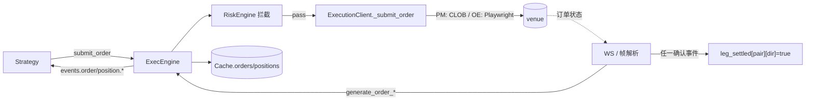
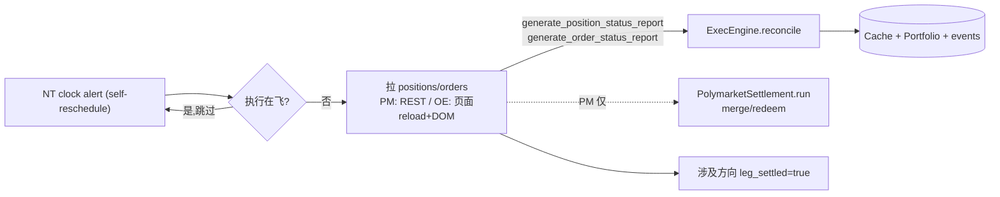
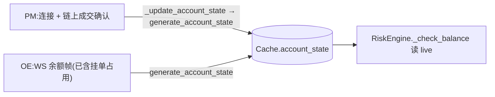
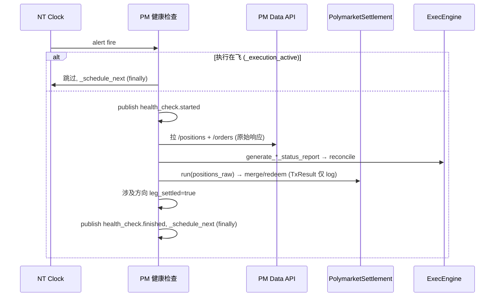

# Execution 组件详细设计

> **定位**:详细设计,面向代码落地。设计理由/历史见初设 `refactor.md §5.5 / §5.8 / §6.8`(Q13/Q15/Q17/Q18/Q19)。
> 冲突时:**有把握 → 以本文为准并回写 `refactor.md` 修订记录;没把握 → 提出讨论,不擅自定**。
> 对应初设 Step 5 + merge/claim(§5.8)+ 健康检查(§6.8)。

---

## 1. 职责与边界

| 组件 | 基类 | 职责 |
|---|---|---|
| **PM ExecutionClient** | 上游 `PolymarketExecutionClient` **薄子类** | 订单 IO(CLOB,上游现成)+ 账户状态(事件驱动)+ reconcile reports + **PM 健康检查**(report 对账 + merge/redeem settlement)+ `leg_settled` 维护 |
| **OE ExecutionClient** | 自写 `LiveExecutionClient` | 订单 IO(Playwright 提交)+ **订单帧解析**(现 stub→实写)+ 账户状态(WS 余额帧)+ reconcile reports + `leg_settled` 维护 |
| `PolymarketSettlement` | 普通类 | merge/redeem 编排(被 PM 健康检查调用,见 §4.6) |

**单一职责契约(Q13)**:execution = **执行 + 追踪**,不做决策。一次 session 单一职责;**移除内部 recovery loop**;补救 / 撤后再下 / 单腿失败补偿 **全归 Strategy**。

**OE 健康检查的宿主**:页面 reload 机制代码住 `OrbitExchDataClient`(它持 page),但本质是**执行完整性**,故在本文档 §4.3 一并描述;data 组件文档只引此处。

**不做**:recovery / re-plan / retry;裸单补救;跨腿对冲。

---

## 2. 数据流

### 2.1 下单 + 回写



### 2.2 健康检查 reconcile(走 NT report 通路,§4.3)



### 2.3 账户状态维护


> 健康检查**不拉余额**(Q17):PM 完全靠事件、OE 完全靠 WS。可用余额由 RiskEngine 按 venue 非对称自算(详见 risk 文档)。

---

## 3. 接口设计

### 3.1 PM ExecutionClient(`adapters/polymarket/execution.py` 薄子类)

上游 `PolymarketExecutionClient` **已实现**(直接用):`_submit_order`/`_cancel_order`/`_modify_order`(`py_clob_client` 签名,天然修 `order_version_mismatch`)、`generate_order_*`(WS USER channel 回写)、`_update_account_state`、`generate_order_status_reports`/`generate_position_status_reports`。

**子类新增**:
```python
class ArbPolymarketExecutionClient(PolymarketExecutionClient):
    def __init__(...):
        self._settlement = PolymarketSettlement(contract_service, ...)   # §4.6
        self._leg_settled: dict[str, list[bool]] = {}                    # §4.4
        # 健康检查 NT clock 自重排 alert(§4.3)
    def _on_health_check_tick(self, event): ...     # reconcile + merge/redeem + leg_settled
    def _schedule_next_health_check(self): ...      # finally 内重排
```

### 3.2 OE ExecutionClient(`adapters/orbitexch/execution.py` 自写)

```python
class OrbitExchExecutionClient(LiveExecutionClient):
    # NT 契约(自写,Playwright 经 manager.get_page("execution"))
    async def _submit_order(self, command: SubmitOrder) -> None: ...
    async def _cancel_order(self, command: CancelOrder) -> None: ...
    async def _modify_order(self, command: ModifyOrder) -> None: ...
    # reconcile
    async def generate_order_status_reports(...) -> list[OrderStatusReport]: ...
    async def generate_position_status_reports(...) -> list[PositionStatusReport]: ...
    # `general` 频道帧解析(2026-05-22 实测抓帧锁定,见下)
    def _on_general_frame(self, msg): ...   # parser.parse_general_frame → 按 type 分派
    def _on_balance_frame(self, parsed): ...          # type=balance → generate_account_state
    def _on_current_bets_frame(self, parsed): ...     # type=current_bets → generate_order_*/reports
```

**OE `general` 频道帧格式(2026-05-22 实测,`message_parser.parse_general_frame` 已实现 + 测试)**:
- 同一个 `general` WS(SockJS,下行 `a[...]`)承载**多类帧,按顶层 key 分型**,未知 key 忽略:
  - `{"BALANCE":{"balance":"37.49","avBalance":null}}` → 账户余额(`balance` 是**字符串**;WS 侧**已含挂单占用**,RiskEngine 不再减,Q17)→ `generate_account_state`。
  - `{"CURRENT_BETS":[<bet>,...]}` → 当前注单 → `generate_order_*` / position report。
- 上行订阅请求 `["{\"BALANCE\":{\"subscribe\":true,...}}"]`(无 `a`、无数据)。
- **已确认**:帧 envelope + 分型 + BALANCE schema(`tests/arbitrage/adapters/orbitexch/test_ws_general_frames.py` 8 passed)。
- **`CURRENT_BETS` 单 bet item schema —— 2026-06-06 live 抓帧实测确认**(place_and_cancel 真单 live 时 odds_client 抓到):
  ```
  {"offerId":"221832455","selectionId":"19924823","averagePrice":0.0,"profitNet":"0.00","liability":"0.00"}
  ```
  - **修正旧假设**:订单 join key 是 **`offerId`(== NT order 的 `venue_order_id`**,executor 下单时从响应 `offerIds` map 写入),**不是** `marketId`(`marketId` 是分组键)。
  - **完整字段(权威来源 = 老 `orchestrator`/`tracker`/`odds_client` 实读,非精选 debug log)**:`offerId`/`marketId`/`selectionId`/**`side`(BACK/LAY)**/**`sizePlaced`(原始量)**/`sizeRemaining`(>0 → working)/`sizeMatched`(累积成交,>0 → position)/`averagePrice`/`price`/`placedDate`/`profitNet`/`liability`。⚠️ 早先误判"bet 无 side"(只看了 odds_client 那条**精选 5 字段** debug log)——实际 bet **自带 `side`/`sizePlaced`**,reconcile 可直接用、无需反查 NT order(支持外部/重启单)。**字段语义单一真理源 = 老代码**;exec 侧 `current_bets_to_fills`/`bet_order_progress` 复用语义、产 NT 事件/report。
  - **仅 unmatched 态已实测**;**matched 态填充值**(sizeMatched>0/averagePrice>0)待**真成交**确认([[gap_c_oe_exec_live_validated]])。
```python
# (上方 OrbitExchExecutionClient 续)
```

### 3.3 消息接线(订阅 / 发布)

| 方向 | 内容 |
|---|---|
| **接收**(NT 管道路由) | `SubmitOrder` / `SubmitOrderList` / `CancelOrder` / `ModifyOrder` |
| **接收**(订阅 topic) | `execution.*` 镜像不需要(自己是发起方);健康检查订 `execution.*` 以让路(见 §3.4) |
| **发布**(NT 标准) | `generate_order_*` → `events.order.{strategy_id}`;`generate_account_state` → `AccountState`;reconcile 经 ExecEngine 发 `events.position.*` |
| **发布**(同步,§6.10) | session:`execution.started`(submit 时)/ `execution.finished`(terminal/timeout);PM 健康检查:`health_check.started/finished` |

### 3.4 同步参与(Q19 / §6.10,详见 `_cross-cutting`)

- **execution session**:submit 时 publish `execution.started` + 置 `_execution_active`(首个 await 前同步);terminal **或** timeout 时 publish `execution.finished` + 清(放 `finally`,两条路径都清,防健康检查永久饿死)。
- **PM 健康检查 tick**:开头 `if _execution_active: 跳过`;否则 publish `health_check.started`→ 跑 → `finally` publish `health_check.finished`。
- 单 asyncio loop 串行,置位/清位纪律见 §6.10。

---

## 4. 机制

### 4.1 Execution session(Q13)+ leg_settled 触发

| Session | 触发 | 动作 | 终点 |
|---|---|---|---|
| **cancel-only** | submit 时 instrument 上有**残留挂单** | 撤残留挂单,**丢弃**当次 submit | venue 推 CANCELED **或** timeout |
| **submit+track** | submit 时无残留 | 下单 → 追踪 | terminal(FILLED/CANCELED/REJECTED/EXPIRED)**或** timeout |

- cancel-only 当次 submit **直接丢弃**(不排队、不延后);Strategy 每轮全量重算(快照 Q20),下轮自行重发。
- 收到**任一** venue 确认事件(OrderAccepted / partial Fill / 全成 / Canceled / Rejected)→ 对应方向 `leg_settled=true`(§4.4)。

### 4.2 Tracking timeout(Q15,NT clock 绝对超时)

```python
def _start_session(self, coid):
    self._clock.set_time_alert_ns(f"exec_timeout_{coid}",
        self._clock.timestamp_ns() + secs_to_nanos(self._config.session_timeout_sec),
        callback=self._on_session_timeout)              # 绝对超时,从启动起算
def _on_order_terminal(self, coid):
    self._clock.cancel_timer(f"exec_timeout_{coid}")    # terminal 抢先取消
def _on_session_timeout(self, event):
    # 超时即结束 session,不撤不重试;order 在 venue 保持当时状态,留给 strategy 下一轮
    self._log.warning(f"Session timeout: {event.name}")
```
- **绝对超时**:partial / OrderAccepted **不重置** timer。
- 全局唯一超时配置(per-venue 不分);cancel session 超时仅 log warning。
- terminal 与 timeout 都触发 session 结束 → 都 publish `execution.finished` + 清 `_execution_active`。

### 4.3 健康检查(§6.8.3 / §6.8.4,loop 节奏 §6.8.4.5)

**统一 loop 节奏(OE/PM 共用)—— ✅ 已落地 `src/arbitrage/execution/health_check.py:HealthCheckLoop`(10 passed)**:NT `Clock` 自重排 one-shot alert —— sync callback → `loop.create_task(_tick)`;`_tick`(async)`try` 跑检查(`run_check` 失败吞掉不打断)+ `finally` 按**当前** interval 重排下次 alert(异常路径也重排,不永久卡死);`trigger_now()` 立即触发;`stop()` 取消 timer。**无** `asyncio.Event`/`monotonic`/block-unblock。
- **间隔 OE/PM 分别可设(用户 2026-05-22)**:`interval_secs_provider` 为**每实例独立** callable,每次重排时重读 → PM/OE 各自配置、运行时改值即时生效。配置落位:PM = PM ExecClient config 的 `health_interval_secs`,OE = OE DataClient config 的 `health_interval_secs`(各自字段,随 PM/OE 客户端落地接线)。
- **执行 ⊥ 健康检查互斥(Q19/§6.10)**:`is_execution_active` callable —— PM 传 `lambda: self._execution_active`(同对象);OE 传 msgbus 订阅 `execution.*` 维护的 ref-count 标志(DataClient 与 ExecClient 不同对象)。执行在飞 → 整 tick 跳过(不 publish `health_check.*`),但仍重排。
- `run_check` 是宿主真实检查(async):PM 拉 positions/orders→reports + settlement + leg_settled;OE 页面 reload→reports。宿主接线随 PM/OE 客户端落地。

| | OE 健康检查(宿主 `OrbitExchDataClient`) | PM 健康检查(宿主 PM ExecClient 子类) |
|---|---|---|
| 触发 | 时间维度(competition 页面 `clock.timestamp_ns()-last_update_ns>阈值`,**仅 tick 评估,不立即刷新**)+ 状态维度(`leg_settled=false`) | 默认周期 + 外部事件可立即触发 |
| 动作 | 页面 reload → 重订阅 → 拉持仓/挂单(**不拉余额**) | 拉持仓/挂单(**不拉余额**) |
| 回写 | `generate_position_status_report`/`generate_order_status_report`(NT report 通路) | 同 + **merge/redeem**(§4.6) |
| 收尾 | 涉及方向 `leg_settled=true` | 同 |

- **走 NT report 通路(非直接覆盖 cache)**:保证 Order 状态机推进 / Position 派生 / Portfolio 一致 / Strategy 收 `events.*`(避免私有覆盖的 4 项隐藏代价)。
- 执行在飞时整个 tick 跳过(§3.4 / Q19)。

### 4.4 leg_settled 语义(§6.8.2)

- 含义 = **execution 启动后通讯通道存活信号**(非"已完全成交")。
- `true` = 至少一次 venue 确认事件已落 cache(任何状态都算);`false` = "execution 启动但从未收到该腿任何事件"(submit 没到 / WS 死)——这才是健康检查兜底刷新的价值。
- 结构:`dict[pair_id, dict[instrument_id, bool]]` —— **腿键 = `instrument_id`**(一个 instrument = 一条腿,全局唯一,**不需 方向→下标 映射**;2026-05-22 定,取代原 `list[bool]`+整数下标)。**首次 execution 创建,不删,每次新 execution 用本轮提交的腿 instrument_id 集合整组重置 false**;非 execution 触发事件不创建 entry,但命中已有 entry 时也置 true(未知 instrument 忽略)。
- 写入侧:execution client 覆盖 `generate_order_*`(均 NT `cpdef void`,可子类覆盖)→ 拿 `order.instrument_id` + `info["competition"]` 解析 pair_id → `mark(pair_id, instrument_id)`;`_begin_session` 用本轮腿集合 `reset(pair_id, instrument_ids)`。
- 消费方:Strategy settled pre-check、ArbitragePortfolio settled gate(见 risk 文档 §4.2),只问 `any_unsettled(pair_id)`,与腿键无关。
- 共享对象 `LegSettledRegistry`(`src/arbitrage/common/leg_settled.py`):`reset(pair_id, instrument_ids)` / `mark(pair_id, instrument_id)` / `any_unsettled` / `all_settled` / `has_entry`。

### 4.5 账户状态维护(Q17)

| Venue | 方式 | 触发 |
|---|---|---|
| PM | 主动 REST `get_balance_allowance` → `generate_account_state` | **连接时 + 链上成交确认**(`POLYMARKET_FINALIZED_TRADE_STATUSES`);**无周期 timer、健康检查不拉** |
| OE | WS 余额帧(已含挂单占用)→ `generate_account_state` | 被动 reactive(Step 5 实写第三类 WS 帧捕获) |

可用余额的"扣挂单"逻辑在 **RiskEngine**(PM 自扣 / OE 信 WS),非本组件。

### 4.6 settlement: merge / claim(§5.8,Q18)

**三层结构(Q18c)**:
```
PM ExecClient 子类(宿主+触发:健康检查 tick 内调)
  └─ PolymarketSettlement(编排:按 condition 分组 / min 取量 / redeemable 门控)
       └─ contract.py:PolymarketContractService(链上 IO:Builder Relayer 调 mergePositions/redeemPositions)
```
> **落地(2026-05-22)**:编排层 = `src/arbitrage/settlement/settlement.py`(app 代码,`run(positions: list[SettlementPosition]) → SettlementResult`;失败吞进 `result.errors` / `TxResult.success=False` 仅 log,不抛、不作健康判据);IO 层 `contract.py` 留在 adapter 目录。健康检查宿主把 /positions 原始响应映射成 `SettlementPosition(condition_id, size, neg_risk, redeemable)` 传入。已 11 passed(FakeContract,见 settlement README)。
- **并入 PM 健康检查 tick**,复用其 `/positions` 拉取(**原始响应**含 `redeemable`/`mergeable`/`neg_risk`——NT cache 没有);**无独立 Actor/调度**。
- **merge**:同 condition ≥2 outcome 持仓 → `merge_positions(condition, min(sizes), neg_risk)`;**redeem**:`redeemable=true` → `redeem_positions(...)`(结算滞后由周期性兜住)。
- **`TxResult` 不作健康判据**:失败仅 log + 下次 tick 重试(幂等),不影响 `venue_connected`/`leg_settled`。
- 结果回流靠下次 reconcile + way_rebate pull,不发事件、不直接改 cache。

---

## 5. 与横切的咬合

| 横切 | 约束 |
|---|---|
| Q19 同步(§6.10) | session 发 `execution.*`;PM 健康检查发 `health_check.*` + 执行在飞跳过;OE 健康检查同理 |
| Q20 快照 | execution 不读 strategy 快照;leg_settled 是 live 安全信号,strategy pre-check 读 live |
| Q17 余额 | 账户状态本组件维护写 cache;可用余额计算在 Risk |
| §6.6 Debug | ✅ #40 落地:`SkipExecution{PM,OE}Client`(`src/arbitrage/debug/execution_clients.py`)子类化 `_submit_order`;`is_override_active("skip_execution")` 真时跳 `_begin_session` + 真 venue,直接 `generate_order_accepted` + `generate_order_filled` mock 全成交(PM=USDC_POS / OE=GBP,commission=0,liquidity=TAKER);否则透传 super。PM/OE exec factory 读 `ArbContext.debug_config` 分支(`enabled` → 装 Skip 子类传 `debug=cfg`)。**不实现订单 lifecycle 时序**(Q11.4 `timeline.py` 仅在真需要部分填 / 拒单 / 撤单时序时才做)。`skip_settlement`(健康检查路径不真上链)待后续。详见 `_cross-cutting/debug-injection.md` |
| §6.7 锁 | 上游 ClobClient 不加外层锁(初版);遇问题再子类化只对写操作加锁 |

---

## 6. 时序

### 6.1 submit+track session 生命周期

```mermaid
sequenceDiagram
  participant ST as Strategy
  participant EC as ExecutionClient
  participant CK as NT Clock
  participant V as venue
  ST->>EC: SubmitOrder(经 RiskEngine)
  EC->>EC: publish execution.started, _execution_active=true
  EC->>CK: set_time_alert exec_timeout_{coid}
  EC->>V: _submit_order
  V-->>EC: OrderAccepted (WS/帧)
  EC->>EC: leg_settled[dir]=true; generate_order_accepted
  alt 成交 terminal
    V-->>EC: OrderFilled
    EC->>CK: cancel_timer exec_timeout_{coid}
    EC->>EC: publish execution.finished, _execution_active=false (finally)
  else 超时
    CK-->>EC: _on_session_timeout
    EC->>EC: session 结束(不补救), publish execution.finished (finally)
  end
```

### 6.2 PM 健康检查 tick



---

## 7. 落地清单(Step 5 实施)

**PM(薄子类,上游为主)—— ✅ 子类骨架落地 `nautilus_trader/adapters/polymarket/arb_execution.py:ArbPolymarketExecutionClient`(集成 /live-test 验)**:
- [x] `class ArbPolymarketExecutionClient(ArbExecutionSessionMixin, PolymarketExecutionClient)`(MRO 验过:mixin 在上游前)+ `_init_arb_session` + 建 `HealthCheckLoop`(PM `health_interval_secs`,`lambda: self._execution_active`)+ 持 `PolymarketSettlement`
- [x] `_submit_order` 接 `_begin_session`;`_cancel_residual_orders` 建 `CancelOrder`→上游 `_cancel_order`;`_connect/_disconnect` 起停 health loop;`_run_health_check`(positions_fetcher→settlement.run + leg_settled.mark)
- [x] 位置:**`nautilus_trader/adapters/polymarket/arb_execution.py`**(P9 唯一例外:venue-coupled 代码住 adapter 目录;**与上游 `execution.py` 同目录但不同文件名**避 upstream merge 冲突;#33 校准,settlement orchestration 仍按 Q18c 在 `src/arbitrage/settlement/`)。Data API /positions 拉取**注入** `positions_fetcher`(launcher 接,复用旧 `odds_client.fetch_positions` 的 `PolymarketPosition`);纯映射 `pm_position_to_settlement` 已单测
- [ ] **/live-test 验**:真 `ClobClient`/`ws_auth` 构造、`_submit_order`/`_run_health_check` 跑通;`order_version_mismatch` 已消失(memory bug);reconcile 走 NT report 通路(集成点,§4.3)
- [ ] settlement creds 注入(钱包与 execution config 共享 + builder/relayer);`_execute_with_proxy` monkey-patch 线程安全(单 loop 串行确认)

**OE(全自写)—— ✅ 客户端骨架 `nautilus_trader/adapters/orbitexch/execution.py:OrbitExchExecutionClient`(集成 /live-test 验)**:
- [x] `class OrbitExchExecutionClient(ArbExecutionSessionMixin, LiveExecutionClient)`(离线可构造:super 只需 instrument_provider+标准 NT 依赖,browser 仅 `_connect` 用);`_submit_order` 接 `_begin_session` + 结果映射(成功→`generate_order_accepted`/失败→`rejected`);`_modify_order`→`generate_order_modify_rejected`(OE 不支持改单)
- [x] **`general` 帧分型 + BALANCE 解析**(`parse_general_frame`,8 passed)+ **`_on_general_frame`:BALANCE→`generate_account_state`**(`oe_balance_to_account_balances`:WS 已净挂单 → total=free,GBP;已测)
- [x] **Gap C 接线已写(#63,代码 + 离线单测;NT-node /live-test 待验)**:`_connect`(共享 BM `create_page("execution")` + 登录 `/customer/` + `OrbitExchExecutor` + general WS `on_order_update(_on_general_frame)` + 初始 account state)、`_login`、`_place_via_executor`(`nt_order_to_legacy_order`:market_id/selection_id 取自 OE instrument)、`_cancel_order`/`_cancel_all_orders`/`_cancel_residual_one`(executor + `generate_order_canceled/_cancel_rejected`)。**注**:`place_and_cancel` scenario 跑老 `services/` 栈,**不验 NT client**;Gap C live 验需 `launchers/arb_node.py`([[gap_c_oe_exec_live_validated]])
- [x] **`_on_current_bets` → `generate_order_filled`(回执核心已实写)**:`current_bets_to_fills` 纯函数(快照非增量 → `offerId` 算 `sizeMatched` delta;`test_execution_translation.py` 7 case)+ `_on_current_bets`(`offerId==venue_order_id` 反查 NT order → `generate_order_filled`,last_px=averagePrice,liquidity=MAKER 假设);accepted 由 `_submit_order` 同步发、撤单由 `_cancel_*` 发,此处只补成交;leg_settled 经 mixin `_send_order_event` 漏斗自动标记
- [x] **`generate_order_status_report(s)`(reconcile 已实写 + hardened)**:`_on_current_bets` 把 CURRENT_BETS 快照缓存到 `self._current_bets`;reports 遍历快照,`bet_order_progress`(纯函数:sizeRemaining/sizeMatched → accepted/partially_filled/filled,**bet 自带 `side`/`sizePlaced` 直接派生**)→ `_build_order_report` 优先用 bet 的 `side`(BACK→BUY/LAY→SELL)、`market_id+selection_id` 反查 instrument、`sizePlaced`/`price` —— **NT order 不在 cache(外部/重启单)也能出 report**;NT order 在则用其更权威的 qty/price。`test_execution_translation.py` reconcile +7 case。`generate_fill_reports`/`generate_position_status_reports` **有意返 []**(OE WS 无逐笔成交回放;持仓由 NT Portfolio 从 fills 自派生 + BALANCE 帧对账 Q17)
- [ ] **待真成交验**:matched 帧填充值 + fill 的 MAKER 假设;OE 健康检查页面 reload(reconcile 前刷新 CURRENT_BETS,宿主 DataClient,另落);Gap C 整体 NT-node /live-test

**Launcher 接线 —— ✅ ArbContext + 自定义 factory(`adapters/polymarket/arb_factories.py` + `adapters/orbitexch/factories.py`,3 passed)**:
NT `LiveExecClientFactory.create(loop, name, config, msgbus, cache, clock)` 签名固定,**经
`src.arbitrage.bootstrap.ArbContext` 进程级共享件注入**额外依赖(leg_settled / settlement /
positions_fetcher / 间隔)—— 同 `install_arbitrage_engines` 的 import-替换思路。

启动顺序(launcher):
1. `install_arbitrage_engines()` —— 替换 kernel.Portfolio / .LiveRiskEngine
2. `node = TradingNode(config)` —— kernel 原生构造 Arbitrage 子类
3. `prepare_arb_context(leg_settled=, pm_settlement=, pm_positions_fetcher=, pm_health_interval_secs=, oe_health_interval_secs=, ...)` —— 填好共享件
4. `node.add_exec_client_factory("POLYMARKET", ArbPolymarketLiveExecClientFactory)`、`("ORBITEXCH", ArbOrbitExchLiveExecClientFactory)`
5. `node.build()` —— factory.create 读 `get_arb_context()` 构造 Arb*ExecutionClient(注入 leg_settled/settlement/fetcher/间隔);**漏调 prepare 早失败**(`RuntimeError: ArbContext.leg_settled is None`)
6. `wire_arbitrage_runtime(node, params=)` —— configure_arb;不传 leg_settled 时**复用 context 那份**(execution 与 portfolio/risk 同一对象)
7. `node.run()`

**共用 —— ✅ session 核心已落地(`src/arbitrage/execution/session.py`,8 passed)**:
- [x] `ArbExecutionSessionMixin`:`_begin_session`(残留检测 → cancel-only 撤残留+`generate_order_rejected`丢弃 / submit+track)、覆盖**唯一漏斗 `_send_order_event`**(NT cpdef,所有 order event 经此)做 leg_settled 标记 + 终态检测
- [x] tracking timeout(NT clock 绝对超时,terminal 抢先 `cancel_timer`;超时即结束不补救)+ `execution.started/finished` publish + `_execution_active` = 在飞 session 数(ref-count,§6.10)
- [x] leg_settled(§4.4):submit+track `arm(pair,instrument_id)`;venue 确认事件 `mark`;终态 = 全成(累计 fill≥qty)或 Canceled/Rejected/Expired
- [ ] 宿主接线:PM 子类 / OE 客户端 `_submit_order` 调 `_begin_session`、`__init__` 调 `_init_arb_session`、覆盖 `_cancel_residual_orders`(venue 撤单 IO)
- 测试:`tests/arbitrage/execution/test_session.py`(8 passed);宿主接线随 PM/OE 客户端落地

> **待核实**:~~OE `CURRENT_BETS` 单 bet item 字段~~(2026-06-06 已实测确认,见 §3.2:`offerId` 是订单 join key);**仍待**:matched 态填充值 + liquidity=MAKER 假设(真成交验);merge/redeem 频率是否要低于健康检查 tick。
