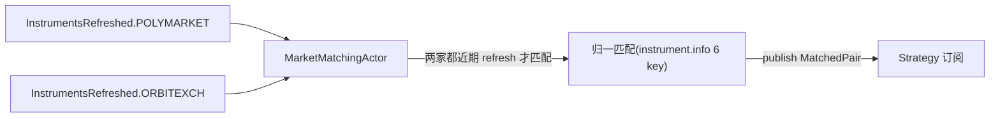

# Matching 组件详细设计(占位)

> **状态:占位**。初设 `refactor.md §5.3` 仅到**概要**。按 **P7**,只记职责 + 数据流骨架 + 已锁点 + 待展开;真启动 Step 3 时按标准模板详化。
> 对应初设 Step 3(MarketMatchingActor)。

## 1. 职责

`MarketMatchingActor`(NT `Actor`)—— 跨 venue 把 PM(`BinaryOption`)与 OE(`BettingInstrument`)**异构 instrument 归一匹配**成 `MatchedPair`,供 Strategy 订阅。算法(`EventNormalizer` / `MatchEngine`)保留自研(P2:NT 没有的领域 IP),外壳换成 NT Actor。

## 2. 数据流骨架

## 3. 已锁点

- **Q9** 异构归一:**不依赖具体 instrument 类型**,只读 `instrument.info` 6 统一 key(sport/competition/home_team/away_team/start_ts/selection_role)→ 对 PM/OE 完全对称,新增 venue 不改 MatchingActor
- **触发**:订阅两家 `InstrumentsRefreshed`,**两家都有近期成功 refresh 才匹配**(避免用对方旧数据)
- **Q4** 单 venue 失败不发 `InstrumentsRefreshed` → 自然 gate 住匹配
- **Q5** "近期"窗口 = `2 × refresh_interval`(留一次 retry 缓冲)

## 4. 待 Step 3 启动展开

- 匹配算法细节(`EventNormalizer` 队名归一 / `MatchEngine` 配对规则)平移
- 启动时全量匹配 vs 增量匹配
- `MatchedPair` 事件 schema(含哪些腿、pair_id = competition)
- 详细接口 / 时序 / 消息接线(标准模板 7 节)
