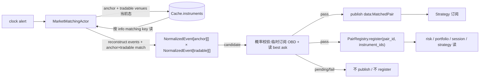
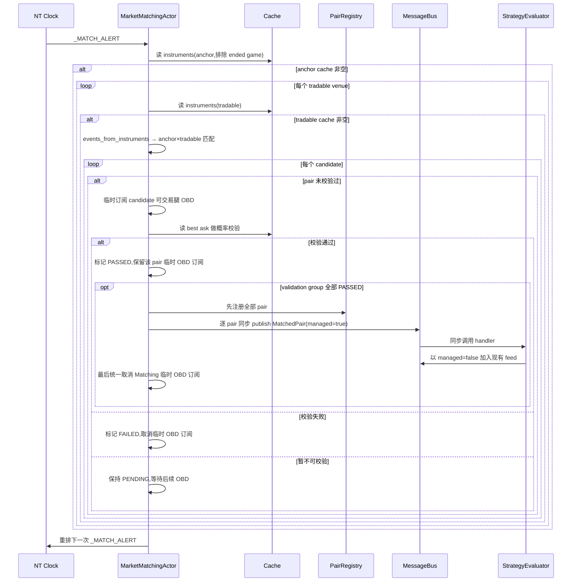

# Matching 组件详细设计

> 设计理由 / 决策史(Q5/Q9 + #34 pair_id 修正)见初设 `refactor.md §5.3`。
> 冲突时:**有把握 → 以本文为准并回写;没把握 → 提出讨论**。对应初设 Step 3。
> Venue 插拔第二阶段的能力/enablement 真理源见
> `_cross-cutting/venues.md`;本文只描述 Matching 当前如何消费 anchor/tradable venue。
> PMSPORTS synthetic event anchor 的后续设计见
> `_cross-cutting/sports-event-anchor.md`;当前已落地 PMSPORTS synthetic discovery + Matching 聚合路径,`MatchedPair` 已有明确的 anchor/tradable/venue 分组字段,旧 PM/OE 输出字段已删除。

---

## 1. 职责与边界

| 件 | 基类 | 职责 |
|---|---|---|
| `MarketMatchingActor` | NT `Actor` | 自 clock timer 读 cache:读取 `anchor_venue` + 逐个 `tradable_venues` 跑归一+匹配 → 生成 pair candidate → 概率校验通过后 publish `MatchedPair` + 注册 `PairRegistry`;dispatcher 显式配置 PMSPORTS anchor + enabled tradable venues |
| `PairRegistry` | 普通类(`src/arbitrage/common/`) | **横切共享件**(P11,共享 registry 模式):MatchingActor 写、risk/portfolio/strategy/session 读;可交易腿与 non-tradable anchor id 分槽登记 |
| `_event_from_legs` | 模块函数 | 从同 instrument.info 同 venue、同 event 的多条腿反推一个事件视图(供算法用) |
| `MatchEngine` | 普通类(算法平移自旧 `services/market_matching/engine.py`) | sport+competition 分组 → 组内 anchor↔单个 tradable venue 队名 confidence 匹配(`get_similar` 命中数 / 两侧较长 token 数)+ 全候选贪心 + competition max_matches;`MatchResult` 只暴露 `anchor_event` / `tradable_event` |

**#34 修正**:`info["competition"]` 是**联赛名**(EPL/NFL/...),**不是** pair_id(老 `MatchedPair.pair_id` 是基于 PM event_id 生成的稳定 ID,是 matching 的产出)。`info` 的 matching key 是**匹配输入**;`pair_id` 由 matching 算出并通过 `PairRegistry` 暴露给下游。

**不做**:
- ❌ instrument 注册时不预填 pair_id(matching 是其唯一产出方)
- ❌ 不依赖具体 instrument 类型(BinaryOption / BettingInstrument),只读 `info` matching key,新增 venue 不改算法
- ❌ 下游不应读取旧 `pm_instrument_ids` / `oe_instrument_ids`;真实归属以 `venue_instrument_ids` 为准

**已落地(#127)**:
- `MarketMatchingConfig` 只接受 `anchor_venue` / `tradable_venues`;旧 `pm_venue` / `external_venues` / `oe_venue` 输入字段已删除。
- `PairRegistry.register(..., anchor_instrument_ids=...)` 支持把 non-tradable anchor id 单独登记;`instrument_ids_for_pair()` 默认仍只给 Strategy/Risk/Portfolio 返回可交易腿。
- dispatcher 当前输出 `anchor_venue="PMSPORTS"`、`tradable_venues=enabled_tradable_venue_ids(cfg)`;PM/OE/SE 均作为可交易 venue 匹配到 PMSPORTS event anchor。
- 当 anchor event 标记 `info["tradable"] is False` 时,MatchingActor 按同一 anchor event 聚合所有已匹配 tradable venues 后发布一个 `MatchedPair`,避免 Strategy 收到单 venue pair。

---

## 2. 数据流



要点:
- **触发**:#59 后由 NT clock 自重排 timer 驱动,不再订 `InstrumentsRefreshed`。
- **anchor + tradable venue latch**:`anchor_venue` cache 非空才配;每个 `tradable_venues` 各自非空即可与 anchor 匹配,某个 tradable venue 缺失不阻塞其它 tradable venue。未配置 anchor/tradable 时不匹配。PMSPORTS non-tradable anchor 路径会把同一 anchor 下的所有 tradable venue 腿聚合成同一个 pair。
- **PairRegistry 写**:matching 是**唯一写者**;只有概率校验通过的 pair 才 register。register 时把可交易腿 instrument_id → 同一 pair_id;若 anchor 是 non-tradable,通过 `anchor_instrument_ids` 单独登记。
- **概率校验**:匹配 candidate 先由 MatchingActor 临时订阅对应可交易腿 OBD;各 venue 的互斥腿 ask 概率和都 `<= probability_validation_clean_sum` 后,再用跨 venue 各 outcome 最优 ask 概率和校验。通过后 publish/register,失败后保持 failed 记录并不再重复发布。

---

## 3. 接口设计

### 3.1 `PairRegistry`(`src/arbitrage/common/pair_registry.py`)

横切共享件,launcher 构造一份注入 matching(写)+ risk/portfolio/session(读)。**单进程单 loop,纯内存,无序列化**。

```python
class PairRegistry:
    def __init__(self):
        self._by_instrument: dict[str, str] = {}   # 可交易腿,key = str(instrument_id)
        self._by_anchor: dict[str, str] = {}       # non-tradable anchor,key = str(instrument_id)
    # matching 写
    def register(self, pair_id: str, instrument_ids: list, *, anchor_instrument_ids=()) -> None: ...
    # #228:内部 `_by_anchor` 为 anchor iid → set[pair_id] 多值(PMSPORTS 唯一锚在 3-way
    # 拆出的多个 role pair 重复登记);可交易腿仍严格一对一。`get(anchor_id)` 兜底返回
    # 排序后第一个 pair(确定性)。
    def unregister_pair(self, pair_id: str) -> None: ...
    # consumers 读
    def get(self, instrument_id) -> str | None: ...                # 可交易腿 / anchor 均可反查
    def instrument_ids_for_pair(self, pair_id: str, *, tradable_only: bool = True) -> set[str]: ...
    def anchor_ids_for_pair(self, pair_id: str) -> set[str]: ...
    def all_pair_ids(self) -> set[str]: ...
```
> **#58 key 归一 str**:matching 写 `str(leg.id)`,消费者(risk/portfolio/session)用 `InstrumentId` 对象查 → `register`/`get` 两侧 `str()` 归一才命中(否则 dict 恒 miss)。snapshot 反查后在 cache 边界转回 `InstrumentId`(`strategy/snapshot.py:_as_instrument_id`)。
> **#116 pair→instrument 反查**:`instrument_ids_for_pair(pair_id)` 供 Portfolio 从 cache instrument.info 读取该 pair 的完整 outcome 集合,避免三元盘某 outcome 暂无持仓时被 Risk profit gate 漏算。
> ⚠️ 受 #228 影响,"三元盘一个 pair 含 3 outcome"的假设失效:3-way 拆为 3 个二元 pair 后,每个 pair 恰好 2 个 outcome,盈亏在 market 内闭合;反查接口保留,但"三元盘漏算"场景不复存在(见 risk 架构对应节)。
> **#127 anchor 分槽**:`instrument_ids_for_pair()` 默认只返回可交易腿;PMSPORTS synthetic event anchor 等 non-tradable id 只通过 `anchor_ids_for_pair` 或 `tradable_only=False` 暴露给 matching/lifecycle。

### 3.2 `MatchedPair`(`src/arbitrage/matching/events.py`)

NT `@customdataclass` Data 类,走 msgbus pub/sub:

```python
@customdataclass
class MatchedPair(Data):
    pair_id: str
    event_key: str             # 所属 event(#228:`competition|home|away`;2-way 时 == pair_id 基础部分)
    sport: str
    competition: str           # 联赛名(非 pair_id;#34)
    outcomes: list[str]        # pair 的互斥 outcome 集,统一为 `["yes","no"]`
    confidence: float          # total_confidence = home_confidence + away_confidence
    anchor_instrument_ids: list[str]       # non-tradable anchor,如 .PMSPORTS
    tradable_instrument_ids: list[str]     # strategy/risk/portfolio 消费的可交易腿
    venue_instrument_ids: dict[str, list[str]]  # venue -> 可交易腿
    order_books_managed: bool              # Matching 是否已建立 managed books，供 Strategy 接管
```

> **#228 pair=market 不变量**:`pair_id` 是 **market 级**语义(strategy/risk/execution 的套利单位),
> 每个 pair 恰好两个互斥 outcome(`outcomes` 声明),pair 内**每 venue 每 outcome 恰好一条**可交易
> instrument 腿。event 级聚合(一场比赛)由 `event_key` 表达,仅用于匹配、连坐 eviction 与展示分组。
> 2-way:一场比赛一个 market,pair_id=event_key(现状不变)。3-way:一场比赛 3 个 market
> (home/draw/away 各一),拆 3 个 pair(§4.2.2);PMSPORTS 每场唯一的合成锚在每个 role pair 的
> `anchor_instrument_ids` 重复登记(锚是 event 级的,一对多复用)。已落地 2026-07-15。

`venue_instrument_ids` 是当前主通路;`MarketMatchingActor` 发布事件时只维护
`venue_instrument_ids` / `tradable_instrument_ids` / `anchor_instrument_ids`。
`MatchedPair.__post_init__` 只允许从 `venue_instrument_ids` 补 `tradable_instrument_ids`;
事件 schema 不再携带 `pm_instrument_ids` / `oe_instrument_ids`,也不从 instrument id 后缀反推主字段。
这样旧字段缺失或错误不会掩盖 `venue_instrument_ids` 主通路是否真实接通。
3+ venue 下,消费者必须读 `venue_instrument_ids`;Strategy 订阅行情和快照入口必须读
`tradable_instrument_ids`,不能把 `.PMSPORTS` 等 `anchor_instrument_ids` 当成可交易腿。

### 3.3 `MarketMatchingActor`(`src/arbitrage/matching/actor.py`)

**#59(slice A)**:发现已迁 DataClient 原生(refresher 退役),matching **不再被 `InstrumentsRefreshed` 触发**,改 NT clock 自重排周期 timer 读 cache。
**#60**:eviction 改由 **PM Sports `SportsGameUpdate` 的 `ended` 事件**驱动(替 #59 的 expiration 扫描;见 §4.4),并订阅之。

```python
class MarketMatchingActor(Actor):
    def on_start(self):
        self._schedule_next()                                  # 排首次 _MATCH_ALERT
        msgbus.subscribe(f"data.{SportsGameUpdate.__name__}*", self.on_data)  # #60 ended → eviction
        msgbus.subscribe("command.arb.refresh_interval", self._on_set_refresh_interval_cmd)  # #119 控制台热改(consumer;契约见 web §8.3)
    def on_stop(self):  self._cancel_alert()
    def on_data(self, data):                                   # #60 + 概率校验
        if isinstance(data, SportsGameUpdate) and data.ended:
            self._evict_game(data.game_id)                     # gameId→pair_id → unregister + _ended_games + 清 validation
        elif isinstance(data, OrderBookDeltas):
            self._try_validate_pair_by_instrument(data.instrument_id)
    def _on_alert(self, event):
        try: self._maybe_match()
        finally: self._schedule_next()                         # clock 自重排(读 refresh_interval_secs)
    def _maybe_match(self):
        anchor = [i for i in cache.instruments(venue=config.anchor_venue or PM)
                  if self._game_id_of(i) not in self._ended_games] # #60:排除已结束 game 的 anchor 腿
        if not anchor: return
        for venue in config.tradable_venues:
            tradable = list(cache.instruments(venue=venue))
            if not tradable: continue                         # 单 tradable venue 缺失不阻塞其它
            # 反推 events → anchor×tradable 匹配 → candidate → 概率校验通过后 emit + register
            # _handle_pair_candidate 填 game_id→pair_ids;_emitted_pairs 只在真正 publish 后记录
```

`MarketMatchingConfig`:字段为 `anchor_venue`、`tradable_venues`、
`refresh_interval_secs`、`competition_max_matches`。旧 `pm_venue` /
`external_venues` / `oe_venue` 输入字段已删除,避免旧入口掩盖 dispatcher 的 keyed
tradable venue 通路。

当前 dispatcher 必须显式设置 `anchor_venue="PMSPORTS"`、`tradable_venues=enabled_tradable_venue_ids(cfg)`。
缺配置时 MatchingActor 不匹配,不再隐式兜底到 PM/OE。

`refresh_interval_secs` = matching 轮询间隔;`competition_max_matches` 保持不变。当前匹配有效性由
`home_confidence > 0 and away_confidence > 0 and total_confidence > 0` 决定。
`probability_validation_enabled` 默认开启;`probability_validation_clean_sum` 默认 `1.05`,
`probability_validation_min_best_sum` 默认 `0.95`。它们只控制 Matching→Strategy 之间的
pair 发布门槛,不进入 RiskEngine。

`_RuntimeDeps`:`pair_registry: PairRegistry`。

> 旧(#52,已退役):订 `data.InstrumentsRefreshed*`(注意 NT publish_data 无 metadata 时 topic 带尾 `*`,#58 修)→ `on_data` → `_both_recent()` 2×window gate。迁 timer 后这些全删。

### 3.4 消息接线

| 类 | 接收 | 发布 |
|---|---|---|
| `MarketMatchingActor` | `data.OrderBookDeltas*`(概率校验临时订阅),`data.SportsGameUpdate*`(ended eviction) | `data:MatchedPair`(匹配且概率校验通过) |
| consumers | strategy 订 `data.MatchedPair*`(NT 带尾 `*` 通配,#58);risk/portfolio/session pull `PairRegistry` | — |

---

## 4. 算法

### 4.1 事件反推(`_event_from_legs`)

从同 venue 同 (competition, home_team, away_team) 的多腿 → 一个 `NormalizedEvent`:
```
key = (info["sport"], info["competition"], info["home_team"], info["away_team"])
events_by_venue.setdefault((venue, key), []).append(instrument)
```

`venue` 统一经 Venue Registry helper `venue_id_from_instrument_id()` 从 NT `InstrumentId`
或兼容字符串后缀解析;测试 fixture 的简化 `instrument.id.venue` 仅作为兼容输入来源。
不从 `instrument.info["venue"]` 兜底,缺 venue 的 instrument 直接跳过。Matching 算法仍只消费归一后的真实 venue id,不直接依赖 PM/OE/SE 类型。

`NormalizedEvent`:venue / sport / competition(league)/ home_team / away_team / home_team_normalized / away_team_normalized / legs。

### 4.2 跨 venue 匹配(平移自旧 `MatchEngine.match_events`)

1. 按 `(sport, competition)` 分组(完全相等)
2. 组内计算所有 anchor×tradable 候选的 home/away/total confidence(`get_similar` 命中 token 数 / 两侧较长 token 数)
3. 按 `(total_confidence,total_matched_chars)` 降序贪心分配;每个 anchor/tradable 事件最多被匹配一次
4. `home_confidence > 0 and away_confidence > 0 and total_confidence > 0` 过滤;`competition_max_matches[comp]` 限制单联赛上限
   `MatchResult.anchor_event` / `tradable_event` 是唯一语义字段。
5. 若 anchor 是 non-tradable(PMSPORTS),MatchingActor 在所有 tradable venue 匹配完成后按 pair_id 聚合:
   `venue_instrument_ids` 按 PM/OE/SE 分组,`tradable_instrument_ids` 放全部可交易腿,
   `anchor_instrument_ids` 放 `.PMSPORTS`;actor 不再维护 `pm_instrument_ids` /
   `oe_instrument_ids` 旧事件字段,真实分组统一以 `venue_instrument_ids` 为准。
   `PairRegistry.instrument_ids_for_pair()` 默认只登记这些可交易腿,`anchor_ids_for_pair()` 单独登记 `.PMSPORTS`。
6. 聚合后的 pair candidate 进入概率校验。校验通过前不写 PairRegistry,也不 publish
   `MatchedPair`,因此 Strategy 不会订阅未校验 pair。

### 4.2.1 概率校验门控(Matching→Strategy)

目标是挡住明显错配的 MatchedPair,不把它交给 Strategy/Risk。该门控属于 Matching,不是
Risk 门控。

状态按 `pair_id` 保存在 `_pair_validations`:
- `PENDING`:已生成 candidate,MatchingActor 对 candidate 的可交易腿临时订阅 OBD,等待可用于校验的 best ask。
- `PASSED`:该 pair 自身已通过，但保留 Matching 临时 managed OBD 订阅；2-way 立即进入交接，
  3-way 等待同一 validation group 的 home/draw/away 全部 `PASSED` 后整组交接。
- `FAILED`:已失败,不 register、不 publish,并取消 Matching 自己的临时 OBD 订阅。进程内 sticky;同 `pair_id` 后续 candidate 直接跳过。

同一个 `pair_id` 已存在于 `_pair_validations` 时,新的 matching candidate 直接跳过,不更新
candidate payload,不重复订阅,不重复校验。已在 `PairRegistry` 的 pair 也直接跳过。

校验算法:
1. 对 candidate 中每个可交易 instrument 读取 cache order book 的 best ask。⚠️ 2026-07-20/21
   (#256)起,该值直接就是隐含概率(decimal venue 的 book 写侧已按 claim 换算,见
   `docs/arbitrage/architectures/data/architecture.md` §2/§3.1),`_ask_probability` 不再
   二次调 `probability_from_price` 转换。
2. 按 venue 聚合其互斥腿 ask 概率和。若任一 venue 缺 role、缺 book、缺 ask,或 ask 和
   `> probability_validation_clean_sum`(默认 `1.05`),保持 `PENDING`,继续等待后续 OBD。
3. 若所有 venue 的 ask 和都可校验,按 outcome 取跨 venue 最小 ask 概率,再求和。
4. 若该 best sum `>= probability_validation_min_best_sum`(默认 `0.95`),置 `PASSED`;否则置
   `FAILED` 并不再发布。2-way 的 validation group 只有自身,可立即 register+publish。

ended eviction 会清理对应 `pair_id` 的 validation 状态和临时 OBD 订阅,避免结束赛事的
failed/pending 记录阻塞未来生命周期。

> **#228 pair 级化(已落地 2026-07-15)**:3-way 拆分(§4.2.2)后门控按拆出的 pair 独立走上述
> 状态机;"互斥腿 ask 概率和"即 pair `outcomes` 两侧的 ask 概率和(outcome 标签 = `claim or
> selection_role`),所有 binary pair 的 outcome 均为 `[yes,no]`。⚠️ decimal 行情概率此前(到
> 2026-07-19)经 Venue Registry `probability_from_price(venue, price, quote_claim)` 在读侧换算;
> #256 起 book 写侧已按 `quote_claim` 换算好隐含概率,读侧直接使用,不再二次换算。只有合成 no
> 腿的 `quote_claim=no`,真实 2-way NO runner 仍按 BACK 概率解释(这条判据本身不受 #256 影响)。
> **FAIL 连坐(双向)**:任一 role pair FAIL,同 `event_key` 的全部 pair 一并置 FAIL 并走
> eviction——门控抓的是 event 级错配(队名配错不会只错一个 market)。已存在的兄弟由
> `_fail_event_siblings` 反注册+置 sticky FAILED;**后到的兄弟 candidate 在
> `_handle_pair_candidate` 入场时检查 `_event_has_failed_pair` 直接置 FAILED**(不订阅不校验),
> 覆盖"home 先 FAIL 时 draw/away candidate 尚未出现"的时序。
>
> **3-way 原子可见性(#231)**:同一拆分批次的三个 candidate 保存相同
> `validation_group_pair_ids=(home,draw,away)`。单个 role PASS 不得 register/publish;只有三者状态全部
> `PASSED` 后才统一交接。交接在一个同步调用栈内分三阶段完成:① 全部 pair 先写
> `PairRegistry`;② 全部 pair 逐个 publish `MatchedPair(order_books_managed=True)`,NT MessageBus
> 同步执行 Strategy handler；③ publish 全部返回后才统一释放 Matching 临时订阅。Strategy 以
> `managed=False` 加入已有 feed，因此 DataEngine 不重建空 OrderBook；Matching 退订时仍有 Strategy
> subscriber，DataClient feed、routing、内部 book updater 与 cache 首帧连续保留。2-way 的 group
> 只有自身，也严格按相同三阶段顺序交接。关闭概率校验时没有 Matching managed feed，事件携带
> `order_books_managed=False`，由 Strategy 以 `managed=True` 首次建 book。
> PM anchor 与 PMSPORTS anchor 两条聚合路径
> 都要求每个 role 至少包含两个 tradable venue；任一 role 不满足时整批不进入门控。
> 因此后续 sibling FAIL 前不存在 Strategy 已收到早到 role 的真钱窗口。

### 4.2.2 3-way 多 market 拆分(#228,已落地 2026-07-15)

event 级名称匹配成功后、进入概率校验(§4.2.1)前,按 market 拆 pair:

- 判据:匹配到的 legs 中含 `selection_role == "draw"` → 3-way;否则 2-way(单 pair,现状路径)。
- 3-way 拆分:按 `selection_role` 把 event 的腿分到 3 个 pair candidate
  (`event_key|home / |draw / |away`,§4.3),每个 pair `outcomes=["yes","no"]`:
  - PM 腿:该 role 对应 binary market 的 YES + NO 两个 token instrument(role 相同,`claim` 区分);
  - OE/SE 腿:该 role selection 的 yes instrument + 合成 no instrument(data 架构"OE/SE 3-way 腿模型"节);
  - PMSPORTS 锚:同一条锚 instrument 进每个 pair 的 `anchor_instrument_ids`。
- 2-way pair `outcomes=["yes","no"]`,pair_id 不变；selection_role 仍是 home/away。
- Matching 维护 `event_key → set[pair_id]`(供 §4.2.1 FAIL 连坐与 ended eviction);
  `game_to_pair[game_id]` 本就是 set,天然容纳多 pair。

### 4.3 pair_id 生成

稳定、确定性:
- 基础 key = `event_key = competition|home_normalized|away_normalized`(#228 起 `event_key` 是独立概念,见 §3.2)。
- **#228 role 后缀(3-way,已落地 2026-07-15)**:3-way 拆分 pair 在 event_key 后追加 role:
  `event_key|home / |draw / |away`;2-way 不加 role 后缀(pair_id == 基础形态,零迁移)。
- 显式 `anchor_venue="POLYMARKET"` 路径中,只要按单个 tradable venue 发 pair,就追加 venue 后缀:`...|ORBITEXCH` / `...|SHARPEXCH`;不再有无后缀的 external 兜底。**venue 后缀在 role 后缀之后**(`event_key|home|ORBITEXCH`)。
- PMSPORTS non-tradable anchor 路径中,同一 anchor event 下所有 tradable venues 共用基础 pair_id,由聚合路径一次 register/publish;实现上显式关闭 venue suffix,不借用 OE 作为哨兵。
- 重匹配同一对得同 ID(幂等,registry 整组覆盖)
- `start_ts` 不参与 pair_id;同联赛同队名 fixture 罕见,当前仍按 event 名称归一后的基础 key 幂等覆盖。

### 4.4 latch + eviction(#59,替 Q5 2×window gate)

**触发节奏(#59 锁定)**:`_maybe_match` 由 NT clock 自重排 timer 周期跑,间隔 = `MarketMatchingConfig.refresh_interval_secs`(由 `cfg.discovery.refresh_interval_secs` 设,**默认 10s**)。控制:启动→首个 MatchedPair 延迟、新发现被配上的延迟、eviction 扫描节奏。与 DataClient 发现间隔(`update_instruments_interval_mins`,默认 60min)**解耦**——matching 在两次发现间反复扫同一 cache(幂等)。

**latch**:anchor cache 非空,且某个 tradable venue cache 非空时,只匹配该 tradable venue。cache 永远保留 last-good(`add_instrument` upsert,失败发现不清零)+ matching 增量 register → 冷启动 anchor 未加载时不出半成品;单个 tradable venue 未加载不阻塞其它 tradable venue。"多 venue 一失败不挡其他"自然成立。PMSPORTS 聚合路径允许先发布当前已匹配到的 tradable venues;下一轮 discovery/cache 补齐后同 pair_id register 覆盖为更完整集合。
> Q5 的 2×interval 新鲜度 gate(及 `_last_refresh_ns`)**退役**:DataClient 拥有发现后,"新鲜度"不再是 matching 的关注点;cache 非空即可配(理由见 refactor.md #58/#59)。

**eviction —— PM Sports `ended` 驱动(#60,替 #59 的 expiration 扫描)**:用户判定 gamma `end_date_iso`(→`expiration_ns`)与 Data API `redeemable` 都**不准**;改用 **PM Sports WS 的真实赛事 `ended` 信号**。NT 无 instrument cache 删除 API,只清 registry / 活跃集(`SportsGameUpdate` 全链路见 §sports / refactor.md §5.9)。
```
# matching 订 data.SportsGameUpdate*;ended 事件:
def on_data(d): if isinstance(d, SportsGameUpdate) and d.ended: self._evict_game(d.game_id)
def _evict_game(gid):
    self._ended_games.add(gid)
    pids = self._game_to_pair.pop(gid, set())
    for pid in pids: registry.unregister_pair(pid); _emitted_pairs.discard(pid); _clear_pair_validation(pid)
# _emit_pair 填 game_to_pair[anchor 腿 info["game_id"]].add(pair_id);_maybe_match 排除 game_id ∈ _ended_games 的 anchor 腿
```
- **映射键 `game_id`**:`arb_provider` / 后续 PMSPORTS provider 发现时抽 `event["gameId"]` 入 `info["game_id"]`(== sports WS gameId,§5.9 实采证实)。
- **纯 `ended` 无兜底**(D4 用户定):漏 `ended` 就不清(`finished_timestamp` 与 ended 绑定不能当 fallback)。
- **P11 归属 = matching**(MarketMatchingActor 是 PairRegistry 唯一写者 + game→pair 索引宿主;`SportsGameUpdate` 生产者是 sports DataClient,单一归属挂 data 主方)—— 不耦合 execution。expiration 静态属性**不再用于 eviction**。

> **#250/#252 接线(已落地)**:matching 的 sports 订阅随 **candidate 产生**逐场发起
> (`_maybe_match` emit 点 `_ensure_sports_subscription(gid)`,幂等,gid ∈ `_ended_games` 跳过;
> **不再**对 anchor 宇宙全量订阅 —— gamma closed=false 延迟会造出永收不到帧的死订阅,#252)。
> 每 tick 末 `_reconcile_sports_subscriptions`:已订阅 − 本 tick candidate 的差集,有 PASSED
> pair 的不动(eviction 仍纯 ended 驱动,D4),PENDING 清校验态+释放订阅,FAILED 保留 sticky
> 标记仅释放订阅。`_evict_game`(ended)退订本场;与 strategy 侧退订汇合归零后由 client 回收
> Store 条目。旧裸 `data.SportsGameUpdate*` 订阅与 lifecycle/strategy 通道已废除。生产、订阅
> 模型与归零回收契约见 data §3.4.1;本文只拥有 eviction 行为。

---

## 5. 与横切的咬合

| 横切 | 约束 |
|---|---|
| `PairRegistry`(P11) | matching 是**唯一写者**;其它只读;launcher 经 `ArbContext` 注入同一实例 |
| ~~`LegSettledRegistry`~~ | **#108 退役**:`leg_settled` 已删除;执行健康现由 `VenueExecutionLiveness` 表达(synchronization §8.5),matching 本就不参与,仍不参与 |
| Q9 matching key | matching 只读 `sport/competition/home_team/away_team/selection_role` + venue type,不依赖具体 instrument 子类(P1) |

---

## 6. 时序:一次匹配 tick



---

## 7. 落地清单(Step 3 实施)

- [x] `PairRegistry`(`src/arbitrage/common/pair_registry.py`)+ 测语义(register/get/unregister/pair→legs 反查/#127 anchor 分槽)
- [x] `MatchedPair`(@customdataclass)+ 测 keyed venue map 主通路、旧 PM/OE 字段不回填主字段 + anchor/tradable/venue 分组字段
- [x] `events_from_instruments` + `normalize_team_name`(平移自旧)+ 单测;venue 只从 InstrumentId / `instrument.id.venue` 解析,不读 `info["venue"]` 兜底
- [x] `MatchEngine.match_events`(平移,改输入为 `NormalizedEvent[from instruments]`)+ 单测
- [x] `MarketMatchingActor`:clock tick + anchor×tradable venues + register + publish + sports ended eviction + 测;SE opt-in 多 tradable venue 已离线覆盖;#127 PMSPORTS 默认 anchor 与显式 PM tradable anchor 配置已离线覆盖
- [x] `MarketMatchingActor` 概率校验门控:matching candidate 先临时订阅 OBD,通过后才 register/publish;pending/failed/passed/ended 清理已离线覆盖
- [x] **#34 修正联动**:`risk._resolve_pair_id` 改读 `PairRegistry`;`session._pair_id_for` 同;`configure_arb` / `_init_arb_session` 加 `pair_registry` 参;factories 经 ArbContext 传;**discovery oe_provider 删 "competition = pair_id" 错注释**
- [x] 各 test 修:risk/portfolio/engine/session 用 `PairRegistry.register` 而非 `info["competition"]`
- [ ] /live-test 待补:启动顺序 + 真实双 venue refresh 触发匹配
