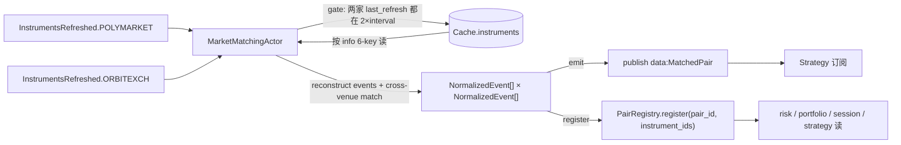
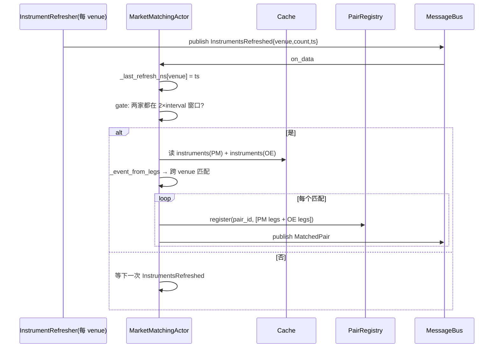

# Matching 组件详细设计

> 设计理由 / 决策史(Q5/Q9 + #34 pair_id 修正)见初设 `refactor.md §5.3`。
> 冲突时:**有把握 → 以本文为准并回写;没把握 → 提出讨论**。对应初设 Step 3。

---

## 1. 职责与边界

| 件 | 基类 | 职责 |
|---|---|---|
| `MarketMatchingActor` | NT `Actor` | 订两 venue `InstrumentsRefreshed` → gate by 2×interval(Q5)→ 跑归一+匹配 → publish `MatchedPair` + 注册 `PairRegistry` |
| `PairRegistry` | 普通类(`src/arbitrage/common/`) | **横切共享件**(P11,同 `LegSettledRegistry` 模式):MatchingActor 写、risk/portfolio/strategy/session 读;`dict[instrument_id, pair_id]` |
| `_event_from_legs` | 模块函数 | 从同 instrument.info 同 venue 的多腿(home/draw/away)反推一个事件视图(供算法用) |
| `MatchEngine` | 普通类(平移自旧 `services/market_matching/engine.py`) | sport+competition 分组 → 组内 PM↔OE 队名相似度匹配(`get_similar`)+ 贪心 + competition max_matches |

**#34 修正**:`info["competition"]` 是**联赛名**(EPL/NFL/...),**不是** pair_id(老 `MatchedPair.pair_id` 是基于 PM event_id 生成的稳定 ID,是 matching 的产出)。`info` 的 6-key 是**匹配输入**;`pair_id` 由 matching 算出并通过 `PairRegistry` 暴露给下游。

**不做**:
- ❌ instrument 注册时不预填 pair_id(matching 是其唯一产出方)
- ❌ 不依赖具体 instrument 类型(BinaryOption / BettingInstrument),只读 `info` 6-key,新增 venue 不改算法

---

## 2. 数据流



要点:
- **gate by 2×interval(Q5)**:matching tick 检查两 venue `last_refresh_ts`,任一超 `2×refresh_interval` 不跑(避免用单边过期数据)。
- **触发**:订两 venue `InstrumentsRefreshed`;event handler 更新 `last_refresh_ts` 并触发一次匹配(满足 gate 才跑)。
- **PairRegistry 写**:matching 是**唯一写者**;register 时把 MatchedPair 的两边所有腿 instrument_id 都 → 同一 pair_id。

---

## 3. 接口设计

### 3.1 `PairRegistry`(`src/arbitrage/common/pair_registry.py`)

横切共享件,launcher 构造一份注入 matching(写)+ risk/portfolio/session(读)。**单进程单 loop,纯内存,无序列化**(同 `LegSettledRegistry`)。

```python
class PairRegistry:
    def __init__(self): self._by_instrument: dict[str, str] = {}   # key = str(instrument_id)
    # matching 写
    def register(self, pair_id: str, instrument_ids: list) -> None: ...   # key 归一 str()
    def unregister_pair(self, pair_id: str) -> None: ...
    # consumers 读
    def get(self, instrument_id) -> str | None: ...                # 查询亦 str() 归一
    def all_pair_ids(self) -> set[str]: ...
```
> **#58 key 归一 str**:matching 写 `str(leg.id)`,消费者(risk/portfolio/session)用 `InstrumentId` 对象查 → `register`/`get` 两侧 `str()` 归一才命中(否则 dict 恒 miss)。snapshot 反查后在 cache 边界转回 `InstrumentId`(`strategy/snapshot.py:_as_instrument_id`)。

### 3.2 `MatchedPair`(`src/arbitrage/matching/events.py`)

NT `@customdataclass` Data 类,走 msgbus pub/sub:

```python
@customdataclass
class MatchedPair(Data):
    pair_id: str
    sport: str
    competition: str           # 联赛名(非 pair_id;#34)
    pm_instrument_ids: list[str]
    oe_instrument_ids: list[str]
    confidence: float          # 队名相似度归一,0-1
```

### 3.3 `MarketMatchingActor`(`src/arbitrage/matching/actor.py`)

**#59(slice A)**:发现已迁 DataClient 原生(refresher 退役),matching **不再被 `InstrumentsRefreshed` 触发**,改 NT clock 自重排周期 timer 读 cache。
**#60**:eviction 改由 **PM Sports `SportsGameUpdate` 的 `ended` 事件**驱动(替 #59 的 expiration 扫描;见 §4.4),并订阅之。

```python
class MarketMatchingActor(Actor):
    def on_start(self):
        self._schedule_next()                                  # 排首次 _MATCH_ALERT
        msgbus.subscribe(f"data.{SportsGameUpdate.__name__}*", self.on_data)  # #60 ended → eviction
    def on_stop(self):  self._cancel_alert()
    def on_data(self, data):                                   # #60
        if isinstance(data, SportsGameUpdate) and data.ended:
            self._evict_game(data.game_id)                     # gameId→pair_id → unregister + _ended_games
    def _on_alert(self, event):
        try: self._maybe_match()
        finally: self._schedule_next()                         # clock 自重排(读 refresh_interval_secs)
    def _maybe_match(self):
        pm = [i for i in cache.instruments(venue=PM)
              if self._game_id_of(i) not in self._ended_games] # #60:排除已结束 game 的 PM 腿
        oe = list(cache.instruments(venue=OE))
        if not pm or not oe: return                            # latch:两 venue cache 都非空(替 2×window)
        # 反推 events → cross-venue 匹配 → emit + register(_emit_pair 填 game_id→pair_id;_emitted_pairs 去重日志)
```

`MarketMatchingConfig`:`pm_venue`/`oe_venue`、`refresh_interval_secs`(= matching 轮询间隔)、`min_similarity`、`competition_max_matches`。

`_RuntimeDeps`:`pair_registry: PairRegistry`。

> 旧(#52,已退役):订 `data.InstrumentsRefreshed*`(注意 NT publish_data 无 metadata 时 topic 带尾 `*`,#58 修)→ `on_data` → `_both_recent()` 2×window gate。迁 timer 后这些全删。

### 3.4 消息接线

| 类 | 接收 | 发布 |
|---|---|---|
| `MarketMatchingActor` | —(#59:自 clock timer 驱动,不再订 `InstrumentsRefreshed`;发现迁 DataClient) | `data:MatchedPair`(成功匹配) |
| consumers | strategy 订 `data.MatchedPair*`(NT 带尾 `*` 通配,#58);risk/portfolio/session pull `PairRegistry` | — |

---

## 4. 算法

### 4.1 事件反推(`_event_from_legs`)

从同 venue 同 (competition, home_team, away_team) 的多腿 → 一个 `NormalizedEvent`:
```
key = (info["sport"], info["competition"], info["home_team"], info["away_team"])
events_by_venue.setdefault((venue, key), []).append(instrument)
```

`NormalizedEvent`:venue / sport / competition(league)/ home_team / away_team / home_team_normalized / away_team_normalized / legs。

### 4.2 跨 venue 匹配(平移自旧 `MatchEngine.match_events`)

1. 按 `(sport, competition)` 分组(完全相等)
2. 组内对每个 PM 事件,在 OE 候选中找最佳队名相似度匹配(`get_similar`)
3. 贪心:每个 OE 事件最多被匹配一次
4. 阈值 `min_similarity` 过滤;`competition_max_matches[comp]` 限制单联赛上限

### 4.3 pair_id 生成

稳定、确定性:`pair_id = f"{competition}|{home_team_normalized}|{away_team_normalized}"`。
- 跨 PM/OE 一致(matching 已对上同一事件)
- 重匹配同一对得同 ID(幂等,registry 整组覆盖)
- 同联赛同 fixture 罕见(若发生,加 `start_ts` 维度;暂不引入)

### 4.4 latch + eviction(#59,替 Q5 2×window gate)

**触发节奏(#59 锁定)**:`_maybe_match` 由 NT clock 自重排 timer 周期跑,间隔 = `MarketMatchingConfig.refresh_interval_secs`(由 `cfg.discovery.refresh_interval_secs` 设,**默认 10s**)。控制:启动→首个 MatchedPair 延迟、新发现被配上的延迟、eviction 扫描节奏。与 DataClient 发现间隔(`update_instruments_interval_mins`,默认 60min)**解耦**——matching 在两次发现间反复扫同一 cache(幂等)。

**latch**:两 venue `cache.instruments(venue)` 都非空才配。cache 永远保留 last-good(`add_instrument` upsert,失败发现不清零)+ matching 增量 register → 冷启动一边未加载时不出半成品,失败/单边不误删既有 pair。"多 venue 一失败不挡其他"自然成立。
> Q5 的 2×interval 新鲜度 gate(及 `_last_refresh_ns`)**退役**:DataClient 拥有发现后,"新鲜度"不再是 matching 的关注点;cache 非空即可配(理由见 refactor.md #58/#59)。

**eviction —— PM Sports `ended` 驱动(#60,替 #59 的 expiration 扫描)**:用户判定 gamma `end_date_iso`(→`expiration_ns`)与 Data API `redeemable` 都**不准**;改用 **PM Sports WS 的真实赛事 `ended` 信号**。NT 无 instrument cache 删除 API,只清 registry / 活跃集(`SportsGameUpdate` 全链路见 §sports / refactor.md §5.9)。
```
# matching 订 data.SportsGameUpdate*;ended 事件:
def on_data(d): if isinstance(d, SportsGameUpdate) and d.ended: self._evict_game(d.game_id)
def _evict_game(gid):
    self._ended_games.add(gid)
    pid = self._game_to_pair.pop(gid, None)
    if pid: registry.unregister_pair(pid); _emitted_pairs.discard(pid)
# _emit_pair 填 game_to_pair[PM 腿 info["game_id"]] = pair_id;_maybe_match 排除 game_id ∈ _ended_games 的 PM 腿
```
- **映射键 `game_id`**:`arb_provider` 发现时抽 `event["gameId"]` 入 `info["game_id"]`(== sports WS gameId,§5.9 实采证实)。
- **纯 `ended` 无兜底**(D4 用户定):漏 `ended` 就不清(`finished_timestamp` 与 ended 绑定不能当 fallback)。
- **P11 归属 = matching**(MarketMatchingActor 是 PairRegistry 唯一写者 + game→pair 索引宿主;`SportsGameUpdate` 生产者是 sports DataClient,单一归属挂 data 主方)—— 不耦合 execution。expiration 静态属性**不再用于 eviction**。

---

## 5. 与横切的咬合

| 横切 | 约束 |
|---|---|
| `PairRegistry`(P11) | matching 是**唯一写者**;其它只读;launcher 经 `ArbContext` 注入同一实例 |
| `LegSettledRegistry` | matching 不动 leg_settled;leg_settled 仅在 execution 启动腿时 arm |
| Q9 6-key | matching 只读 info 6-key + venue type,不依赖具体 instrument 子类(P1) |

---

## 6. 时序:一次匹配 tick



---

## 7. 落地清单(Step 3 实施)

- [ ] `PairRegistry`(`src/arbitrage/common/pair_registry.py`)+ 测语义(register/get/unregister)
- [ ] `MatchedPair`(@customdataclass)+ 测构造/字段
- [ ] `_event_from_legs` + `EventNormalizer.normalize_team_name`(平移自旧)+ 单测
- [ ] `MatchEngine.match_events`(平移,改输入为 `NormalizedEvent[from instruments]`)+ 单测
- [ ] `MarketMatchingActor`:on_data + gate + _maybe_match + register + publish + 测
- [ ] **#34 修正联动**:`risk._resolve_pair_id` 改读 `PairRegistry`;`session._pair_id_for` 同;`configure_arb` / `_init_arb_session` 加 `pair_registry` 参;factories 经 ArbContext 传;**discovery oe_provider 删 "competition = pair_id" 错注释**
- [ ] 各 test 修:risk/portfolio/engine/session 用 `PairRegistry.register` 而非 `info["competition"]`
- [ ] /live-test 待补:启动顺序 + 真实双 venue refresh 触发匹配
