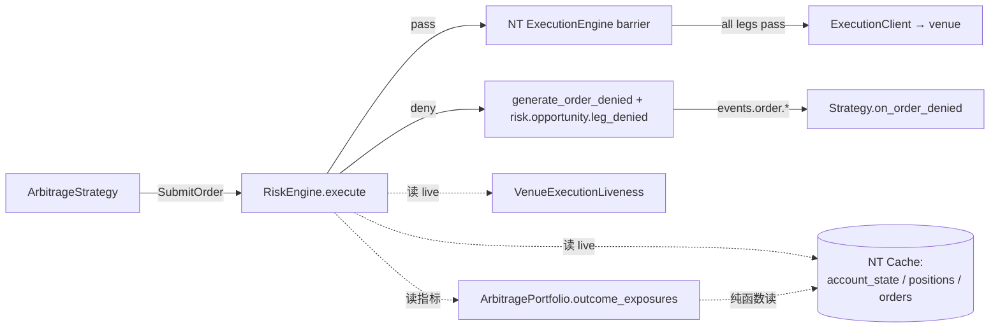
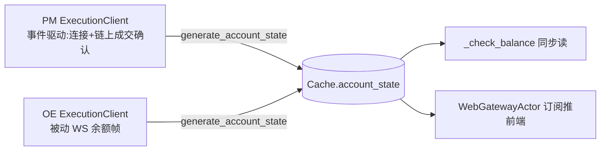
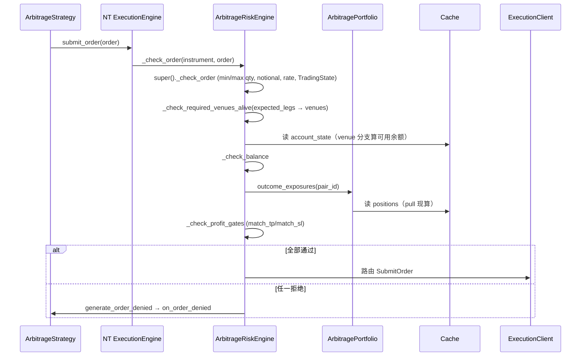

# Risk 组件详细设计

> **定位**:本文是 **详细设计**,面向代码落地(类/方法签名、数据流、算法、时序)。
> 设计**理由与决策历史**(Q12/Q14/Q16/Q17 的讨论过程)见初设 `refactor.md §5.6 / §6.9`。本文与初设冲突时:**有把握 → 以本文为准并回写 `refactor.md` 修订记录;没把握 → 提出讨论,不擅自定**。
> 对应初设 Step 6。

---

## 1. 职责与边界

Risk 层 = **两个 NT 子类**,无独立服务、无 Actor:

| 类 | 基类 | 职责 |
|---|---|---|
| `ArbitrageLiveRiskEngine` | NT `LiveRiskEngine` | 在 `submit_order` 管道上**透明拦截**:share limit adjusted-size gate + NT 父类自动检查(price/quantity/GTD + notional/submit_rate/`TradingState`/native 余额)+ 应用层 **VenueExecutionLiveness 门控** + **余额检查** + **单场 profit gates**(match_tp/match_sl) |
| `ArbitragePortfolio` | NT `Portfolio` | 领域指标 `outcome_exposures` / `way_rebate` 等(pull-based 纯函数),与 NT `unrealized_pnl` 并列扩展;**不读取执行健康状态** |

> **基类必须是 `LiveRiskEngine`(非基类 `RiskEngine`)**:实盘环境 kernel 实例化 `LiveRiskEngine`(`system/kernel.py:407`);基类 `RiskEngine` 仅 backtest 用。两者 `_handle_submit_order → _check_order` 派发链一致。(Step 6 核实修正,见 refactor.md 修订记录)

**明确不做**(对照旧微服务架构,全部砍掉):

- ❌ 无 `LiquidityRiskActor` / `check_min_size`(最小限额由 NT instrument 元数据自动管:PM `min_quantity=5 shares`,OE `min_notional=7 GBP stake`)
- ❌ 无 `BalanceMonitorActor` / 余额阈值告警 publish(告警让前端订阅 `AccountState` 自己看)
- ❌ 无独立熔断 Actor / 不翻 `TradingState`(单场 profit gates 与 venue liveness = 逐 submit deny,见 §4.3/§4.4)
- ❌ Strategy **不引用** Risk —— 透明拦截,Strategy 只通过 `on_order_denied` 感知结果

**账户状态来源**:由各 venue 的 `ExecutionClient` 维护写入 NT `Cache`(PM 事件驱动 / OE 被动 WS),Risk 层**只读 Cache**,对来源透明。

---

## 2. 数据流

### 2.1 订单拦截(submit 管道)



要点:
- `CancelOrder` 走**另一条命令通路**,**不经** `_check_order` 的 deny —— 补偿撤单永远放行(关联 `bug_compensating_cancel_missing`)。
- Risk 读 **live** Cache,**不读** Strategy 的机会快照(快照是 Strategy 规划私有,Q20)。

### 2.2 账户状态维护(Risk 只是消费端)



### 2.3 持仓指标拉取(pull-based,无触发器)

调用方按需调,`ArbitragePortfolio` 即时从 Cache 持仓现算,无中间缓存:

| 调用方 | 时机 | 用途 |
|---|---|---|
| `ArbitrageStrategy` | 评估机会(取快照那刻冻结果,Q20) | `min_way_rebate` 与阈值比较 + 默认方向选择 |
| `ArbitrageRiskEngine._check_profit_gates` | 每次 submit 拦截 | 单场止盈/止损硬停 |
| `WebGatewayActor` | 前端 HTTP GET | 序列化推前端 |

---

## 3. 接口设计

### 3.1 `ArbitrageRiskEngine`(`src/arbitrage/risk/engine.py`)

```python
class ArbitrageLiveRiskEngine(LiveRiskEngine):
    """扩展 NT LiveRiskEngine:余额检查 + 单场 profit gates。"""

    def _handle_submit_order(self, command: SubmitOrder) -> None:
        # 若 max_leg_share 启用,先把 order 替换为 adjusted order,再交给 NT 父类管道。
        command = self._adjust_submit_order_for_share_limit(command)
        if command is None:
            return
        super()._handle_submit_order(command)

    # ⚠️ 签名必须与 NT 父类一致(engine.pyx:571 cpdef bint,两参 instrument/order)
    def _check_order(self, instrument: Instrument, order: Order) -> bool:
        if not super()._check_order(instrument, order):   # NT: price/quantity/GTD
            return False
        if not self._check_required_venues_alive(order):  # 应用层:venue 执行真相可信
            return False
        if not self._check_balance(instrument, order):    # 应用层:余额(venue 非对称)
            return False
        if not self._check_profit_gates(order):           # 应用层:单场 profit gates
            return False
        return True

    # ── Hook(Debug 子类可覆盖)──
    def _check_required_venues_alive(self, order: Order) -> bool: ...
    def _check_balance(self, instrument: Instrument, order: Order) -> bool: ...
    def _check_profit_gates(self, order: Order) -> bool: ...
```

**share limit adjusted-size gate(2026-06-21)**:
- 配置 `risk.max_leg_share` 为单个 outcome 允许的最大 share,`None` 表示关闭。所有腿共用一个上限,不做 per-leg 配置。
- 该 gate 在 `_handle_submit_order` 入口执行,先从 `PairRegistry` 取得 `pair_id`,再从 order tags 的 `arb:expected_legs` 解析本次机会所有 outcome role,读取 `ArbitragePortfolio.outcome_shares(pair_id)` 计算每个 outcome 剩余额度。
- 缩放比例 `scale = min(1, min_remaining / requested_share)`。PM 的 `requested_share = quantity`;OE 的 `requested_share = quantity * price * fx`(gross payout share)。PM/OE 走同一段多边逻辑,只在 share 换算公式上分支。
- 若 `scale < 1`,Risk 构造一个同 `client_order_id` 的 adjusted `LimitOrder` 替换进 `SubmitOrder`,保留原有 opportunity metadata tags。原始 order 的 `quantity` 是 NT readonly 字段,不原地改。
- adjusted order 随后进入父类 `_handle_submit_order`,所以 NT 原生 PM `min_quantity=5` / OE `min_notional=7` 检查看到的是**缩放后的 size**,不是原始 size。若缩放后低于最小下单限制,由 NT 原生 gate deny。
- Execution opportunity barrier 不参与缩放、不需要改;它只接收 risk pass 后的 adjusted command。

**NT 检查分两步,本类只覆盖第一步**(Step 6 核实修正):
- `_check_order`(本类覆盖点):仅 **price / quantity / GTD**。
- `_check_orders_risk → _check_orders_risk_for_account`(本类**不覆盖**,父类原样跑):**notional / submit_rate / native 余额**。NT 的 native 余额读 cache `free`——对 PM 因 `free==total` 偏宽松(不会误拒,只是不够紧),故本类在 `_check_order` 内**前置**更严的 PM 自扣余额检查(它先于 native 跑、先拒)。

**venue 最小下单门控来源**:
- PM:最小值是 share 数量,由 PM Provider/解析层写入 `BinaryOption.min_quantity=5`;NT `_check_order_quantity` 拦 `quantity < 5`。
- OE:最小值是 stake,由 OE Provider 写入 `BettingInstrument.min_notional=7 GBP`;`BettingInstrument.notional_value(quantity, price)` 返回 stake notional,NT `_check_orders_risk_for_account` 拦 `notional < 7 GBP`。
- Risk 组件不再维护 `MIN_SIZE_POLYMARKET` / `MIN_SIZE_ORBITEXCH` 常量;若 adjusted-size gate 后的最小下单门控失效,优先检查 instrument 元数据是否正确进入 cache。

**自定义拒绝必须自己 emit denied 事件**:父类 `_handle_submit_order` 见 `_check_order` 返 False 仅 `return`,指望它已调 `self._deny_order(order, reason)`。漏调 → 订单静默丢弃,`Strategy.on_order_denied` 不触发。(已 end-to-end 验证:覆盖被派发 + deny 事件发出 + 订单不泄漏到 execution)

**`_check_balance` —— 可用余额按 venue 非对称(Q17)**:

| Venue | 可用余额 | 理由 |
|---|---|---|
| PM | `account.balance_total − Σ(PM cache.orders_open 在途名义额)` 自扣 | PM 上报 `reported=True/locked=0/free=total`,`CashAccount.apply` 清空 NT 自算 locked → cache `free` 恒 total,不能信 |
| OE | 直接信 cache 余额(WS 已含挂单占用,不再减) | 再减会双重扣减低估 |

→ 实现内按 `order.instrument_id.venue` 分支。读 **live** cache(非快照)。

**`_check_profit_gates` —— 单场止盈/止损硬停(Q16 修订)**:逐 submit deny = "别开新仓",与 Strategy 的机会评估正交。Risk 不再按 `way_rebate` 比率门控,也不再执行全局止盈/止损;`global_sl` 仅作为旧配置兼容字段保留。

```python
def _check_profit_gates(self, order: Order) -> bool:
    pair_id = self._pair_id_for_order(order)  # PairRegistry.get(order.instrument_id)
    exposures = self._portfolio.outcome_exposures(pair_id, order.account_id)
    # 1. match_tp:所有 outcome net_profit > share*match_tp → deny(已赚够别加)
    # 2. match_sl:所有 outcome net_profit < share*match_sl → deny(该场恶化别加)
    ...
```

`_check_required_venues_alive`(见横切 `synchronization.md §8.5`):若订单带 opportunity metadata,从 `arb:expected_legs` 解析本次机会所有真实腿并推导 required venues;任一 required venue 的 `order_alive && position_alive` 不成立 → **deny**。无 metadata 的普通订单退化为只检查当前 `order.instrument_id.venue`。

**补救下单 intent 例外(2026-06-11)**:
- Strategy submitter 将 `spec["intent"]` 写入 NT `Order.tags=["arb:intent=<intent>"]`,详见 strategy 详设 §3.9。
- `arb:intent=recovery` 表示该订单用于降低不完整持仓风险,不是新增套利开仓;Risk 仍执行 NT 父类基础检查和 `_check_balance`,但 `_check_profit_gates` 内部直接放行 recovery,跳过 `match_tp / match_sl`。
- recovery **不跳过** `_check_required_venues_alive`:venue 执行真相不可信时,补救下单同样不能安全进入 venue。撤单仍不经 `_check_order`,不受 liveness gate 拦截。
- 默认无 tag 或未知 tag 按 `"arbitrage"` 处理,保持旧行为。
- `CancelOrder` 本来不经 `_check_order`,不需要 intent。

### 3.2 `ArbitragePortfolio`(`src/arbitrage/risk/portfolio.py`)

子类化 NT `cdef class Portfolio` —— **只能加纯 Python 方法**(不能加 cpdef/cdef):

```python
class ArbitragePortfolio(Portfolio):
    # ── per-pair(对应 unrealized_pnl 单数风格)──
    def outcome_exposures(self, pair_id: str, account_id=None) -> dict[str, OutcomeExposure]: ...
    def outcome_shares(self, pair_id: str, account_id=None) -> dict[str, float]: ...
    def way_rebate(self, pair_id: str, account_id=None) -> dict[str, float]: ...
    def min_way_rebate(self, pair_id: str, account_id=None) -> float | None: ...
    # ── per-pair-per-venue(对应 net_exposures 嵌套风格)──
    def way_rebates_by_venue(self, pair_id: str, account_id=None) -> dict[Venue, dict[str, float]]: ...
    # ── 全账户聚合(对应 equity)──
    def global_min_rebate_sum(self, account_id=None) -> float: ...
    # ── 内部 ──
    def _legs_for_pair(self, pair_id, account_id) -> list[_Leg]: ...
    def _resolve_pair_id(self, position) -> str | None:  # PairRegistry.get(instrument_id), #34
    def _leg_from_position(self, position) -> _Leg | None:  # info["selection_role"] (Q9) + 类型判 venue
```

**腿来源(平移自旧 `position.py`,但不再自维护 `_positions`)**:从 NT Cache 的 `positions_open()` 反推 `_Leg`。
- **pair_id 经 `PairRegistry`**(matching 写、本类读;#34 修正,原误用 `info["competition"]` 是联赛名非 pair_id)。`outcome_exposures` 会通过 `PairRegistry.instrument_ids_for_pair(pair_id)` 读取该 pair 的完整 instrument 集合,再从 cache instrument.info 得到完整 outcome 集合;若 registry 不可用才回退到持仓腿推断。
- **`instrument.info` 契约**(由 **discovery** 填充,本类只读,单一 seam 在 `_leg_from_position`):`info["selection_role"]`→home/draw/away(Q9 标准 key;旧 `info["market_type"]` 作 fallback 兼容);其它 Q9 6-key 是 matching 输入。
- **venue / 公式分支**由 instrument 类型判定(`BinaryOption`=PM,`BettingInstrument`=OE),不靠字符串。

**接线 —— 导入名替换(`src/arbitrage/bootstrap.py`),取代旧"构造后 swap"方案**(Step 6 改进,见 refactor.md 修订记录):

`Portfolio` 与 `LiveRiskEngine` 都被 kernel 用模块级名字硬编码构造(`system/kernel.py:359 / :407`),无 class 注入点。构造 `TradingNode` **之前**替换这两个名字 → kernel 原生构造我们的子类,零摘除/零重注册/无 Trader-ref 问题:

```python
import nautilus_trader.system.kernel as _kernel
def install_arbitrage_engines():       # 构造 TradingNode 之前调用,幂等
    _kernel.Portfolio = ArbitragePortfolio
    _kernel.LiveRiskEngine = ArbitrageLiveRiskEngine
```

领域参数(fx/单场 profit gates,以及保留兼容的 share)在 NT 固定实参表外,由 launcher 构造后经 setter 注入:`portfolio.configure_arb(share=, fx=, pair_registry=)` / `risk_engine.configure_arb(params, venue_liveness=...)`(`wire_arbitrage_runtime(node, ...)`)。Risk 使用 `share * match_tp/match_sl` 得到绝对金额阈值;`way_rebate` 的分母仍由实际持仓 legs 决定(见 §4.1)。代价:依赖 kernel 模块结构(模块级 import 名),NT 升级时需复核。

### 3.3 消息接线(订阅 / 发布)

Risk 是 **submit 管道拦截 + P2P endpoint** 型,**不是 topic pub/sub 重组件**(不像 Strategy 订 `MatchedPair`)。

| 类 | 接收 | 发布 | 不订阅 |
|---|---|---|---|
| `ArbitrageLiveRiskEngine` | NT 管道路由的 `TradingCommand`(`SubmitOrder`/`SubmitOrderList`/`ModifyOrder`)进 `_check_order`;`CancelOrder` 也过但不被 balance/profit gate deny | 拒绝 → `_deny_order` → `events.order.{strategy_id}`;若 order 带 opportunity metadata,额外 publish `risk.opportunity.leg_denied`(见 `_cross-cutting/synchronization.md §8.4bis`) | `health_check.*` / `execution.*`(Q19 不参与,§3.4);不订 opportunity barrier topic |
| `ArbitragePortfolio` | P2P endpoint(基类 `__init__` 注册;import 替换后 kernel 原生构造即注册):`Portfolio.update_account` / `update_order` / `update_position` | **无**(way_rebate pull-based,不发事件、不写 cache) | 任何 topic(纯函数式) |

> NT 父类 `RiskEngine` 在 `set_trading_state` 时会发 `events.risk`(`TradingStateChanged`);本系统**不主动改 TradingState**(Q16 profit gates 走逐 submit deny),故该 topic 不被触发。

**opportunity deny 领域消息(已落地代码,待 live 验证,2026-06-14)**:
- `ArbitrageLiveRiskEngine` 覆盖 `_deny_order(order, reason)` 时必须先调用 `super()._deny_order(order, reason)`,保留 NT 原生 `OrderDenied` / cache / order event 链。
- 若 `order.tags` 含 `arb:opportunity_id` / `arb:pair_id` / `arb:leg_key`,再 publish:

```json
{
  "opportunity_id": "...",
  "pair_id": "...",
  "leg_key": "...",
  "client_order_id": "...",
  "reason": "..."
}
```

- 该领域消息只服务 Execution opportunity barrier,不能替代 NT `OrderDenied`。
- Risk 不等待其它 legs,不维护 opportunity 状态,不释放 `pair_inflight`;统一出口属 Execution barrier。

### 3.4 同步参与(Q19 / §6.10)+ VenueExecutionLiveness 读取

Risk **不参与**健康检查 ⊥ 执行全局互斥:它是 submit 管道上的**同步拦截器**(NT 单 loop 内同步返回 bool),无自身的 `await` 循环 / timer / tick,也不发收 `health_check.*` / `execution.*`。余额/profit 门限**始终读 live cache**(非 Strategy 快照),要最新安全信号。

**VenueExecutionLiveness 读取**:`ArbitrageLiveRiskEngine` 经共享 `VenueExecutionLiveness` 读 `venue_order_alive` / `venue_position_alive`。该对象由 execution/reconciliation 写、Risk 读,Strategy/Portfolio 不读;横切真理源见 `synchronization.md §8.5`。Risk 不直接操作 NT `TradingState`,也不把 venue liveness 同步成 `set_trading_state(HALTED/ACTIVE)`。

---

## 4. 算法

### 4.1 outcome_exposures 与 way_rebate

Risk 门控读取 `outcome_exposures(pair_id)` 的绝对金额:

```
net_profit[outcome] = Σ profit_if_wins(leg) for leg.market_type == outcome
                      − Σ loss_if_loses(leg) for leg.market_type != outcome
liability[outcome]  = Σ loss_if_loses(leg) for leg.market_type != outcome
```

- `match_tp`:若所有 outcome 的 `net_profit > share * match_tp`,deny 新开仓。
- `match_sl`:若所有 outcome 的 `net_profit < share * match_sl`,deny 新开仓。
- 比较使用配置目标规模 `share`(当前示例 22.5)作为绝对金额阈值基数,**不使用** `way_rebate` 分母。
- outcome 集合优先来自 `PairRegistry` 注册的所有 instrument,保证三元盘某 outcome 暂无持仓时仍参与“所有 outcome”判断;无 registry 时回退到持仓腿中的 `home/away/draw`。
- 全局止盈/止损已撤掉;Risk 不再调用 `global_min_rebate_sum` 做门控。

`way_rebate` 作为 Strategy/Web 兼容展示指标保留,公式平移自旧 `position.py`:

```
way_rebate[outcome] = ( Σ profit_if_wins(leg)   for leg.market_type == outcome
                       − Σ loss_if_loses(leg)    for leg.market_type != outcome ) / share
```
- `profit_if_wins`:PM = `size*(1-price)`;OE = `size*(price-1)*fx`
- `loss_if_loses`:PM = `size*price`;OE = `size*fx`
- `share` 取 **按 outcome 聚合后的最大实际 share**:`max(Σ share_if_wins(leg) for same outcome)`;单腿 `share_if_wins`:PM=`size`;OE=`size*price*fx`(stake×odds×fx 的 gross payout)。同一 outcome 若同时有 PM/OE 持仓,必须先相加再参与分母,避免 numerator 已聚合但 denominator 只取单腿 max 导致 rebate 被放大。`mean_rebate` 正常下单会让各 outcome share 相同;若 live probe / 手动仓位造成 outcome share 不同,用最大 outcome share 归一化,避免配置 share 与真实持仓脱节。
- `outcome ∈ {home, draw, away}`,draw 仅当有腿 `market_type=="draw"`
- 不依赖 mark price,只依赖成交落库的 `size/price/fx`

`global_min_rebate_sum` **只遍历有 open position 的 active pair**(对应旧 `_positions.values()`);**未交易比赛不进遍历、不致 None**。它不再被 Risk 门控消费,仅作为旧展示/兼容指标。

### 4.2 Portfolio 不再做 settled gate(2026-06-15)

`leg_settled` gate 退役。`ArbitragePortfolio` 是持仓指标计算器,只根据 NT Cache positions 计算 `outcome_exposures` / `way_rebate` / `global_min_rebate_sum`;执行真相是否可信由 `ArbitrageLiveRiskEngine._check_required_venues_alive` 统一门控。

因此:
- `outcome_exposures` / `way_rebate` 不因执行健康状态返回 `{}`。
- `global_min_rebate_sum` 不因执行健康状态返回 `None`。
- `None` 只表达“没有可计算的持仓/数据不足以形成该指标”的数据语义,不再承载 settled fail-closed。

### 4.3 为什么 profit gates 不用 NT `TradingState`(Q16)

NT `TradingState`(HALTED/REDUCING)是原生熔断,但本系统 profit gates 的**唯一动作是"挡新开仓"**,而挡单正是 `_check_order` 本职;故单场止盈/止损统一逐 submit deny,**不翻 TradingState、不起监测 Actor、无频率**(执行靠 NT 逐 command 拦截本就 per-submit)。全局止盈/止损已撤掉。

### 4.4 为什么 venue liveness 也不用 NT `TradingState`

NT `TradingState` 是全局互斥状态:
- `ACTIVE`:交易开启;
- `HALTED`:submit 全局拒绝,cancel 仍可走;
- `REDUCING`:只允许按单个 instrument 降低已有 net position 的 submit/update。

它不是 bitmask,不能组合成 `REDUCING | ACTIVE`;也不能表达 per-venue、order/position 拆分、或 PM+OE opportunity 级 required venues。故 venue liveness 不同步到 `set_trading_state`。Risk 采用独立 liveness gate 与 NT TradingState 串联:父类先保留原生 TradingState 语义,子类再检查 `VenueExecutionLiveness`。

---

## 5. 与横切的咬合

| 横切 | 对 Risk 的约束 |
|---|---|
| Q17 账户状态 | Risk 只读 cache;PM 余额事件驱动、OE WS(余额帧 Step 5 实写),健康检查不拉余额 |
| Q19 同步(§6.10) | RiskEngine 读 **live** cache;不参与健康检查 ⊥ 执行互斥(它是 submit 管道上的同步拦截,无自身 await 循环) |
| Q20 快照 | Risk **不读** Strategy 快照(快照是规划私有);余额/profit 门限都用 live 最新值 |
| VenueExecutionLiveness | Risk 从 opportunity `expected_legs` 推导 required venues 并 fail-closed;Strategy/Portfolio 不读 |
| Execution barrier | Risk 在进入 barrier 前完成 adjusted-size gate;barrier 不缩放、不维护 share limit |
| §6.6 Debug | `DebugArbitrageRiskEngine`:`skip_check_size`(子类覆盖,跳过 NT 父类 min_quantity 便于小单测试);粒度待 Step 6 核实 NT API |

---

## 6. 时序:一次 submit 的完整路径



---

## 7. 落地清单(Step 6 实施)

- [x] `ArbitrageLiveRiskEngine` 子类(基类 `LiveRiskEngine`)+ `_check_order` 两参签名 + super 先行 + 自 emit `_deny_order`
- [x] `_check_balance` venue 分支(PM 自扣在途挂单 / OE 信 cache free);无价单交父类
- [x] `_handle_submit_order` share limit adjusted-size gate:`max_leg_share` 先缩放,再交 NT 原生 PM/OE min size gate 检查 adjusted size
- [x] `_check_profit_gates` 单场止盈/止损;Risk 不再执行全局止盈/止损
- [x] `_check_required_venues_alive`:注入 `VenueExecutionLiveness`,从 `expected_legs` 推导 required venues,任一不 alive 则 deny
- [x] `ArbitragePortfolio` 四方法 + `_legs_for_pair` + `_resolve_pair_id` + `_leg_from_position`(从 cache Position 反推)
- [x] `bootstrap.install_arbitrage_engines`(导入名替换)+ `wire_arbitrage_runtime`(configure_arb 注入)
- [x] 移除共享 `LegSettledRegistry` settled gate seam;新增 `VenueExecutionLiveness` 注入 Risk
- [x] **核实 NT cpdef `_check_order` 子类覆盖**:已 end-to-end 验证(`_handle_submit_order` 派发到 Python 覆盖,deny 事件发出,订单不泄漏)
- [x] **`skip_check_size`** ✅ Q11 Debug slice #38 落地(2026-05-24):`DebugArbitrageLiveRiskEngine._check_order` 子类覆盖,`DebugConfig.is_override_active("skip_check_size")` 时跳过 `super()._check_order`(跳过 NT 父类 price/quantity/GTD 校验),直跑应用层 `_check_balance` + `_check_profit_gates`。`src/arbitrage/debug/risk.py`,~10 行;`bootstrap.install_arbitrage_engines(debug_config=)` 接线 → kernel 自动装 Debug 子类。tests:`tests/arbitrage/debug/test_debug_risk_engine.py` 5 passed。
- [x] 对应测试 .py:`tests/arbitrage/common/test_venue_liveness.py` / `tests/arbitrage/risk/test_engine.py` / `tests/arbitrage/risk/test_portfolio.py`

> **已闭环**:`_check_profit_gates` 取 `outcome_exposures` 经 `self._portfolio`(import 替换后即 `ArbitragePortfolio` 实例)调其方法 ✓;cpdef 覆盖可行性 ✓。
> **仍依赖外部契约**:`instrument.info["selection_role"]` 由 discovery 填充(旧 `market_type` 兼容读取,本类只读,单一 seam);OE 腿的 size/price 语义(stake / 十进制赔率)由 OE ExecutionClient 上报时保证。

**#34(2026-05-24)pair_id 来源校准**:`_resolve_pair_id` / 引擎的 `_pair_id_for_order` 原读 `instrument.info["competition"]` 是**错读**——`competition` 是联赛名(EPL/NFL),不是 pair_id;pair_id 由 matching 算出经 `PairRegistry` 暴露。现两处都改读 registry(`ArbitragePortfolio._pair_registry`),`configure_arb` 增 `pair_registry` 参,launcher 经 `ArbContext.pair_registry` 注入(共享 registry 模式)。`_leg_from_position` 同时把 `info` 读 key 校正:Q9 标准是 `selection_role`,旧 `market_type` 作 fallback 兼容。

**NT 子类化两个 cdef 可见性陷阱(写测试时发现,已修;production-affecting)**:
1. **`Portfolio._cache` 是私有 `cdef`(非 `readonly`)→ Python 子类方法 `self._cache` 抛 AttributeError**(`RiskEngine._cache` 是 `readonly` 故引擎侧无此问题)。`ArbitragePortfolio` 改为**覆盖 `__init__`**(签名 `msgbus/cache/clock/config`,与 kernel 原生构造一致)`super().__init__(...)` 后自存 `self._arb_cache = cache`,所有腿提取走 `_arb_cache`。
2. **`order.has_price_c()` 是 `cdef` 方法,Python 侧不可调** → `_check_balance` / `_pm_open_notional` 必须用 **`order.has_price`(property)**。同理价格/数量用 `order.price` / `order.leaves_qty`(均 Python 可见)。
