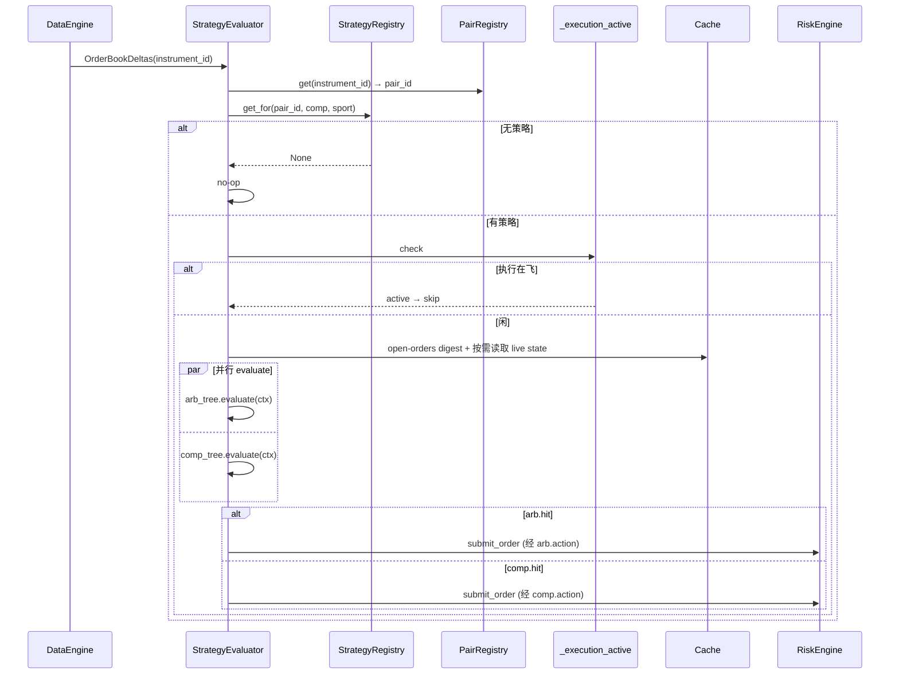

# Strategy 组件详细设计

> 设计理由 / 决策史(Q13/Q14/Q16/Q19/Q20 早期约束 + **Q21 框架锁定 2026-05-24**)见初设 `refactor.md §5.4 / Q21`。Q20 全状态快照已由 refactor #266 取代。
> 冲突时:有把握 → 以本文为准并回写;没把握 → 提出讨论。对应初设 Step 4。

---

## 1. 职责与边界

| 件 | 基类 / 角色 | 职责 |
|---|---|---|
| `StrategyEvaluator` | NT `Strategy` | 唯一运行时策略:订触发事件(`OrderBookDelta` / `MatchedPair` / PMS 比赛状态)→ 查 `StrategyRegistry` → 构造当前 `EvalContext` → 并行 evaluate arb+comp 树 → fire action；所有订单经原生 `submit_order` |
| `StrategyRegistry` | 普通类 | 按 scope 索引策略;`get_for(pair_id) → Strategy or None`,按**挂载存在锁定**:具体比赛挂了就锁定本 scope,即使没命中也**不降级**(Q21-a) |
| `Strategy` | 领域 dataclass | `{ scope_key, arbitrage_tree: Condition, compensation_tree: Condition, metadata }`；仅是配置树，不逐个注册为 NT Strategy |
| `Condition` | dataclass | `{ self_hits: BoolExpr, sub_conditions: list[Condition], checktion: CheckExpr, actions: list[Action] }` |
| `BoolExpr` / `StateQuery` | DSL | self_hits 的无状态布尔查询树；叶子直接读取当前 `EvalContext`，支持 AND/OR/NOT 嵌套 |
| `CheckExpr` / `Check` | DSL / abstract | checktion 的有副作用布尔树；`Check.passes(ctx) -> bool` 为叶子，支持 AND/OR/NOT 嵌套及 `scratch` 事务 |
| `Action` | abstract | `async Action.execute(ctx)` 由 Evaluator 按顺序 await |
| `EvalContext` | dataclass | 每轮评估上下文；Strategy 随用随读 live Cache，只冻结评估开始时的 pair order/position digests 并透传 Execution |

**职责边界(继承自前期锁定)**:
- ❌ **不引用 Risk**:透明拦截,strategy 只通过 `on_order_denied` 感知结果(§5.4)
- ❌ **不缓存待下单意图**:每轮全量重算(Q13)
- ❌ **不在策略层做 tp/sl/global 硬停**:归 RiskEngine(Q16)
- ✅ 设计参数与决策逻辑归本组件
- ✅ `self_hits` 只表达当前状态查询，不保存 persistent/transient signal；跨轮状态由其自然归属组件维护，查询时经 `EvalContext` 读取

---

## 2. 数据流

```mermaid
flowchart TB
  subgraph EV[触发事件]
    OBK[OrderBookDelta]
    MP[MatchedPair]
    EXT["PMS SportsGameUpdate"]
  end
  EV --> EVA[StrategyEvaluator<br/>NT Strategy]
  EVA -->|查 pair_id| PR[(PairRegistry)]
  EVA -->|按 scope 优先级| SR[(StrategyRegistry)]
  SR -->|Strategy or None| EVA
  EVA -->|Q19 mutex 检查| EXEC{execution_active?}
  EXEC -->|是 跳过本轮| END[end]
  EXEC -->|否| BASE[记录 pair order/position digests]
  BASE --> EVAL["并行 evaluate(arb, comp)<br/>行情/持仓随用随读 live Cache"]
  EVAL --> ARB[arbitrage_tree → (hit, action)]
  EVAL --> COMP[compensation_tree → (hit, action)]
  ARB --> ARBOK{arb.hit?}
  COMP --> COMPOK{comp.hit?}
  ARBOK -->|是: comp 命中则注入 recovery candidate| FIRE1[跑 arb 链<br/>candi_select 内做门控+补偿优先]
  ARBOK -->|否| COMPOK
  COMPOK -->|是 且 arb 否| FIRE2[跑 comp 链<br/>同样过 candi_select 门控]
  FIRE1 & FIRE2 -.submit_order.-> RE[RiskEngine 拦截]
```

要点:
- **OBD 触发(2026-07-30,已落地)**:`on_order_book_deltas` 不按 venue 类型过滤；PM(probability)与 OE/SE(decimal)的已订阅 OBD 都可触发机会评估。NT 在回调前已更新对应 order book cache，Evaluator 继续复用 `instrument_id → PairRegistry → pair_id` 路由及 per-pair 串行门控。修订理由见 refactor.md #297；测试 `test_evaluator.py::test_obd_from_{decimal,probability}_venue_triggers_eval`。
- evaluate **不执行 Action**:返回 `EvalResult { hit, pending_actions }`,fire 由 evaluator 顶层做；
  Check 只可写本树独占的 per-eval `ctx.scratch`
- arb / comp 两棵树 **真并行**(`asyncio.gather`)
- **树间取舍(补偿优先)#295 起在 `candi_select` 内做**(见 §4.2):顶层只选运行宿主链
  (arb 命中时运行 arb 链并注入 comp candidate，否则运行 comp 链)；`candi_select` 先从
  通过门控的补偿候选中选择，补偿组全灭才回退套利组。补偿树内部仍由 CheckExpr OR
  的配置顺序决定 `spread_cancel_recovery` 与 `mean_rebate_recovery` 的优先级
- order/position digests 不是对象快照；它们只用于 Execution release 前检测评估窗口内订单或
  仓位字段是否变化

---

## 3. 接口设计

### 3.1 `BoolExpr` + `StateQuery`(条件 DSL)

```python
class BoolExpr(ABC):
    @abstractmethod
    def eval(self, ctx: EvalContext) -> bool: ...

class StateQuery(BoolExpr):
    """叶子：每次直接读取当前上下文。"""
    @abstractmethod
    def matches(self, ctx: EvalContext) -> bool: ...

class AndExpr(BoolExpr):  # 同 OrExpr / NotExpr
    def __init__(self, *exprs: BoolExpr): self.exprs = exprs
    def eval(self, ctx): return all(e.eval(ctx) for e in self.exprs)
```

`StateQuery` 与 `Check` 分开注册：前者只能查询状态并返回 bool；后者属于机会核查，可向
`ctx.scratch` 写本轮派生数据。框架不维护任何 signal 状态。

### 3.2 `Condition` / `CheckExpr` / `Check` / `Action`

```python
@dataclass
class Condition:
    self_hits: BoolExpr                        # 当前状态 guard
    sub_conditions: list["Condition"] = field(default_factory=list)   # 子组合互斥
    checktion: CheckExpr = field(default_factory=AndCheckExpr)         # 空 AND = 默认通过
    actions: list["Action"] = field(default_factory=list)              # 命中后按顺序执行

@dataclass
class EvalResult:
    hit: bool
    pending_actions: list["Action"] = field(default_factory=list)

class CheckExpr(ABC):
    @abstractmethod
    def eval(self, ctx: "EvalContext") -> bool: ...

class Check(CheckExpr):
    @abstractmethod
    def passes(self, ctx: "EvalContext") -> bool: ...

class AndCheckExpr(CheckExpr): ...  # 同 OrCheckExpr / NotCheckExpr

class Action(ABC):
    @abstractmethod
    async def execute(self, ctx: "EvalContext") -> None: ...
```

`CheckExpr` 与 `BoolExpr` 使用相同的 AND/OR/NOT 认知模型，但不能共用实现：
`StateQuery` 是纯查询，`Check` 会把 `legs/candidates` 等派生结果写入 `ctx.scratch`。
`CheckExpr` 因而规定以下事务语义：

- 所有节点同步执行，并按配置顺序短路，不并行调用 Check。
- Check 叶子返回 False 或抛异常时，回滚本叶子对 `scratch` 的修改。
- AND 任一子表达式失败时，回滚整个 AND；全部成功才提交所有顺序产物。因此
  `mean_rebate AND require_cross_venue` 的后者能读取前者生成的 legs。
- OR 的失败分支均从进入 OR 时的同一份 `scratch` 求值；首个成功分支提交并短路，
  后续分支不执行。
- NOT 只取反布尔结果，无论子表达式命中与否都丢弃其 `scratch` 修改。

### 3.3 `Strategy` / `StrategyRegistry`

```python
ScopeKey = Union[PairId, CompetitionName, SportName]   # 三种 scope,带类型

@dataclass
class Strategy:
    scope_key: ScopeKey
    arbitrage_tree: Condition
    compensation_tree: Condition
    metadata: dict = field(default_factory=dict)

class StrategyRegistry:
    """按 scope 索引;查找按优先级 pair_id > competition > sport,
    **挂载存在锁定**(Q21-a):某 scope 挂了 = 锁定本 scope,即使没命中也不下放。"""
    def __init__(self):
        self._by_pair: dict[str, Strategy] = {}
        self._by_competition: dict[str, Strategy] = {}
        self._by_sport: dict[str, Strategy] = {}

    def register(self, strategy: Strategy): ...
    def get_for(self, pair_id: str, competition: str, sport: str) -> Strategy | None:
        # 严格按优先级,挂了就锁定,不降级
        if pair_id in self._by_pair: return self._by_pair[pair_id]
        if competition in self._by_competition: return self._by_competition[competition]
        return self._by_sport.get(sport)
```

### 3.4 `StrategyEvaluator`(NT `Strategy`,唯一运行时策略)

**算法 `evaluate_tree` 是 `condition.py` 的模块级纯函数**(与运行时 Strategy 解耦,可全单测；
Strategy 只做 orchestration:open-order baseline / gather / fire)。

`strategy.enabled=false` 不卸载本 Strategy。原因是本 Strategy 还承担 `MatchedPair` 后
`_ensure_obd_subscribed` 的 OBD 订阅桥职责;卸载会让 PM/OE 盘口不进入 cache。禁用策略时,
配置 dispatcher 返回空 `StrategyRegistry`,Evaluator 仍订阅 OBD,但 `_route_eval` 查不到策略后 no-op,
因此不会评估条件树或触发 Action/submit。

```python
# condition.py(模块级,纯)
def evaluate_tree(cond: Condition, ctx: EvalContext) -> EvalResult:
    if not cond.self_hits.eval(ctx):
        return EvalResult(hit=False)
    if cond.sub_conditions:
        for sub in cond.sub_conditions:
            res = evaluate_tree(sub, ctx)
            if res.hit:
                return res            # 互斥:命中即停(Q21)
        return EvalResult(hit=False)
    if cond.checktion.eval(ctx):
        return EvalResult(hit=True, pending_actions=cond.actions)
    return EvalResult(hit=False)


# actor.py
class StrategyEvaluator(NTStrategy):
    def __init__(self, config, deps): ...   # deps: pair_registry / strategy_registry / portfolio /
                                            #       is_execution_active / loop

    def on_start(self):
        # slice 10d(#52):msgbus 直订 — NT `subscribe_data` 强制 SubscribeData cmd 路由(需 client_id/instrument_id);
        # MatchedPair 是组件间事件(MarketMatchingActor publish),走 msgbus broker。
        self._msgbus.subscribe(topic=f"data.{MatchedPair.__name__}", handler=self.on_data)
        # OrderBookDeltas 是 venue/instrument-tied,**slice 10d MVP 不预订**(MatchedPair 触发足以验全链路);
        # MatchedPair fire 后按 per-iid 订阅；概率校验通路按 matching 的 managed handoff 契约
        # 使用 managed=False，关闭校验时使用 managed=True 首次建立 book。
        # 只订 tradable_instrument_ids;PMSPORTS 等 non-tradable anchor 不订,旧 PM/OE 字段不作为 fallback。
        # #250:SportsGameUpdate 按场经 NT subscribe_data 订阅,MatchedPair 时发起(§3.8.1)

    def on_data(self, data):
        # 1. _extract_evaluation_target(data) → (pair_id, sport, competition);MatchedPair 直读,
        #    其它 event 经 PairRegistry + instrument.info 反查
        # 2. 查 StrategyRegistry,有则 _create_task(self._evaluate_and_fire(strategy, pair_id))

    async def _evaluate_and_fire(self, strategy, pair_id):
        if self._is_execution_active(): return    # Q19:让路
        instrument_ids = self._pair_registry.instrument_ids_for_pair(pair_id)
        open_orders_digest = pair_open_orders_digest(self.cache, instrument_ids)
        positions_digest = pair_positions_digest(self.cache, instrument_ids)
        submitter = self._make_submitter()
        common = dict(
            pair_id=pair_id,
            cache=self.cache,
            pair_registry=self._pair_registry,
            sports_store=self._get_sports_store(),
            open_orders_digest=open_orders_digest,
            positions_digest=positions_digest,
            submitter=submitter,
            pair_order_canceler=self._make_pair_order_canceler(),
        )
        arb_ctx = EvalContext(**common)
        comp_ctx = EvalContext(**common)
        arb_res, comp_res = await asyncio.gather(                # 并行(_aevaluate 是 sync evaluate 的 async 包)
            self._aevaluate(strategy.arbitrage_tree, arb_ctx),
            self._aevaluate(strategy.compensation_tree, comp_ctx),
        )
        # 树间取舍下移至 candi_select。顶层只决定跑哪条链:
        # arb 命中 → 跑 arb 链;comp 同轮命中时把 comp legs 包成 recovery candidate 注入,
        # candi_select 内部做「最小下注门控 → 补偿优先分组 → 组内选择」(§4.2)。
        # actions 走 `await`(原 fire-and-forget):让异常落进本 task,
        # 由 `_on_eval_done` 带 traceback 打出来。返回值无用(#261:闸无条件释放)。
        if arb_res.hit and arb_res.pending_actions:
            if comp_res.hit and comp_res.pending_actions and comp_ctx.scratch.get("legs"):
                arb_ctx.scratch["recovery_candidates"] = [
                    {"candidate_id": "recovery", "intent": "recovery",
                     "legs": comp_ctx.scratch["legs"]},
                ]
            await self._execute_actions(arb_res.pending_actions, arb_ctx)
        elif comp_res.hit and comp_res.pending_actions:
            await self._execute_actions(comp_res.pending_actions, comp_ctx)

    async def _aevaluate(self, tree, ctx):
        return evaluate_tree(tree, ctx)         # sync evaluate 包成 coroutine 供 gather;
                                                # Check 演进到 async I/O 时本层无需改动
        return EvalResult(hit=False)
```

`StrategyEvaluator` 的异步派发通过 `_create_task(...)` 统一处理:生产路径使用 NT kernel
`Actor.register_executor(...)`（`Strategy` 继承自 `Actor`）注入的运行 loop;`StrategyEvaluator.register_executor(...)` 先调用
NT 原生注册,再把同一个 loop 保存为 Python 侧调度指针。deps 注入的 `loop` 只作为未注册 executor
的单测 fallback。

> **⚠️ 本段原文(2026-06-30 ~ 2026-07-22)把两个不同问题混写成一条,已按 #260 拆开。**
> 旧文写"`on_data` 不保证处于 asyncio task 内,所以不能把 `get_running_loop()` 当作调度入口;
> 若当前 running loop 正是注册 loop 直接 `create_task`,否则 `call_soon_threadsafe` 投递",
> 读起来像"那条 fallback 是为下面那次事故写的"。实际是两件事:

| | 问题 | 状态 |
|---|---|---|
| **A** | **loop 身份取错** —— `add_actors()` 在 `node.run()` 之前捕获的 loop 不是节点实际运行的 loop,协程投上去永不执行 | **真实事故**(见下段),由 `register_executor` 解决 |
| **B** | **当前不在该 loop 上** —— 需要跨线程投递 | **未证实的假设**,#260 已删除该分支 |

A 已由 NT 保证:`kernel.py` 在 `start_async()`(本身已跑在 kernel loop 上)内调 `_register_executor()`
→ `actor.register_executor(self._loop, ...)`,拿到的就是真正运行中的 loop。因此 `_create_task`
只需 `loop.create_task(coro)`。

B 的 `call_soon_threadsafe` 分支 **#260 删除**,理由(同 `#105 ②`「无兜底猜测」纪律):
① 它返回 `Handle` 而非 Task,挂不了 done-callback → pair 闸的释放会静默失效;
② 它把"协程会不会跑"变成模糊态,导致在其上设计释放逻辑必然出错;
③ 真发生时 `loop.create_task` 会响亮抛 `RuntimeError: Non-thread-safe operation ...`,
届时按实际成因解决,而不是预先用一条未经验证的分支把问题吸收掉。

`add_actors()` 在 `node.run()` 前装配 actor,不能把当时通过 `asyncio.get_event_loop()` 取得的 loop
当作 NT 实际运行 loop,否则会出现只打印 `Strategy evaluate scheduled`、但无
`Strategy evaluate result` 且 `PairInFlightGate` 一直占用的症状(即上表问题 A)。

#### pair 闸的所有权出口(#260,2026-07-22,已落地)

**加锁与释放同层对称** —— 闸在 `_dispatch_eval`(OBD 回调同步段)置位,由**同一函数挂的
done-callback `_on_eval_done` 唯一释放**;`_evaluate_and_fire` 不再持有闸的知识,只返回
(#261:不再返回 `handed_off`)。闸机制本体见 `_cross-cutting/synchronization.md §7.3`;
全局 ≤1 执行见同文 §7.5(barrier 单点 + 纯派生态)。

```python
def _dispatch_eval(self, pair_id, ...):
    if not self._pair_inflight.try_enter(pair_id):        # 置位
        return
    coro = self._evaluate_and_fire(strategy, pair_id)
    try:
        task = self._create_task(coro)
    except Exception:
        coro.close()
        self._pair_inflight.release(pair_id)             # 排程失败:协程从未排程 → 释放安全
        raise
    task.add_done_callback(partial(self._on_eval_done, pair_id))   # 唯一释放点

def _on_eval_done(self, pair_id, task):
    # #261:无条件释放 —— 闸只保证"同 pair 不并发评估",没有跨组件交接,就没有可漏的判据。
    if not task.cancelled() and task.exception():
        self._log.error(...)          # 否则 fire-and-forget 异常被静默吞掉
    self._pair_inflight.release(pair_id)
```

**#261:释放是无条件的。** `_on_eval_done` 不再判断"有没有下单" —— 闸只保证「同一 pair 不并发评估」,
评估 task 结束就释放。#260 的 `handed_off` / `submitter.submitted_count` 交接判据**已删除**:
跨组件传递所有权才需要判据,而判据会漏(`#105 ②` 就漏了「action 链零提交」一态)。
**全局 ≤1 执行**改由 `ArbLiveExecutionEngine` barrier 用纯派生态保证,见
`_cross-cutting/synchronization.md §7.5`。

`await self._execute_actions(...)` 保留(原为 `create_task`):让 action 链的异常落进本 task,
由 `_on_eval_done` 带 traceback 打出来,而不是变成无上下文的 asyncio
"Task exception was never retrieved"。代价核对过为零 —— 本方法本就在自己的 task 里,
await 不阻塞别的 pair、不阻塞 loop(actions 内部本就顺序 await)。挂单 digest 作为不可变字符串
随 ctx 活到 actions 结束并写入每条 order metadata。

`is_execution_active` 前置检查保留,但 **#261 起只用于省算力**(避免明知会被 barrier 拒还去评估),
**不承担正确性**。用户明确不把 barrier ctx 纳入该判据:执行刚起步的那 ~2s 内仍会评估、
多几条 deny 日志,属吞吐/降噪取舍。

`StrategyEvaluatorConfig.log_evaluations=True` 时,评估器只增加 INFO 级低噪声运行锚点日志,不改变决策语义:
`Strategy evaluate scheduled` / `Strategy evaluate skipped` / `Strategy evaluate result` /
`Strategy action fired|skipped`。该开关用于 NT-node smoke 中确认 `OrderBookDeltas` 是否真的触发了
strategy evaluate,默认 `False` 保持生产路径安静。

### 3.6 消息接线

| 类 | 接收 | 发布 |
|---|---|---|
| `StrategyEvaluator` | `OrderBookDeltas` / `MatchedPair` / NT per-game `SportsGameUpdate` CustomData(#250) | `submit_order`(经 Action;走 RiskEngine 标准管道)|
| `Action` 类 | (无订阅) | `submit_order` / `cancel_order`(NT 标准 client 接口)|

### 3.7 StateQuery/Check/Action 类型注册 + JSON loader

`StateQuery`、`Check`、`Action` 都是 ABC，具体类由 launcher 注册。三类 registry 分离：
状态查询不能复用会写 `scratch` 的 Check。

```python
register_state_query(name: str, cls: type[StateQuery])
register_check(name: str, cls: type[Check])    # 同名异类 raise(防误覆盖)
register_action(name: str, cls: type[Action])
build_state_query({"type": name, "params": {...}})
build_check({"type": name, "params": {...}})   # → cls(**params);未注册/参数错 → StrategyConfigError
build_action(...)                              # 同上;旧 action share 等未知参数 fail-fast
```

**JSON loader**(`src/arbitrage/strategy/json_loader.py`):递归解析 + registry 装配。

```python
bool_expr_from_json(spec)        # StateQuery spec 或 {"AND"|"OR"|"NOT": ...} → BoolExpr
check_expr_from_json(spec)       # Check spec 或 {"AND"|"OR"|"NOT": ...} → CheckExpr
condition_from_json(spec)        # 递归 sub_conditions / checktion / actions
strategy_from_json(id, spec, scope_key)  # 组装 Strategy
build_strategy_registry(cfg.strategy)    # bindings → StrategyRegistry
```

**缺值兜底**(Q21 必填字段):
- `self_hits` 缺 / None → `AndExpr()`(空 AND = vacuous truth,让下游决定 hit)
- `checktion` 缺 / None / `{}` → `AndCheckExpr()`(空 AND，默认通过)
- `compensation_tree` 缺 / None → 永 False no-op `Condition(self_hits=OrExpr())`(空 OR,从不 fire)

**scope 字符串格式**:`pair:<id>`(或别名 `pair_id:<id>`)/ `competition:<name>` / `sport:<name>`。
loader 解析前缀 → 调对应 `register_pair/_competition/_sport`。

**配置驱动 vs 代码硬编码**(#41 Q25 决策):配置驱动允许用户在 JSON 里递归组合
Condition 树,Q21 框架的"参数 first-class"特性配合 registry 实现了真正的运行时 wiring。
**dispatch 路径**:`to_strategy_registry(cfg)`(`config/dispatcher.py`)。`strategy.enabled=false`
时 dispatcher 返回空 registry,保留 OBD 订阅桥但禁用策略 Action。

### 3.8 per-eval scratch + live state 查询 + 用户域 Check/Action

具体策略需要 Check 算 derived 数据交给 Action 下单；状态查询则必须读取状态自然归属方的当前数据，
不在 Strategy 内复制一套跨轮状态。

| 数据类型 | 例子 | 落点 | 隔离 |
|---|---|---|---|
| 同 condition 树内 Check→Action 传值 | mean_rebate 算的 legs | `EvalContext.scratch: dict` | **per-eval 自动**(每次 evaluate 新建 ctx)|
| 当前状态查询 | PMS 比赛状态、订单、持仓 | `StateQuery.matches(ctx)` 从 `EvalContext` 读取其自然归属 Store/Cache | 由 `pair_id` / `game_id` 查询键隔离 |

**live state 契约(#266)**:
- `EvalContext` 持 `cache / pair_registry / sports_store`,Check/Action 在实际使用点读取当前
  order book、instrument info、position 与 instrument constraints，不再复制整个 pair 状态。
- 所有 binary pair 的经济 outcome 固定为 `["yes","no"]`。`claim` 是经济 outcome；
  `selection_role` 只用于匹配/展示。claim=no 的候选腿仍可带
  `lay_price` 与 `exec_instrument_id`，执行转换语义不变。
- 冻结项是 `open_orders_digest + positions_digest`:Evaluator 在评估开始时对 pair 全部可交易
  instrument 的 orders/positions 分别取不可变摘要；Action 原样写入所有真实腿 metadata，
  Execution barrier release 前统一重算比较。跨组件协议见
  `_cross-cutting/synchronization.md §8.4bis`，摘要 helper 落点见 common architecture §9。

**`EvalContext.scratch: dict`**:per-eval 自动隔离的 mutable scratch space。Check 算的 derived 数据(如 `ctx.scratch["legs"]`)给同 condition 树内 Action 用;Action consume 不需考虑跨 pair race。套利树与补偿树同轮并行 evaluate 时必须使用两份 `EvalContext` / `scratch`:补偿树可能写单腿 recovery legs,不得覆盖套利树写出的多腿 arbitrage legs。唯一的跨树写入是 #277 的 `recovery_candidates`:evaluator 在**两树 evaluate 都返回后**才把 comp legs 包成 recovery candidate 写进 arb ctx(专用 key,不与 `candidates`/`legs` 冲突),不违反并行期间的隔离不变量。

**`EvalContext.pair_order_canceler`**:Evaluator 注入的同步回调。调用时重新读取
`PairRegistry` 下全部 instrument 的 live `cache.orders_open`，按 `client_order_id` 去重；
随后为这一组订单生成共享 cancel opportunity metadata，并逐单调用 NT 原生
`Strategy.cancel_order(order, params=...)`。不保存 Check 阶段的可变 Order 引用，不调用 venue
私有撤单接口。命令先由 Execution 的共享 grouped-command barrier 按 cancel policy 收齐，再统一释放；PM/OE/SE 的
请求与终态确认仍由各自既有 cancel session 负责。横切协议见
`_cross-cutting/synchronization.md §8.4bis`。

**运行时默认规模参数(2026-06-29;fx 边界校准 2026-06-30;SE 第一阶段接线 2026-06-30;Venue Registry 收口 2026-07-02)**:`EvalContext.strategy_defaults` 每轮由 `StrategyEvaluator` 从 live `ArbitrageParams` 读取,当前只包含 Strategy 会消费的 `share` / `max_leg_share`。这些值来自顶层 `arbitrage` 配置段,Web Arbitrage 标签页热改时通过 `command.arb.arbitrage_params` 同步到 StrategyEvaluator;strategy JSON 中各 Check/Action 的 `params` 若显式给同名字段,优先级高于 Web 默认。边界原则:Condition/Checktion 发现机会时应产出带 `share_if_wins` 或 `qty` 的完整计划腿;Action 只做缩放、选择、提交,不负责决定原始 share。Strategy 内部外部 venue `qty` 一律按 USD stake 口径,`fx` 不进入 `EvalContext.strategy_defaults`,只由对应 adapter 在 CURRENT_BETS 入站和 placeBets 出站使用。Strategy 概率/qty/share-limit 分支按 Venue Registry `odds_model` 派生,真理源见 `_cross-cutting/venues.md §4/§5.4`。

**用户域子类(slice 9 #49 落地)**:

| 类 | 文件 | 用 |
|---|---|---|
| `MeanRebateCheck(min_rate, share=None)` | `src/arbitrage/strategy/checks/mean_rebate.py` | 从 live Cache 按 canonical `claim=yes/no` 分组并校验完整性；每个 outcome 取跨 venue 最低隐含概率后求 rate。decimal 概率换算与执行字段语义不变 |
| `OneSideRebateCheck(min_rate, share=None)` | `src/arbitrage/strategy/checks/one_side_rebate.py` | 从 live Cache 按固定 `yes/no` outcome 收集所有可买 leg，枚举 venue 组合与 target outcome；达阈值时写 `ctx.scratch["candidates"]`。qty 通过 Venue Registry 计算 |
| `RequireCrossVenueCheck()` | `src/arbitrage/strategy/checks/cross_venue.py` | 套利树过滤器:放在 `mean_rebate` / `one_side_rebate` 之后。若 `ctx.scratch["legs"]` 全部来自同一 venue,清空 legs 并返回 False;若 `ctx.scratch["candidates"]` 存在,过滤掉“candidate 内所有腿同 venue”的 candidate,剩余为空才返回 False。补偿树/recovery 可能天然单腿,不要放这个 Check |
| `MeanRebateRecoveryCheck(min_repaired_rebate=-0.05)` | `src/arbitrage/strategy/checks/mean_rebate_recovery.py` | 从 live Cache 的 open positions 计算每个 outcome 的实际 share，目标为最大实际 share；当前/修复后 rebate 的净利润基线读取 Portfolio outcome exposure，包含 Data API 对账恢复的 SELL/merge 已实现盈亏；对缺口 outcome 取当前 best ask 最便宜 venue，写 recovery legs。position outcome/金额统一委托 venues §4.1 |
| `SpreadCancelRecoveryCheck(spread)` | `src/arbitrage/strategy/checks/spread_cancel_recovery.py` | 遍历该 pair 的 open orders，将订单按实际 `(instrument_id, side)` 与 `quote_legs_by_outcome` 的当前可执行 ask 对齐；任一订单满足 `abs(order_price - ask_price) < spread` 时，同时写标准 `scratch["legs"]` 与 `scratch["cancel_pair_orders"]`。因此同轮套利命中时它可作为 recovery candidate 进入既有 `candi_select`，并按 #295 补偿优先。decimal 合成 NO 以真实 instrument 的 `SELL@lay` 比较。缺订单/行情/映射均不命中 |
| `ShareLimitModification(max_leg_share=None)` | `src/arbitrage/strategy/actions/share_limit.py` | strategy 层 share limit 调整。单一 `ctx.scratch["legs"]` 时只按 leg 自带 `share_if_wins/qty` 计算目标 share,直接写回调整后的 `qty/share_if_wins/cost`;candidate 输入只认 `ctx.scratch["candidates"]`,对每个 candidate 独立按 probability venue 或 decimal odds venue 的 remaining 计算 scale,复制并缩放该 candidate 的 `qty/share_if_wins/cost`,输出调整后的 candidate 数组和 `adjusted_share`。venue 类别经 Venue Registry `is_decimal_odds_venue` 判断,不维护 OE/SE 集合。`max_leg_share` 未显式配置时读 Web 默认;Action 不接收 `share` 参数,leg/candidate 缺 `qty/share_if_wins` 时清空 legs 或丢弃该 candidate |
| `CandiSelectAction()` | `src/arbitrage/strategy/actions/candi_select.py` | #277 起**所有链**(arb + comp)都插在 `place_bets` 之前,内部三步:① **最小下注门控** —— 候选池 = 本树 `candidates`(缺失时把 `legs` 包成单 candidate)+ evaluator 注入的 `recovery_candidates`;逐腿按与 place_bets 共用的 `leg_plan` 解析 side/price/qty,对**实际提交 instrument**(`exec_instrument_id` 优先)检查 `min_quantity` / `min_notional`(经 `notional_value`,与 NT 原生口径一致)/ BUY `min_buy_notional`;任一腿不过整 candidate 淘汰(低于限额是常态 → DEBUG 留痕;字段/价格解析异常 → WARNING,循 #260)。② **补偿优先分组(#295)** —— recovery 组有幸存者就只在该组选，recovery 全灭才回退本树的套利组；两组不混合比较 share。③ **组内选择(逻辑不变)** —— 取 legs 内最大 `share_if_wins` 最高者,写 `ctx.scratch["selected_candidate"]`(含 intent 标记)和 `ctx.scratch["legs"]`;全池皆空时清空 legs |
| `PlaceBetsAction(price_overrides=None, qty_overrides=None, intent="arbitrage", spread=None)` | `src/arbitrage/strategy/actions/place_bets.py` | 通用“撤单意图/语义腿→NT 命令”边界。若 `selected_candidate` 携带 `cancel_pair_orders`（补偿链单独执行时也可直接来自 scratch），调用 `pair_order_canceler` 并返回，不构造/提交新订单；这些标准 CancelOrder 走共享 grouped-command barrier 的 cancel policy，不经过 Risk、不复用 residual cancel-only。否则按原路径处理 legs。只有带执行重定向的 decimal 合成腿转 `SELL@lay`。probability BUY 在执行 Action 时读取 live Cache 的互斥 LONG 仓位与 instrument constraints，优先展开为 SELL 减仓 + BUY 剩余量。Strategy 始终保留计划价，不读取深度、不判断 `market_order_enabled`；市价语义只由各 Execution adapter 在最终服务端提交边界转换。全部转换后才生成实际 `leg_key/expected_legs`，并把同一 `open_orders_digest/positions_digest` 与 per-venue 整组资金需求写入所有真实腿 metadata。不做 FX；窗口内订单或仓位变化由 Execution barrier 收口。**spread(#293)**:可选 `[0,1)` 绝对价格偏移；qty 与库存拆单完成后，对最终 BUY limit price 减 spread、SELL limit price 加 spread，再按最终价格计算资金需求；越界取 instrument 允许极值。**intent(#277)**:优先读 `ctx.scratch["selected_candidate"]["intent"]`,缺失才用自身配置 —— recovery candidate 经 arb 链胜出时必须以 `intent=recovery` 提交,否则丢失 Risk 对 recovery 的 profit-gates 豁免。leg→side/price/qty 基础解析与 instrument constraints 读取抽在 `strategy/leg_plan.py` 与门控共用一份 |

`mean_rebate`、`one_side_rebate` 与 `mean_rebate_recovery` 的行情候选腿统一由
`src/arbitrage/strategy/checks/quote_legs.py::quote_legs_by_outcome` 构造。⚠️ 2026-07-20/21
(#256)起,`best_ask(book)` 读到的直接就是隐含概率(decimal venue 的 book 写侧已按
`quote_claim` 换算,见 `docs/arbitrage/architectures/data/architecture.md` §2/§3.1),不再
在读侧二次调 `probability_from_price`;`leg["price"]`(真实下单价)经新增的
`to_price`(`price_from_probability` 的容错包装)从这个概率换算回来。Strategy 不再用
OrderBook 最深档覆盖计划价，也不读取 `market_order_enabled`。该开关属于 Execution 配置，
由 PM/OE/SE adapter 在最终服务端提交前完成 venue-specific 转换；详细契约见
`docs/arbitrage/architectures/execution/architecture.md` §3.6。
`claim/lay_price/exec_instrument_id` 透传只维护一份；三个 Check 只保留各自的组合与阈值算法。
Recovery 读取持仓时若发现 probability SHORT 等经济投影不变量错误,记录错误并放弃本轮；
ShareLimit 通过严格 Portfolio 读取持仓，遇到缺 claim 或 probability SHORT 时清空本轮
legs/candidates,不把未知敞口当成零继续下单。

**candidate action 链(2026-06-28;#277 扩展)**:`one_side_rebate` 等 Check 统一写
`ctx.scratch["candidates"]`。标准链路:
`share_limit -> candi_select -> place_bets`(arb 链);comp 链为 `candi_select -> place_bets`
(#277:comp 链也插 candi_select 使补救单同样过最小下注门控,但**不插 share_limit** ——
补救不受 `max_leg_share` 限制的现状语义不变)。`share_limit` 只处理 `candidates`,
不碰 `recovery_candidates`;`candi_select` 做门控+分组+选择(见上表)后写回 `legs`。`PlaceBetsAction`
继续只认 `legs`,不再做 share-limit 缩量,因此不需要改 submitter / opportunity barrier。
legs-only 的 Check(`mean_rebate` / `mean_rebate_recovery`)不必改写 candidates:
`candi_select` 对缺 `candidates` 键的 scratch 把 `legs` 包成单 candidate 走同一路径。

`one_side_rebate` candidate 的 share 语义:非 target outcome 的 `share_if_wins=share`;target outcome
使用非 target 买完后的剩余预算全部买入,因此 `target_share_if_wins = target_cost / target_prob`。
例如 home=0.45、away=0.50、share=100 时,target=home → away 买到 100 share,home 用剩余 50
买到 111.11 share,rate=11.11%。`candi_select` 后续只看 share-limit 调整后的 candidate 内最大
`share_if_wins`,不依赖 `target_role`。

#### 3.8.1 PMSPORTS 状态触发与 live 状态读取(#250/#266,已落地)

状态生产、订阅模型、Cache key、归零回收与错误边界的单一真理源在
`architectures/data/architecture.md §3.4.1`;本节只定义 Strategy 消费契约。

接线:

1. **按场订阅**:`MatchedPair` 到达时,gid 经 PairRegistry `game_id_for_pair(pair_id)` 反查
   (matching 注册先于发布,同步时序安全),`subscribe_data(sports_data_type(gid),
   client_id=PMSPORTS)`;同时自记 `game→OBD 腿` 映射。无 gid 的 pair 静默跳过。
2. **`game_id` 是事件路由键**:一次 per-game 事件按确定性顺序(`sorted`)对
   `pair_ids_for_game(gid)` 的全部注册 pair 走 `_route_eval_sports` → `_dispatch_eval`;
   未注册 game no-op。每个 pair 仍受既有 `PairInFlightGate` 约束,不引入 event 级全局锁。
3. **事件 payload 只负责唤醒和定位**。PMS processor 已先把最新状态写入
   `SportsGameStateStore`；需要比赛状态的 `StateQuery` 经 `ctx.pair_registry` 定位 game_id，
   再从 `ctx.sports_store` 查询当前值。
4. **ended 释放**:ended 事件扇出分发完毕后,退订本场 sports 与该场各 pair 腿的 OBD
   (自记映射,不依赖 registry)→ 与 matching 侧退订汇合归零 → NT 收尾 + 内存回收
   (Store 条目、managed book;见 data §3.4.1)。
5. Strategy 不冻结 sports state。新 sports update 由 per-game topic 触发下一轮评估；
   查询发生时读取当时的 Store 当前值。

### 3.9 `EvalContext.submitter` + NT 原生出单链路

Action 只消费领域 `spec`，不直接依赖 NT Order API。`StrategyEvaluator` 是唯一注册到 Trader 的
NT `Strategy`，负责把 spec 转成 NT Order，并通过原生 `submit_order` 提交。

**落地**:
- `EvalContext.submitter: Callable[[dict], Awaitable[None]] | None`(默认 None,Action log-only fallback)
- `StrategyEvaluator._evaluate_and_fire` 构造 ctx 时 `submitter=self._make_submitter()`
- `make_submitter(*, cache, order_factory, submit_order, log)` module-level 工厂 → `async def submit(spec)`:
  1. `cache.instrument(iid).{size_precision, price_precision}` 拿精度
  2. 经 evaluator 的 NT `order_factory.limit(...)` 构 `LimitOrder`(`OrderSide.BUY/SELL` / `Quantity` / `Price` / `TimeInForce.GTC` / `ARB-*` ClientOrderId / opportunity tags)
  3. 调 evaluator 绑定的 `Strategy.submit_order(order)`；NT 原生发布 `OrderInitialized`、检查重复
     `client_order_id`、写 Cache，并构造 `SubmitOrder` 路由到 RiskEngine
  4. Risk pass 后进入 `ExecEngine`;Execution opportunity barrier 等齐本轮 legs 后才 release 到 venue
     ExecClient。横切协议见 `_cross-cutting/synchronization.md §8.4bis`。
- 原生 submit 写入 Cache 时订单仍为 `INITIALIZED`；NT `cache.orders_open()` 不把该状态计为 open，
  因此本次机会的新腿不会污染评估开始时的 open-order digest，也不会被 barrier 当成 residual。
- **spec schema**:`{instrument_id, side: "BUY"|"SELL", qty: float, price: float, intent?: "arbitrage"|"recovery", opportunity_id?: str, pair_id?: str, leg_key?: str, expected_legs?: list[str], open_orders_digest?: str, positions_digest?: str}`
- `instrument_id` 允许是策略 legs 使用的字符串视图,也允许是 NT 原生 `InstrumentId`;
  `make_submitter` 是边界适配点,统一转成 `InstrumentId` 后再调用 `cache.instrument(...)`
  和构造 `LimitOrder`。这是 Strategy 与 NT cache 的契约边界,避免 Action 层直接依赖 NT 标识对象。
- 冷启动安全:`cache.instrument(iid)` 返 None → warning + skip,不 raise

**PlaceBetsAction.execute 双路径**(slice 10a):
- `ctx.submitter` 非 None → `await submitter(spec)` 真出单(log `PlaceBets[submit]`)；汇总日志从
  `selected_candidate` 记录实际 `strategy/rate`，mean_rebate 的 legs-only 候选回退读取
  `mean_rebate_rate`
- `ctx.submitter` None → log-only fallback(log `PlaceBets[smoke]` + `would submit: ...`)
- size 计算优先级不变。decimal 合成 no 以 `exec_instrument_id != instrument_id` 判定并转 `SELL @ lay/bid`;逻辑 `claim=no` 本身不触发转换。转换/拆单后才建立实际 barrier legs。
- non-tradable guard:若上游误把 `.PMSPORTS` anchor 或其它 `tradable=false` / `anchor=true` leg 写进 `ctx.scratch["legs"]`,整次 opportunity fail-closed,不生成任何 submit spec。
- Action 参数覆盖(#88):`price_overrides={"ORBITEXCH": 1000.0}` / `qty_overrides={"ORBITEXCH": 7.0}` 只用于构造最终 submit spec,适合 live 验证“不成交挂单 → 下一轮 cancel-only”这类执行路径;`MeanRebateCheck` 仍用真实 OBD 的 best ask 计算机会与选择 venue,execution 仍透明执行传入订单内容。
- Action 限价价差(#293):`spread` 缺失或为 0 时不改变行为；设置后先按原计划价完成 qty
  计算及 PM 互斥库存拆单，再对每个最终 draft 执行 `BUY: price-spread` /
  `SELL: price+spread`，因此只改变限价、不改变既定 qty。调整后优先使用 instrument
  `min_price/max_price`；PM 未显式给边界时按 `[price_increment, 1-price_increment]`，
  decimal venue 未显式给边界时按 `[1.01, 1000]` 裁剪。`price_overrides` 先于 spread；
  资金需求按 spread 后价格计算。若 `market_order_enabled=true`，Execution adapter 的最终
  市价转换仍可覆盖该限价，Strategy 不读取 execution 配置。
- `intent` 默认 `"arbitrage"`;compensation/recovery tree 应显式配置 `"recovery"`。submitter 将其写入 `Order.tags` 的 `arb:intent=<intent>` 标签。该标签是 Strategy → Risk 的跨组件契约:Risk 对 `recovery` 仍执行 NT 基础检查 + 余额检查,但跳过单场 profit gates(`match_tp/match_sl`),详见 risk 详设 §3.1。
- **opportunity metadata(已落地代码,待 live 验证,2026-06-14)**:`PlaceBetsAction` 在同一次 `execute(ctx)` 内为所有真实 legs 生成同一个 `opportunity_id`,并为每条 spec 写 `pair_id=ctx.pair_id`、稳定 `leg_key`、`expected_legs`(所有真实腿 key,包含自己)。submitter 把这些字段写入 `Order.tags`:`arb:opportunity_id` / `arb:pair_id` / `arb:leg_key` / `arb:expected_legs`。不发送 0 qty 空单;没有真实下单的 outcome 不进 `expected_legs`。tag 构造/解析复用 `src/arbitrage/common/opportunity.py`。

**one_side_rebate 补偿配置形态(#294)**:

```json
{
  "compensation_tree": {
    "checktion": {
      "OR": [
        {"type": "spread_cancel_recovery", "params": {"spread": 0.01}},
        {"type": "mean_rebate_recovery", "params": {"min_repaired_rebate": -0.05}}
      ]
    },
    "actions": [
      {"type": "candi_select"},
      {"type": "place_bets", "params": {"intent": "recovery"}}
    ]
  }
}
```

语义:
- OR 按顺序短路：先检查近价挂单。命中时产出标准 legs 和显式撤单元数据；若同轮套利也
  命中，evaluator 将两者作为一个 recovery candidate 注入套利链，交给现有 `candi_select`
  按 #277 当前优先级仲裁。该 candidate 真正胜出后，`place_bets` 执行时重新读取并撤销该
  pair 的全部挂单；不创建 submit，不复用 Execution cancel-only。`spread` 与
  `PlaceBetsAction.spread` 是两个独立参数。
- `mean_rebate_recovery` 只负责判断并生成补缺口 legs:目标 `target_share = max(actual_share_by_outcome)`,只对 `missing_share > 0` 的 outcome 写 leg。existing position 通过 venues §4.1 的 claim/side 感知投影归属固定 `yes/no` outcome 并计算 share/return；候选从 live Cache 读取。decimal no 候选写 `claim=no/lay_price/exec_instrument_id`,最终由现有 `place_bets` 转 SELL@lay;PM no 候选仍 BUY NO token。补救 qty 继续经 `qty_from_share(venue, missing_share, price)` 推导。
- Recovery 依赖已有持仓的真实 `avg_px_open`。若 reconciliation 导入的外部持仓缺少真实成本(`avg_px_open<=0`),本轮 recovery 不触发;不使用当前盘口估算历史成本。PM 成本缺失应回到 PM adapter / trade history 归因路径解决。
- Recovery 的 `target_share` 仍只由当前 open positions 决定；当前与补齐后的 outcome
  `net_profit` 以 `ctx.portfolio.outcome_exposures(pair_id)` 为基线，再叠加本轮候选腿。因此已平仓
  SELL 与 merge 的 Data API realized PnL 会影响“是否需要补”和“补后是否达标”，但不会虚增
  持仓 share；计算热路径只读内存 Portfolio/ledger，不请求服务端。
- `min_repaired_rebate` 是补齐到最大实际 share 后允许的最差 outcome return rate 阈值;例如 `-0.05` 表示只允许修到不低于 -5%。
- 补救 legs 必须带最终 `qty`,由 `place_bets` 直接提交;不新增 `repair_mean_rebate` Action。
- `RequireCrossVenueCheck` 只用于套利树,不用于补偿树。原因:套利树一般应是跨 venue 机会;补偿树可能是单腿补缺口,用该过滤器会误伤 recovery。
- `arb_config.example.json` 的 `mean_rebate` 已默认启用该 `compensation_tree`;生产启动前需确认 `debug.skip_execution` 与真金开关符合预期。

**配合 Q11.3 SkipExecutionClient**:`debug.skip_execution=true` 时 SkipExecutionClient 拦 ExecClient `_submit_order` mock 全成,**Action→submitter→真 SubmitOrder→SkipExecution 兜底**完整链路安全可跑(不上链)。

**验证状态(2026-06-08)**:NT-node skip smoke 用临时配置强制 `mean_rebate` 命中后,
`PlaceBetsAction` 已实测进入 `ExecClient-ORBITEXCH: Submit LimitOrder(...)`,并由 SkipExecution
mock fill 更新 portfolio。限制:skip 模式立即全成,不产生 open order,所以不能用来验证真实撤单 / cancel-only;
cancel-only 主流程由 `tests/arbitrage/e2e/test_mean_rebate_cancel_only.py` 离线覆盖。
同次 smoke 暴露 OBD 高频下同一机会可重复 fire/重复 mock submit,需后续单独补 strategy 执行保护。

**`StrategyId` 固定为 `"ARB-EVAL-001"`**:`StrategyEvaluatorConfig` 使用
`strategy_id="ARB-EVAL"` + `order_id_tag="001"`，由 NT `Strategy` 生成最终 ID。所有 evaluator
订单的 `order.strategy_id` 与 `SubmitOrder.strategy_id` 均来自该注册策略，不再手写 literal。

---

## 4. 算法

### 4.1 evaluate 主流程(见 §3.4 `evaluate_tree`)

伪代码上面已写。**关键不变量**:
- evaluate 是**纯求值**(无副作用):返 `EvalResult { hit, pending_actions }`
- fire action 在 evaluator 顶层做;**树间取舍(补偿优先)#295 起在 candi_select 内**(§4.2)
- sub_conditions 互斥:命中第一个就停,不遍历后续

### 4.2 arb / comp 并行 + 补偿优先(Q8;#277 取舍点下移，#295 优先级翻转)

```python
arb_res, comp_res = await asyncio.gather(
    evaluate(arb_tree, arb_ctx),
    evaluate(comp_tree, comp_ctx),
)
# #277:顶层只决定跑哪条链;树间取舍在 candi_select 内(门控后按幸存者定)
if arb_res.hit:
    if comp_res.hit:      # comp legs 包成 recovery candidate 注入 arb ctx
        arb_ctx.scratch["recovery_candidates"] = [wrap_recovery(comp_ctx.scratch["legs"])]
    fire(arb_res.pending_actions, arb_ctx)      # 链内 candi_select:门控→补偿优先分组→组内选择
elif comp_res.hit:
    fire(comp_res.pending_actions, comp_ctx)    # comp 链同样过 candi_select 门控
```

**补偿优先语义(#295)**:recovery 候选组经最小下注门控后**只要有幸存者**，就在 recovery
组内选择，套利候选不参与比较；recovery 组全灭才回退套利组。Evaluator 仍以 arb Action
链作为两组同时命中时的统一执行宿主，避免重复执行两套 Action；这里的“跑 arb 链”不代表
套利 candidate 胜出。⚠️ 2026-07-30 (#295) 前为 #277 的套利组优先，现已翻转。

**为什么 evaluate 必须分离求值与执行**:补救要"等套利的 evaluate 结果"才决定注入/fire,所以 evaluate 不能边求值边执行 action(否则补救 evaluate 走到叶子就会 fire,无法回收)。这就是 Q21 "evaluate 返 True 不等 action 完成"的根本原因。

**arb/comp scratch 隔离不变量**:两棵树可并行求值并共享 live cache、sports store、submitter
与同一组 order/position digests，但不能共享 `scratch`。否则补偿树写入的单腿会污染套利树 action。
(#277 的 `recovery_candidates` 注入发生在两树 evaluate 都返回之后,见 §3.8。)

**recovery 经 arb 链执行时的配置语义(#277)**:胜出的 recovery candidate 由 **arb 链的**
`place_bets` 提交(price/qty overrides 用 arb 链配置),intent 由 candidate 自带的
`"recovery"` 覆盖 —— Risk 的 profit-gates 豁免依赖该 intent,不能丢。

### 4.3 self_hits 无状态查询

- `AND/OR/NOT` 只负责组合，不保存状态。
- 叶子 `StateQuery.matches(ctx)` 在每轮求值时查询 `EvalContext`。
- 跨轮状态由 Cache、SportsGameStateStore、Portfolio 等自然归属组件维护。

### 4.4 scope 优先级查找(Q3 / Q6)

挂载存在锁定:具体比赛 > comp > sport,**先挂者得**,即使本轮没命中也不下放(运营在该 scope 挂 = 承诺该 scope 全权负责该 pair_id)。

### 4.5 Q19 互斥 + execution-state baseline 咬合

- **per-pair 评估串行闸(§7,#84;#261 收窄)**:`_dispatch_eval` 在 `create_task` 派发评估**之前同步** `PairInFlightGate.try_enter(pair_id)` —— 同 pair **已在评估中** → 直接放弃(不派发)。释放在同层的 done-callback `_on_eval_done`,**无条件**(#261:不再有「已 fire 就交给执行」的例外)。**为什么必须同步在 `create_task` 前**:Risk/Execution 的信号都在下游,挡不住同毫秒并发评估;同步闸在单 loop 串行下保证后到的并发评估立刻看到 → 放弃。**本闸不保证全局 ≤1 执行** —— 那由 barrier 单点用派生态保证,见 synchronization.md §7.5。
- **健康检查互斥已退役(#108,2026-06-16)**:strategy 不再订 `health_check.*`、无 `_hc_running`、`_route_eval` 无健检预检。原因:旧理由是"健康检查 reload **执行页**会撞下单",但执行页 reload 已迁 NT reconciliation;剩余 competition 页 reload 在另一张页、且 OE 下单是 `page.evaluate`(与焦点无关),不冲突。详见 synchronization.md §8.6 / refactor #108。(#261 后 in-flight 出口只剩 `_on_eval_done` 一处无条件释放,与本互斥无关。)
- **VenueExecutionLiveness 不在 Strategy 读(2026-06-15)**:Strategy 计算机会前不看 venue order/position liveness,也不再读 `leg_settled`。Strategy 只负责发现机会、生成带 `arb:expected_legs` 的 order metadata;Risk 从 metadata 推导 required venues 并统一门控。详见 `_cross-cutting/synchronization.md §8.5` 与 risk §3.1/§4.4。
- evaluate 开跑前查 `_execution_active`(全局,Q19/§6.10 健康检查⊥执行 + ≤1 全局执行),在飞就 skip(让路)
- evaluate 开跑记录 pair order/position digests；行情、instrument、持仓和约束仍在使用点读 live Cache
- Action 把两份 digest 写入每条真实腿；Execution barrier 在 release 前重算，任一变化则整组拒绝
- digests 是短字符串，绑定 per-evaluation context，评估结束自然回收

---

## 5. 与横切的咬合

| 横切 | 约束 |
|---|---|
| **PairRegistry**(matching 写) | evaluator 从触发 event 的 instrument_id pull pair_id,再查 StrategyRegistry;未注册 pair → no-op |
| **VenueExecutionLiveness**(execution/reconcile 写,Risk 读) | Strategy 不直接读取;Strategy 只在 order tags 中携带 `expected_legs`,供 Risk 推导 required venues |
| **Q19/§6.10 同步** | `_execution_active` ref-count 由 execution 维护(经 msgbus `execution.*`);evaluator 在 evaluate 开跑前查,在飞跳过 |
| **挂单窗口校验** | Strategy 记录 baseline；Execution barrier 统一比较；详见 execution §3.5 |
| **Q21 scope 优先级** | 挂载存在锁定;不降级 |
| **Risk(透明拦截)** | strategy `submit_order` → RiskEngine `_check_order` → 通过则路由;deny → on_order_denied;strategy 不 import Risk(§5.4) |
| **NT 原生优先级 — 无** | NT msgbus 有 handler priority 但语义不同;策略 scope 优先级**自建**于本组件,**不超前抽象**为通用件(P7) |

---

## 6. 时序:一次触发到下单



---

## 7. 落地清单(Step 4 实施;按依赖顺序)

**框架基础(纯逻辑,可全单测)**:
- [x] `BoolExpr` / `StateQuery` / `AndExpr` / `OrExpr` / `NotExpr`(`bool_expr.py`)；
  `self_hits` 叶子直接查询 `EvalContext`，无 SignalStore。覆盖见 `test_bool_expr.py` /
  `test_json_loader.py` / `test_check_action_registry.py`。
- [x] `Condition` / `EvalResult` dataclass + 抽象 `Check` / `Action`(`condition.py`)+ condition tree 测试(`test_condition.py`)
- [x] `CheckExpr` / `AndCheckExpr` / `OrCheckExpr` / `NotCheckExpr`；checktion 支持
  AND/OR/NOT 顺序短路，未采用分支的 `scratch` 事务回滚
- [x] `Strategy` / `ScopeKey` dataclass + `StrategyRegistry`(`registry.py`)+ scope 优先级 + 挂载存在锁定测试(`test_registry.py` / `test_json_loader.py`)

**评估器(NT Strategy)**:
- [x] `StrategyEvaluator(Strategy)`(`actor.py`)+ `evaluate_tree` 递归 + `gather(arb,comp)` + 补偿候选优先选择 + OBD 订阅/重评 + per-pair in-flight gate 测试(`test_evaluator.py`)
- [x] evaluator 以 `ARB-EVAL-001` 经 Trader `add_strategy` 注册；submitter 使用 NT `order_factory`
  与 `Strategy.submit_order`，不再手工发送 `RiskEngine.execute`
- [x] 全状态 `OpportunitySnapshot` 已删除(#266)；Evaluator 记录 order/position digests，
  Check/Action 按需读取 live Cache；摘要契约测试见
  `tests/arbitrage/common/test_open_orders.py` / `test_positions.py`。

**具体填充(已完成；迁移前 services 实现已删除)**:
- [x] mean_rebate / one_side_rebate / mean_rebate_recovery / require_cross_venue 已落为 `Check` 子类,并由 `tests/arbitrage/strategy/test_check_*.py` 覆盖。旧 `way_rebate` / Portfolio rebate 路径已退役,不再迁移。
- [x] `place_bets` / `share_limit` / `candi_select` 已落为 `Action` 子类,含 Venue Registry 概率/decimal odds size 换算、candidate 缩放筛选、opportunity metadata、non-tradable anchor fail-closed。覆盖见 `test_action_*.py` / `test_submitter.py`。
- [x] 配置驱动:`StrategyRegistry` 从 JSON 装载(sport / competition / pair_id 三层),经 `build_strategy_registry` / `to_strategy_registry` 接入 `ArbConfig.strategy`。覆盖见 `test_json_loader.py` / `test_mean_rebate_e2e.py`。

**外部事件接入(part of Step 4 + Step 7)**:
- [x] PMSPORTS sports firehose / synthetic anchor 已经接入 matching→strategy 主链路;Strategy 只订阅 `tradable_instrument_ids`,不订阅/不下单 non-tradable anchor。
- [x] #250:per-game CustomData subscription(MatchedPair 订 / ended 释放)→ `game_id`
  扇出全部注册 pair → Store-backed live sports state 已落地(§3.8.1);
  覆盖见 `test_evaluator.py` sports 用例。
- [ ] 通用比分/比赛开始等第三方外部事件 DSL 与具体 publish policy 仍未设计;#250 只锁数据/触发架构。

**集成 + /live-test**:
- [x] launcher 以 `add_strategy` 接 `StrategyEvaluator` + 注册 `StrategyRegistry`(配置加载)+ 通过
  `ArbContext` 共享 PairRegistry / PairInFlightGate。覆盖见
  `tests/arbitrage/launchers/test_arb_node.py` 与 `tests/arbitrage/strategy/test_evaluator.py`。
- [ ] /live-test:小 scope 配置 + 实盘小单跑通 evaluate → submit

> **仍待**:
> - 钱真链路 live 验证:小 scope 配置跑通 evaluate → submit → Risk → barrier → execution。
> - #250 的具体 publish policy 与准入 filter 规则另起设计,不要恢复旧 `strategy.signals` 配置表;
>   无 sports 覆盖赛事的比赛状态判定(§3.8.1 第 5 点已知边界)另起实现。
