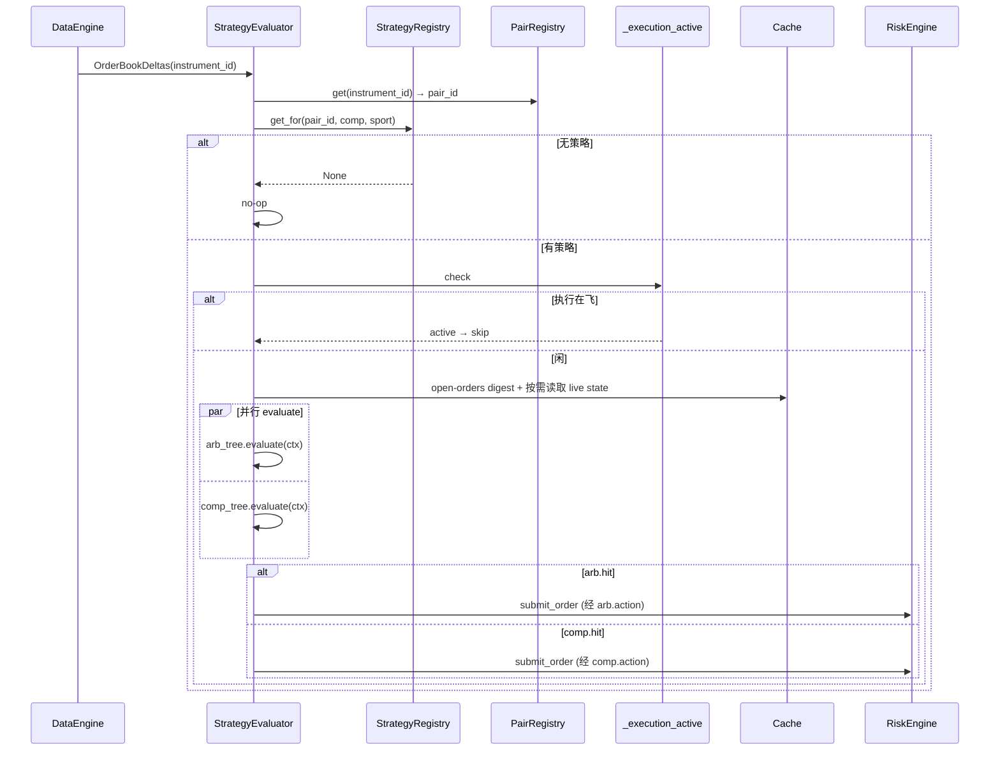

# Strategy 组件详细设计

> 设计理由 / 决策史(Q13/Q14/Q16/Q19/Q20 早期约束 + **Q21 框架锁定 2026-05-24**)见初设 `refactor.md §5.4 / Q21`。Q20 全状态快照已由 refactor #266 取代。
> 冲突时:有把握 → 以本文为准并回写;没把握 → 提出讨论。对应初设 Step 4。

---

## 1. 职责与边界

| 件 | 基类 / 角色 | 职责 |
|---|---|---|
| `StrategyEvaluator` | NT `Strategy` | 唯一运行时策略:订触发事件(`OrderBookDelta` / `MatchedPair` / PMS 比赛状态)→ 查 `StrategyRegistry` → 构造当前 `EvalContext` → 并行 evaluate arb+comp 树 → fire action；所有订单经原生 `submit_order` |
| `StrategyRegistry` | 普通类 | 按 scope 索引策略;`get_for(pair_id) → Strategy or None`,按**挂载存在锁定**:具体比赛挂了就锁定本 scope,即使没命中也**不降级**(Q21-a) |
| `Strategy` | 领域 dataclass | `{ scope_key, arbitrage_tree: Condition, compensation_tree: Condition, metadata }`；仅是配置树，不逐个注册为 NT Strategy |
| `Condition` | dataclass | `{ self_hits: BoolExpr, sub_conditions: list[Condition], checktion: CheckExpr, actions: list[Action] }` |
| `BoolExpr` / `StateQuery` | DSL | self_hits 的无状态布尔查询树；叶子直接读取当前 `EvalContext`，支持 AND/OR/NOT 嵌套 |
| `CheckExpr` / `Check` | DSL / abstract | checktion 的有副作用布尔树；`Check.passes(ctx) -> bool` 为叶子，支持 AND/OR/NOT 嵌套及 `scratch` 事务 |
| `Action` | abstract | `async Action.execute(ctx)` 由 Evaluator 按顺序 await |
| `EvalContext` | dataclass | 每轮评估上下文；Strategy 随用随读 live Cache，只冻结评估开始时的 pair order/position digests 并透传 Execution |

**职责边界(继承自前期锁定)**:
- ❌ **不引用 Risk**:透明拦截,strategy 只通过 `on_order_denied` 感知结果(§5.4)
- ❌ **不缓存待下单意图**:每轮全量重算(Q13)
- ❌ **不在策略层做 tp/sl/global 硬停**:归 RiskEngine(Q16)
- ✅ 设计参数与决策逻辑归本组件
- ✅ `self_hits` 只表达当前状态查询，不保存 persistent/transient signal；跨轮状态由其自然归属组件维护，查询时经 `EvalContext` 读取

---

## 2. 数据流

```mermaid
flowchart TB
  subgraph EV[触发事件]
    OBK[OrderBookDelta]
    MP[MatchedPair]
    EXT["PMS SportsGameUpdate"]
  end
  EV --> EVA[StrategyEvaluator<br/>NT Strategy]
  EVA -->|查 pair_id| PR[(PairRegistry)]
  EVA -->|按 scope 优先级| SR[(StrategyRegistry)]
  SR -->|Strategy or None| EVA
  EVA -->|Q19 mutex 检查| EXEC{execution_active?}
  EXEC -->|是 跳过本轮| END[end]
  EXEC -->|否| BASE[记录 pair order/position digests]
  BASE --> EVAL["并行 evaluate(arb, comp)<br/>行情/持仓随用随读 live Cache"]
  EVAL --> ARB[arbitrage_tree → (hit, action)]
  EVAL --> COMP[compensation_tree → (hit, action)]
  ARB --> PLAN1[套利树独立规划<br/>arbitrage plan]
  COMP --> PLAN2[补偿树独立规划<br/>compensation plan]
  PLAN1 & PLAN2 --> SELECT{补偿 plan 存在?}
  SELECT -->|是| DISPATCH[统一分发补偿 plan]
  SELECT -->|否| DISPATCH2[统一分发套利 plan]
  DISPATCH & DISPATCH2 -.submit/cancel.-> RE[Risk / grouped barrier]
```

要点:
- **OBD 触发(2026-07-30,已落地)**:`on_order_book_deltas` 不按 venue 类型过滤；PM(probability)与 OE/SE(decimal)的已订阅 OBD 都可触发机会评估。NT 在回调前已更新对应 order book cache，Evaluator 继续复用 `instrument_id → PairRegistry → pair_id` 路由及 per-pair 串行门控。修订理由见 refactor.md #297；测试 `test_evaluator.py::test_obd_from_{decimal,probability}_venue_triggers_eval`。
- evaluate **不执行 Action**:返回 `EvalResult { hit, pending_actions }`,fire 由 evaluator 顶层做；
  Check 只可写本树独占的 per-eval `ctx.scratch`
- arb / comp 两棵树 **真并行**(`asyncio.gather`)
- **树间取舍(#301)**在 Evaluator 统一分发阶段执行：两树各自完成门控、选择和计划构造，
  有补偿 plan 就选择补偿，否则选择套利。补偿树内部仍由 CheckExpr OR 的配置顺序决定
  `spread_cancel_recovery` 与 `mean_rebate_recovery` 的优先级
- order/position digests 不是对象快照；它们只用于 Execution release 前检测评估窗口内订单或
  仓位字段是否变化

---

## 3. 接口设计

### 3.1 `BoolExpr` + `StateQuery`(条件 DSL)

```python
class BoolExpr(ABC):
    @abstractmethod
    def eval(self, ctx: EvalContext) -> bool: ...

class StateQuery(BoolExpr):
    """叶子：每次直接读取当前上下文。"""
    @abstractmethod
    def matches(self, ctx: EvalContext) -> bool: ...

class AndExpr(BoolExpr):  # 同 OrExpr / NotExpr
    def __init__(self, *exprs: BoolExpr): self.exprs = exprs
    def eval(self, ctx): return all(e.eval(ctx) for e in self.exprs)
```

`StateQuery` 与 `Check` 分开注册：前者只能查询状态并返回 bool；后者属于机会核查，可向
`ctx.scratch` 写本轮派生数据。框架不维护任何 signal 状态。

### 3.2 `Condition` / `CheckExpr` / `Check` / `Action`

```python
@dataclass
class Condition:
    self_hits: BoolExpr                        # 当前状态 guard
    sub_conditions: list["Condition"] = field(default_factory=list)   # 子组合互斥
    checktion: CheckExpr = field(default_factory=AndCheckExpr)         # 空 AND = 默认通过
    actions: list["Action"] = field(default_factory=list)              # 命中后按顺序执行

@dataclass
class EvalResult:
    hit: bool
    pending_actions: list["Action"] = field(default_factory=list)

class CheckExpr(ABC):
    @abstractmethod
    def eval(self, ctx: "EvalContext") -> bool: ...

class Check(CheckExpr):
    @abstractmethod
    def passes(self, ctx: "EvalContext") -> bool: ...

class AndCheckExpr(CheckExpr): ...  # 同 OrCheckExpr / NotCheckExpr

class Action(ABC):
    @abstractmethod
    async def execute(self, ctx: "EvalContext") -> None: ...
```

`CheckExpr` 与 `BoolExpr` 使用相同的 AND/OR/NOT 认知模型，但不能共用实现：
`StateQuery` 是纯查询，`Check` 会把 `legs/candidates` 等派生结果写入 `ctx.scratch`。
`CheckExpr` 因而规定以下事务语义：

- 所有节点同步执行，并按配置顺序短路，不并行调用 Check。
- Check 叶子返回 False 或抛异常时，回滚本叶子对 `scratch` 的修改。
- AND 任一子表达式失败时，回滚整个 AND；全部成功才提交所有顺序产物。因此
  `mean_rebate AND require_cross_venue` 的后者能读取前者生成的 legs。
- OR 的失败分支均从进入 OR 时的同一份 `scratch` 求值；首个成功分支提交并短路，
  后续分支不执行。
- NOT 只取反布尔结果，无论子表达式命中与否都丢弃其 `scratch` 修改。

### 3.3 `Strategy` / `StrategyRegistry`

```python
ScopeKey = Union[PairId, CompetitionName, SportName]   # 三种 scope,带类型

@dataclass
class Strategy:
    scope_key: ScopeKey
    arbitrage_tree: Condition
    compensation_tree: Condition
    metadata: dict = field(default_factory=dict)

class StrategyRegistry:
    """按 scope 索引;查找按优先级 pair_id > competition > sport,
    **挂载存在锁定**(Q21-a):某 scope 挂了 = 锁定本 scope,即使没命中也不下放。"""
    def __init__(self):
        self._by_pair: dict[str, Strategy] = {}
        self._by_competition: dict[str, Strategy] = {}
        self._by_sport: dict[str, Strategy] = {}

    def register(self, strategy: Strategy): ...
    def get_for(self, pair_id: str, competition: str, sport: str) -> Strategy | None:
        # 严格按优先级,挂了就锁定,不降级
        if pair_id in self._by_pair: return self._by_pair[pair_id]
        if competition in self._by_competition: return self._by_competition[competition]
        return self._by_sport.get(sport)
```

### 3.4 `StrategyEvaluator`(NT `Strategy`,唯一运行时策略)

**算法 `evaluate_tree` 是 `condition.py` 的模块级纯函数**(与运行时 Strategy 解耦,可全单测；
Strategy 只做 orchestration:open-order baseline / gather / fire)。

`strategy.enabled=false` 不卸载本 Strategy。原因是本 Strategy 还承担 `MatchedPair` 后
`_ensure_obd_subscribed` 的 OBD 订阅桥职责;卸载会让 PM/OE 盘口不进入 cache。禁用策略时,
配置 dispatcher 返回空 `StrategyRegistry`,Evaluator 仍订阅 OBD,但 `_route_eval` 查不到策略后 no-op,
因此不会评估条件树或触发 Action/submit。

```python
# condition.py(模块级,纯)
def evaluate_tree(cond: Condition, ctx: EvalContext) -> EvalResult:
    if not cond.self_hits.eval(ctx):
        return EvalResult(hit=False)
    if cond.sub_conditions:
        for sub in cond.sub_conditions:
            res = evaluate_tree(sub, ctx)
            if res.hit:
                return res            # 互斥:命中即停(Q21)
        return EvalResult(hit=False)
    if cond.checktion.eval(ctx):
        return EvalResult(hit=True, pending_actions=cond.actions)
    return EvalResult(hit=False)


# actor.py
class StrategyEvaluator(NTStrategy):
    def __init__(self, config, deps): ...   # deps: pair_registry / strategy_registry / portfolio /
                                            #       is_execution_active / loop

    def on_start(self):
        # slice 10d(#52):msgbus 直订 — NT `subscribe_data` 强制 SubscribeData cmd 路由(需 client_id/instrument_id);
        # MatchedPair 是组件间事件(MarketMatchingActor publish),走 msgbus broker。
        self._msgbus.subscribe(topic=f"data.{MatchedPair.__name__}", handler=self.on_data)
        # OrderBookDeltas 是 venue/instrument-tied,**slice 10d MVP 不预订**(MatchedPair 触发足以验全链路);
        # MatchedPair fire 后按 per-iid 订阅；概率校验通路按 matching 的 managed handoff 契约
        # 使用 managed=False，关闭校验时使用 managed=True 首次建立 book。
        # 只订 tradable_instrument_ids;PMSPORTS 等 non-tradable anchor 不订,旧 PM/OE 字段不作为 fallback。
        # #250:SportsGameUpdate 按场经 NT subscribe_data 订阅,MatchedPair 时发起(§3.8.1)

    def on_data(self, data):
        # 1. _extract_evaluation_target(data) → (pair_id, sport, competition);MatchedPair 直读,
        #    其它 event 经 PairRegistry + instrument.info 反查
        # 2. 查 StrategyRegistry,有则 _create_task(self._evaluate_and_fire(strategy, pair_id))

    async def _evaluate_and_fire(self, strategy, pair_id):
        if self._is_pair_executing(pair_id): return    # §7.5(#316):本 pair 让路
        instrument_ids = self._pair_registry.instrument_ids_for_pair(pair_id)
        positions_digest = pair_positions_digest(self.cache, instrument_ids)  # #317:仅 position
        submitter = self._make_submitter()
        common = dict(
            pair_id=pair_id,
            cache=self.cache,
            pair_registry=self._pair_registry,
            sports_store=self._get_sports_store(),
            positions_digest=positions_digest,
            submitter=submitter,
            pair_order_canceler=self._make_pair_order_canceler(),
        )
        arb_ctx = EvalContext(**common)
        comp_ctx = EvalContext(**common)
        arb_res, comp_res = await asyncio.gather(                # 并行(_aevaluate 是 sync evaluate 的 async 包)
            self._aevaluate(strategy.arbitrage_tree, arb_ctx),
            self._aevaluate(strategy.compensation_tree, comp_ctx),
        )
        # 两树 Action 链在各自 ctx 内走完，只生成 execution_plan，不提交/撤单。
        await asyncio.gather(
            self._prepare_actions(arb_res, arb_ctx),
            self._prepare_actions(comp_res, comp_ctx),
        )
        arb_plan = arb_ctx.scratch.get("execution_plan")
        comp_plan = comp_ctx.scratch.get("execution_plan")
        plan = comp_plan or arb_plan                    # 补偿优先
        if plan:
            await dispatch_execution_plan(plan, ...)    # 唯一执行副作用边界

    async def _aevaluate(self, tree, ctx):
        return evaluate_tree(tree, ctx)         # sync evaluate 包成 coroutine 供 gather;
                                                # Check 演进到 async I/O 时本层无需改动
        return EvalResult(hit=False)
```

`StrategyEvaluator` 的异步派发通过 `_create_task(...)` 统一处理:生产路径使用 NT kernel
`Actor.register_executor(...)`（`Strategy` 继承自 `Actor`）注入的运行 loop;`StrategyEvaluator.register_executor(...)` 先调用
NT 原生注册,再把同一个 loop 保存为 Python 侧调度指针。deps 注入的 `loop` 只作为未注册 executor
的单测 fallback。

> **⚠️ 本段原文(2026-06-30 ~ 2026-07-22)把两个不同问题混写成一条,已按 #260 拆开。**
> 旧文写"`on_data` 不保证处于 asyncio task 内,所以不能把 `get_running_loop()` 当作调度入口;
> 若当前 running loop 正是注册 loop 直接 `create_task`,否则 `call_soon_threadsafe` 投递",
> 读起来像"那条 fallback 是为下面那次事故写的"。实际是两件事:

| | 问题 | 状态 |
|---|---|---|
| **A** | **loop 身份取错** —— `add_actors()` 在 `node.run()` 之前捕获的 loop 不是节点实际运行的 loop,协程投上去永不执行 | **真实事故**(见下段),由 `register_executor` 解决 |
| **B** | **当前不在该 loop 上** —— 需要跨线程投递 | **未证实的假设**,#260 已删除该分支 |

A 已由 NT 保证:`kernel.py` 在 `start_async()`(本身已跑在 kernel loop 上)内调 `_register_executor()`
→ `actor.register_executor(self._loop, ...)`,拿到的就是真正运行中的 loop。因此 `_create_task`
只需 `loop.create_task(coro)`。

B 的 `call_soon_threadsafe` 分支 **#260 删除**,理由(同 `#105 ②`「无兜底猜测」纪律):
① 它返回 `Handle` 而非 Task,挂不了 done-callback → pair 闸的释放会静默失效;
② 它把"协程会不会跑"变成模糊态,导致在其上设计释放逻辑必然出错;
③ 真发生时 `loop.create_task` 会响亮抛 `RuntimeError: Non-thread-safe operation ...`,
届时按实际成因解决,而不是预先用一条未经验证的分支把问题吸收掉。

`add_actors()` 在 `node.run()` 前装配 actor,不能把当时通过 `asyncio.get_event_loop()` 取得的 loop
当作 NT 实际运行 loop,否则会出现只打印 `Strategy evaluate scheduled`、但无
`Strategy evaluate result` 且 `PairInFlightGate` 一直占用的症状(即上表问题 A)。

#### pair 闸的所有权出口(#260,2026-07-22,已落地)

**加锁与释放同层对称** —— 闸在 `_dispatch_eval`(OBD 回调同步段)置位,由**同一函数挂的
done-callback `_on_eval_done` 唯一释放**;`_evaluate_and_fire` 不再持有闸的知识,只返回
(#261:不再返回 `handed_off`)。闸机制本体见 `_cross-cutting/synchronization.md §7.3`;
全局 ≤1 执行见同文 §7.5(barrier 单点 + 纯派生态)。

```python
def _dispatch_eval(self, pair_id, ...):
    if not self._pair_inflight.try_enter(pair_id):        # 置位
        return
    coro = self._evaluate_and_fire(strategy, pair_id)
    try:
        task = self._create_task(coro)
    except Exception:
        coro.close()
        self._pair_inflight.release(pair_id)             # 排程失败:协程从未排程 → 释放安全
        raise
    task.add_done_callback(partial(self._on_eval_done, pair_id))   # 唯一释放点

def _on_eval_done(self, pair_id, task):
    # #261:无条件释放 —— 闸只保证"同 pair 不并发评估",没有跨组件交接,就没有可漏的判据。
    if not task.cancelled() and task.exception():
        self._log.error(...)          # 否则 fire-and-forget 异常被静默吞掉
    self._pair_inflight.release(pair_id)
```

**#261:释放是无条件的。** `_on_eval_done` 不再判断"有没有下单" —— 闸只保证「同一 pair 不并发评估」,
评估 task 结束就释放。#260 的 `handed_off` / `submitter.submitted_count` 交接判据**已删除**:
跨组件传递所有权才需要判据,而判据会漏(`#105 ②` 就漏了「action 链零提交」一态)。
**全局 ≤1 执行**改由 `ArbLiveExecutionEngine` barrier 用纯派生态保证,见
`_cross-cutting/synchronization.md §7.5`。

`await self._execute_actions(...)` 保留(原为 `create_task`):让 action 链的异常落进本 task,
由 `_on_eval_done` 带 traceback 打出来,而不是变成无上下文的 asyncio
"Task exception was never retrieved"。代价核对过为零 —— 本方法本就在自己的 task 里,
await 不阻塞别的 pair、不阻塞 loop(actions 内部本就顺序 await)。position digest 作为不可变字符串
随 ctx 活到 actions 结束并写入每条 order metadata（#317:open-orders-digest 已删）。

`is_execution_active` 前置检查保留,但 **#261 起只用于省算力**(避免明知会被 barrier 拒还去评估),
**不承担正确性**。用户明确不把 barrier ctx 纳入该判据:执行刚起步的那 ~2s 内仍会评估、
多几条 deny 日志,属吞吐/降噪取舍。

`StrategyEvaluatorConfig.log_evaluations=True` 时,评估器只增加 INFO 级低噪声运行锚点日志,不改变决策语义:
`Strategy evaluate scheduled` / `Strategy evaluate skipped` / `Strategy evaluate result` /
`Strategy action fired|skipped`。该开关用于 NT-node smoke 中确认 `OrderBookDeltas` 是否真的触发了
strategy evaluate,默认 `False` 保持生产路径安静。

### 3.6 消息接线

| 类 | 接收 | 发布 |
|---|---|---|
| `StrategyEvaluator` | `OrderBookDeltas` / `MatchedPair` / NT per-(game,phase) `SportsGameUpdate` CustomData(#250/#322) | `submit_order`(经 Action;走 RiskEngine 标准管道)|
| `Action` 类 | (无订阅) | `submit_order` / `cancel_order`(NT 标准 client 接口)|

### 3.7 StateQuery/Check/Action 类型注册 + JSON loader

`StateQuery`、`Check`、`Action` 都是 ABC，具体类由 launcher 注册。三类 registry 分离：
状态查询不能复用会写 `scratch` 的 Check。

```python
register_state_query(name: str, cls: type[StateQuery])
register_check(name: str, cls: type[Check])    # 同名异类 raise(防误覆盖)
register_action(name: str, cls: type[Action])
build_state_query({"type": name, "params": {...}})
build_check({"type": name, "params": {...}})   # → cls(**params);未注册/参数错 → StrategyConfigError
build_action(...)                              # 同上;旧 action share 等未知参数 fail-fast
```

**JSON loader**(`src/arbitrage/strategy/json_loader.py`):递归解析 + registry 装配。

```python
bool_expr_from_json(spec)        # StateQuery spec 或 {"AND"|"OR"|"NOT": ...} → BoolExpr
check_expr_from_json(spec)       # Check spec 或 {"AND"|"OR"|"NOT": ...} → CheckExpr
condition_from_json(spec)        # 递归 sub_conditions / checktion / actions
strategy_from_json(id, spec, scope_key)  # 组装 Strategy
build_strategy_registry(cfg.strategy)    # bindings → StrategyRegistry
```

**缺值兜底**(Q21 必填字段):
- `self_hits` 缺 / None → `AndExpr()`(空 AND = vacuous truth,让下游决定 hit)
- `checktion` 缺 / None / `{}` → `AndCheckExpr()`(空 AND，默认通过)
- `compensation_tree` 缺 / None → 永 False no-op `Condition(self_hits=OrExpr())`(空 OR,从不 fire)

**scope 字符串格式**:`pair:<id>`(或别名 `pair_id:<id>`)/ `competition:<name>` / `sport:<name>`。
loader 解析前缀 → 调对应 `register_pair/_competition/_sport`。

**配置驱动 vs 代码硬编码**(#41 Q25 决策):配置驱动允许用户在 JSON 里递归组合
Condition 树,Q21 框架的"参数 first-class"特性配合 registry 实现了真正的运行时 wiring。
**dispatch 路径**:`to_strategy_registry(cfg)`(`config/dispatcher.py`)。`strategy.enabled=false`
时 dispatcher 返回空 registry,保留 OBD 订阅桥但禁用策略 Action。

### 3.8 per-eval scratch + live state 查询 + 用户域 Check/Action

具体策略需要 Check 算 derived 数据交给 Action 下单；状态查询则必须读取状态自然归属方的当前数据，
不在 Strategy 内复制一套跨轮状态。

| 数据类型 | 例子 | 落点 | 隔离 |
|---|---|---|---|
| 同 condition 树内 Check→Action 传值 | mean_rebate 算的 legs | `EvalContext.scratch: dict` | **per-eval 自动**(每次 evaluate 新建 ctx)|
| 当前状态查询 | PMS 比赛状态、订单、持仓 | `StateQuery.matches(ctx)` 从 `EvalContext` 读取其自然归属 Store/Cache | 由 `pair_id` / `game_id` 查询键隔离 |

**live state 契约(#266)**:
- `EvalContext` 持 `cache / pair_registry / sports_store`,Check/Action 在实际使用点读取当前
  order book、instrument info、position 与 instrument constraints，不再复制整个 pair 状态。
- 所有 binary pair 的经济 outcome 固定为 `["yes","no"]`。`claim` 是经济 outcome；
  `selection_role` 只用于匹配/展示。claim=no 的候选腿仍可带
  `lay_price` 与 `exec_instrument_id`，执行转换语义不变。
- 冻结项是 `positions_digest`（#317:open_orders_digest 已删,承 #316 per-pair ≤1）:Evaluator 在评估开始时对 pair 全部可交易
  instrument 的 positions 取不可变摘要；Action 原样写入所有真实腿 metadata，
  Execution barrier release 前重算比较。跨组件协议见
  `_cross-cutting/synchronization.md §8.4bis`，摘要 helper 落点见 common architecture §9。

**`EvalContext.scratch: dict`**:per-eval 自动隔离的 mutable scratch space。Check 算出的
derived 数据只给同树 Action 使用；套利树和补偿树分别拥有独立 `EvalContext/scratch`，禁止
跨树注入 candidate。每条命中链最终只能写本树 `execution_plan`；Evaluator 等两条链都完成
后读取两个 plan 做优先级选择。

**`EvalContext.pair_order_canceler`**:Evaluator 注入的同步回调。调用时重新读取
`PairRegistry` 下全部 instrument 的 live `cache.orders_open`，按 `client_order_id` 去重；
随后为这一组订单生成共享 cancel opportunity metadata，并逐单调用 NT 原生
`Strategy.cancel_order(order, params=...)`。不保存 Check 阶段的可变 Order 引用，不调用 venue
私有撤单接口。命令先由 Execution 的共享 grouped-command barrier 按 cancel policy 收齐，再统一释放；PM/OE/SE 的
请求与终态确认仍由各自既有 cancel session 负责。横切协议见
`_cross-cutting/synchronization.md §8.4bis`。

**运行时默认规模参数(2026-06-29;fx 边界校准 2026-06-30;SE 第一阶段接线 2026-06-30;Venue Registry 收口 2026-07-02)**:`EvalContext.strategy_defaults` 每轮由 `StrategyEvaluator` 从 live `ArbitrageParams` 读取,当前只包含 Strategy 会消费的 `share` / `max_leg_share`。这些值来自顶层 `arbitrage` 配置段,Web Arbitrage 标签页热改时通过 `command.arb.arbitrage_params` 同步到 StrategyEvaluator;strategy JSON 中各 Check/Action 的 `params` 若显式给同名字段,优先级高于 Web 默认。边界原则:Condition/Checktion 发现机会时应产出带 `share_if_wins` 或 `qty` 的完整计划腿;Action 只做缩放、选择、提交,不负责决定原始 share。Strategy 内部外部 venue `qty` 一律按 USD stake 口径,`fx` 不进入 `EvalContext.strategy_defaults`,只由对应 adapter 在 CURRENT_BETS 入站和 placeBets 出站使用。Strategy 概率/qty/share-limit 分支按 Venue Registry `odds_model` 派生,真理源见 `_cross-cutting/venues.md §4/§5.4`。

**用户域子类(slice 9 #49 落地)**:

| 类 | 文件 | 用 |
|---|---|---|
| `MeanRebateCheck(min_rate, share=None)` | `src/arbitrage/strategy/checks/mean_rebate.py` | 从 live Cache 按 canonical `claim=yes/no` 分组并校验完整性；每个 outcome 取跨 venue 最低隐含概率后求 rate。decimal 概率换算与执行字段语义不变 |
| `OneSideRebateCheck(min_rate, share=None)` | `src/arbitrage/strategy/checks/one_side_rebate.py` | 从 live Cache 按固定 `yes/no` outcome 收集所有可买 leg，枚举 venue 组合与 target outcome；达阈值时写 `ctx.scratch["candidates"]`。qty 通过 Venue Registry 计算 |
| `NegRebateCheck(max_rate=0.0)` | `src/arbitrage/strategy/checks/neg_rebate.py` | one_side_rebate 之后的候选方向门控：读取 Portfolio 的 `outcome_exposures/outcome_shares`，以各 outcome 聚合后的最大 share 为共同分母计算当前 rebate；按每个 candidate 的 `target_role` 过滤，只保留该 outcome 满足 `net_profit / max_share <= max_rate` 的 candidate。默认阈值为 0；无仓位时各 outcome rebate 视为 0，因此默认可通过。缺 candidates、Portfolio、完整 yes/no outcome 或经济投影异常时 fail-closed。只判断当前仓位，不预测加入 candidate 后的结果 |
| `RequireCrossVenueCheck()` | `src/arbitrage/strategy/checks/cross_venue.py` | 套利树过滤器:放在 `mean_rebate` / `one_side_rebate` 之后。若 `ctx.scratch["legs"]` 全部来自同一 venue,清空 legs 并返回 False;若 `ctx.scratch["candidates"]` 存在,过滤掉“candidate 内所有腿同 venue”的 candidate,剩余为空才返回 False。补偿树/recovery 可能天然单腿,不要放这个 Check |
| `MeanRebateRecoveryCheck(min_repaired_rebate=-0.05, venue_select=False, force=False, pnl=True)` | `src/arbitrage/strategy/checks/mean_rebate_recovery.py` | 从 live Cache 的 open positions 计算每个 outcome 的实际 share,**补单目标位**为最大实际 share;当前/修复后 rebate 的净利润基线读取 Portfolio outcome exposure,包含 Data API 对账恢复的 SELL/merge 已实现盈亏;对缺口 outcome 选补救腿写 recovery legs。**rebate 费率分母(#321)** = arbitrage `share`(读 `strategy_defaults["share"]`,不单设 Check 参数);分子含 realizedPNL,故分母用固定意向 share、不用波动的在场 share(理由见 refactor #321),取不到/≤0 则 fail-closed。**`venue_select`**:缺省/`False` 保持现状(各 venue 按 `(prob, venue_preference_rank)` 取最优赔率);`True` 时只在 PM 里选,某 outcome 无 PM 报价则该 role 缺席 → `roles_present` 校验 fail-closed(不补)。position outcome/金额统一委托 venues §4.1。**`force`(#326)**:缺省 `False` 保持 #262 双向率门(当前率 < 阈值才补、补后率 ≥阈值才算有用);`True` 时**旁路这两道率门**,只要存在缺口 outcome 就无条件补到 `target_share`(供 pre_rebate 开赛兜底强平衡,见 §3.10)。仅设很低的 `min_repaired_rebate` **不能**达到强补效果——#262 前置门 `current >= 阈值` 反而会拦住。**`pnl`(#327)**:缺省 `True` 保持 #321(补后率分子含 realizedPNL);`False` 时经 `outcome_exposures(..., include_realized_pnl=False)` 取基线,**当前率/补后率均不含 realized**,只按当轮开仓投影判率(供 pre_rebate 循环开平防即买即卖,见 §3.10;不影响 `target_share`/denom)。 |
| `SpreadCancelRecoveryCheck(spread)` | `src/arbitrage/strategy/checks/spread_cancel_recovery.py` | 遍历该 pair 的 open orders，将订单价与当前 ask 都换算为 outcome exposure probability；严格概率差满足门限时写标准 `legs + cancel_pair_orders`。随后仍完整经过补偿树 `candi_select -> place_bets`：前者做树内门控，后者生成 `cancel_pair` plan；不在 Check/Action 中旁路撤单 |
| `ShareLimitModification(max_leg_share=None)` | `src/arbitrage/strategy/actions/share_limit.py` | strategy 层 share limit 调整。单一 `ctx.scratch["legs"]` 时只按 leg 自带 `share_if_wins/qty` 计算目标 share,直接写回调整后的 `qty/share_if_wins/cost`;candidate 输入只认 `ctx.scratch["candidates"]`,对每个 candidate 独立按 probability venue 或 decimal odds venue 的 remaining 计算 scale,复制并缩放该 candidate 的 `qty/share_if_wins/cost`,输出调整后的 candidate 数组和 `adjusted_share`。venue 类别经 Venue Registry `is_decimal_odds_venue` 判断,不维护 OE/SE 集合。`max_leg_share` 未显式配置时读 Web 默认;Action 不接收 `share` 参数,leg/candidate 缺 `qty/share_if_wins` 时清空 legs 或丢弃该 candidate |
| `VenueReplaceAction(pm_price=None)` | `src/arbitrage/strategy/actions/venue_replace.py` | 显式 PM 定向执行动作：对本树 `legs/candidates/selected_candidate`(candidate 即包了元数据的 legs 数组,三种输入都支持)中的每条非 PM 腿，按同一 pair、同一 canonical outcome(`yes/no`)读取 PM 报价腿作为路由目标(`instrument_id/venue/side/claim/role`)并替换,decimal 合成 NO 的 `lay_price/exec_instrument_id` 不透传。**定价由 `pm_price` 决定**(#330):不存在或 `True`(默认)→ 用 **PM 报价腿概率**(= PM best_ask 隐含概率,PM 实时价);存在且 `False` → 沿用**原 order 隐含概率** `prob`(两 venue 共享 outcome 概率,不看 PM 实时价、也不用原 decimal 赔率)。PM 为 probability venue,`price=prob=` 所选价、`qty=share`(不随价缩放)、`cost=share×prob`;每腿 `share_if_wins` 不变。`pm_price=True` 缺 PM 报价 → 告警回退 0;`pm_price=False` 裸腿无 `prob` → 回退 PM 报价概率并告警。已有 PM 腿原样保留;缺 PM 对应报价或缺 share 时 fail-closed。撤单计划不替换。推荐放在 `share_limit` 前，使额度按最终 PM venue 持仓计算 |
| `CandiSelectAction()` | `src/arbitrage/strategy/actions/candi_select.py` | 每棵树独立执行：本树 `candidates` 优先，缺失时把本树 `legs` 包成单 candidate；逐腿按共享 `leg_plan` 做最小下注门控，再在本树幸存者中选择最大 leg share 最高者。它不读取另一棵树的 candidate，也不承担树间优先级 |
| `DashGateAction()` | `src/arbitrage/strategy/actions/dash_gate.py` | 只处理 `candi_select` 已选出的 `selected_candidate`：读取 `PairPriceStore.start_price`，按腿的 `claim`（缺失时 `role`）找到对应 outcome；若腿为 BUY 且 `leg.prob < 0.5 × start_price[outcome]`，从 candidate 中删除该腿，其余腿和 candidate 元数据保持不变，并同步写回 `selected_candidate["legs"]` 与 `scratch["legs"]`。等于阈值、SELL、缺 pair price、缺 outcome 或缺有效 `prob` 均保留，不凭不完整数据误删。撤单 candidate 不处理 |
| `TrendGateAction(trend="up")` | `src/arbitrage/strategy/actions/trend_gate.py` | 按 **pair 级跨 venue/outcome 一致**的价格趋势筛 `selected_candidate` 的 leg(#329,消费 #trend §3.8.3)。**一致判据**:某 outcome 的**所有 venue 腿 Δprob≥0(up/flat)**且互斥 outcome 的**所有 venue 腿 Δprob≤0(down/flat)**、至少一处严格移动 → 该 outcome 为"干净上升"(complement 即下降)。**筛选语义 = 符合要求的腿留、不符合的删**:`trend="up"`(**默认,概率变大**)只留上升 outcome 的腿,`trend="down"`(概率变小)只留下降 outcome 的腿。趋势读 `ctx.price_trend`(key=`str(instrument_id)`→Δprob,概率空间 PM/OE/SE 同口径,不二次转);一致判据**扫该 pair 全部 tradable 腿**(含未执行的 OE/SE),缺趋势数据的腿当 flat 参与。**任一 venue 反向 / 无严格移动 / `price_trend` 空 / 缺 pair_registry → 无干净趋势 → 没有腿符合 → 全删**(candidate 清空,本轮不下该单);outcome 无法解析的腿也不符合 → 删。只处理 `candi_select` 选出的 candidate,回写两份 legs 视图、元数据不变;撤单 candidate / 空 legs 不处理。`trend` 非法值构造即 `ValueError`。one_side_rebate 套利链用它替换 dash_gate。⚠️ 预热期(相关腿还没攒够两帧)或行情全平时会全删 → one_side_rebate 本轮不下单,属有意的严格取舍 |
| `PreMoveCheck(move_threshold)` | `src/arbitrage/strategy/checks/pre_move.py` | pre_rebate 赛前追腿(#326):读 `PairPriceStore.first_price` 与当前 PM best ask 概率向量,对每个 outcome 算**绝对概率跌幅** `first - now`;最大跌幅 `>=` `move_threshold` 的 outcome = mover(赔率变大/概率变小),写单条 PM `BUY` leg(`qty=qty_from_share(PM, strategy_defaults["share"], now)`,带 `share_if_wins`)到 `ctx.scratch["legs"]`。`first_price` 空 / 缺完整 PM 盘口 / 概率非法 / 无 outcome 达阈 → False(安全 no-op)。赛前/赛中门由 self_hits `in_game` 负责(§3.10),本 Check 不自判 phase |
| `PlaceBetsAction(price_overrides=None, qty_overrides=None, intent="arbitrage", spread=None, enable_timeout=None, market=None)` | `src/arbitrage/strategy/actions/place_bets.py` | 名称为配置兼容保留，职责已收窄为**树内执行计划构造**。撤单意图生成 `ExecutionPlan(kind="cancel_pair")`；普通 legs 完成 side/price/qty、PM 库存减仓、spread、metadata 和资金需求转换后生成 `ExecutionPlan(kind="submit")`。PM 互斥 LONG 减仓只有在应用 spread 后的 SELL 限价 `<=` 该 instrument 当前 best bid 时才转换；缺盘口/bid 或价格不交叉则保留原 BUY。减仓量按现有 LONG Position 拆分，每条 SELL spec 携带对应 `position_id`，由 NT 原生 Position 生命周期关闭该仓位；无法取得 ID 或拆分后不满足单笔最小数量时不使用该库存。该门只保证价格可立即成交，暂不检查 bid 深度。`market=true` 只写订单 metadata，不在 Action 改价；最终市价转换见 execution §3.6。Action 不调用 `submitter/pair_order_canceler`。最终计划由 Evaluator 统一选择和分发，现有 Risk、submit/cancel grouped barrier 与 adapter 不变 |

`mean_rebate`、`one_side_rebate` 与 `mean_rebate_recovery` 的行情候选腿统一由
`src/arbitrage/strategy/checks/quote_legs.py::quote_legs_by_outcome` 构造。⚠️ 2026-07-20/21
(#256)起,`best_ask(book)` 读到的直接就是隐含概率(decimal venue 的 book 写侧已按
`quote_claim` 换算,见 `docs/arbitrage/architectures/data/architecture.md` §2/§3.1),不再
在读侧二次调 `probability_from_price`;`leg["price"]`(真实下单价)经新增的
`to_price`(`price_from_probability` 的容错包装)从这个概率换算回来。Strategy 不再用
OrderBook 最深档覆盖计划价。市价意图由 `place_bets.market` 写入订单 metadata，
由 PM/OE/SE adapter 在最终服务端提交前完成 venue-specific 转换；详细契约见
`docs/arbitrage/architectures/execution/architecture.md` §3.6。
`claim/lay_price/exec_instrument_id` 透传只维护一份；三个 Check 只保留各自的组合与阈值算法。
Recovery 读取持仓时若发现 probability SHORT 等经济投影不变量错误,记录错误并放弃本轮；
ShareLimit 通过严格 Portfolio 读取持仓，遇到缺 claim 或 probability SHORT 时清空本轮
legs/candidates,不把未知敞口当成零继续下单。

**candidate action 链(2026-06-28;2026-07-31 #301 修订)**:`one_side_rebate` 等 Check 统一写
`ctx.scratch["candidates"]`。标准链路:
`share_limit -> candi_select -> place_bets`(arb 链);comp 链为 `candi_select -> place_bets`
(#277:comp 链也插 candi_select 使补救单同样过最小下注门控,但**不插 share_limit** ——
补救不受 `max_leg_share` 限制的现状语义不变)。两条链完全隔离；`candi_select` 只在本树内
门控和选择，`PlaceBetsAction` 只生成本树 `execution_plan`。树间补偿优先由 Evaluator 的统一
分发阶段实现，不改 submit/cancel barrier。
legs-only 的 Check(`mean_rebate` / `mean_rebate_recovery`)不必改写 candidates:
`candi_select` 对缺 `candidates` 键的 scratch 把 `legs` 包成单 candidate 走同一路径。

需要把执行 venue 强制定向到 PM 时，套利链显式插入
`venue_replace -> share_limit -> candi_select -> trend_gate -> place_bets`。`candi_select` 之后的
腿过滤是**可选、可替换**的一格:`dash_gate`(开赛价断层过滤,读 `PairPriceStore.start_price`)
与 `trend_gate`(最近一帧趋势过滤,读 `ctx.price_trend`,§3.8.3)二选一。**#329(2026-08-09)起
`one_side_rebate` 套利树用 `trend_gate` 替换了 `dash_gate`**(默认留概率变大的腿);两者都不进补偿树。
`venue_replace` 顺序不可后移到 `share_limit`
之后：替换会改变 venue，额度必须读取最终 PM 持仓。`venue_replace` 只转换执行腿，不重新执行
上游 Check，也不重算 candidate 的发现时 `rate/total_prob`；这些字段继续表示替换前机会。

`one_side_rebate` candidate 的 share 语义:非 target outcome 的 `share_if_wins=share`;target outcome
使用非 target 买完后的剩余预算全部买入,因此 `target_share_if_wins = target_cost / target_prob`。
例如 home=0.45、away=0.50、share=100 时,target=home → away 买到 100 share,home 用剩余 50
买到 111.11 share,rate=11.11%。`candi_select` 后续只看 share-limit 调整后的 candidate 内最大
`share_if_wins`,不依赖 `target_role`。

#### 3.8.1 PMSPORTS 状态触发与 live 状态读取(#250/#266,已落地)

状态生产、订阅模型、Cache key、归零回收与错误边界的单一真理源在
`architectures/data/architecture.md §3.4.1`;本节只定义 Strategy 消费契约。

接线:

1. **按场订阅 phase 通道**:`MatchedPair` 到达时,gid 经 PairRegistry
   `game_id_for_pair(pair_id)` 反查(matching 注册先于发布,同步时序安全),
   `subscribe_data(sports_data_type(gid, SPORTS_CHANNEL_PHASE), client_id=PMSPORTS)`；
   同时自记 `game→OBD 腿` 映射。当前 Strategy 只消费 phase/ended，不订阅 score；无 gid 的 pair 静默跳过。
2. **`game_id` 是事件路由键**:一次 per-(game,phase) 事件按确定性顺序(`sorted`)对
   `pair_ids_for_game(gid)` 的全部注册 pair 走 `_route_eval_sports` → `_dispatch_eval`;
   未注册 game no-op。每个 pair 仍受既有 `PairInFlightGate` 约束,不引入 event 级全局锁。
3. **事件 payload 只负责唤醒和定位**。PMS processor 已先把最新状态写入
   `SportsGameStateStore`；需要比赛状态的 `StateQuery` 经 `ctx.pair_registry` 定位 game_id，
   再从 `ctx.sports_store` 查询当前值。
4. **ended 释放**:ended 事件扇出分发完毕后,退订本场 sports 与该场各 pair 腿的 OBD
   (自记映射,不依赖 registry)→ 与 matching 侧退订汇合归零 → NT 收尾 + 内存回收
   (Store 条目、managed book;见 data §3.4.1)。
5. Strategy 不冻结 sports state。新 phase update 由 per-(game,phase) topic 触发下一轮评估；
   查询发生时读取当时的 Store 当前值。

#### 3.8.2 PM 初始/开赛价格采集(#323,已落地)

`StrategyEvaluator` 组合 PM OBD、PMS phase 与 PairRegistry，把 market-level pair 的
`first_price/start_price` 写入 Cache-backed `PairPriceStore`（Store schema/API 见 common §3.1）。
一个 3-way event 仍是 home/draw/away 三个 binary pair，每个 pair 按自身 `yes/no` outcomes
独立保存，不聚合成 event 级价格。

**初始化**：MatchedPair 到达且能经 PairRegistry 取得 `game_id` 时，按
`MatchedPair.outcomes` 幂等初始化；同时登记 `game_id → pair_ids`，该映射既用于 phase 扇出，
也避免 matching 先 unregister 后 Strategy 无法找到待回收价格。

**first_price**：仅 PM instrument 的 OBD 可触发。NT 已在回调前更新 managed OrderBook，
Evaluator 从该 pair 全部 PM instruments 读取每个 outcome 唯一且完整的 best ask 概率向量。
**Sports Store 必须正面确认 PRE（存在且 `not live/ended`）才视为未开赛并采集；`None`（无状态）
与 `live/ended` 一律不采**（#322 修订续，2026-08-06）。完整向量的概率和位于闭区间
`[0.95, 1.05]` 时整组首次写入；缺腿、重复 outcome、非法价格或区间不通过均保持空值。OE/SE OBD
只继续触发既有策略评估，不参与参考价采集。

> **为何 `None` 不再当赛前(late-join 根因)**：旧逻辑把 `None` 当"未开赛"采集,理由是 firehose
> 不推赛前帧、真赛前 game 的 Sports Store 本就是 `None`——但 `None` 二义:它**也**是 late-join 的
> 状态。matching 用 **Gamma discovery anchor**(非 firehose)成型 MatchedPair,sports 订阅在
> `_emit_pair` 同步发布之时/之后才发生(matching `_reconcile_sports_subscriptions`),故 MatchedPair
> 到达、strategy 订 OBD 的**那一刻 Sports Store 对该 game 必空 = `None`**;PM OBD 紧随 OBD 订阅先到、
> firehose 首帧未到 → `_capture_first_price` 把盘中盘口误采成 first_price → 进而污染 start_price
> (0.6→盘中价)、`DashGateAction` 阈值塌陷不删崩腿(实盘 2026-08-06 ATP 复现:start_price 0.6→0.13,
> no@0.06 腿本该删却被买 30 手)。因两种 `None` 采集时刻无法区分、且 firehose 无 PRE 帧 → 无法正面
> 确认赛前 → **实盘 first_price 基本不再采集,start_price 恒默认 `0.6`、gate 用固定 `0.5×0.6=0.30`
> 阈值**(late-join 正确删崩腿)。这是有意放弃 adaptive 开赛价采集换 robust——它与 late-join 污染
> 共用同一 `None` 窗口、无法只留 happy-path。

**start_price**：收到 `live=True && ended=False` 的 phase 消息时，按 game 扇出全部 pair；
**仅当该 pair 已采到 `first_price`（= 见证过赛前盘口）**且所有 start values 仍为默认 `0.6` 时，
读取当时 Cache 中完整 PM best ask 向量并整组首次写入，不执行概率和校验。phase 时缺完整
PM 盘口则保留默认值，后续 OBD 不补写。

**`first_price` 前置 = late-join 护栏（#322 修订）**：firehose 不推赛前帧、一场首帧即
IN_PLAY（data §3.4.2），故"phase live 帧"本身无法区分"赛前订上、首帧≈开赛"与"中途接入、
首帧已深盘中"——两者都是 null→IN_PLAY。而 `first_price` 只在赛前 OBD 可采（`live/ended` 禁写），
它非空即**证明本 pair 见证过赛前**。中途接入的 pair 采不到 `first_price` → start_price 保持默认
`0.6`，不会把盘中（可能已崩）赔率误当开赛价、污染 `DashGateAction` 的 `0.5×start` 阈值。
（实盘 WTA pair 复现：late-join 把盘中 ~0.15 存成开赛价 → 阈值塌到 ~0.075、gate 形同虚设、
0.1 腿照下。修法在 capture 侧加 `first_price` 前置，不改 phase 通道广播语义 data §3.4.2。）

**释放**：ended 到达后仍先调度该场最后一次策略评估，并立即沿用 §3.8.1 释放 sports/OBD
订阅；价格记录进入 pending cleanup。Evaluator 按 pair 统计已排程 task，最后一个 task 的
done-callback 才 `delete(pair_id)` 并清 game 索引。无策略且没有在途 task 的 pair 立即删除，
保证不会在异步评估开始前先清 Cache。

#### 3.8.3 PM/OE/SE 价格趋势(#trend,plumbing 已落地 · 消费件未定 · live-unvalidated · as-of 2026-08-09)

`StrategyEvaluator` 维护每条已订阅 instrument 的**相邻两帧 best_ask 变化(Δprob)**,供 Check
按需读"涨/跌"。这是框架内首个 evaluator 自持的**跨帧 transient 状态**(§4.3:跨轮状态由自然
归属组件维护)。

**为什么写在 OBD 回调、不在评估里**:评估经 `PairInFlightGate` 收窄,**不保证每帧都跑**;而
`on_order_book_deltas` 回调体每帧都执行(闸只挡 `_dispatch_eval` 的评估 task,不挡回调)。故趋势
更新放 `_update_price_trend`(回调内、`_route_eval` 前),与 `_capture_first_price` 并列,per-frame。

**存储(key = `str(instrument_id)` = venue + 该腿/outcome,唯一 → 天然分 venue/leg)**:
- `_price_last`:仅内部滚动"上一帧 best_ask";**Check 不读**。
- `_price_trend`:每帧**覆盖 `_price_last` 之前**算好的 `new - prev`;经 `EvalContext.price_trend`
  暴露给 Check。**为何不让 Check 读 last 再与当前 book 比**:评估晚于回调,那时 `_price_last`
  已被覆盖成当前值 → 趋势恒为 0。必须回调时就把结果(Δ)存下。

**概率空间可比(关键)**:`best_ask(book)` 对 PM/OE/SE **都已是隐含概率**(#256 写侧
`oe_runner_to_book_deltas` 已 `probability_from_price` 换算、反向单调已配平),故 Δprob 跨 venue
同向同口径,**不得再转一次**(会把 OE/SE 弄反)。原始 decimal 赔率那层才与 PM 反向,但策略不读原始赔率。

**读法**:Check 按 (pair, outcome, venue) 经 `pair_registry.instrument_ids_for_pair` +
`instrument.info.claim` / `venue_of` 反查 `instrument_id`,再取 `ctx.price_trend[str(iid)]`;
"只看 PM"筛 venue,"每条腿各自"就遍历。`None`=未接入;某腿首帧无 prev → 无条目。

**仅深度帧不冲趋势(#trend,2026-08-10)**:`new_best == prev`(top-ask 价与上一帧完全相同,只挂单量变)
时 `_update_price_trend` **直接返回**,既不覆盖 `_price_trend` 也不动 `_price_last`,保留上一次真实价格
移动的 Δprob。否则纯深度帧会把趋势冲成 flat(0),评估恰好落在这类帧时会误判"无趋势"→ 被 `trend_gate`
全删。下一次真实移动仍从上次真实价算 Δ。判等用精确 `==`(概率由 `probability_from_price` 纯函数换算,
同赔率必得同 float)。

**边界**:首帧无趋势(只 seed `_price_last`);**无阈值**(存原始 Δprob,防抖/最小变动由消费 Check
决定,不在存储层锁死);ended 释放时 `_release_game_subscriptions` 随 OBD 退订 pop 该 game 各腿条目
(防无界增长);缺 book / best_ask ≤0 / 缺 instrument_id → 跳过。

**成熟度**:plumbing 已落地(`_update_price_trend` + `EvalContext.price_trend` + 释放清理 +
`test_price_trend.py`);**消费 Check 尚未定**(给 pre_rebate 还是新件、阈值多少待定)。决策史见
refactor #328。

### 3.9 树内执行计划 + Evaluator 统一分发

**状态：已落地，2026-07-31（#301）。**

套利树和补偿树各自完成 Action 链并生成 `ExecutionPlan`。`PlaceBetsAction` 不产生执行副作用；
`StrategyEvaluator` 等两棵树都完成规划后，以 `compensation_plan > arbitrage_plan` 选择唯一
计划，再调用 `dispatch_execution_plan`。

**落地**:
- `ExecutionPlan(kind="submit")` 携带已定稿的真实 order specs；spread、intent、
  `enable_timeout`、实际 instrument/side/price/qty 均在所属树内确定，dispatcher 不重算。
- `ExecutionPlan(kind="cancel_pair")` 只携带 pair/reason；胜出后才调用 `pair_order_canceler`，
  并继续走现有 grouped cancel barrier。
- 补偿树命中但树内门控后没有 plan 时可选择套利 plan；一旦某个 plan 开始分发，本轮不再回退。
- 任一树 Action 链抛异常则整轮失败，不以套利 plan 绕过异常的补偿链。
- `EvalContext.submitter/pair_order_canceler` 仅供 Evaluator 最终分发使用，树内 Action 禁止调用。
- `make_submitter(*, cache, order_factory, submit_order, log)` module-level 工厂 → `async def submit(spec)`:
  1. `cache.instrument(iid).{size_precision, price_precision}` 拿精度
  2. 经 evaluator 的 NT `order_factory.limit(...)` 构 `LimitOrder`(`OrderSide.BUY/SELL` / `Quantity` / `Price` / `TimeInForce.GTC` / `ARB-*` ClientOrderId / opportunity tags)
  3. 调 evaluator 绑定的 `Strategy.submit_order(order, position_id=...)`；普通 BUY/无库存转换的订单省略
     `position_id`，PM inventory SELL 传入要关闭的既有 LONG Position ID。NT 原生发布 `OrderInitialized`、检查重复
     `client_order_id`、写 Cache，并构造 `SubmitOrder` 路由到 RiskEngine
  4. Risk pass 后进入 `ExecEngine`;Execution opportunity barrier 等齐本轮 legs 后才 release 到 venue
     ExecClient。横切协议见 `_cross-cutting/synchronization.md §8.4bis`。
- 原生 submit 写入 Cache 时订单仍为 `INITIALIZED`；NT `cache.orders_open()` 不把该状态计为 open，
  因此本次机会的新腿不会被 barrier 当成 residual（#317:barrier 已不做 open-order digest 校验）。
- **spec schema**:`{instrument_id, side: "BUY"|"SELL", qty: float, price: float, position_id?: str|PositionId, intent?: "arbitrage"|"recovery", opportunity_id?: str, pair_id?: str, leg_key?: str, expected_legs?: list[str], positions_digest?: str}`（#317:open_orders_digest 已删）。`position_id` 仅用于明确针对既有 Position 的订单；submitter 统一转为 NT `PositionId`。
- `instrument_id` 允许是策略 legs 使用的字符串视图,也允许是 NT 原生 `InstrumentId`;
  `make_submitter` 是边界适配点,统一转成 `InstrumentId` 后再调用 `cache.instrument(...)`
  和构造 `LimitOrder`。这是 Strategy 与 NT cache 的契约边界,避免 Action 层直接依赖 NT 标识对象。
- 冷启动安全:`cache.instrument(iid)` 返 None → warning + skip,不 raise

**PlaceBetsAction 规划边界**:
- 汇总日志为 `PlaceBets[prepare]`；只表示计划已构造，不表示订单已经提交。
- 只有统一分发器输出的 `ExecutionPlan[submit]` / `ExecutionPlan[cancel]` 才表示某个计划
  已被选中并开始执行；同轮未胜出的树可以有 `PlaceBets[prepare]`，但不会有执行副作用。
- `ctx.submitter is None` 时由 dispatcher 输出 `would submit`，用于 smoke。
- size 计算优先级不变。decimal 合成 no 以 `exec_instrument_id != instrument_id` 判定并转 `SELL @ lay/bid`;逻辑 `claim=no` 本身不触发转换。转换/拆单后才建立实际 barrier legs。
- non-tradable guard:若上游误把 `.PMSPORTS` anchor 或其它 `tradable=false` / `anchor=true` leg 写进 `ctx.scratch["legs"]`,整次 opportunity fail-closed,不生成任何 submit spec。
- Action 参数覆盖(#88):`price_overrides={"ORBITEXCH": 1000.0}` / `qty_overrides={"ORBITEXCH": 7.0}` 只用于构造最终 submit spec,适合 live 验证“不成交挂单 → 下一轮 cancel-only”这类执行路径;`MeanRebateCheck` 仍用真实 OBD 的 best ask 计算机会与选择 venue,execution 仍透明执行传入订单内容。
- Action 限价价差(#293):`spread` 缺失或为 0 时不改变行为；设置后先按原计划价完成 qty
  计算及 PM 互斥库存拆单，再把每个最终 draft 的 venue 价格转成 YES 隐含概率，执行
  `BUY: probability-spread` / `SELL: probability+spread` 后反算 venue 价格，因此只改变
  限价、不改变既定 qty。调整后优先使用 instrument
  `min_price/max_price`；PM 未显式给边界时按 `[price_increment, 1-price_increment]`，
  decimal venue 未显式给边界时按 `[1.01, 1000]` 裁剪。`price_overrides` 先于 spread；
  资金需求按 spread 后的计划价格计算。decimal 分段赔率量化属于 Execution adapter 的最终
  payload 边界，不在 Action 重复执行。若本 Action 显式 `market=true`，Execution adapter 的最终
  市价转换可覆盖该限价；Action 仍保留原计划价格。
- Action ACK 收口参数(#298/#300):`enable_timeout` 必须是 JSON boolean；对 submit，缺失/`true` 保持
  等待终态或 watchdog 的既有行为；显式 `false` 时
  `PlaceBetsAction` 为同一 opportunity 的每条真实 submit spec 写该字段，submitter 经
  `OpportunityMeta` 写入 `Order.tags`。普通 cancel-only 不读取原订单该字段；只有补偿树
  grouped cancel plan 显式携带时，才通过 `CancelOrder.params` 传给 cancel session；
  Strategy 只声明策略，不直接结束 execution session。
- Action 市价参数(#325):`market` 必须是 JSON boolean；显式 `true` 时同一 opportunity 的每条
  submit spec 都写入该值，经 `OpportunityMeta` 进入 `Order.tags`。缺失或 `false` 不请求市价；
  Action 不改 price/qty，venue-specific 转换只发生在 execution §3.6 的最终提交边界。
- `intent` 默认 `"arbitrage"`;compensation/recovery tree 应显式配置 `"recovery"`。submitter 将其写入 `Order.tags` 的 `arb:intent=<intent>` 标签。该标签是 Strategy → Risk 的跨组件契约:Risk 对 `recovery` 仍执行 NT 基础检查 + 余额检查,但跳过单场 profit gates(`match_tp/match_sl`),详见 risk 详设 §3.1。
- **opportunity metadata(已落地代码,待 live 验证,2026-06-14)**:`PlaceBetsAction` 在同一次 `execute(ctx)` 内为所有真实 legs 生成同一个 `opportunity_id`,并为每条 spec 写 `pair_id=ctx.pair_id`、稳定 `leg_key`、`expected_legs`(所有真实腿 key,包含自己)。submitter 把这些字段写入 `Order.tags`:`arb:opportunity_id` / `arb:pair_id` / `arb:leg_key` / `arb:expected_legs`，并在 Action 显式配置时追加 `arb:enable_timeout=<true|false>`。不发送 0 qty 空单;没有真实下单的 outcome 不进 `expected_legs`。tag 构造/解析复用 `src/arbitrage/common/opportunity.py`。

**one_side_rebate 补偿配置形态(#294)**:

```json
{
  "compensation_tree": {
    "checktion": {
      "OR": [
        {"type": "spread_cancel_recovery", "params": {"spread": 0.01}},
        {"type": "mean_rebate_recovery", "params": {"min_repaired_rebate": -0.05}}
      ]
    },
    "actions": [
      {"type": "candi_select"},
      {"type": "place_bets", "params": {"intent": "recovery"}}
    ]
  }
}
```

语义:
- OR 按顺序短路：先检查近价挂单。命中时产出标准 legs 和显式撤单元数据，继续走完整
  补偿 Action 链；`place_bets` 生成 cancel plan，Evaluator 在两树规划结束后优先选择它，
  再重新读取并撤销该 pair 全部挂单。不创建 submit，不复用 Execution cancel-only。该 Check 的 `spread`
  同样是概率差，但与 `PlaceBetsAction.spread` 是两个独立参数。
- `mean_rebate_recovery` 只负责判断并生成补缺口 legs:目标 `target_share = max(actual_share_by_outcome)`,只对 `missing_share > 0` 的 outcome 写 leg。existing position 通过 venues §4.1 的 claim/side 感知投影归属固定 `yes/no` outcome 并计算 share/return；候选从 live Cache 读取。decimal no 候选写 `claim=no/lay_price/exec_instrument_id`,最终由现有 `place_bets` 转 SELL@lay;PM no 候选仍 BUY NO token。补救 qty 继续经 `qty_from_share(venue, missing_share, price)` 推导。
- Recovery 依赖已有持仓的真实 `avg_px_open`。若 reconciliation 导入的外部持仓缺少真实成本(`avg_px_open<=0`),本轮 recovery 不触发;不使用当前盘口估算历史成本。PM 成本缺失应回到 PM adapter / trade history 归因路径解决。
- Recovery 的 **`target_share`(补单目标位)** 与开仓 `net_profit` 投影都由本轮同一次 open-position
  读取计算，避免成交刚落仓时 Strategy 已看见 Position、Portfolio 聚合仍返回零敞口而误判“无需补偿”。
  `pnl=true` 时再从 Portfolio 的含/不含 realized 两份 exposure 之差提取 SELL/merge 的 Data API
  realized PnL；该差额会影响“是否需要补”和“补后是否达标”，但不会覆盖开仓投影或虚增持仓
  share。`pnl=false` 不叠加该差额。计算热路径只读内存 Portfolio/ledger,不请求服务端。
- **rebate 费率分母(#321):`net_profit / 配置的意向 share`,不用 `target_share`。** 分子含 realizedPNL(已平部分落袋盈亏),
  分母用波动的「最大在场 share」会随平仓而缩、与含 realized 的分子口径不自洽;arbitrage `share`
  (`strategy_defaults["share"]`,不单设 Check 参数)是 open+已平共同的意向规模,作分母才同基准。**分母与补单目标位就此分家**:目标位仍是
  max 在场 share(决定买多少),分母是配置 share(决定率达不达标)。配置 share 缺失/≤0 → 无从算率 → 保守不补。
- `min_repaired_rebate` 是补齐后允许的最差 outcome return rate 阈值(率 = `net_profit / 配置 share`);例如 `-0.05` 表示只允许修到不低于 -5%。同一阈值双向门控:当前率 < 阈值才补(#262 前置门)、补后率 >= 阈值才算有用。
- 补救 legs 必须带最终 `qty`,由 `place_bets` 直接提交;不新增 `repair_mean_rebate` Action。
- `RequireCrossVenueCheck` 只用于套利树,不用于补偿树。原因:套利树一般应是跨 venue 机会;补偿树可能是单腿补缺口,用该过滤器会误伤 recovery。
- `arb_config.example.json` 的 `mean_rebate` 已默认启用该 `compensation_tree`;生产启动前需确认 `debug.skip_execution` 与真金开关符合预期。

**配合 Q11.3 SkipExecutionClient**:`debug.skip_execution=true` 时 SkipExecutionClient 拦 ExecClient `_submit_order` mock 全成,**Action→submitter→真 SubmitOrder→SkipExecution 兜底**完整链路安全可跑(不上链)。

**验证状态(2026-06-08)**:NT-node skip smoke 用临时配置强制 `mean_rebate` 命中后,
`PlaceBetsAction` 已实测进入 `ExecClient-ORBITEXCH: Submit LimitOrder(...)`,并由 SkipExecution
mock fill 更新 portfolio。限制:skip 模式立即全成,不产生 open order,所以不能用来验证真实撤单 / cancel-only;
cancel-only 主流程由 `tests/arbitrage/e2e/test_mean_rebate_cancel_only.py` 离线覆盖。
同次 smoke 暴露 OBD 高频下同一机会可重复 fire/重复 mock submit,需后续单独补 strategy 执行保护。

**`StrategyId` 固定为 `"ARB-EVAL-001"`**:`StrategyEvaluatorConfig` 使用
`strategy_id="ARB-EVAL"` + `order_id_tag="001"`，由 NT `Strategy` 生成最终 ID。所有 evaluator
订单的 `order.strategy_id` 与 `SubmitOrder.strategy_id` 均来自该注册策略，不再手写 literal。

### 3.10 pre_rebate 策略配置形态(#326,设计 · 组件未落地 · live-unvalidated · as-of 2026-08-08)

**意图**:赛前"追赔率变大(概率变小)的腿"投机 + 返水补救,开赛兜底强平衡。三行为,用 condition
(self_hits `in_game`)分赛前/赛中:

| 行为 | 触发 | 命中条件 | 动作 |
|---|---|---|---|
| B1 赛前追腿 | PM OBD | 赛前(`NOT in_game`)且某 outcome 现价较 `first_price` **绝对概率跌幅 ≥ move_threshold** | PM `BUY` 该 outcome,量 = `arbitrage.share` |
| B2 赛前返水补救 | OBD / phase | 赛前 且已有失衡持仓 且 `mean_rebate_recovery` 补后率 ≥ `min_repaired_rebate` | 补另一腿(recovery)|
| B3 开赛强制补救 | phase `live` | 赛中(`in_game`)且仍失衡 | `mean_rebate_recovery(force=true)` 无条件补,不看率 |

```jsonc
"pre_rebate": {
  "arbitrage_tree": {
    "self_hits": {"NOT": {"type": "in_game"}},
    "checktion": {"type": "pre_move", "params": {"move_threshold": 0.1}},
    "actions": [{"type": "place_bets"}]
  },
  "compensation_tree": {
    "sub_conditions": [
      { "self_hits": {"type": "in_game"},
        "checktion": {"type": "mean_rebate_recovery", "params": {"force": true, "pnl": false}},
        "actions": [{"type": "place_bets", "params": {"intent": "recovery", "market": true}}] },
      { "self_hits": {"NOT": {"type": "in_game"}},
        "checktion": {"type": "mean_rebate_recovery", "params": {"min_repaired_rebate": 0.0, "pnl": false}},
        "actions": [{"type": "place_bets", "params": {"intent": "recovery"}}] }
    ]
  }
}
```

语义与边界:
- **链路精简到 `[place_bets]`**:pre_rebate 单腿、按 `share` 精确买、纯 PM,不需要
  `venue_replace`(本就 PM)/ `share_limit`(不缩量)/ `candi_select`(≤1 candidate,组内选择空转)。
  **代价**:candi_select 的最小下注门控被去掉 → 由 **Risk 侧 `min_notional`/`min_quantity` 兜底**;
  某腿低于最小额时会走到 Risk 才被拒、且每 OBD tick 重复一次(噪声),pre_rebate 可接受。
  `place_bets` 直接消费 `ctx.scratch["legs"]`(place_bets.py:72),不依赖 `selected_candidate`。
- **condition 分赛前/赛中**:`in_game` StateQuery(§4.3)。`sub_conditions` 互斥、命中即停,
  同轮只命中一支;B3 在前(赛中优先强补)。
- **树间取舍不变**:comp_plan > arb_plan(§4.2)。赛前若已失衡且率达标 → B2 先于 B1
  (先补救再谈新腿)。
- **`pre_move` 依赖 `first_price` 已被采集**:first_price 的采集条件与 late-join 污染治理归
  §3.8.2(与本策略解耦——`pre_move` 只**读**,不负责采);当前 §3.8.2 落地下**实盘 first_price
  基本不采** → B1 生产命中率取决于 §3.8.2 是否放开赛前采集。这是**已知依赖,不由本策略修复**;
  first_price 空时 `pre_move` 安全 no-op(不下单)。⚠️ 若要 B1 在实盘真正生效,需另行(在 §3.8.2)
  引入正面赛前采集信号(如 anchor `market_start_time`),届时会连带影响 one_side_rebate 的
  dash_gate 阈值,须单独决策。
- **`force` 补救自终止**:B3 每 tick 命中直到缺口补平;补平后 `mean_rebate_recovery` 找不到
  缺口 → 停。
- **`pnl:false` 防即买即卖(#327)**:pre_rebate 循环开平会累积 banked realizedPNL;若 recovery 补后率
  分子含 realized(#321 默认),banked 会把补后率门抬过阈值 → recovery 把补腿转成互斥减仓 SELL
  (place_bets.py:263)→ 再实现 → banked 再涨 → 自我强化的即买即卖空转。故两支 recovery 均置
  `pnl:false`,补后率只按当轮开仓投影判定,不含 banked。机制与 API 见 §3.8 表 / risk §4.1b / refactor #327。
- **scope 绑定**由运营在 `bindings` 配置(pair/competition/sport),不写死。

---

## 4. 算法

### 4.1 evaluate 主流程(见 §3.4 `evaluate_tree`)

伪代码上面已写。**关键不变量**:
- evaluate 是**纯求值**(无副作用):返 `EvalResult { hit, pending_actions }`
- Action 链在 evaluator 顶层执行；**树间补偿优先在统一分发阶段实现**(§4.2)
- sub_conditions 互斥:命中第一个就停,不遍历后续

### 4.2 arb / comp 独立规划 + 补偿优先统一分发(#301)

```python
arb_res, comp_res = await asyncio.gather(
    evaluate(arb_tree, arb_ctx),
    evaluate(comp_tree, comp_ctx),
)
await asyncio.gather(
    prepare_actions(arb_res, arb_ctx),
    prepare_actions(comp_res, comp_ctx),
)
arb_plan = arb_ctx.scratch.get("execution_plan")
comp_plan = comp_ctx.scratch.get("execution_plan")
if plan := comp_plan or arb_plan:
    await dispatch_execution_plan(plan)
```

**补偿优先语义**:两棵树先独立完成本树门控、选择和计划转换；有补偿 plan 就不选择套利
plan，补偿链没有生成 plan 才回退套利 plan。`spread_cancel_recovery` 也必须完整经过补偿树，
生成 `cancel_pair` plan 后参与同一统一分发，不存在撤单旁路。

**为什么 evaluate 必须分离求值与执行**:两棵树必须先完成独立求值和计划构造，Evaluator
才能在没有执行副作用的前提下比较两个 plan。若边求值边提交，先完成的树会绕过补偿优先。

**arb/comp scratch 隔离不变量**:两棵树可共享 live cache、sports store、submitter 和同一组
order/position digests，但不能共享 `scratch`，也不能跨树搬运 candidates。由此保证补偿计划
不会继承套利树的 spread/override/enable_timeout。

### 4.3 self_hits 无状态查询

- `AND/OR/NOT` 只负责组合，不保存状态。
- 叶子 `StateQuery.matches(ctx)` 在每轮求值时查询 `EvalContext`。
- 跨轮状态由 Cache、SportsGameStateStore、Portfolio 等自然归属组件维护。

**已注册 StateQuery(#326,首个 self_hits 实用叶子)**:
- `InGameQuery`(`src/arbitrage/strategy/queries/in_game.py`,注册名 `in_game`):经
  `ctx.pair_registry.game_id_for_pair(pair_id)` → `ctx.sports_store.get(gid)`,`state` 存在且
  `live` 且 `not ended` → True(= 比赛进行中)。**赛前门 = `{"NOT": {"type": "in_game"}}`**,
  它同时覆盖真赛前(sports_store 为 `None` / 未 live)。**边界**:`ended` 落入 `NOT in_game`
  (与赛前同支),因 ended 后 pair 立即回收(§3.8.1)、只触及最后一次评估,影响可忽略;
  将来若需显式排除 ended,另加 `pre_game`(`not live and not ended`)叶子。此前框架里
  `self_hits` 全是 `{}`(vacuous truth),`in_game` 是第一个实用叶子。注册经 §3.7
  `register_state_query`,JSON 走 `bool_expr_from_json`(支持叶子 + `AND/OR/NOT`)。

### 4.4 scope 优先级查找(Q3 / Q6)

挂载存在锁定:具体比赛 > comp > sport,**先挂者得**,即使本轮没命中也不下放(运营在该 scope 挂 = 承诺该 scope 全权负责该 pair_id)。

### 4.5 Q19 互斥 + execution-state baseline 咬合

- **per-pair 评估串行闸(§7,#84;#261 收窄)**:`_dispatch_eval` 在 `create_task` 派发评估**之前同步** `PairInFlightGate.try_enter(pair_id)` —— 同 pair **已在评估中** → 直接放弃(不派发)。释放在同层的 done-callback `_on_eval_done`,**无条件**(#261:不再有「已 fire 就交给执行」的例外)。**为什么必须同步在 `create_task` 前**:Risk/Execution 的信号都在下游,挡不住同毫秒并发评估;同步闸在单 loop 串行下保证后到的并发评估立刻看到 → 放弃。**本闸不保证全局 ≤1 执行** —— 那由 barrier 单点用派生态保证,见 synchronization.md §7.5。
- **健康检查互斥已退役(#108,2026-06-16)**:strategy 不再订 `health_check.*`、无 `_hc_running`、`_route_eval` 无健检预检。原因:旧理由是"健康检查 reload **执行页**会撞下单",但执行页 reload 已迁 NT reconciliation;剩余 competition 页 reload 在另一张页、且 OE 下单是 `page.evaluate`(与焦点无关),不冲突。详见 synchronization.md §8.6 / refactor #108。(#261 后 in-flight 出口只剩 `_on_eval_done` 一处无条件释放,与本互斥无关。)
- **VenueExecutionLiveness 不在 Strategy 读(2026-06-15)**:Strategy 计算机会前不看 venue order/position liveness,也不再读 `leg_settled`。Strategy 只负责发现机会、生成带 `arb:expected_legs` 的 order metadata;Risk 从 metadata 推导 required venues 并统一门控。详见 `_cross-cutting/synchronization.md §8.5` 与 risk §3.1/§4.4。
- evaluate 开跑前查 `_execution_active`(全局,Q19/§6.10 健康检查⊥执行 + ≤1 全局执行),在飞就 skip(让路)
- evaluate 开跑记录 pair order/position digests；行情、instrument、持仓和约束仍在使用点读 live Cache
- Action 把两份 digest 写入每条真实腿；Execution barrier 在 release 前重算，任一变化则整组拒绝
- digests 是短字符串，绑定 per-evaluation context，评估结束自然回收

---

## 5. 与横切的咬合

| 横切 | 约束 |
|---|---|
| **PairRegistry**(matching 写) | evaluator 从触发 event 的 instrument_id pull pair_id,再查 StrategyRegistry;未注册 pair → no-op |
| **VenueExecutionLiveness**(execution/reconcile 写,Risk 读) | Strategy 不直接读取;Strategy 只在 order tags 中携带 `expected_legs`,供 Risk 推导 required venues |
| **Q19/§6.10 同步** | `_execution_active` ref-count 由 execution 维护(经 msgbus `execution.*`);evaluator 在 evaluate 开跑前查,在飞跳过 |
| **挂单窗口校验** | Strategy 记录 baseline；Execution barrier 统一比较；详见 execution §3.5 |
| **Q21 scope 优先级** | 挂载存在锁定;不降级 |
| **Risk(透明拦截)** | strategy `submit_order` → RiskEngine `_check_order` → 通过则路由;deny → on_order_denied;strategy 不 import Risk(§5.4) |
| **NT 原生优先级 — 无** | NT msgbus 有 handler priority 但语义不同;策略 scope 优先级**自建**于本组件,**不超前抽象**为通用件(P7) |

---

## 6. 时序:一次触发到下单



---

## 7. 落地清单(Step 4 实施;按依赖顺序)

**框架基础(纯逻辑,可全单测)**:
- [x] `BoolExpr` / `StateQuery` / `AndExpr` / `OrExpr` / `NotExpr`(`bool_expr.py`)；
  `self_hits` 叶子直接查询 `EvalContext`，无 SignalStore。覆盖见 `test_bool_expr.py` /
  `test_json_loader.py` / `test_check_action_registry.py`。
- [x] `Condition` / `EvalResult` dataclass + 抽象 `Check` / `Action`(`condition.py`)+ condition tree 测试(`test_condition.py`)
- [x] `CheckExpr` / `AndCheckExpr` / `OrCheckExpr` / `NotCheckExpr`；checktion 支持
  AND/OR/NOT 顺序短路，未采用分支的 `scratch` 事务回滚
- [x] `Strategy` / `ScopeKey` dataclass + `StrategyRegistry`(`registry.py`)+ scope 优先级 + 挂载存在锁定测试(`test_registry.py` / `test_json_loader.py`)

**评估器(NT Strategy)**:
- [x] `StrategyEvaluator(Strategy)`(`actor.py`)+ `evaluate_tree` 递归 + `gather(arb,comp)` + 补偿候选优先选择 + OBD 订阅/重评 + per-pair in-flight gate 测试(`test_evaluator.py`)
- [x] evaluator 以 `ARB-EVAL-001` 经 Trader `add_strategy` 注册；submitter 使用 NT `order_factory`
  与 `Strategy.submit_order`，不再手工发送 `RiskEngine.execute`
- [x] 全状态 `OpportunitySnapshot` 已删除(#266)；Evaluator 记录 order/position digests，
  Check/Action 按需读取 live Cache；摘要契约测试见
  `tests/arbitrage/common/test_open_orders.py` / `test_positions.py`。

**具体填充(已完成；迁移前 services 实现已删除)**:
- [x] mean_rebate / one_side_rebate / mean_rebate_recovery / require_cross_venue 已落为 `Check` 子类,并由 `tests/arbitrage/strategy/test_check_*.py` 覆盖。旧 `way_rebate` / Portfolio rebate 路径已退役,不再迁移。
- [x] `place_bets` / `share_limit` / `candi_select` 已落为 `Action` 子类,含 Venue Registry 概率/decimal odds size 换算、candidate 缩放筛选、opportunity metadata、non-tradable anchor fail-closed。覆盖见 `test_action_*.py` / `test_submitter.py`。
- [x] 配置驱动:`StrategyRegistry` 从 JSON 装载(sport / competition / pair_id 三层),经 `build_strategy_registry` / `to_strategy_registry` 接入 `ArbConfig.strategy`。覆盖见 `test_json_loader.py` / `test_mean_rebate_e2e.py`。

**外部事件接入(part of Step 4 + Step 7)**:
- [x] PMSPORTS sports firehose / synthetic anchor 已经接入 matching→strategy 主链路;Strategy 只订阅 `tradable_instrument_ids`,不订阅/不下单 non-tradable anchor。
- [x] #250/#322:per-(game,phase) CustomData subscription(MatchedPair 订 / ended 释放)→ `game_id`
  扇出全部注册 pair → Store-backed live sports state 已落地(§3.8.1);
  覆盖见 `test_evaluator.py` sports 用例。
- [ ] 通用比分/比赛开始等第三方外部事件 DSL 与具体 publish policy 仍未设计;#250 只锁数据/触发架构。

**集成 + /live-test**:
- [x] launcher 以 `add_strategy` 接 `StrategyEvaluator` + 注册 `StrategyRegistry`(配置加载)+ 通过
  `ArbContext` 共享 PairRegistry / PairInFlightGate。覆盖见
  `tests/arbitrage/launchers/test_arb_node.py` 与 `tests/arbitrage/strategy/test_evaluator.py`。
- [ ] /live-test:小 scope 配置 + 实盘小单跑通 evaluate → submit

> **仍待**:
> - 钱真链路 live 验证:小 scope 配置跑通 evaluate → submit → Risk → barrier → execution。
> - #250 的具体 publish policy 与准入 filter 规则另起设计,不要恢复旧 `strategy.signals` 配置表;
>   无 sports 覆盖赛事的比赛状态判定(§3.8.1 第 5 点已知边界)另起实现。
