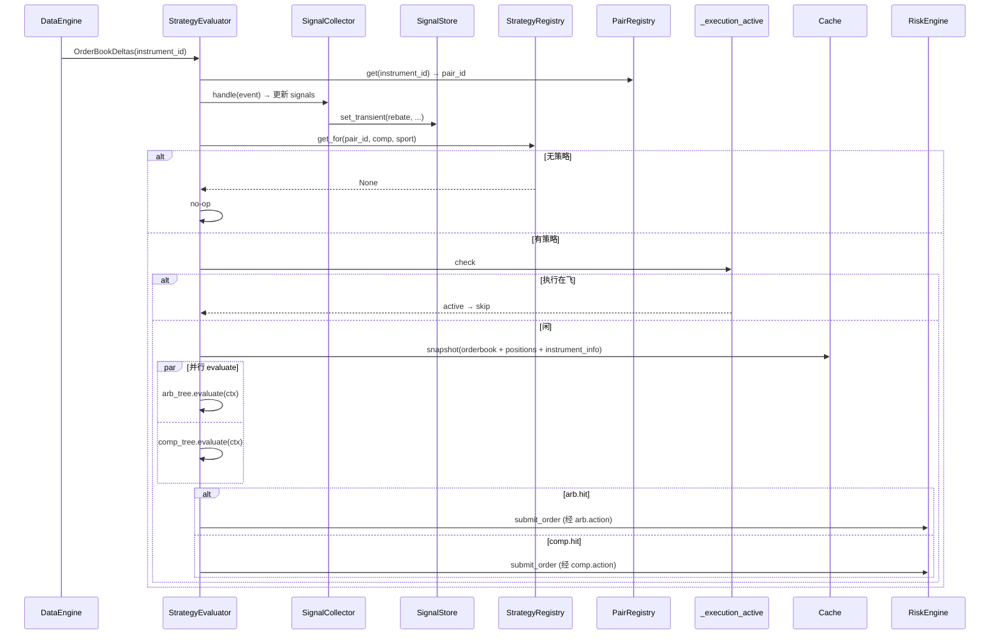

# Strategy 组件详细设计

> 设计理由 / 决策史(Q13/Q14/Q16/Q19/Q20 早期约束 + **Q21 框架锁定 2026-05-24**)见初设 `refactor.md §5.4 / Q21`。
> 冲突时:有把握 → 以本文为准并回写;没把握 → 提出讨论。对应初设 Step 4。

---

## 1. 职责与边界

| 件 | 基类 / 角色 | 职责 |
|---|---|---|
| `StrategyEvaluator` | NT `Actor` | 唯一活体:订触发事件(`OrderBookDelta` / `MatchedPair` / 自定义比分/赛事开始)→ 更新 `SignalStore` → 查 `StrategyRegistry` → 并行 evaluate arb+comp 树 → fire action |
| `StrategyRegistry` | 普通类 | 按 scope 索引策略;`get_for(pair_id) → Strategy or None`,按**挂载存在锁定**:具体比赛挂了就锁定本 scope,即使没命中也**不降级**(Q21-a) |
| `Strategy` | dataclass | `{ scope_key, arbitrage_tree: Condition, compensation_tree: Condition, metadata }` |
| `Condition` | dataclass | `{ self_hits: BoolExpr, sub_conditions: list[Condition], checktion: list[Check], action: Action | None }` |
| `BoolExpr` / `SignalRef` | DSL | self_hits 的布尔表达式树,叶子是 `SignalRef("live")` 等;支持 AND/OR/NOT 嵌套(Q21-b) |
| `Check` / `Action` | abstract | `Check.passes(ctx) -> bool`;`Action.execute(ctx)`(fire-and-forget,不阻塞 evaluate 返回) |
| `SignalStore` | 普通类 | **双状态**:`persistent[key]=value`(写后保留,如 `live=True`)/ `transient[key]=value`(读取消费一次即清,如 `rebate`)|
| `SignalCollector` | 普通类 | event → signal 加工(由 evaluator 持有,每个触发事件调一次)|
| `OpportunitySnapshot` | dataclass | Q20 快照:`{ order_book, positions, instrument_info }`,evaluate 开跑时一次性冻,整轮评估+下单复用 |

**职责边界(继承自前期锁定)**:
- ❌ **不引用 Risk**:透明拦截,strategy 只通过 `on_order_denied` 感知结果(§5.4)
- ❌ **不缓存待下单意图**:每轮全量重算(Q13)
- ❌ **不在策略层做 tp/sl/global 硬停**:归 RiskEngine(Q16)
- ✅ 设计参数 / signal 配置 / 决策逻辑(包含父类默认方向选择)归本组件
- ✅ 旧 `services/strategy/` 3000 行(signals/strategies/...)语义可作为 **具体 Check/Action/SignalCollector 类的填充内容**,但**框架结构按本文**(condition 树 + scope 优先级)

---

## 2. 数据流

```mermaid
flowchart TB
  subgraph EV[触发事件]
    OBK[OrderBookDelta]
    MP[MatchedPair]
    EXT["外部:比分 / 比赛开始 / ..."]
  end
  EV --> EVA[StrategyEvaluator Actor]
  EVA -->|on_data / on_signal| SC[SignalCollector]
  SC -->|update| SS[(SignalStore)]
  EVA -->|查 pair_id| PR[(PairRegistry)]
  EVA -->|按 scope 优先级| SR[(StrategyRegistry)]
  SR -->|Strategy or None| EVA
  EVA -->|Q19 mutex 检查| EXEC{execution_active?}
  EXEC -->|是 跳过本轮| END[end]
  EXEC -->|否| SNAP[OpportunitySnapshot 冻一份]
  SNAP --> EVAL["并行 evaluate(arb, comp)"]
  EVAL --> ARB[arbitrage_tree → (hit, action)]
  EVAL --> COMP[compensation_tree → (hit, action)]
  ARB --> ARBOK{arb.hit?}
  COMP --> COMPOK{comp.hit?}
  ARBOK -->|是| FIRE1[fire arb.action]
  ARBOK -->|否| COMPOK
  COMPOK -->|是 且 arb 否| FIRE2[fire comp.action]
  FIRE1 & FIRE2 -.submit_order.-> RE[RiskEngine 拦截]
```

要点:
- evaluate **无副作用**:返回 `EvalResult { hit, pending_action }`,fire 由 evaluator 顶层做(决定套利优先)
- arb / comp 两棵树 **真并行**(`asyncio.gather`);套利没命中,补救才执行(Q21)
- safety gate(settled / risk)在 RiskEngine 端走 live(不在策略快照内,Q20)

---

## 3. 接口设计

### 3.1 `SignalStore`(`src/arbitrage/strategy/signals.py`)

```python
class SignalStore:
    """双状态信号:persistent 写后保留;transient 读取消费一次即清。"""
    def __init__(self):
        self._persistent: dict[str, object] = {}
        self._transient: dict[str, object] = {}

    def set_persistent(self, key: str, value): self._persistent[key] = value
    def clear_persistent(self, key: str):     self._persistent.pop(key, None)
    def set_transient(self, key: str, value): self._transient[key] = value

    def get(self, key: str) -> object | None:
        if key in self._transient:
            return self._transient.pop(key)        # 用后即清
        return self._persistent.get(key)

    def peek(self, key: str) -> object | None:
        return self._transient.get(key, self._persistent.get(key))  # 不消费(BoolExpr 求值用)
```

设计要点:`get` 消费 transient(避免 stale rebate 二次用);`peek` 不消费(BoolExpr 求值时只看一眼,不能因为求值就把信号清掉)。**Action 内部消费决定值用 `get`**。

### 3.2 `BoolExpr` + `SignalRef`(条件 DSL)

```python
class BoolExpr(ABC):
    @abstractmethod
    def eval(self, store: SignalStore) -> bool: ...

class SignalRef(BoolExpr):
    """叶子:读信号 + 可选谓词(默认 truthy)。"""
    def __init__(self, key: str, pred: Callable[[object], bool] | None = None): ...
    def eval(self, store):
        v = store.peek(self.key)
        return self.pred(v) if self.pred else bool(v)

class AndExpr(BoolExpr):  # 同 OrExpr / NotExpr
    def __init__(self, *exprs: BoolExpr): self.exprs = exprs
    def eval(self, store): return all(e.eval(store) for e in self.exprs)
```

### 3.3 `Condition` / `Check` / `Action`

```python
@dataclass
class Condition:
    self_hits: BoolExpr                        # 自身命中(场景 guard,Q1+Q9 双状态信号组合)
    sub_conditions: list["Condition"] = field(default_factory=list)   # 子组合互斥
    checktion: list["Check"] = field(default_factory=list)            # 决策核查(AND,空 list = 默认通过)
    action: "Action" | None = None                                    # 命中后执行(None = no-op pass)

@dataclass
class EvalResult:
    hit: bool
    pending_action: "Action" | None = None     # hit=True 且非 sub_conditions 路径时才非空

class Check(ABC):
    @abstractmethod
    def passes(self, ctx: "EvalContext") -> bool: ...

class Action(ABC):
    @abstractmethod
    def execute(self, ctx: "EvalContext") -> None: ...  # fire-and-forget;evaluator 顶层 create_task
```

### 3.4 `Strategy` / `StrategyRegistry`

```python
ScopeKey = Union[PairId, CompetitionName, SportName]   # 三种 scope,带类型

@dataclass
class Strategy:
    scope_key: ScopeKey
    arbitrage_tree: Condition
    compensation_tree: Condition
    metadata: dict = field(default_factory=dict)

class StrategyRegistry:
    """按 scope 索引;查找按优先级 pair_id > competition > sport,
    **挂载存在锁定**(Q21-a):某 scope 挂了 = 锁定本 scope,即使没命中也不下放。"""
    def __init__(self):
        self._by_pair: dict[str, Strategy] = {}
        self._by_competition: dict[str, Strategy] = {}
        self._by_sport: dict[str, Strategy] = {}

    def register(self, strategy: Strategy): ...
    def get_for(self, pair_id: str, competition: str, sport: str) -> Strategy | None:
        # 严格按优先级,挂了就锁定,不降级
        if pair_id in self._by_pair: return self._by_pair[pair_id]
        if competition in self._by_competition: return self._by_competition[competition]
        return self._by_sport.get(sport)
```

### 3.5 `StrategyEvaluator`(NT `Actor`,唯一活体)

**算法 `evaluate_tree` 是 `condition.py` 的模块级纯函数**(从 Actor 解耦,可全单测;Actor 只做
orchestration:snapshot / gather / fire)。

`strategy.enabled=false` 不卸载本 Actor。原因是本 Actor 还承担 `MatchedPair` 后
`_ensure_obd_subscribed` 的 OBD 订阅桥职责;卸载会让 PM/OE 盘口不进入 cache。禁用策略时,
配置 dispatcher 返回空 `StrategyRegistry`,Evaluator 仍订阅 OBD,但 `_route_eval` 查不到策略后 no-op,
因此不会评估条件树或触发 Action/submit。

```python
# condition.py(模块级,纯)
def evaluate_tree(cond: Condition, ctx: EvalContext) -> EvalResult:
    if not cond.self_hits.eval(ctx.store):
        return EvalResult(hit=False)
    if cond.sub_conditions:
        for sub in cond.sub_conditions:
            res = evaluate_tree(sub, ctx)
            if res.hit:
                return res            # 互斥:命中即停(Q21)
        return EvalResult(hit=False)
    if all(c.passes(ctx) for c in cond.checktion):
        return EvalResult(hit=True, pending_action=cond.action)
    return EvalResult(hit=False)


# actor.py
class StrategyEvaluator(Actor):
    def __init__(self, config, deps): ...   # deps: pair_registry / strategy_registry / portfolio /
                                            #       signal_store / is_execution_active / loop / signal_collector

    def on_start(self):
        # slice 10d(#52):msgbus 直订 — NT `subscribe_data` 强制 SubscribeData cmd 路由(需 client_id/instrument_id);
        # MatchedPair 是 Actor-to-Actor 事件(MarketMatchingActor publish),走 msgbus broker。
        self._msgbus.subscribe(topic=f"data.{MatchedPair.__name__}", handler=self.on_data)
        # OrderBookDeltas 是 venue/instrument-tied,**slice 10d MVP 不预订**(MatchedPair 触发足以验全链路);
        # 需要 OBD-driven 重评时改 per-iid `subscribe_order_book_deltas(iid)` MatchedPair fire 后调
        # 外部事件(比分 / 比赛开始):自建 topic 或 custom Data type,具体接入点 Step 4 落地时定

    def on_data(self, data):
        # 1. SignalCollector 先消化 event → 写 SignalStore(可选)
        # 2. _extract_evaluation_target(data) → (pair_id, sport, competition);MatchedPair 直读,
        #    其它 event 经 PairRegistry + instrument.info 反查
        # 3. 查 StrategyRegistry,有则 _create_task(self._evaluate_and_fire(strategy, pair_id))

    async def _evaluate_and_fire(self, strategy, pair_id):
        if self._is_execution_active(): return    # Q19:让路
        snap = build_snapshot(pair_id, cache=self.cache, portfolio=self._portfolio,
                              pair_registry=self._pair_registry)            # Q20
        store = self._signal_store.view(pair_id)
        store.set_transient("pre_match", not snap.in_play)  # snapshot 派生 signal,供 self_hits 门控
        submitter = self._make_submitter()
        arb_ctx = EvalContext(pair_id=pair_id, snapshot=snap, store=store, submitter=submitter)
        comp_ctx = EvalContext(pair_id=pair_id, snapshot=snap, store=store, submitter=submitter)
        arb_res, comp_res = await asyncio.gather(                # 并行(_aevaluate 是 sync evaluate 的 async 包)
            self._aevaluate(strategy.arbitrage_tree, arb_ctx),
            self._aevaluate(strategy.compensation_tree, comp_ctx),
        )
        # 套利 > 补救;fire-and-forget(不阻塞)
        if arb_res.hit and arb_res.pending_action is not None:
            self._create_task(arb_res.pending_action.execute(arb_ctx))
        elif comp_res.hit and comp_res.pending_action is not None:
            self._create_task(comp_res.pending_action.execute(comp_ctx))

    async def _aevaluate(self, tree, ctx):
        return evaluate_tree(tree, ctx)         # sync evaluate 包成 coroutine 供 gather;
                                                # Check 演进到 async I/O 时本层无需改动
        return EvalResult(hit=False)
```

`StrategyEvaluator` 的异步派发通过 `_create_task(...)` 统一处理:生产路径使用 NT kernel
`Actor.register_executor(...)` 注入的运行 loop;`StrategyEvaluator.register_executor(...)` 先调用
NT 原生注册,再把同一个 loop 保存为 Python 侧调度指针。NT `MessageBus` handler 是同步调用,
`on_data` 不保证处于 asyncio task 内,所以不能把 `asyncio.get_running_loop()` 当作调度入口;若当前
running loop 正是注册 loop,直接 `create_task`,否则通过 `registered_loop.call_soon_threadsafe(...)`
投递。deps 注入的 `loop` 只作为未注册 executor 的单测 fallback。

`add_actors()` 在 `node.run()` 前装配 actor,不能把当时通过 `asyncio.get_event_loop()` 取得的 loop
当作 NT 实际运行 loop,否则会出现只打印 `Strategy evaluate scheduled`、但无
`Strategy evaluate result` 且 `PairInFlightGate` 一直占用的症状。

`StrategyEvaluatorConfig.log_evaluations=True` 时,评估器只增加低噪声运行锚点日志,不改变决策语义:
`Strategy evaluate scheduled` / `Strategy evaluate skipped` / `Strategy evaluate result` /
`Strategy action fired|skipped`。该开关用于 NT-node smoke 中确认 `OrderBookDeltas` 是否真的触发了
strategy evaluate,默认 `False` 保持生产路径安静。

### 3.6 消息接线

| 类 | 接收 | 发布 |
|---|---|---|
| `StrategyEvaluator` | `OrderBookDeltas` / `MatchedPair` / 外部事件 topics | `submit_order`(经 Action;走 RiskEngine 标准管道)|
| `Action` 类 | (无订阅) | `submit_order` / `cancel_order`(NT 标准 client 接口)|

### 3.7 Check/Action 类型注册 + JSON loader(#44 slice 5)

**前置**:Q21 框架的 `Check` / `Action` 是 ABC,具体类用户域(#41 撤回旧策略平移)。
**注册路径**:`src/arbitrage/strategy/check_action_registry.py` 提供两个 dict + `register_*` / `build_*`,
框架**不预注册**任何具体类(launcher main 调 `register_check("rebate", RebateCheck)` 等装入)。

```python
register_check(name: str, cls: type[Check])    # 同名异类 raise(防误覆盖)
register_action(name: str, cls: type[Action])
build_check({"type": name, "params": {...}})   # → cls(**params);未注册 → StrategyConfigError
build_action(...)                              # 同上
```

**JSON loader**(`src/arbitrage/strategy/json_loader.py`):3 个递归解析 + 1 个 registry 装配。

```python
bool_expr_from_json(spec)        # {"signal"|"AND"|"OR"|"NOT": ...} → BoolExpr
condition_from_json(spec)        # 递归 sub_conditions / checktion / action
strategy_from_json(id, spec, scope_key)  # 组装 Strategy
build_strategy_registry(cfg.strategy)    # bindings → StrategyRegistry
```

**缺值兜底**(Q21 必填字段):
- `self_hits` 缺 / None → `AndExpr()`(空 AND = vacuous truth,让下游决定 hit)
- `compensation_tree` 缺 / None → 永 False no-op `Condition(self_hits=OrExpr())`(空 OR,从不 fire)

**scope 字符串格式**:`pair:<id>`(或别名 `pair_id:<id>`)/ `competition:<name>` / `sport:<name>`。
loader 解析前缀 → 调对应 `register_pair/_competition/_sport`。

**配置驱动 vs 代码硬编码**(#41 Q25 决策):配置驱动允许用户在 JSON 里递归组合
Condition 树,Q21 框架的"参数 first-class"特性配合 registry 实现了真正的运行时 wiring。
**dispatch 路径**:`to_strategy_registry(cfg)`(`config/dispatcher.py`)。`strategy.enabled=false`
时 dispatcher 返回空 registry,保留 OBD 订阅桥但禁用策略 Action。

### 3.8 slice 9 落地(#49):per-pair 隔离 + per-eval scratch + 用户域 Check/Action

**问题背景**:具体策略(如 mean_rebate)需要 Check 算 derived 数据(legs:每方向最优 venue + price + size)交给 Action 下单;同时持久信号(如 `in_play`)需跨 evaluate 保留 + per-pair 隔离(避免 pair A 的 `in_play=True` 污染 pair B 评估)。三件隔离机制各落其位:

| 数据类型 | 例子 | 落点 | 隔离 |
|---|---|---|---|
| 同 condition 树内 Check→Action 传值 | mean_rebate 算的 legs | `EvalContext.scratch: dict` | **per-eval 自动**(每次 evaluate 新建 ctx)|
| per-pair 持久态(跨 evaluate)| 真"持久信号"(外部输入 user_pause 等;**注**:`in_play` 不走这,见下)| `SignalStore.view(pair_id)` 子视图 | **per-pair**(内部 key 加 `.{pair_id}` 后缀)|
| 派生自最新瞬时数据(每事件能从 cache 重读)| `in_play`(OE WS 帧带)| OE DataClient 写 `cache.instrument.info["in_play"]` + `build_snapshot` 派生 | **天然**(instrument.info 是 per-instrument mutable dict,cache-resident)|

**`OpportunitySnapshot` 新字段**:
- `in_play: bool` — 任一 OE leg `instrument.info["in_play"]=True` → True
- `instrument_info: dict[InstrumentId, dict]` — 各 leg `instrument.info` 浅拷贝冻结(Check/Action decouple from cache;直接读 `selection_role` 等 6-key)

**`SignalStore.view(pair_id)` 返 `_PairScopedStoreView`**:thin wrapper,所有读写自动 namespace 到 `f"{key}.{pair_id}"`。evaluator 构造 EvalContext 时传 `store=self._signal_store.view(pair_id)`,SignalRef / Action 写法不变。跨 pair 全局信号走 root store(罕见;`signal_collector` 决定走哪条)。

**`EvalContext.scratch: dict`**:per-eval 自动隔离的 mutable scratch space。Check 算的 derived 数据(如 `ctx.scratch["legs"]`)给同 condition 树内 Action 用;Action consume 不需考虑跨 pair race。套利树与补偿树同轮并行 evaluate 时必须使用两份 `EvalContext` / `scratch`:补偿树可能写单腿 recovery legs,不得覆盖套利树写出的多腿 arbitrage legs。

**运行时默认规模参数(2026-06-29;fx 边界校准 2026-06-30;SE 第一阶段接线 2026-06-30)**:`EvalContext.strategy_defaults` 每轮由 `StrategyEvaluator` 从 live `ArbitrageParams` 读取,当前包含 `share` / `max_leg_share` / `fx`。这些值来自顶层 `arbitrage` 配置段,Web Arbitrage 标签页热改时通过 `command.arb.arbitrage_params` 同步到 StrategyEvaluator;strategy JSON 中各 Check/Action 的 `params` 若显式给同名字段,优先级高于 Web 默认。边界原则:Condition/Checktion 发现机会时应产出带 `share_if_wins` 或 `qty` 的完整计划腿;Action 只做缩放、选择、提交,不负责决定原始 share。Strategy 内部 OE/SE `qty` 一律按 USD stake 口径,`fx` 只由对应 adapter 在 CURRENT_BETS 入站和 placeBets 出站使用。第一阶段 SharpExch 接入不引入可插拔 odds-model 抽象,仅让 `SHARPEXCH` 复用现有 OE 类 decimal odds 语义。

**用户域子类(slice 9 #49 落地)**:

| 类 | 文件 | 用 |
|---|---|---|
| `pre_match` self_hits signal / `PreMatchCheck()` | `StrategyEvaluator` / `src/arbitrage/strategy/checks/pre_match.py` | 推荐用法:Evaluator 每轮从 snapshot 写 `ctx.store["pre_match"] = not snapshot.in_play`,strategy JSON 用 `"self_hits": {"signal": "pre_match"}` 做 condition 级门控。`PreMatchCheck` 类仍保留为兼容/单测用的 Check 形式,但 example 不再把它放进套利 `checktion` |
| `MeanRebateCheck(min_rate, share=None)` | `src/arbitrage/strategy/checks/mean_rebate.py` | 平均返水套利算法:按 `selection_role` 分组 → PM/OE/SE 各取 best_ask → 转 prob(PM=`polymarket_price_to_probability`,OE/SE=`orbitexch_odds_to_probability`)→ 每个 outcome 取 min → sum → `rate = 1 - sum`;`>= min_rate` 时写带 `share_if_wins` 的 `ctx.scratch["legs"]` + return True。`share` 未显式配置时读 `ctx.strategy_defaults["share"]` |
| `OneSideRebateCheck(min_rate, share=None, fx=None)` | `src/arbitrage/strategy/checks/one_side_rebate.py` | 定向返水候选生成:按 `selection_role` 收集所有可买 PM/OE/SE leg(同 outcome 多 venue 都保留)→ 枚举每个 outcome 选一条 leg 的笛卡尔积 → 对每个组合枚举 target outcome → `rate=(1-total_prob)/target_prob`;达阈值时写 `ctx.scratch["candidates"]`,每个 candidate 的 legs 已带 USD 口径 `qty/share_if_wins/cost`。OE/SE qty 均按 decimal odds stake 语义计算。`share` 未显式配置时读 Web 默认;`fx` 参数仅兼容旧配置,不参与中间层计算 |
| `RequireCrossVenueCheck()` | `src/arbitrage/strategy/checks/cross_venue.py` | 套利树过滤器:放在 `mean_rebate` / `one_side_rebate` 之后。若 `ctx.scratch["legs"]` 全部来自同一 venue,清空 legs 并返回 False;若 `ctx.scratch["candidates"]` 存在,过滤掉“candidate 内所有腿同 venue”的 candidate,剩余为空才返回 False。补偿树/recovery 可能天然单腿,不要放这个 Check |
| `MeanRebateRecoveryCheck(min_repaired_rebate=-0.05, fx=1.0)` | `src/arbitrage/strategy/checks/mean_rebate_recovery.py` | mean_rebate 补救检查:从 USD 口径 `snapshot.positions` 计算每个 outcome 的实际 share,目标 `target_share=max(actual_share_by_outcome)`;对缺口 outcome 取当前 best ask 最便宜 venue,写只包含缺口的 `ctx.scratch["legs"]` 且每 leg 带最终 USD 口径 `qty`;PM qty=`missing_share`,OE/SE qty=`missing_share/odds`;补齐后的最差 rebate 必须 `>= min_repaired_rebate`;`fx` 参数仅兼容旧配置 |
| `ShareLimitModification(max_leg_share=None, share=None, fx=None)` | `src/arbitrage/strategy/actions/share_limit.py` | strategy 层 share limit 调整。单一 `ctx.scratch["legs"]` 时优先按 leg 自带 `share_if_wins/qty` 计算目标 share,直接写回调整后的 `qty/share_if_wins/cost`;candidate 输入只认 `ctx.scratch["candidates"]`,对每个 candidate 独立按 PM 或 OE/SE remaining 计算 scale,复制并缩放该 candidate 的 `qty/share_if_wins/cost`,输出调整后的 candidate 数组和 `adjusted_share`。`max_leg_share` 未显式配置时读 Web 默认;`share` 仅保留为旧 leg 缺 share/qty 时的 fallback;`fx` 参数仅兼容旧配置 |
| `CandiSelectAction()` | `src/arbitrage/strategy/actions/candi_select.py` | 放在 `share_limit` 与 `place_bets` 之间;对每个 candidate 取其 legs 中最大的 `share_if_wins`,再选择该最大值最高的 candidate,写 `ctx.scratch["selected_candidate"]` 和 `ctx.scratch["legs"]`,后续 `PlaceBetsAction` 只提交被选 candidate |
| `PlaceBetsAction(share=None, price_overrides=None, qty_overrides=None, intent="arbitrage")` | `src/arbitrage/strategy/actions/place_bets.py` | 通用下单:consume `ctx.scratch["legs"]`;不决定原始 share。qty 优先级为 `qty_overrides` > `leg["qty"]` > `leg["share_if_wins"]` 推导(PM=`size=share`,OE/SE=`share/price`) > action 显式 `share`/Web 默认 share fallback;`price_overrides` / `qty_overrides` 是 venue-keyed Action 参数,只改最终 submit spec,不改 Check 用真实 order book 选腿;`intent` 写入最终 submit spec,submitter 转成 NT `Order.tags=["arb:intent=<intent>"]`,供 Risk 区分普通套利与补救单;`ctx.submitter` 存在时提交 NT `SubmitOrder`,否则 log-only fallback |

**candidate action 链(2026-06-28)**:`one_side_rebate` 等 Check 统一写
`ctx.scratch["candidates"]`。推荐链路:
`share_limit -> candi_select -> place_bets`。`share_limit` 不丢弃 candidate 集合语义,而是逐个 candidate
输出调整结果;`candi_select` 再按 candidate 内最大 `share_if_wins` 选择一个 candidate 写回 `legs`。`PlaceBetsAction`
继续只认 `legs`,不再做 share-limit 缩量,因此不需要改 submitter / opportunity barrier。

`one_side_rebate` candidate 的 share 语义:非 target outcome 的 `share_if_wins=share`;target outcome
使用非 target 买完后的剩余预算全部买入,因此 `target_share_if_wins = target_cost / target_prob`。
例如 home=0.45、away=0.50、share=100 时,target=home → away 买到 100 share,home 用剩余 50
买到 111.11 share,rate=11.11%。`candi_select` 后续只看 share-limit 调整后的 candidate 内最大
`share_if_wins`,不依赖 `target_role`。

**OE DataClient `_on_price_frame` 透 inPlay**:每帧调 `write_inplay_to_instrument_info(cache, iid, in_play)` module 级 helper;helper 防御性 — instrument 不在 cache 不 raise(冷启动场景)。

**冷启动假阳性**:不存在 —— OE 赔率是 MeanRebateCheck 的硬前置(没 OE best_ask 算不出 prob),OE 赔率帧本身就携带 inplay → 赔率到 = in_play 到。同一时刻发生。

### 3.9 slice 10a 落地(#50):`EvalContext.submitter` + 真出单链路

**问题**:Action 是 ABC,`execute(ctx)` 默认无法 submit_order(StrategyEvaluator 是 Actor,非 Strategy,无 `self.submit_order` facade)。

**落地**:
- `EvalContext.submitter: Callable[[dict], Awaitable[None]] | None`(默认 None,Action log-only fallback)
- `StrategyEvaluator._evaluate_and_fire` 构造 ctx 时 `submitter=self._make_submitter()`
- `make_submitter(*, cache, msgbus, clock, trader_id, log)` module-level 工厂 → `async def submit(spec)`:
  1. `cache.instrument(iid).{size_precision, price_precision}` 拿精度
  2. 构 NT `LimitOrder`(`OrderSide.BUY/SELL` from spec / `Quantity` / `Price` / `TimeInForce.GTC` / 随机 `ClientOrderId`)
  3. 包成 `SubmitOrder` cmd
  4. **已落地链路(#106)**:`msgbus.send("RiskEngine.execute", cmd)` → NT RiskEngine 逐单检查 → pass 后回 `ExecEngine.execute`;Execution opportunity barrier 等齐本轮 legs 后才 release 到 venue ExecClient。横切协议见 `_cross-cutting/synchronization.md §8.4bis`。
- **spec schema**:`{instrument_id, side: "BUY"|"SELL", qty: float, price: float, intent?: "arbitrage"|"recovery", opportunity_id?: str, pair_id?: str, leg_key?: str, expected_legs?: list[str]}`
- `instrument_id` 允许是策略快照/legs 使用的字符串视图,也允许是 NT 原生 `InstrumentId`;
  `make_submitter` 是边界适配点,统一转成 `InstrumentId` 后再调用 `cache.instrument(...)`
  和构造 `LimitOrder`。这是 Strategy 与 NT cache 的契约边界,避免 Action 层直接依赖 NT 标识对象。
- 冷启动安全:`cache.instrument(iid)` 返 None → warning + skip,不 raise

**PlaceBetsAction.execute 双路径**(slice 10a):
- `ctx.submitter` 非 None → `await submitter(spec)` 真出单(log `PlaceBets[submit]`)
- `ctx.submitter` None → log-only fallback(log `PlaceBets[smoke]` + `would submit: ...`)
- size 计算优先级:`qty_overrides[venue]` > `leg["qty"]` > `leg["share_if_wins"]` 推导 > fallback share 公式。这样 `mean_rebate`/`one_side_rebate`/`mean_rebate_recovery` 这类 Check 均可产出完整计划腿,继续复用 `place_bets`,不另起专用 Action。第一阶段 SE 接入中,`SHARPEXCH` 与 `ORBITEXCH` 使用相同的 decimal odds size 公式。
- Action 参数覆盖(#88):`price_overrides={"ORBITEXCH": 1000.0}` / `qty_overrides={"ORBITEXCH": 7.0}` 只用于构造最终 submit spec,适合 live 验证“不成交挂单 → 下一轮 cancel-only”这类执行路径;`MeanRebateCheck` 仍用真实 OBD 的 best ask 计算机会与选择 venue,execution 仍透明执行传入订单内容。
- `intent` 默认 `"arbitrage"`;compensation/recovery tree 应显式配置 `"recovery"`。submitter 将其写入 `Order.tags` 的 `arb:intent=<intent>` 标签。该标签是 Strategy → Risk 的跨组件契约:Risk 对 `recovery` 仍执行 NT 基础检查 + 余额检查,但跳过 rebate gates(`match_tp/match_sl/global_sl`),详见 risk 详设 §3.1。
- **opportunity metadata(已落地代码,待 live 验证,2026-06-14)**:`PlaceBetsAction` 在同一次 `execute(ctx)` 内为所有真实 legs 生成同一个 `opportunity_id`,并为每条 spec 写 `pair_id=ctx.pair_id`、稳定 `leg_key`、`expected_legs`(所有真实腿 key,包含自己)。submitter 把这些字段写入 `Order.tags`:`arb:opportunity_id` / `arb:pair_id` / `arb:leg_key` / `arb:expected_legs`。不发送 0 qty 空单;没有真实下单的 outcome 不进 `expected_legs`。tag 构造/解析复用 `src/arbitrage/common/opportunity.py`。

**mean_rebate recovery 配置形态(已落地 Check,2026-06-11)**:

```json
{
  "compensation_tree": {
    "checktion": [
      {"type": "mean_rebate_recovery", "params": {"min_repaired_rebate": -0.05}}
    ],
    "actions": [
      {"type": "place_bets", "params": {"intent": "recovery"}}
    ]
  }
}
```

语义:
- `mean_rebate_recovery` 只负责判断并生成补缺口 legs:目标 `target_share = max(actual_share_by_outcome)`,只对 `missing_share > 0` 的 outcome 写 leg。实际 share 计算:PM=`position.quantity`,OE/SE=`position.quantity * avg_px_open`;OE/SE 补救 qty=`missing_share / price`。OE/SE position quantity 已由 adapter 入站归一为 USD stake。
- Recovery 依赖已有持仓的真实 `avg_px_open`。若 reconciliation 导入的外部持仓缺少真实成本(`avg_px_open<=0`),本轮 recovery 不触发;不使用当前盘口估算历史成本。PM 成本缺失应回到 PM adapter / trade history 归因路径解决。
- `min_repaired_rebate` 是补齐到最大实际 share 后允许的最差 outcome return rate 阈值;例如 `-0.05` 表示只允许修到不低于 -5%。
- 补救 legs 必须带最终 `qty`,由 `place_bets` 直接提交;不新增 `repair_mean_rebate` Action。
- `RequireCrossVenueCheck` 只用于套利树,不用于补偿树。原因:套利树一般应是跨 venue 机会;补偿树可能是单腿补缺口,用该过滤器会误伤 recovery。
- `arb_config.example.json` 的 `mean_rebate` 已默认启用该 `compensation_tree`;生产启动前需确认 `debug.skip_execution` 与真金开关符合预期。

**配合 Q11.3 SkipExecutionClient**:`debug.skip_execution=true` 时 SkipExecutionClient 拦 ExecClient `_submit_order` mock 全成,**Action→submitter→真 SubmitOrder→SkipExecution 兜底**完整链路安全可跑(不上链)。

**验证状态(2026-06-08)**:NT-node skip smoke 用临时配置强制 `mean_rebate` 命中后,
`PlaceBetsAction` 已实测进入 `ExecClient-ORBITEXCH: Submit LimitOrder(...)`,并由 SkipExecution
mock fill 更新 portfolio。限制:skip 模式立即全成,不产生 open order,所以不能用来验证真实撤单 / cancel-only;
cancel-only 主流程由 `tests/arbitrage/e2e/test_mean_rebate_cancel_only.py` 离线覆盖。
同次 smoke 暴露 OBD 高频下同一机会可重复 fire/重复 mock submit,需后续单独补 strategy 执行保护。

**`StrategyId` 用 fixed literal** `"ARB-EVAL-001"`:StrategyEvaluator 是 Actor 非 Strategy,无独立 StrategyId;统一记账用。

---

## 4. 算法

### 4.1 evaluate 主流程(见 §3.5 `_evaluate_tree`)

伪代码上面已写。**关键不变量**:
- evaluate 是**纯求值**(无副作用):返 `EvalResult { hit, pending_action }`
- fire action 在 evaluator 顶层做(决定套利优先)
- sub_conditions 互斥:命中第一个就停,不遍历后续

### 4.2 arb / comp 并行 + 套利优先(Q8)

```python
arb_res, comp_res = await asyncio.gather(
    evaluate(arb_tree, arb_ctx),
    evaluate(comp_tree, comp_ctx),
)
# 套利结果优先:套利命中 → 套利 action;否则补救命中 → 补救 action
if arb_res.hit:   fire(arb_res.pending_action, arb_ctx)
elif comp_res.hit: fire(comp_res.pending_action, comp_ctx)
```

**为什么 evaluate 必须分离求值与执行**:补救要"等套利的 evaluate 结果"才决定 fire,所以 evaluate 不能边求值边执行 action(否则补救 evaluate 走到叶子就会 fire,无法回收)。这就是 Q21 "evaluate 返 True 不等 action 完成"的根本原因。

**arb/comp scratch 隔离不变量**:两棵树可并行求值并共享同一 snapshot / store / submitter,但不能共享 `scratch`。否则补偿树命中时写入的单腿 `ctx.scratch["legs"]` 会污染套利树 action,形成 `intent=arbitrage` 但 `expected_legs` 只有一条腿的错误订单。

### 4.3 信号量双状态(Q9)

- **persistent**:`live=True`(比赛开始信号到 → set,后续读不重算;比赛结束信号到 → clear)
- **transient**:`rebate=0.025`(赔率到 → SignalCollector 算 → set;Action 读 → `store.get()` 消费;下次赔率到才重算)
- BoolExpr 用 `peek`(不消费);Action 内决策用 `get`(消费)

### 4.4 scope 优先级查找(Q3 / Q6)

挂载存在锁定:具体比赛 > comp > sport,**先挂者得**,即使本轮没命中也不下放(运营在该 scope 挂 = 承诺该 scope 全权负责该 pair_id)。

### 4.5 Q19 互斥 + Q20 快照咬合

- **per-pair 串行闸(§6.10 §7,#84)**:`_route_eval` 在 `create_task` 派发评估**之前同步** `PairInFlightGate.try_enter(pair_id)` —— 同 pair 已在飞(评估中/执行中)→ 直接放弃(不派发)。`_evaluate_and_fire` finally:**未 fire** → `release_eval`;**已 fire** → 不释放(所有权交执行,execution `exec_finished` 在双腿 session 归 0 时清)。**为什么必须同步在 `create_task` 前**:Risk/Execution 的信号都在下游,挡不住同毫秒并发评估;同步 per-pair 闸在单 loop 串行下保证后到的并发评估立刻看到 → 放弃。详见 synchronization.md §7。
- **健康检查互斥已退役(#108,2026-06-16)**:strategy 不再订 `health_check.*`、无 `_hc_running`、`_route_eval` 无健检预检。原因:旧理由是"健康检查 reload **执行页**会撞下单",但执行页 reload 已迁 NT reconciliation;剩余 competition 页 reload 在另一张页、且 OE 下单是 `page.evaluate`(与焦点无关),不冲突。详见 synchronization.md §8.6 / refactor #108。(in-flight 出口靠结构保证 = opportunity barrier 出口 + session `exec_started`↔watchdog 原子,与本互斥无关。)
- **VenueExecutionLiveness 不在 Strategy 读(2026-06-15)**:Strategy 计算机会前不看 venue order/position liveness,也不再读 `leg_settled`。Strategy 只负责发现机会、生成带 `arb:expected_legs` 的 order metadata;Risk 从 metadata 推导 required venues 并统一门控。详见 `_cross-cutting/synchronization.md §8.5` 与 risk §3.1/§4.4。
- evaluate 开跑前查 `_execution_active`(全局,Q19/§6.10 健康检查⊥执行 + ≤1 全局执行),在飞就 skip(让路)
- evaluate 开跑取一次 `OpportunitySnapshot { order_book, positions, instrument_info }`,整轮决策用;safety gate(settled/risk)RiskEngine 端走 live
- 回收:绑 per-evaluation 上下文,evaluate + fire 结束 GC

---

## 5. 与横切的咬合

| 横切 | 约束 |
|---|---|
| **PairRegistry**(matching 写) | evaluator 从触发 event 的 instrument_id pull pair_id,再查 StrategyRegistry;未注册 pair → no-op |
| **VenueExecutionLiveness**(execution/reconcile 写,Risk 读) | Strategy 不直接读取;Strategy 只在 order tags 中携带 `expected_legs`,供 Risk 推导 required venues |
| **Q19/§6.10 同步** | `_execution_active` ref-count 由 execution 维护(经 msgbus `execution.*`);evaluator 在 evaluate 开跑前查,在飞跳过 |
| **Q20 快照** | OpportunitySnapshot per-evaluation;safety gate(settled/Risk)走 live |
| **Q21 scope 优先级** | 挂载存在锁定;不降级 |
| **Risk(透明拦截)** | strategy `submit_order` → RiskEngine `_check_order` → 通过则路由;deny → on_order_denied;strategy 不 import Risk(§5.4) |
| **NT 原生优先级 — 无** | NT msgbus 有 handler priority 但语义不同;策略 scope 优先级**自建**于本组件,**不超前抽象**为通用件(P7) |

---

## 6. 时序:一次触发到下单



---

## 7. 落地清单(Step 4 实施;按依赖顺序)

**框架基础(纯逻辑,可全单测)**:
- [ ] `SignalStore`(`signals.py`)+ 双状态读写测试
- [ ] `BoolExpr` / `SignalRef` / `AndExpr` / `OrExpr` / `NotExpr`(`bool_expr.py`)+ AND/OR/NOT 嵌套求值测试
- [ ] `Condition` / `EvalResult` dataclass + 抽象 `Check` / `Action`(`condition.py`)
- [ ] `Strategy` / `ScopeKey` dataclass + `StrategyRegistry`(`registry.py`)+ scope 优先级 + 挂载存在锁定测试

**评估器(NT Actor)**:
- [ ] `StrategyEvaluator(Actor)`(`actor.py`)+ `_evaluate_tree` 递归 + `gather(arb,comp)` + 套利优先 fire 测试(fake event + 受控 SignalStore + 受控 StrategyRegistry + capture action)
- [ ] `OpportunitySnapshot` 取数 + 回收(`snapshot.py`)+ Q19 跳过 + Q20 整轮复用测试

**具体填充(渐进,旧 `services/strategy/` 平移)**:
- [ ] 把旧 `signals/{rebate,multi_way,mean_signal,match_status}.py` 重构为本框架的 `Check` 子类;**计算**部分进 `SignalCollector`,**判定**部分进 `Check`
- [ ] 把旧 `strategies/{default,max_rebate}.py` 重构为本框架的 `Action` 子类(含父类默认方向选择算法、深度缩放、概率转换)
- [ ] 配置驱动:`StrategyRegistry` 从 YAML/JSON 装载(sport / competition / pair_id 三层)

**外部事件接入(part of Step 4 + Step 7)**:
- [ ] 比分 / 比赛开始等自定义 Data 类(`events.py`)+ 来源接入(web / 外部 API,具体到 Step 7 决定)

**集成 + /live-test**:
- [ ] launcher 接 `StrategyEvaluator` Actor + 注册 `StrategyRegistry`(配置加载)+ 通过 `ArbContext` 共享 PairRegistry / SignalStore / PairInFlightGate
- [ ] /live-test:小 scope 配置 + 实盘小单跑通 evaluate → submit

> **未决/待 Step 4 启动时讨论**:
> - SignalCollector 怎么接 NT msgbus(放 Actor 内部,还是独立 Actor)?
> - 外部信号源(比分 / 赛事开始)的接入方式(web 推 / 第三方 API)— 跟 Step 7 web 重启时一起设计
> - 旧 mean_signal discount sizing / 父类默认方向选择算法移植细节
